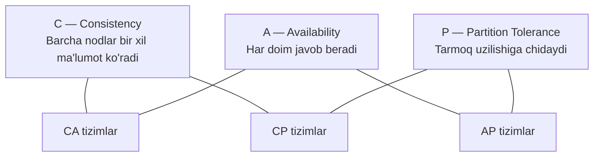
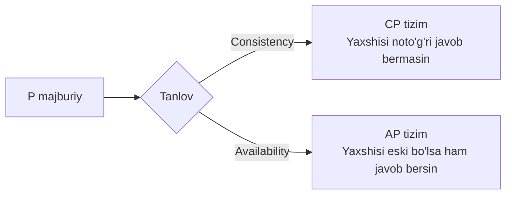
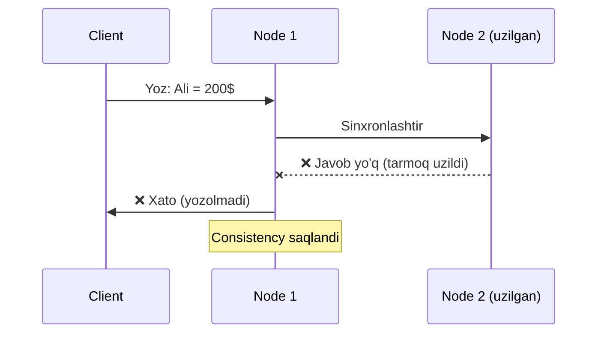
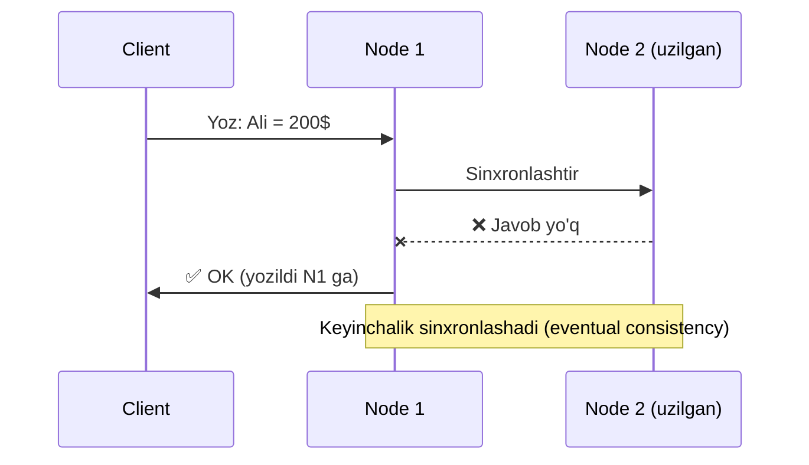
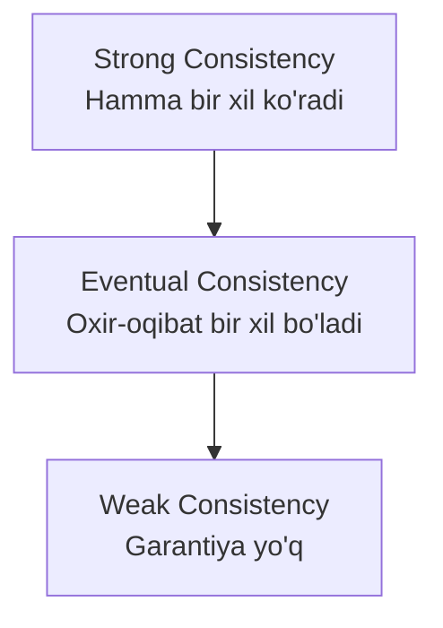

# CAP Theorem

## Ta'rif

**CAP Theorem** — taqsimlangan tizim uchta xususiyatdan bir vaqtning o'zida faqat **ikkitasini** kafolatlay oladi.



---

## Uchta Xususiyat

### C — Consistency (Izchillik)
Har qanday node'dan o'qilgan ma'lumot **eng so'nggi yozilgan** ma'lumot bo'lishi kerak.

```
Node 1: Ali → 100$
Node 2: Ali → 100$   ← Consistency: Ikkisi teng
```

### A — Availability (Mavjudlik)
Har bir so'rovga **javob** qaytarilishi kerak (eski bo'lsa ham).

```
Node 1 ishlamayapti
Node 2: Ali → 90$ (eski)  ← Availability: Javob berdi (eski bo'lsa ham)
```

### P — Partition Tolerance (Bo'linishga chidamlilik)
Tarmoq uzilsa ham tizim **ishlashda davom etishi** kerak.

```
Node 1 ←✂️ uzildi → Node 2
Tizim ishlashda davom etadi  ← Partition Tolerance
```

---

## Nima uchun ikkalasi?

Taqsimlangan tizimda **tarmoq uzilishi** (partition) har doim yuz berishi mumkin.
Shuning uchun amalda P majburiy, tanlov C va A o'rtasida:



---

## CP Tizimlar — Consistency + Partition Tolerance



**Misollar:** HBase, Zookeeper, MongoDB (default), Etcd

**Qachon:** Bank operatsiyalari, inventar, order tizimi

---

## AP Tizimlar — Availability + Partition Tolerance



**Misollar:** Cassandra, DynamoDB, CouchDB, DNS

**Qachon:** Social media, analytics, IoT, kesh

---

## CA Tizimlar — Consistency + Availability

> Amalda mavjud emas: Partition Tolerance'siz taqsimlangan tizim bo'lmaydi.
> Faqat bitta node'li tizimlar CA bo'la oladi.

**Misollar:** PostgreSQL, MySQL (bitta node)

---

## Consistency Darajalari



### Strong Consistency
```
Yozish → Barcha o'qishlar yangi qiymat ko'radi
Qimmat lekin ishonchli
Foydalanish: bank, to'lov tizimi
```

### Eventual Consistency
```
Yozish → Vaqt o'tishi bilan barcha nodlar sinxronlashadi
Tez lekin eski ma'lumot ko'rinishi mumkin
Foydalanish: social media like, view count
```

### Weak Consistency
```
Yozishdan keyin yangi o'qish eski qiymat ko'rishi mumkin
Eng tez, lekin kafolat yo'q
Foydalanish: video o'yinlar (koordinat), real-time chat
```

---

## PACELC kengaytmasi

CAP faqat tarmoq uzilganda. PACELC normal ishlash vaqtida ham qo'shadi:

```
P: Partition bo'lsa → A yoki C tanlash
E: Else (normal) → Latency yoki Consistency tanlash
```

| Tizim | Partition | Normal |
|-------|-----------|--------|
| DynamoDB | AP | EL (low latency) |
| Cassandra | AP | EL |
| MongoDB | CP | EC |
| PostgreSQL | CA | EC |

---

## Amaliy Misol

> **Instagram like tizimi:**
> - 1M foydalanuvchi bir vaqtda like bosadi
> - Like count 1000 dan 1001 ga o'tishi 1 soniya kechikishi mumkinmi?

```
Javob: Ha, bu Eventual Consistency
→ AP tizim (Cassandra/Redis) yaxshiroq
→ Like count bir necha soniya kechikishi OK
→ Availability muhim: like bosganda "xato" ko'rinmasin
```

> **Bank puli o'tkazish:**
> - Ali 1000$ jo'natdi
> - Vali darhol pul olishi kerakmi?

```
Javob: Ha, Strong Consistency kerak
→ CP tizim (PostgreSQL + tranzaksiya)
→ Bir node ishlamasa ham noto'g'ri o'tkazma bo'lmasin
```

---

## Keyingi Qadam

→ [3. Sharding va Replication.md](3.%20Sharding%20va%20Replication.md)
