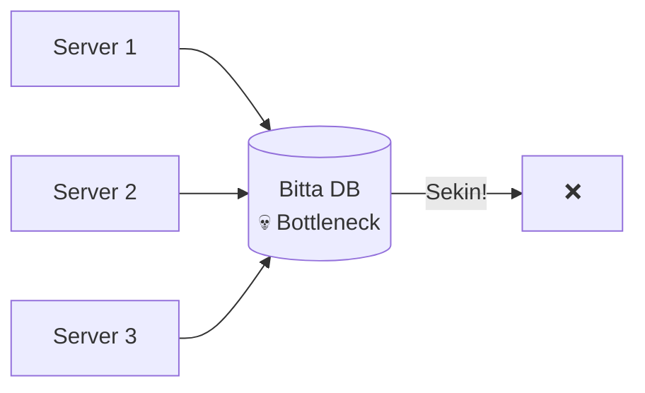
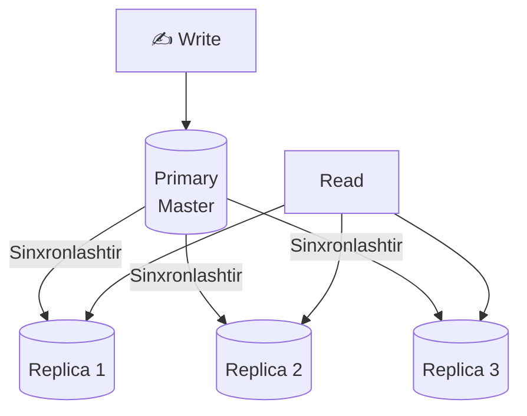
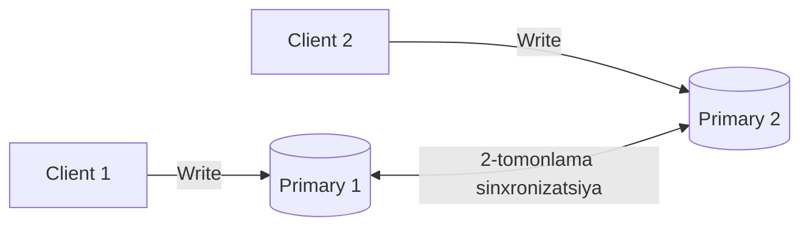
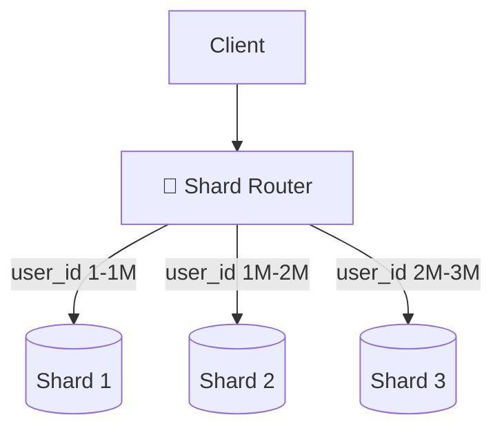
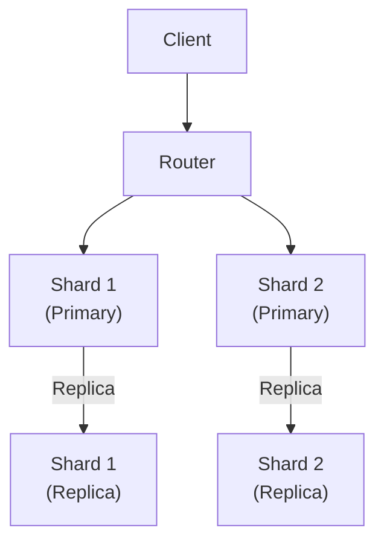

# Sharding va Replication

## Muammo: Bitta DB yetarli emas



---

## Replication — Nusxalash

Ma'lumotlar bazasini **bir necha nusxada** saqlash.

### Master-Slave (Primary-Replica)



- **Primary** — faqat yozish
- **Replica** — faqat o'qish
- **Read/Write nisbati** 80%/20% bo'lsa juda foydali

### Afzalliklari
- O'qish (read) imkoniyati oshadi
- Primary tushsa — replica primary bo'ladi (failover)
- Backup uchun qulay

### Kamchiliklari
- Replication lag (kechikish)
- Primary tushishi muammosi

---

### Master-Master (Multi-Primary)



- Ikkisi ham yoza oladi
- Conflict yechish kerak
- Foydalanish: geografik taqsimlash

---

## Sharding — Bo'lish

Ma'lumotlarni **bir necha DB'ga** taqsimlash.



### Shard Strategiyalari

#### 1. Range-based Sharding
```
Shard 1: user_id 1 — 1,000,000
Shard 2: user_id 1,000,001 — 2,000,000
Shard 3: user_id 2,000,001 — 3,000,000

Muammo: hot shard (yangi foydalanuvchilar ko'p)
```

#### 2. Hash-based Sharding
```
shard_id = hash(user_id) % 3

user_id=100  → hash → 1 → Shard 1
user_id=200  → hash → 0 → Shard 0
user_id=300  → hash → 2 → Shard 2

Afzalligi: teng taqsimlash
Muammo: resharding qiyin
```

#### 3. Directory-based Sharding
```
Lookup jadval:
user_id 1-500   → Shard A
user_id 501-900 → Shard B
user_id 901+    → Shard C

Afzalligi: moslashuvchan
Muammo: lookup jadval bottleneck bo'lishi mumkin
```

---

## Go'da Hash-based Sharding

```go
package main

import (
    "database/sql"
    "fmt"
    "hash/fnv"
)

type ShardRouter struct {
    shards []*sql.DB
}

func NewShardRouter(shards []*sql.DB) *ShardRouter {
    return &ShardRouter{shards: shards}
}

func (r *ShardRouter) getShard(userID string) *sql.DB {
    h := fnv.New32a()
    h.Write([]byte(userID))
    idx := h.Sum32() % uint32(len(r.shards))
    return r.shards[idx]
}

func (r *ShardRouter) GetUser(userID string) (*User, error) {
    shard := r.getShard(userID)
    var u User
    err := shard.QueryRow(
        "SELECT id, name FROM users WHERE id = $1", userID,
    ).Scan(&u.ID, &u.Name)
    return &u, err
}

type User struct {
    ID   string
    Name string
}

func main() {
    router := &ShardRouter{}
    // Misol: user_id ga qarab shard aniqlash
    fmt.Println(hashShard("user123", 3)) // 0, 1, yoki 2
}

func hashShard(key string, numShards int) int {
    h := fnv.New32a()
    h.Write([]byte(key))
    return int(h.Sum32()) % numShards
}
```

---

## Replication + Sharding Birga



---

## Muammolar

### Cross-shard Join
```sql
-- Bu ishlamaydi (har xil shard):
SELECT u.name, o.amount
FROM users u JOIN orders o ON u.id = o.user_id
-- users Shard 1'da, orders Shard 2'da

-- Yechim: Denormalization yoki application-level join
```

### Hot Shard
```
Shard 1: 1M so'rov/s   ← hot
Shard 2: 100 so'rov/s
Shard 3: 200 so'rov/s

Yechim: consistent hashing, resharding
```

### Distributed Transaction
```
Shard 1'dan pul yechish
Shard 2'ga pul qo'shish
Bu ikkisi atomic bo'lishi kerak!

Yechim: 2-phase commit, saga pattern
```

---

## Consistent Hashing

Oddiy hash'dan farqi: server qo'shilsa/o'chirilsa minimal ma'lumot ko'chadi.

```
Ring (0 — 360°):
Server A: 90°
Server B: 180°
Server C: 270°

Key X: 120° → Server B ga boradi (keyingisi)
Key Y: 200° → Server C ga boradi

Server B o'chirilsa:
Key X: 120° → Server C ga o'tadi (faqat B ning ma'lumotlari)
```

---

## Qachon Sharding kerak?

| Signal | Qiymat |
|--------|--------|
| DB hajmi | > 1TB |
| Write throughput | > 10K/s |
| Read throughput | > 100K/s (replika yetarli emas) |
| Latency | > 100ms |

---

## Keyingi Qadam

→ [../3. Kesh/1. Caching.md](../3.%20Kesh/1.%20Caching.md)
