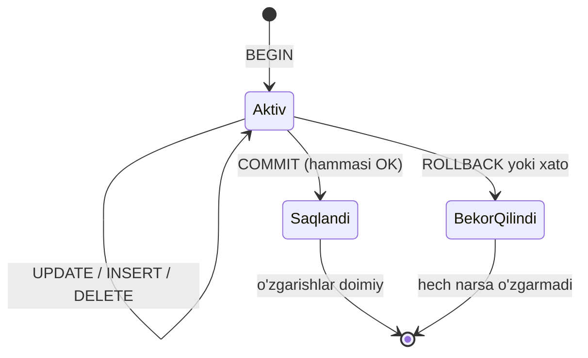
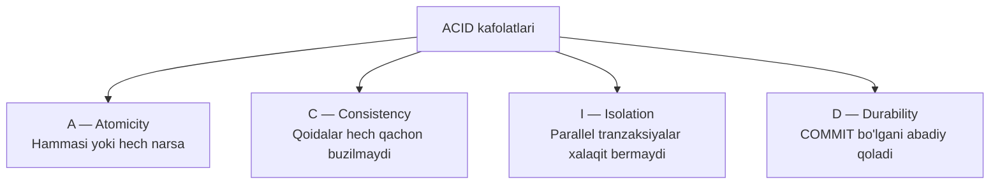
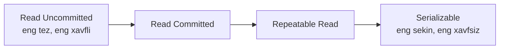

# 01 — ACID va Tranzaksiyalar

> **Modul 3, Dars 1.** Ma'lumot ombori sekinlashmasligidan oldin, u **noto'g'ri bo'lmasligi** kerak. Bu dars ma'lumotning to'g'ri qolish kafolatlari haqida.

---

## 1. Muammo — pul havoga uchib ketdi

Tasavvur qil: Ali Valiga 100 000 so'm o'tkazyapti. Bank kodi ikki qadamdan iborat:

```sql
UPDATE hisoblar SET balans = balans - 100000 WHERE egasi = 'Ali';   -- 1-qadam
UPDATE hisoblar SET balans = balans + 100000 WHERE egasi = 'Vali';  -- 2-qadam
```

Endi 1-qadam bajarildi, lekin aynan shu daqiqada **serverga tok o'chdi**. Natija:
Alidan 100 000 yechildi, Valiga hech narsa qo'shilmadi. Pul **yo'q bo'lib ketdi**.

Bu falokat. Bizga mexanizm kerak: **yo ikkala qadam ham bajarilsin, yo hech qaysi biri**.
Ana shu mexanizm — **tranzaksiya** (transaction).

---

## 2. Analogiya — restoran buyurtmasi

Restoranda ovqat buyurtma qildingiz. Oshxona taomni tayyorlaydi, ofitsiant olib keladi,
siz pul to'laysiz. Bu **bitta yaxlit jarayon**. Agar oshpaz taomni kuydirsa,
butun jarayon **bekor qilinadi** — sizdan pul olinmaydi, go'yo hech narsa bo'lmagandek.

Tranzaksiya ham xuddi shunday: bir nechta amalni **bitta bo'linmas paket** qilib bog'laydi.
Paket to'liq muvaffaqiyatli tugasa — saqlanadi (**commit**), aks holda —
hammasi ortga qaytariladi (**rollback**), go'yo boshlanmagandek.

> ⚠️ **Analogiya chegarasi:** restoranda "yarim bajarilgan" holat ko'zga ko'rinadi
> (taom stolda turadi). Tranzaksiyada esa boshqa foydalanuvchilar **yarim holatni umuman ko'rmasligi** kerak — bu ancha qattiqroq kafolat.

---

## 3. Sodda ta'rif

> **Tranzaksiya** — bir nechta o'qish/yozish amalini bitta mantiqiy birlikka birlashtiruvchi,
> "hammasi yoki hech narsa" prinsipida ishlaydigan bo'linmas operatsiya.

Uch asosiy buyruq:

| Buyruq | Ma'nosi |
|--------|---------|
| `BEGIN` | Tranzaksiya boshlandi, "qora quti" ochildi |
| `COMMIT` | Hammasi joyida — o'zgarishlarni doimiy saqla |
| `ROLLBACK` | Xato bo'ldi — hamma o'zgarishni bekor qil |

---

## 4. Diagramma — tranzaksiya holatlari



Diqqat qil: `Aktiv` holatdan **faqat ikki chiqish yo'li** bor — yoki `Saqlandi`,
yoki `BekorQilindi`. "Yarim saqlangan" degan holat **mavjud emas**. Bu tranzaksiyaning butun gvozi.

---

## 5. Worked example — xavfsiz pul o'tkazma

Endi 1-qadamdagi falokatni tranzaksiya bilan tuzatamiz:

```sql
-- --- 1-qadam: qora qutini ochamiz ---
BEGIN;

-- --- 2-qadam: Alidan pulni yechamiz ---
UPDATE hisoblar SET balans = balans - 100000 WHERE egasi = 'Ali';

-- --- 3-qadam: Valiga pulni qo'shamiz ---
UPDATE hisoblar SET balans = balans + 100000 WHERE egasi = 'Vali';

-- --- 4-qadam: hammasi joyida bo'lsa, muhrlaymiz ---
COMMIT;
```

**Nima sodir bo'ladi (notional machine):** `BEGIN` dan keyin `UPDATE`'lar
darhol diskka doimiy yozilmaydi. Ular avval **WAL** (Write-Ahead Log — o'zgarishlar jurnali)
ga qoralama sifatida tushadi. `COMMIT` bo'lgandagina bu jurnal "tasdiqlangan" deb belgilanadi.
Agar `COMMIT` dan oldin tok o'chsa, DB qayta yonganida jurnaldagi **tasdiqlanmagan**
o'zgarishlarni tashlab yuboradi — Alining puli o'z joyida qoladi.

**Output (2-qadamdan keyin tok o'chsa):**
```
Qayta ishga tushirish → tasdiqlanmagan tranzaksiya bekor qilindi
Ali balans:  500000  (o'zgarmadi)
Vali balans: 300000  (o'zgarmadi)
```

Xuddi shu Go tilida (`database/sql`):

```go
// --- 1-qadam: tranzaksiya ochamiz ---
tx, err := db.Begin()
if err != nil { return err }

// --- 2-qadam: har xatoda avtomatik ortga qaytarish rejalashtiramiz ---
defer tx.Rollback() // COMMIT muvaffaqiyatli bo'lsa, bu bekorga ketadi

// --- 3-qadam: ikkala amalni bajaramiz ---
if _, err = tx.Exec("UPDATE hisoblar SET balans = balans-100000 WHERE egasi='Ali'"); err != nil {
    return err // defer Rollback ishga tushadi
}
if _, err = tx.Exec("UPDATE hisoblar SET balans = balans+100000 WHERE egasi='Vali'"); err != nil {
    return err
}

// --- 4-qadam: hammasi joyida — muhrlaymiz ---
return tx.Commit()
```

> **Go nozikligi:** `defer tx.Rollback()` — bu himoya to'ri. Agar biror joyda `return err`
> bo'lsa, `Rollback` ishlaydi. Agar `Commit` muvaffaqiyatli o'tsa, keyingi `Rollback`
> "tranzaksiya allaqachon tugagan" xatosini qaytaradi, lekin bu zararsiz — e'tibor bermaymiz.

---

## 6. Predict savoli (PRIMM)

Yuqoridagi SQL misolida `COMMIT;` qatorini **butunlay o'chirib tashlasak** va shu bilan sessiyani yopsak,
ma'lumotlar bazasida nima bo'ladi?

<details>
<summary>💡 Javobni ko'rish</summary>

Ko'pchilik DB'da (masalan PostgreSQL) ochilgan tranzaksiya `COMMIT` bo'lmasdan sessiya yopilsa —
**avtomatik ROLLBACK** bo'ladi. Ya'ni ikkala `UPDATE` ham bekor qilinadi, balanslar o'zgarmaydi.

Sabab: DB "tasdiqlanmagan" o'zgarishni **hech qachon doimiy qilmaydi**. `COMMIT` — bu sizning
"men bu o'zgarishlarga javobgarman" degan aniq imzoyingiz. Imzo bo'lmasa — o'zgarish yo'q.
</details>

---

## 7. Ko'p uchraydigan xatolar

⚠️ **Xato 1: "Har bir `UPDATE` o'zi tranzaksiya-ku, alohida `BEGIN` shart emas"**
Noto'g'ri tasavvur: bitta `UPDATE` haqiqatan ham avtomatik tranzaksiya (autocommit).
Lekin **bir-biriga bog'liq bir nechta amal** bitta `BEGIN...COMMIT` ichida bo'lmasa,
o'rtada uzilib qolishi mumkin. Pul o'tkazma — har doim ko'p qadamli, demak har doim `BEGIN` kerak.

⚠️ **Xato 2: `ROLLBACK` ni unutish**
Xato yuz berganda `COMMIT` qilmaslik yetarli emas — ba'zi drayverlar tranzaksiyani ochiq qoldiradi,
u boshqa ulanishlarni bloklaydi. Har doim `defer tx.Rollback()` yoki aniq `ROLLBACK` yoz.

⚠️ **Xato 3: Tranzaksiyani juda uzoq ochiq tutish**
Tranzaksiya ochiqligicha turgan qatorlarni **lock** (qulflaydi). Ichida tarmoq so'rovi yoki
foydalanuvchi javobini kutish qo'ymang — boshqa tranzaksiyalar navbatda qotib qoladi.

---

## ACID — to'rt harf, to'rt kafolat

Tranzaksiya "hammasi yoki hech narsa" prinsipini qanday kafolatlaydi? To'rtta xususiyat orqali —
**ACID**. Har birini alohida, buzilgan holat misoli bilan ko'ramiz.



### A — Atomicity (bo'linmaslik)

**Ta'rif:** tranzaksiyadagi barcha amallar **bitta bo'linmas donacha** — yo hammasi bajariladi, yo hech qaysi biri.

**Buzilgan holat:** yuqoridagi pul o'tkazmada 1-qadam bajarilib, 2-qadam bajarilmasa —
Atomicity buzildi. Alidan pul yechilib, Valiga qo'shilmadi. Tranzaksiya buni `ROLLBACK` bilan tuzatadi.

### C — Consistency (izchillik / yaxlitlik)

**Ta'rif:** tranzaksiya DB'ni bir **to'g'ri holatdan** boshqa **to'g'ri holatga** o'tkazadi.
Barcha qoidalar (constraint'lar: `CHECK`, `FOREIGN KEY`, `UNIQUE`) hech qachon buzilmaydi.

**Buzilgan holat:** qoida — "balans manfiy bo'lmasin" (`CHECK balans >= 0`). Alida atigi 50 000 bor,
lekin 100 000 yechmoqchimiz. Consistency buzilishiga yo'l qo'ymaydi: `UPDATE` rad etiladi va butun tranzaksiya `ROLLBACK` bo'ladi.

> **Diqqat:** ACID'dagi `C` bilan CAP teoremasidagi `C` — bu **ikki xil narsa**.
> Bu yerdagi `C` — DB qoidalari. CAP'dagi `C` — nusxalar orasidagi kelishuv (bu haqda 5-darsda).

### I — Isolation (ajratilganlik)

**Ta'rif:** bir vaqtda ishlayotgan tranzaksiyalar bir-birining **yarim holatini** ko'rmaydi.
Har biri o'zini yolg'iz ishlayotgandek his qiladi.

**Buzilgan holat (double spending):** Alida 100 000 bor. Ikki tranzaksiya bir vaqtda
har biri 100 000 yechmoqchi bo'ladi. Ajratish bo'lmasa, ikkalasi ham "balans 100 000, yetadi"
deb o'qiydi va ikkalasi ham yechadi — Ali 200 000 sarfladi. Isolation buni to'xtatadi.

### D — Durability (doimiylik)

**Ta'rif:** `COMMIT` qaytgach, o'zgarish **abadiy** — hatto tok o'chsa, server o'chsa ham yo'qolmaydi.

**Buzilgan holat:** o'zgarish faqat operativ xotirada (RAM) turgan bo'lsa, tok o'chganda yo'qoladi.
Shuning uchun DB `COMMIT` dan oldin o'zgarishni **diskdagi WAL jurnaliga** yozadi
(1-modulda o'rgangan disk — energiya o'chsa ham saqlaydigan xotira).

---

## Isolation levels — ajratishning to'rt darajasi

Isolation'ni to'liq (mukammal) qilish **qimmat va sekin**. Shuning uchun SQL standart
to'rt daraja beradi: kamroq ajratish = tezroq, lekin ko'proq anomaliya xavfi.

Avval uch anomaliyani (nosozlik) tanishtiramiz:

| Anomaliya | Ma'nosi |
|-----------|---------|
| **Dirty read** | Boshqa tranzaksiyaning **hali COMMIT bo'lmagan** o'zgarishini o'qib qo'yish |
| **Non-repeatable read** | Bir qatorni ikki marta o'qiganda, orada boshqasi o'zgartirgani uchun **turli qiymat** olish |
| **Phantom read** | Bir shartni ikki marta so'raganda, orada yangi qator qo'shilgani uchun **qatorlar soni o'zgarishi** |



To'rt daraja qaysi anomaliyaga yo'l qo'yadi:

| Daraja | Dirty read | Non-repeatable | Phantom |
|--------|:----------:|:--------------:|:-------:|
| **Read Uncommitted** | mumkin | mumkin | mumkin |
| **Read Committed** | yo'q | mumkin | mumkin |
| **Repeatable Read** | yo'q | yo'q | mumkin* |
| **Serializable** | yo'q | yo'q | yo'q |

\* PostgreSQL'da Repeatable Read phantom'ni ham to'sadi (snapshot izolyatsiyasi tufayli).

> **Oltin qoida:** yuqoriga chiqqan sari xavfsizroq, lekin sekinroq va lock ko'proq.
> Ko'p ilovalar uchun **Read Committed** (PostgreSQL default) yetarli;
> pul, inventar, chipta band qilishda esa **Serializable** yoki aniq lock ishlatiladi.

### Trade-off'ni his qilish

Serializable — go'yo hamma tranzaksiya **navbatda birma-bir** ishlaydi. Bu eng xavfsiz,
lekin parallellikni yo'qotadi: yuqori yuklamada tizim sekinlashadi va "serialization failure"
xatolar ko'payadi (dastur ularni qayta urinib ko'rishi kerak). Read Committed esa
parallellikni saqlaydi, lekin yuqoridagi anomaliyalarga o'zing e'tibor berishing kerak.

---

## Xulosa

- **Tranzaksiya** — bir nechta amalni "hammasi yoki hech narsa" birligiga bog'laydi (`BEGIN → COMMIT/ROLLBACK`).
- `COMMIT` — imzo; unsiz o'zgarish doimiy bo'lmaydi va odatda avtomatik `ROLLBACK` bo'ladi.
- **A**tomicity — bo'linmaslik; **C**onsistency — qoidalar buzilmaydi; **I**solation — parallel xalaqit yo'q; **D**urability — COMMIT abadiy.
- ACID'dagi `C` va CAP'dagi `C` — butunlay boshqa tushunchalar.
- Isolation to'liqligi qimmat; SQL to'rt daraja beradi: Read Uncommitted → Serializable.
- Yuqori daraja = xavfsizroq, lekin sekinroq va lock ko'proq (trade-off).
- Durability disk WAL jurnaliga tayanadi — 1-moduldagi disk "doimiy xotira" bilimiga bog'lanadi.

## 🧠 Eslab qol

- Tranzaksiya = "hammasi yoki hech narsa".
- `COMMIT` bo'lmasa — o'zgarish yo'q.
- ACID `C` ≠ CAP `C`.
- Yuqori isolation = xavfsiz, lekin sekin.
- Durability = disk + WAL jurnali.

## ✅ O'z-o'zini tekshir (retrieval practice)

**1.** Pul o'tkazmaning 1-qadamidan keyin server o'chsa, nega Alining puli yo'qolmaydi (`COMMIT` bo'lmagan bo'lsa)?
<details>
<summary>Javob</summary>
Chunki `COMMIT` bo'lmagan o'zgarishlar WAL jurnalida "tasdiqlanmagan" holatda turadi. DB qayta yonganida ularni tashlab yuboradi (Atomicity + Durability birga ishlaydi). Ali balansi o'zgarmaydi.
</details>

**2.** Nega Read Committed'da ham "non-repeatable read" bo'lishi mumkin, lekin "dirty read" bo'lmaydi?
<details>
<summary>Javob</summary>
Read Committed faqat **COMMIT bo'lgan** ma'lumotni o'qishga ruxsat beradi — shuning uchun dirty read yo'q. Lekin ikki o'qish orasida boshqa tranzaksiya COMMIT qilib ulgursa, ikkinchi o'qish yangi (boshqa) qiymatni ko'radi — bu non-repeatable read.
</details>

**3.** ACID'dagi Consistency bilan CAP'dagi Consistency farqi nimada?
<details>
<summary>Javob</summary>
ACID `C` — bitta DB ichidagi **qoidalar** (constraint) hech qachon buzilmasligi. CAP `C` — bir nechta nusxa (replica) orasida ma'lumotning **bir xil** bo'lishi. Birinchisi — mantiqiy to'g'rilik, ikkinchisi — taqsimlangan tizimlardagi kelishuv.
</details>

**4.** Nima uchun hamma joyda Serializable ishlatmaymiz — u eng xavfsiz-ku?
<details>
<summary>Javob</summary>
Serializable parallellikni deyarli yo'qotadi (tranzaksiyalar navbatda ishlaydi), yuqori yuklamada sekinlashtiradi va "serialization failure" xatolarni ko'paytiradi — dastur ularni qayta urinishi kerak. Xavfsizlik va tezlik o'rtasida trade-off bor. Ko'pincha Read Committed yetarli.
</details>

## 🛠 Amaliyot

**1. Oson (Modify).** Yuqoridagi SQL pul o'tkazma tranzaksiyasiga uchinchi amal qo'sh:
`operatsiyalar` jadvaliga bitta `INSERT` yozib, o'tkazma tarixini saqla. `BEGIN...COMMIT` ichida qolsin.
<details>
<summary>Hint</summary>
`UPDATE ... Vali` dan keyin, `COMMIT` dan oldin: `INSERT INTO operatsiyalar(kim, kimga, summa) VALUES ('Ali','Vali',100000);` qo'sh. Endi uch amal bitta atomik birlik.
</details>

**2. O'rta (faded example).** Quyidagi Go funksiyasini to'ldir:
```go
func Otkaz(db *sql.DB, kim, kimga string, summa int) error {
    tx, err := db.Begin()
    if err != nil { return err }
    // TODO: xatoda avtomatik ortga qaytishni rejalashtir
    // TODO: kim'dan summa yech (xatoni tekshir)
    // TODO: kimga summa qo'sh (xatoni tekshir)
    // TODO: hammasi joyida bo'lsa muhrla
}
```
<details>
<summary>Hint</summary>
1-TODO: `defer tx.Rollback()`. 2/3-TODO: `if _, err = tx.Exec("UPDATE ...", summa, kim); err != nil { return err }`. Oxirgi TODO: `return tx.Commit()`.
</details>

**3. Qiyin (Make).** Chipta band qilish stsenariysini loyihalash: bitta chiptaga ikki xaridor
bir vaqtda urinmoqda. Qaysi isolation level'ni tanlaysan va nega? Ikki tranzaksiya
bir chiptani band qilmasligini qanday ta'minlaysan? 4-5 jumlada tushuntir.
<details>
<summary>Hint</summary>
`Serializable` yoki aniq lock — `SELECT ... FOR UPDATE`. G'oya: birinchi tranzaksiya chipta qatorini lock qiladi, ikkinchisi kutadi; birinchi COMMIT qilganda ikkinchisi "band" holatini ko'radi va rad etadi. "Race condition"ni faqat izolyatsiya yoki lock to'xtatadi.
</details>

## 🔁 Takrorlash

**Bog'liq oldingi mavzular:**
- [1-modul: Disk latency va doimiy xotira](../01-tizimlar-negizi/) — Durability nega diskka tayanadi.
- [2-modul: Kengayish usullari](../02-kengayish-usullari/) — bitta DB yukni ko'tara olmaganda nima bo'ladi (keyingi darslarga ko'prik).

**Shu modul ichida keyingi:**
- [02-malumotlar-ombori-oilalari.md](02-malumotlar-ombori-oilalari.md) — ACID'ni to'liq beruvchi SQL va bermaydigan NoSQL oilalar.

**Takrorlash jadvali:**
| Qachon | Nima qilish |
|--------|-------------|
| Ertaga | "O'z-o'zini tekshir" 1 va 3-savolga qaytib javob ber |
| 3 kundan keyin | Isolation levels jadvalini xotiradan chiz |
| 1 haftadan keyin | Butun ACID'ni misollari bilan qayta tushuntir |

**Feynman testi:** Kod so'zlarini ishlatmasdan, do'stingga 3 jumlada tushuntir:
tranzaksiya nima, nega bank uni ishlatadi, va "hammasi yoki hech narsa" nimani anglatadi.
