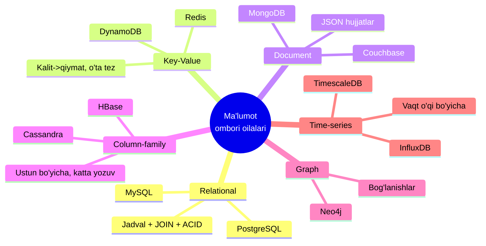
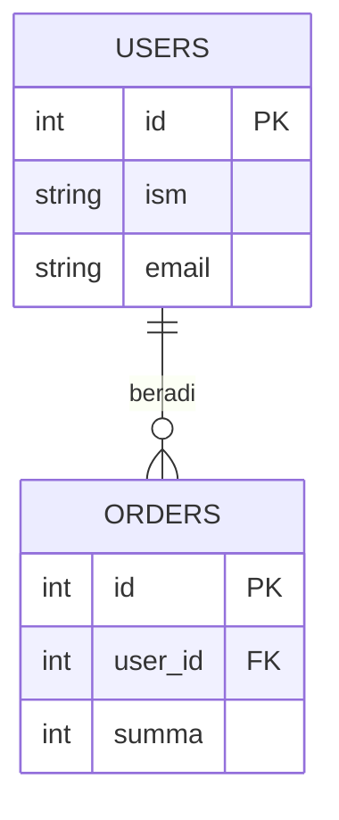
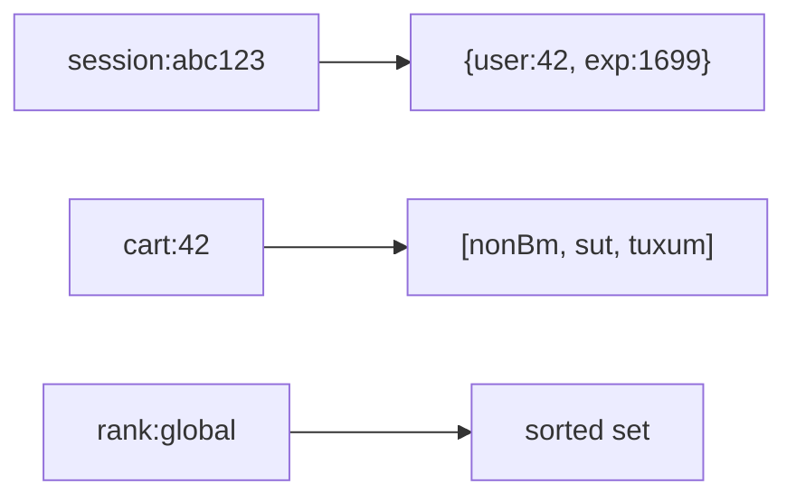
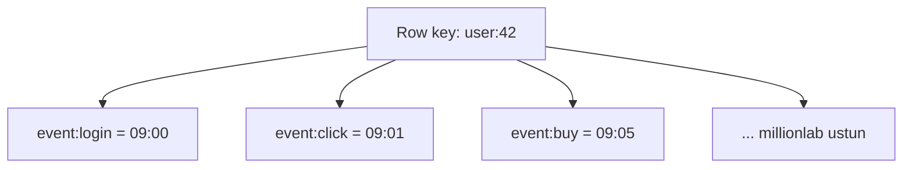
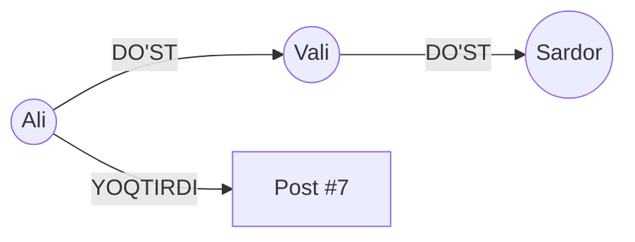
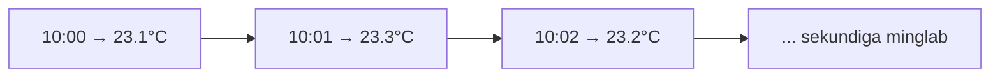
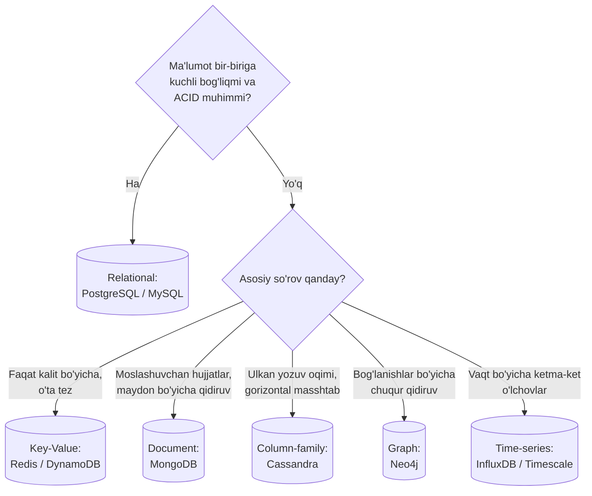
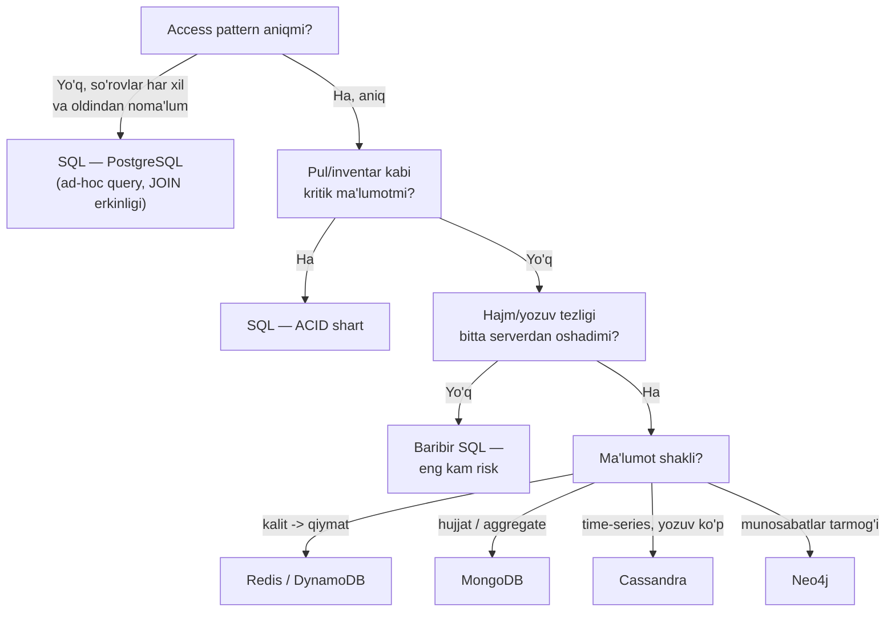
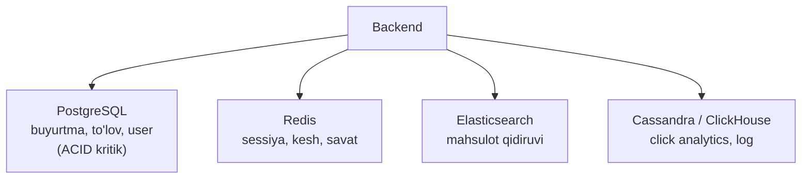

# 02 — Ma'lumotlar ombori oilalari

> **Modul 3, Dars 2.** Bitta bolg'a bilan hamma ishni qilib bo'lmaydi. Bu dars — qaysi vaziyatda qaysi turdagi ma'lumot ombori (database) to'g'ri asbob ekanini o'rgatadi.

---

## 1. Muammo — hamma joyga bitta DB tiqishtirdik

Bir loyihada boshlovchi shunday qiladi: hamma narsani PostgreSQL'ga tiqadi.
Foydalanuvchi sessiyasi ham, "kim kimning do'sti" grafi ham, sensor o'lchovlari ham, kesh ham.

Natijada:
- Sessiyani har so'rovda diskdan o'qish — **sekin** (aslida RAM'da tez kesh kerak edi).
- "Do'stning do'sti" so'rovi 5 ta `JOIN` — **dahshatli sekin** (aslida graph DB kerak edi).
- Sekundiga million sensor yozuvi — **PostgreSQL bo'g'iladi** (aslida time-series DB kerak edi).

Muammo DB'da emas — **noto'g'ri asbob tanlashda**. Har bir oila
ma'lum bir shakldagi ma'lumot va so'rov uchun optimallashgan.

---

## 2. Analogiya — transport turlari

Bir manzilga borish uchun transport tanlaysan: shahar ichida velosiped,
uzoq masofaga samolyot, yuk tashishga fura, tog'da ot. Bittasi "eng yaxshi" emas —
**vaziyatga mos** bo'lgani yaxshi.

Ma'lumot ombori oilalari ham shunday: relational — ishonchli poyezd (jadval, qat'iy jadval),
key-value — velosiped (tez, sodda), document — universal furgon (moslashuvchan),
graph — bog'lanishlar bo'yicha yuguruvchi, time-series — vaqt o'qi bo'yicha konveyer.

> ⚠️ **Analogiya chegarasi:** transportda odatda bittasini tanlaysan. Real tizimda esa
> ko'pincha **bir nechta DB birga** ishlatiladi (polyglot persistence) — masalan PostgreSQL + Redis.

---

## 3. Oilalar xaritasi



Endi har bir oilani alohida ko'ramiz: **qanday saqlaydi → qachon ishlatiladi → mashhur vakili**.

---

## 4. Relational (SQL) — jadvallar va bog'lanishlar

**Qanday saqlaydi:** ma'lumot **jadvallarga** (table) bo'linadi — qator (row) va ustun (column).
Jadvallar bir-biriga **kalit** (key) orqali bog'lanadi va `JOIN` bilan birlashtiriladi.
Schema qat'iy: har ustunning turi oldindan belgilangan.



**Qachon:** murakkab bog'lanishlar, ACID muhim (bank, e-commerce, buxgalteriya),
ma'lumot yaxlitligi shart. 1-darsdagi tranzaksiyalar aynan shu yerda porlaydi.

**Mashhur vakili:** PostgreSQL, MySQL, SQLite.

```sql
-- Bir foydalanuvchining barcha buyurtmalari — JOIN kuchi
SELECT u.ism, o.summa
FROM users u
JOIN orders o ON o.user_id = u.id
WHERE u.id = 42;
```

---

## 5. Key-Value — eng sodda va eng tez

**Qanday saqlaydi:** faqat **kalit → qiymat**. Xuddi dasturlashdagi hash map/dictionary,
lekin tarmoq orqali. Kalitni berasan — qiymatni bir zumda qaytaradi. Ichki tuzilma yo'q:
DB qiymat ichida nima borligini bilmaydi (u siz uchun shunchaki "quti").



**Qachon:** kesh (cache), sessiya, savatcha, real-time leaderboard, rate limiting —
ya'ni kalit bo'yicha o'ta tez o'qish/yozish kerak bo'lgan joylar.

**Mashhur vakili:** Redis (RAM'da, o'ta tez), DynamoDB.

> **Nozik nuqta:** kalit bo'yicha qidiruv — chaqmoqdek tez. Lekin "qiymat ichidagi bir
> maydon bo'yicha qidir" (masalan "yoshi 25 dan katta hamma") — key-value'da **imkonsiz**,
> chunki DB qiymat ichini ko'rmaydi.

---

## 6. Document — moslashuvchan JSON hujjatlar

**Qanday saqlaydi:** ma'lumot **hujjat** (document) sifatida, odatda JSON/BSON ko'rinishida.
Key-value'dan farqi: DB hujjat **ichini ko'radi** va uning maydonlari bo'yicha qidira oladi.
Schema erkin: har hujjat turli maydonlarga ega bo'lishi mumkin.

```json
{
  "_id": "42",
  "ism": "Ali",
  "manzil": { "shahar": "Toshkent", "index": "100000" },
  "buyurtmalar": [
    { "id": 1, "summa": 50000 },
    { "id": 2, "summa": 30000 }
  ]
}
```

Diqqat: bog'liq ma'lumot (buyurtmalar) **bitta hujjat ichida** turadi — `JOIN` shart emas.
Bir o'qishda hammasi keladi. Bu tez, lekin ma'lumot takrorlanishi (denormalization) mumkin.

**Qachon:** CMS, katalog, foydalanuvchi profillari, tez o'zgaruvchan yoki har xil shakldagi ma'lumot.

**Mashhur vakili:** MongoDB, Couchbase, Firestore.

---

## 7. Column-family (wide-column) — yozishga optimallashgan gigant

**Qanday saqlaydi:** tashqaridan jadvalga o'xshaydi, lekin ma'lumot diskda **ustun oilalari**
(column family) bo'yicha guruhlanadi va **shard**'larga tarqatiladi (4-darsda batafsil).
Har qator juda ko'p (millionlab) ustunga ega bo'lishi mumkin va ular siyrak (sparse) bo'ladi.



**Qachon:** juda katta hajm, **yozuv oqimi ulkan** (write-heavy), gorizontal masshtab shart —
IoT sensor ma'lumotlari, loglar, analitika, xabar tarixi. LSM-tree ustiga qurilgani uchun
(3-darsda ko'ramiz) yozishga juda tez.

**Mashhur vakili:** Cassandra, HBase, ScyllaDB.

---

## 8. Graph — bog'lanishlar birinchi o'rinda

**Qanday saqlaydi:** ma'lumot **tugun** (node) va **qirra** (edge — bog'lanish) sifatida.
Bog'lanishning o'zi birinchi darajali fuqaro: "Ali → DO'ST → Vali" to'g'ridan-to'g'ri saqlanadi,
`JOIN` orqali qidirilmaydi.



**Qachon:** bog'lanishlar bo'yicha chuqur so'rov kerak bo'lganda — ijtimoiy tarmoq
("do'stning do'sti"), tavsiya tizimi, firibgarlikni aniqlash, bilim grafi.

> **Nega SQL bunga yaramaydi:** "do'stning do'stining do'sti" so'rovi SQL'da 3 ta `JOIN`,
> 6-daraja uchun 6 ta `JOIN` — eksponensial sekinlashadi. Graph DB'da bu shunchaki
> qirralar bo'ylab yurish, chuqurlikdan qat'i nazar tez.

**Mashhur vakili:** Neo4j, ArangoDB, Amazon Neptune.

---

## 9. Time-series — vaqt o'qi bo'yicha

**Qanday saqlaydi:** har yozuvning markazida **vaqt tamg'asi** (timestamp) turadi.
Ma'lumot vaqt bo'yicha tartiblangan holda, siqilgan (compressed) va bo'laklarga (chunk) bo'lib saqlanadi.
Eski ma'lumotni avtomatik o'chirish (retention) yoki jamlash (downsampling) qulay.



**Qachon:** metrikalar, monitoring, IoT sensorlari, moliyaviy narx tiklari — ya'ni
"vaqt bo'yicha ketma-ket yoziladi, oraliq bo'yicha o'qiladi" naqshi.

**Mashhur vakili:** InfluxDB, TimescaleDB (PostgreSQL ustida), Prometheus.

---

## SQL vs NoSQL — asosiy taqqoslash

"NoSQL" — bitta narsa emas; u relational bo'lmagan oilalar (key-value, document, column, graph, ...)
uchun umumiy nom. Umumiy farqlar:

| Xususiyat | SQL (Relational) | NoSQL (umuman) |
|-----------|------------------|----------------|
| **Schema** | Qat'iy, oldindan belgilangan | Moslashuvchan yoki yo'q |
| **Masshtab** | Asosan vertikal (kuchliroq server) | Asosan gorizontal (ko'p server) |
| **ACID** | To'liq | Ko'pincha qisman (eventual consistency) |
| **JOIN** | Kuchli tomoni | Yo'q yoki application-level |
| **So'rov tili** | Standart SQL | Har DB'da o'ziga xos |
| **Eng yaxshi** | Murakkab bog'lanish, tranzaksiya | Ulkan hajm, tezlik, moslashuvchanlik |
| **Misol** | Bank, ERP, buxgalteriya | Kesh, log, katalog, ijtimoiy graf |

> **Oltin qoida:** SQL — "ma'lumotning to'g'riligi va bog'lanishi eng muhim" bo'lganda.
> NoSQL — "hajm, tezlik yoki moslashuvchanlik eng muhim" bo'lganda. Ko'pincha ikkalasi birga.

---

## Qaysi DB'ni tanlash — qaror daraxti



---

## Worked example — bitta ilova, uch xil DB

Faraz qil: onlayn do'kon ilovasi. Turli ma'lumotga turli asbob:

```go
// --- 1-qadam: buyurtmalar va to'lov — ACID shart → PostgreSQL ---
tx, _ := pg.Begin()
tx.Exec("INSERT INTO orders(user_id, summa) VALUES($1,$2)", 42, 50000)
tx.Commit() // pul va buyurtma atomik

// --- 2-qadam: savatcha va sessiya — tez, vaqtinchalik → Redis (key-value) ---
redis.Set(ctx, "cart:42", `["nonBm","sut"]`, 30*time.Minute)

// --- 3-qadam: "sizga o'xshash xaridorlar" tavsiyasi → Neo4j (graph) ---
// MATCH (u:User {id:42})-[:BOUGHT]->(:Item)<-[:BOUGHT]-(other) RETURN other
```

**Output (g'oyaviy):**
```
orders    → PostgreSQL: to'lov ishonchli, ACID
cart:42   → Redis: 0.2 ms o'qish, 30 daqiqada avtomatik o'chadi
tavsiya   → Neo4j: "do'stlar sotib olgan" tez topildi
```

Bir ilova — uch DB. Bu **polyglot persistence** deyiladi: har ma'lumotga eng mos asbob.

---

## DB tanlash — amaliy framework (5 savol)

Qaror daraxti "qanday ma'lumot" degan savolga javob beradi. Lekin real loyihada (va intervyuda)
undan ham muhimroq boshlang'ich savol bor: **"qanday so'rovlar bo'ladi?"** Quyidagi 5 savol
ketma-ketligi deyarli har doim to'g'ri asbobga olib boradi.

1. **Access pattern qanday?** Eng muhim savol. "Qanday ma'lumot bor?" emas — **"qanday so'rovlar bo'ladi?"**
   ID bo'yicha bitta obyekt olishmi? Murakkab filtr va aggregatsiyalarmi? Ko'p jadval kesishadigan hisobotlarmi?
2. **Consistency qanchalik kritik?** Pul, inventar, bron — bir soniya ham noto'g'ri ko'rinmasligi kerak
   -> **strong consistency (ACID)** shart. Like soni, ko'rishlar, feed — 2 soniya eskirsa hech kim sezmaydi
   -> **eventual consistency** yetadi.
3. **Hajm va o'sish qanday?** Yiliga bir necha yuz GB — bitta PostgreSQL bemalol ko'taradi (to'g'ri indeks bilan
   yuz millionlab qator muammo emas). Kuniga terabaytlab yozuv (IoT, log, clickstream) -> horizontal scaling kerak.
4. **Ma'lumot shakli qanchalik o'zgaruvchan?** Har yozuv har xil maydonga ega bo'lsa (telefon vs futbolka
   atributlari) — flexible schema qulay.
5. **Jamoa nimani biladi?** PostgreSQL biladigan jamoaga Cassandra berish — loyihani cho'ktirish.



> **Oltin qoida:** aniq sabab bo'lmasa — **PostgreSQL bilan boshla**. "Default — SQL, NoSQL — isbotlangan
> ehtiyoj bo'lganda" pozitsiyasi senior javob hisoblanadi. NoSQL'ni "zamonaviy ko'ringani uchun" tanlash —
> klassik junior xato.

---

## Nega bu loyihaga SQL, unisiga NoSQL — konkret misollar

Qaror daraxti mavhum. Endi uni **aniq loyihalar**ga bog'laymiz — nega aynan shu tanlov.

### SQL tanlanadigan loyihalar

- **Bank / to'lov tizimi.** A hisobdan B hisobga pul o'tkazish — ikkita yozuv **bitta transaction** ichida
  bo'lishi shart: birinchisi bajarilib ikkinchisi yiqilsa, pul "yo'qoladi" (Atomicity). Balans hech qachon
  minusga tushmasligi — Consistency. Bu kafolatlarni NoSQL'da qo'lda qurish — o'zingga xato yozish.
- **E-commerce buyurtma va inventar.** Oxirgi 1 dona mahsulotni 2 kishi bir vaqtda sotib olmoqchi. SQL'da
  Isolation + row lock buni tabiiy hal qiladi: `UPDATE stock SET qty = qty - 1 WHERE qty > 0`. Eventual
  consistent tizimda ikkalasiga ham "sotildi" deb yuborib qo'yish mumkin.
- **ERP / CRM / buxgalteriya.** Ma'lumot tabiatan relational (mijoz -> shartnoma -> hisob-faktura -> to'lov) va
  hisobotlar oldindan noma'lum ad-hoc so'rovlar bilan olinadi. JOIN erkinligi bu yerda oltin.

### NoSQL tanlanadigan loyihalar

- **Sessiya / kesh / leaderboard -> Redis (key-value).** Ma'lumot doim bitta kalit bo'yicha olinadi, TTL kerak,
  latency mikrosekund darajada. Relational modelning hech bir kuchi ishlatilmaydi — nega uning narxini to'lash?
- **Mahsulot katalogi / CMS -> MongoDB (document).** Telefonda `screen_size`, `ram` bor; futbolkada `size`,
  `color`, `material`. Ming xil kategoriya — ming xil atribut. SQL'da bu yo yuzlab nullable ustun, yo qo'pol
  EAV jadval bo'lardi. Document modelda har mahsulot — o'z shaklidagi hujjat.
- **IoT / metrikalar / chat tarixi -> Cassandra (wide-column).** Kuniga milliardlab yozuv, deyarli hech qachon
  UPDATE yo'q, o'qish doim "shu qurilmaning oxirgi N soati" ko'rinishida. Cassandra yozuvni linearga yaqin
  scale qiladi: 10 node yetmasa — 20 qilasan.
- **Ijtimoiy tarmoq grafi / tavsiya -> Neo4j (graph).** "Do'stimning do'stlari ichida shu kursni yoqtirganlar" —
  SQL'da 3-4 darajali self-join bo'lib chirmashib ketadi, graph DB'da bu tabiiy traversal.

### Real e-commerce arxitekturasi — polyglot to'liq ko'rinishda

Yuqoridagi worked example'da bir ilova uch DB ishlatishini ko'rding. Real e-commerce esa odatda undan ham
ko'p tizimni birlashtiradi. Savol "SQL **yoki** NoSQL" emas — "**qaysi ma'lumotga qaysi tizim**":



> **Amaliy maslahat:** boshlanishida hammasi PostgreSQL'da bo'ladi; boshqa tizimlar **o'lchangan ehtiyoj**
> paydo bo'lganda qo'shiladi. Bir necha DB'ni birdan olib boshlash — erta optimizatsiya (premature optimization).

---

## Predict savoli (PRIMM)

Sen foydalanuvchi sessiyalarini (kimning login qilganini) saqlamoqchisan. Sessiya —
qisqa umrli, faqat sessiya ID bo'yicha o'qiladi va sekundiga o'n minglab so'rov keladi.
Buni PostgreSQL jadvaliga saqlasang, nima muammo bo'ladi?

<details>
<summary>💡 Javobni ko'rish</summary>

PostgreSQL har o'qish/yozishda diskka boradi va ACID kafolatlarini ta'minlaydi —
bu sessiya uchun **ortiqcha va sekin**. Sekundiga o'n minglab so'rovda DB bo'g'iladi,
latency oshadi. Sessiyaga ACID kerak emas (yo'qolsa — qayta login qilinadi).

To'g'risi: **Redis (key-value)** — RAM'da, 0.2 ms, `EXPIRE` bilan avtomatik o'chadi.
Bu — noto'g'ri oila tanlashning klassik namunasi.
</details>

---

## Ko'p uchraydigan xatolar

⚠️ **Xato 1: "NoSQL — bu bitta narsa"**
Noto'g'ri: NoSQL — kamida to'rt xil oila (key-value, document, column, graph), ular bir-biridan
transport turlaridek farq qiladi. "NoSQL ishlataylik" degani "transport ishlataylik" degandek noaniq.

⚠️ **Xato 2: "NoSQL SQL'dan har doim tezroq"**
Noto'g'ri: NoSQL o'zi optimallashgan naqsh uchun tez. Noto'g'ri naqshda (masalan document DB'da
ko'p `JOIN`ga o'xshash ish) u SQL'dan sekinroq bo'lishi mumkin. Tezlik — moslikdan keladi.

⚠️ **Xato 3: "Schema yo'q = dizayn kerak emas"**
Noto'g'ri: document DB schema majburlamaydi, lekin ma'lumotni qanday guruhlash (qaysi maydon
qaysi hujjatda) — baribir jiddiy dizayn qarori. Yomon dizayn keyin qimmatga tushadi.

⚠️ **Xato 4: "Bitta DB hamma narsani hal qiladi"**
Noto'g'ri: real tizimlar ko'pincha polyglot — PostgreSQL + Redis + time-series birga.
Har ma'lumotga mos asbob tanlash normal holat.

---

## Xulosa

- Har oila ma'lum shakldagi ma'lumot va so'rov uchun optimallashgan — "eng yaxshi DB" degani yo'q.
- **Relational** — jadval + JOIN + ACID; bank, e-commerce (PostgreSQL, MySQL).
- **Key-value** — kalit→qiymat, o'ta tez; kesh, sessiya (Redis, DynamoDB).
- **Document** — moslashuvchan JSON, maydon bo'yicha qidiruv; katalog, profil (MongoDB).
- **Column-family** — ulkan yozuv oqimi, gorizontal masshtab; log, IoT (Cassandra).
- **Graph** — bog'lanishlar bo'yicha chuqur qidiruv; ijtimoiy tarmoq (Neo4j).
- **Time-series** — vaqt o'qi bo'yicha o'lchovlar; monitoring, sensor (InfluxDB, Timescale).
- Real tizim ko'pincha bir nechta DB'ni birga ishlatadi (polyglot persistence).

## 🧠 Eslab qol

- "Eng yaxshi DB" yo'q — vaziyatga mos DB bor.
- Key-value = hash map tarmoq orqali; faqat kalit bo'yicha tez.
- Graph = "do'stning do'sti" so'rovi uchun; SQL bunda sekinlashadi.
- NoSQL — bitta narsa emas, kamida 4 oila.
- Bitta ilova bir nechta DB ishlatishi normal.

## ✅ O'z-o'zini tekshir (retrieval practice)

**1.** Key-value va document DB ikkalasi ham kalit bo'yicha saqlaydi. Asosiy farqi nima?
<details>
<summary>Javob</summary>
Key-value DB qiymat **ichini ko'rmaydi** — u siz uchun shunchaki "quti", faqat kalit bo'yicha topadi. Document DB esa hujjat **ichini ko'radi** va maydonlari bo'yicha qidira oladi (masalan "shahri Toshkent bo'lgan hamma"). Shuning uchun document — key-value'dan "aqlliroq", lekin biroz sekinroq.
</details>

**2.** Nega "do'stning do'stining do'sti" so'rovi uchun graph DB relational'dan afzal?
<details>
<summary>Javob</summary>
Relational'da har daraja bitta `JOIN` — 3 daraja 3 ta JOIN, chuqurlashgan sari eksponensial sekinlashadi. Graph DB'da bog'lanish to'g'ridan-to'g'ri saqlanadi, so'rov shunchaki qirralar bo'ylab yurish — chuqurlikdan qat'i nazar tez.
</details>

**3.** Sekundiga million sensor o'lchovi keladi. Nega PostgreSQL emas, column-family/time-series DB?
<details>
<summary>Javob</summary>
PostgreSQL ACID va indekslarni yangilash bilan yozuvni sekinlashtiradi; million yozuv/sekund uni bo'g'adi. Column-family (LSM-tree ustida) va time-series DB yozishga optimallashgan, gorizontal masshtablanadi va vaqt bo'yicha siqadi — bunday oqimga mos.
</details>

**4.** "NoSQL SQL'dan tezroq" degan gap nega noto'g'ri?
<details>
<summary>Javob</summary>
Tezlik oilaning o'ziga xos naqshiga mosligidan keladi, "NoSQL" degan yorliqdan emas. Document DB'da JOIN'ga o'xshash murakkab so'rov qilsang, u SQL'dan sekinroq bo'lishi mumkin. Har asbob o'z ishida tez.
</details>

## 🛠 Amaliyot

**1. Oson (savol/diagramma).** 8-bo'limdagi graph diagrammani qog'ozga chizib, unga
"Sardor YOQTIRDI Post#7" qirrasini qo'sh. Endi "Post#7 ni yoqtirganlar" so'rovini
qirralar bo'ylab qanday topasan — bir jumlada yoz.
<details>
<summary>Hint</summary>
`Post#7` tugunidan ichkariga kiruvchi barcha `YOQTIRDI` qirralarini ol — ular Ali va Sardorga olib boradi. JOIN yo'q, faqat qirralar bo'ylab yurish.
</details>

**2. O'rta (kamchilik topish).** Bir jamoa **hamma narsani MongoDB'ga** saqladi: buyurtma,
to'lov, savatcha, "do'st" grafi, sensor o'lchovlari. Har biriga bittadan kamchilik ayt.
<details>
<summary>Hint</summary>
To'lov → ACID/ko'p hujjatli tranzaksiya cheklovlari (pul yo'qolishi xavfi). Savatcha → RAM-tez Redis afzalroq. "Do'st" grafi → chuqur bog'lanish so'rovi document'da sekin, graph DB kerak. Sensor → yozuv oqimi va vaqt bo'yicha siqish uchun time-series afzal.
</details>

**3. Qiyin (kichik dizayn).** "Spotify'ga o'xshash" musiqa ilovasi uchun DB rejasi tuz:
(a) foydalanuvchi va obuna to'lovi, (b) playlist va tinglash tarixi, (c) "sizga yoqishi mumkin"
tavsiyasi, (d) real-time "hozir nechta odam tinglayapti" hisoblagichi. Har biriga mos oila va sabab yoz.
<details>
<summary>Hint</summary>
(a) PostgreSQL — to'lov ACID. (b) tinglash tarixi → time-series yoki column-family (katta oqim); playlist → document yoki relational. (c) Neo4j graph — "o'xshash tinglovchilar". (d) Redis — real-time hisoblagich (`INCR`), o'ta tez.
</details>

## 🔁 Takrorlash

**Bog'liq oldingi mavzular:**
- [01-acid-va-tranzaksiyalar.md](01-acid-va-tranzaksiyalar.md) — ACID nega relational DB'ning kuchli tomoni.
- [2-modul: Kengayish usullari](../2-kengayish-usullari/) — gorizontal masshtab NoSQL oilalari uchun nega markaziy.

**Shu modul ichida keyingi:**
- [03-b-tree-indeks.md](03-b-tree-indeks.md) — relational DB ma'lumotni tez topish uchun indeksdan qanday foydalanadi.

**Takrorlash jadvali:**
| Qachon | Nima qilish |
|--------|-------------|
| Ertaga | Qaror daraxtini xotiradan chiz |
| 3 kundan keyin | Har oilaga bittadan vakil va bittadan ishlatilish holatini ayt |
| 1 haftadan keyin | "O'z-o'zini tekshir" savollariga qayta javob ber |

**Feynman testi:** Kod so'zlarini ishlatmasdan, do'stingga 3 jumlada tushuntir:
nega bitta DB hamma ishga yaramaydi, key-value va graph DB qaysi vaziyat uchun,
va polyglot persistence nima.
