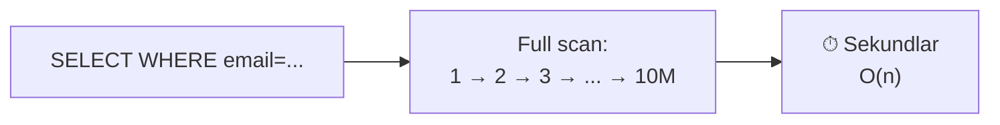
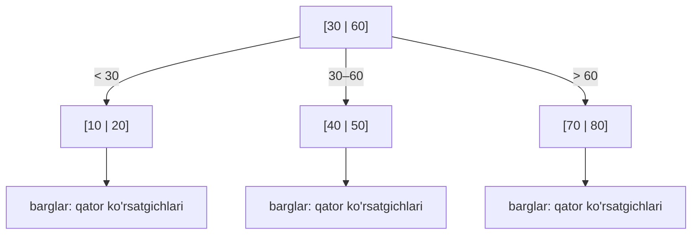
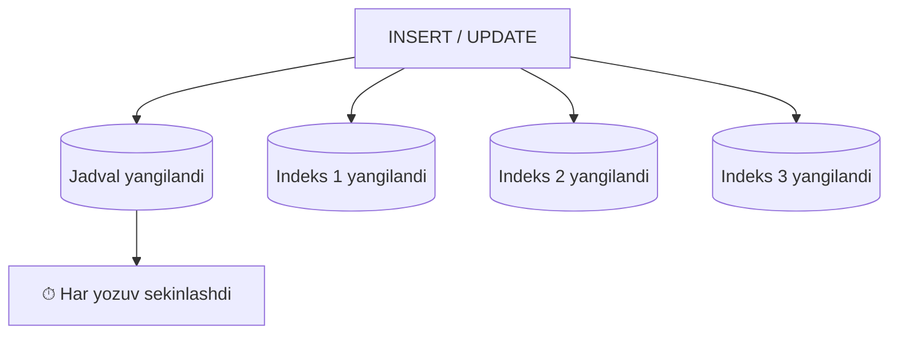
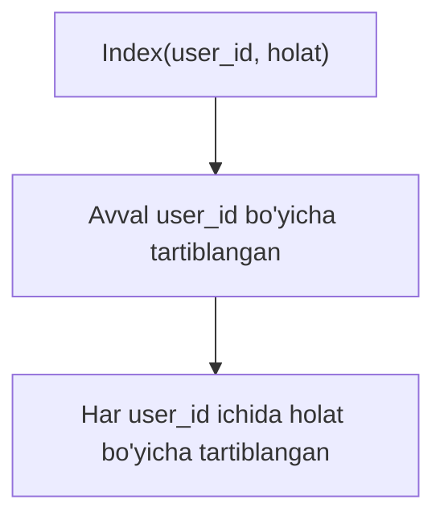
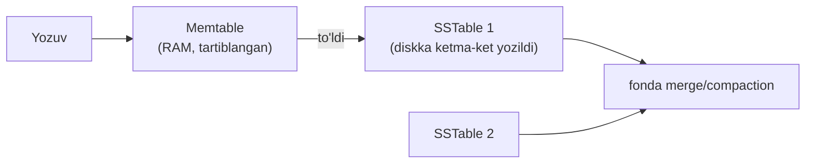

# 03 — B-tree indeks

> **Modul 3, Dars 3.** Terabaytlab ma'lumotdan bitta qatorni topish — pichanzorda igna izlash. Bu dars indeks (index) qanday qilib qidiruvni soniyalardan millisekundlarga tushirishini o'rgatadi.

---

## 1. Muammo — million qatorni birma-bir tekshirish

`users` jadvalida 10 million qator bor. Sen bittasini so'raysan:

```sql
SELECT * FROM users WHERE email = 'ali@example.com';
```

Indeks bo'lmasa, DB **full table scan** (butun jadvalni birma-bir o'qish) qiladi:
1-qatorni disk'dan o'qi, email tekshir, mos kelmadi. 2-qator, 3-qator... 10 millioninchisigacha.

1-modulda o'rgangan raqamlarni eslaymiz: **disk latency** — o'qishlar orasidagi kechikish.
Har blok o'qish ~0.1 ms bo'lsa ham, 10 million qatorni skanerlash **sekundlar** oladi.
Bitta so'rov uchun bu — o'lim. Bizga "birma-bir emas, to'g'ri sakrab borish" kerak.



---

## 2. Analogiya — kitob oxiridagi alfavit ko'rsatkichi

500 betlik kitobda "mitoxondriya" so'zi qayerda ekanini topmoqchisan.
Ikki yo'l bor:
- **1-betdan boshlab har betni o'qib chiqish** — bu full table scan.
- **Kitob oxiridagi alfavit ko'rsatkichga** (index) qarash: "mitoxondriya — 213-bet". Darrov o'sha betga o'tasan.

Indeks — aynan shu **alfavit ko'rsatkich**: qiymatni oldindan tartiblab, "qaysi qatorda" ekanini
saqlaydi. Sen qiymatni berasan — u to'g'ri joyni bir zumda aytadi.

> ⚠️ **Analogiya chegarasi:** kitob ko'rsatkichi bir tekis ro'yxat. DB indeksi esa
> **daraxt** (B-tree) — u yanada tez, chunki har qadamda qidiruv maydonini bir necha barobar qisqartiradi.

---

## 3. Sodda ta'rif

> **Indeks** — jadval ustunining qiymatlarini **tartiblangan** holda, "qaysi qatorda joylashgani"
> bilan birga saqlaydigan qo'shimcha ma'lumot tuzilmasi. Full scan (O(n)) o'rniga O(log n) qidiruv beradi.

Ko'pchilik relational DB indeksni **B-tree** (balanslangan daraxt) ko'rinishida saqlaydi.

---

## 4. B-tree tuzilishi

B-tree — balanslangan daraxt: har tugun (node) bir nechta tartiblangan kalitni saqlaydi
va bolalarga ko'rsatgichlar (pointer) tutadi. Barcha barglar (leaf) bir xil chuqurlikda —
shuning uchun "balanslangan".



Asosiy g'oya: har tugundagi kalitlar **tartiblangan**, va ular qidiruv maydonini
bo'laklarga bo'ladi. Bitta tugunga qarab, keyin **qaysi bolaga tushishni** hal qilasan —
qolgan bo'laklarni **butunlay tashlab yuborasan**.

---

## 5. Worked example — qidiruv qadam-baqadam

Yuqoridagi daraxtda **50** qiymatini izlaymiz:

```
// --- 1-qadam: ildizga qaraymiz: [30 | 60] ---
// 50 qaysi oraliqda? 30 < 50 < 60 → o'rta bolaga tush
// (< 30 va > 60 shoxlarini BUTUNLAY tashladik)

// --- 2-qadam: o'rta tugun: [40 | 50] ---
// 50 topildi! → qator ko'rsatgichini ol

// --- 3-qadam: ko'rsatgich bo'yicha diskdan qatorni o'qi ---
```

**Nima sodir bo'ldi (notional machine):** har qadamda daraxt kalitlar sonini
bir necha barobar qisqartirdi. 10 million qatorli jadvalda B-tree chuqurligi atigi **3-4 daraja**
(chunki har tugun yuzlab kalit tutadi). Ya'ni 10 million o'rniga **~4 ta disk o'qish** —
sekundlardan **millisekundga**.

Bu O(log n): har qadam maydonni bo'ladi.

| Jadval hajmi | Full scan (O(n)) | B-tree (O(log n)) |
|--------------|------------------|-------------------|
| 1 000 | 1 000 qadam | ~3 qadam |
| 1 000 000 | 1 000 000 qadam | ~4 qadam |
| 1 000 000 000 | 1 mlrd qadam | ~5 qadam |

Diqqat: ma'lumot **ming barobar** ko'paysa, B-tree qadamlari deyarli o'zgarmaydi. Ana shu logarifmning kuchi.

Indeks yaratish SQL'da bitta qator:

```sql
-- email bo'yicha B-tree indeks
CREATE INDEX idx_users_email ON users(email);

-- endi bu so'rov full scan emas, indeksdan foydalanadi:
SELECT * FROM users WHERE email = 'ali@example.com';
```

Tekshirish — `EXPLAIN`:
```
EXPLAIN SELECT * FROM users WHERE email = 'ali@example.com';
-- Index Scan using idx_users_email  ← full scan emas!  ✅
```

---

## 6. Predict savoli (PRIMM)

Indeks qidiruvni bunchalik tezlashtirsa, nega **har bir ustunga** indeks qo'yib qo'ymaymiz?
Bu bepul emasdek tuyuladi — narxi nima?

<details>
<summary>💡 Javobni ko'rish</summary>

Indeks bepul emas — u ikki narxni oladi:

1. **Yozish sekinlashadi.** Har `INSERT`/`UPDATE`/`DELETE`da DB nafaqat jadvalni, balki
   **har bir indeksni ham** yangilashi kerak (B-tree'ni balansda ushlash). 5 ta indeks =
   har yozuvda 5 ta qo'shimcha yangilanish. Write-heavy tizimda bu og'ir.

2. **Joy egallaydi.** Har indeks — alohida disk tuzilmasi. Ular jadval hajmining katta
   qismini, ba'zan undan ham ko'proq joy oladi.

Shuning uchun indeks — **o'qishni tezlashtirish, yozishni sekinlashtirish** kelishuvi.
Faqat tez-tez qidiriladigan ustunlarga qo'yiladi.
</details>

---

## Indeksning narxi — o'qish tez, yozish sekin



> **Oltin qoida:** indeks — o'qishni tezlashtirish evaziga yozishni sekinlashtirish va
> disk joyini sarflashdir. Faqat qidiruv/filtr/tartiblashda tez-tez ishlatiladigan ustunlarga qo'y.

Qaerga indeks qo'yish kerak:
- `WHERE` shartida tez-tez ishlatiladigan ustun (masalan `email`, `user_id`).
- `JOIN` kaliti (foreign key).
- `ORDER BY` da tartiblanadigan ustun.

Qaerga shart emas: kam qidiriladigan ustun; qiymatlar deyarli bir xil bo'lgan ustun
(masalan `jinsi` — faqat 2 qiymat; indeks foyda bermaydi).

---

## Composite index va ustunlar tartibi

Ba'zan bir necha ustun birga filtrlanadi:

```sql
SELECT * FROM buyurtmalar
WHERE user_id = 42 AND holat = 'yangi';
```

Bunda **composite index** (bir nechta ustunli indeks) qo'yamiz:

```sql
CREATE INDEX idx_buyurtma ON buyurtmalar(user_id, holat);
```

Ustunlar **tartibi muhim**. Analogiya: telefon kitobi **familiya, keyin ism** bo'yicha tartiblangan.



**Chapdan boshlash qoidasi (leftmost prefix):** bu indeks quyidagilarda ishlaydi:
- `WHERE user_id = 42` ✅ (birinchi ustun)
- `WHERE user_id = 42 AND holat = 'yangi'` ✅ (ikkalasi)

Lekin bunda **ishlamaydi**:
- `WHERE holat = 'yangi'` ❌ (birinchi ustun `user_id` o'tkazib yuborilgan)

Xuddi telefon kitobida familiyani bilmasdan faqat ism bo'yicha topib bo'lmagani kabi.

> **Qoida:** composite index'da eng ko'p va eng aniq filtrlaydigan ustunni **oldinga** qo'y.
> Faqat ikkinchi ustun bo'yicha qidirsang — indeks yordam bermaydi.

---

## Qisqacha LSM-tree bilan taqqos

B-tree — o'qishga muvozanatli, lekin har yozuvda daraxtni joyida yangilaydi (random disk yozuv).
Yozuv oqimi ulkan bo'lsa (2-darsdagi Cassandra kabi column-family DB'lar), boshqa tuzilma —
**LSM-tree** (Log-Structured Merge-tree) ishlatiladi.



Asosiy g'oya: yozuvlar avval **RAM'da** (memtable) to'planadi, keyin diskka **ketma-ket**
(sequential — random emas) bir butun bo'lib yoziladi. Ketma-ket yozuv random yozuvdan
disk uchun ancha tez (1-modul disk bilimi).

| | B-tree | LSM-tree |
|--|--------|----------|
| **Optimallashtiruv** | O'qish | Yozish |
| **Disk yozuvi** | Random (joyida) | Ketma-ket (append) |
| **Ishlatadi** | PostgreSQL, MySQL | Cassandra, RocksDB, LevelDB |
| **Kamchilik** | Yozuv sekinroq | O'qish ba'zan sekin (bir necha faylni tekshirish) |

Xulosa: **o'qish ko'p → B-tree; yozuv ko'p → LSM-tree**.

---

## Ko'p uchraydigan xatolar

⚠️ **Xato 1: "Ko'p indeks = tez DB"**
Noto'g'ri: indeks o'qishni tezlashtiradi, lekin **har biri yozuvni sekinlashtiradi** va joy oladi.
Keraksiz indekslar write-heavy tizimni bo'g'adi. Faqat kerakligini qo'y, `EXPLAIN` bilan tekshir.

⚠️ **Xato 2: "Indeks qo'ydim, demak so'rovim indeksdan foydalanadi"**
Noto'g'ri: ustun ustida funksiya ishlatsang (`WHERE LOWER(email) = ...`) yoki tur mos kelmasa,
DB indeksni **e'tiborsiz qoldirishi** mumkin va full scan qiladi. Har doim `EXPLAIN` bilan tasdiqla.

⚠️ **Xato 3: composite index ustun tartibini teskari qo'yish**
Noto'g'ri: `Index(holat, user_id)` yaratib, keyin `WHERE user_id = 42` qidirsang — indeks
ishlamaydi (leftmost prefix buzildi). Eng aniq/tez-tez filtrlaydigan ustunni oldinga qo'y.

⚠️ **Xato 4: qiymatlari kam xilma-xil ustunga indeks**
`jinsi` (2 qiymat) yoki `faol` (true/false) ustuniga indeks deyarli foydasiz — u baribir
jadvalning yarmini qaytaradi, full scan'dan tez emas.

---

## Xulosa

- Indekssiz qidiruv — **full table scan**, O(n), disk latency tufayli katta jadvalda sekundlar.
- **Indeks** = tartiblangan qo'shimcha tuzilma; qidiruvni O(log n) ga tushiradi.
- **B-tree** — balanslangan daraxt; har qadam maydonni bo'ladi, 10M qator = ~4 disk o'qish.
- Ma'lumot ming barobar ko'paysa, B-tree qadamlari deyarli o'zgarmaydi (logarifm kuchi).
- Indeks bepul emas: **yozishni sekinlashtiradi** va **disk joyi** oladi.
- **Composite index** — ustunlar tartibi muhim; leftmost prefix qoidasi.
- **LSM-tree** — yozishga optimallashgan alternativa (Cassandra); ketma-ket disk yozuvi.

## 🧠 Eslab qol

- Indekssiz = pichanzorda igna izlash (full scan).
- Indeks = kitob oxiridagi alfavit ko'rsatkich.
- B-tree qidiruv O(log n): 10M qator ≈ 4 qadam.
- Indeks o'qishni tezlashtiradi, yozishni sekinlashtiradi.
- O'qish ko'p → B-tree; yozuv ko'p → LSM-tree.

## ✅ O'z-o'zini tekshir (retrieval practice)

**1.** Jadval 1000 qatordan 1 milliardga o'ssa, full scan million barobar sekinlashadi. B-tree qidiruvi qancha sekinlashadi va nega?
<details>
<summary>Javob</summary>
Deyarli sekinlashmaydi — ~3 qadamdan ~5 qadamga o'sadi xolos. Sabab: B-tree O(log n), har qadam qidiruv maydonini yuzlab barobar qisqartiradi. Logarifm juda sekin o'sadi: ming barobar ko'p ma'lumot bir-ikkita qo'shimcha qadam degani.
</details>

**2.** `Index(user_id, holat)` bor. Nega `WHERE holat = 'yangi'` so'rovi bu indeksdan foydalana olmaydi?
<details>
<summary>Javob</summary>
Composite index avval `user_id` bo'yicha, keyin uning ichida `holat` bo'yicha tartiblangan (telefon kitobi: familiya→ism). `user_id` berilmasa, `holat` daraxt bo'ylab tarqoq joylashgan — leftmost prefix buzilgani uchun indeks yordam bermaydi.
</details>

**3.** Nega har ustunga indeks qo'yish yomon g'oya?
<details>
<summary>Javob</summary>
Har indeks yozuvni (INSERT/UPDATE/DELETE) sekinlashtiradi — DB har o'zgarishda barcha indekslarni yangilaydi va balansda ushlaydi. Ustiga disk joyini oladi. Write-heavy tizimda ortiqcha indekslar tizimni bo'g'adi.
</details>

**4.** Cassandra kabi yozuv-og'ir DB nega B-tree emas, LSM-tree ishlatadi?
<details>
<summary>Javob</summary>
B-tree har yozuvni daraxtning to'g'ri joyiga yozadi — bu random disk yozuvi, sekin. LSM-tree yozuvlarni avval RAM'da (memtable) to'plab, keyin diskka ketma-ket (sequential) bir butun bo'lib yozadi. Ketma-ket yozuv random'dan tez, shuning uchun ulkan yozuv oqimiga mos.
</details>

## 🛠 Amaliyot

**1. Oson (savol/diagramma).** 4-bo'limdagi B-tree diagrammada **20** qiymatini izlash yo'lini
qadam-baqadam yoz (qaysi tugunga, qaysi shoxga).
<details>
<summary>Hint</summary>
Ildiz `[30|60]`: 20 < 30 → chap bolaga. Chap tugun `[10|20]`: 20 topildi → qator ko'rsatgichi. Ikki qadam.
</details>

**2. O'rta (kamchilik topish).** Bir jamoa yozuvi juda sekinlashib qoldi. `orders` jadvalida
**9 ta indeks** bor va tizim sekundiga 5000 `INSERT` qabul qiladi, lekin o'qish kam. Muammo va yechimni ayt.
<details>
<summary>Hint</summary>
Write-heavy tizimda har INSERT 9 ta indeksni yangilaydi — bu yozuvni bo'g'adi. Yechim: `EXPLAIN`/statistika bilan ishlatilmaydigan indekslarni topib o'chirish; faqat haqiqatan qidiriladigan ustunlarni qoldirish. Yozuv-og'ir bo'lsa LSM-asosli DB'ni ham ko'rib chiqish.
</details>

**3. Qiyin (kichik dizayn).** `logs(user_id, sana, daraja, xabar)` jadvali, tez-tez so'rov:
"berilgan foydalanuvchining berilgan kundagi loglari". Qanday indeks(lar) qo'yasan?
Ustunlar tartibini asosla. Bu jadval kuniga 100M yozuv qabul qilsa, umuman B-tree'mi yoki boshqa yondashuvmi?
<details>
<summary>Hint</summary>
So'rov `WHERE user_id = ? AND sana = ?` → `Index(user_id, sana)` (aniq filtrlaydigan user_id oldinda). Kuniga 100M yozuv → yozuv-og'ir; time-series/LSM-asosli yechim (TimescaleDB, Cassandra) B-tree'dan mosroq. Bu 2-darsdagi oila tanlashga bog'lanadi.
</details>

## 🔁 Takrorlash

**Bog'liq oldingi mavzular:**
- [1-modul: Disk latency](../1-tizimlar-negizi/) — full scan nega sekin, ketma-ket yozuv nega tez.
- [02-malumotlar-ombori-oilalari.md](02-malumotlar-ombori-oilalari.md) — column-family DB'lar LSM-tree ustida qurilgan.

**Shu modul ichida keyingi:**
- [04-replication-va-sharding.md](04-replication-va-sharding.md) — bitta serverga sig'may qolgan indekslangan ma'lumotni ko'p serverga tarqatish.

**Takrorlash jadvali:**
| Qachon | Nima qilish |
|--------|-------------|
| Ertaga | Full scan vs B-tree jadvalini xotiradan qayta chiz |
| 3 kundan keyin | Composite index leftmost prefix qoidasini misol bilan tushuntir |
| 1 haftadan keyin | "O'z-o'zini tekshir" savollariga qayta javob ber |

**Feynman testi:** Kod so'zlarini ishlatmasdan, do'stingga 3 jumlada tushuntir:
indeks nima, nega u kitob oxiridagi ko'rsatkichga o'xshaydi, va nega har ustunga indeks qo'ymaymiz.
