# 04 — Replication va Sharding

> **Modul 3, Dars 4.** Bitta server kuchli indeks bilan ham bir chegaraga yetadi: disk to'ladi, so'rovlar navbatga tushadi. Bu dars ma'lumotni **ko'p serverga** xavfsiz tarqatishni o'rgatadi.

---

## 1. Muammo — bitta DB butun tizimning bo'g'zi

2-modulda ilovani ko'p serverga (load balancer bilan) tarqatgan eding. Lekin ular
hammasi **bitta DB'ga** boradi:

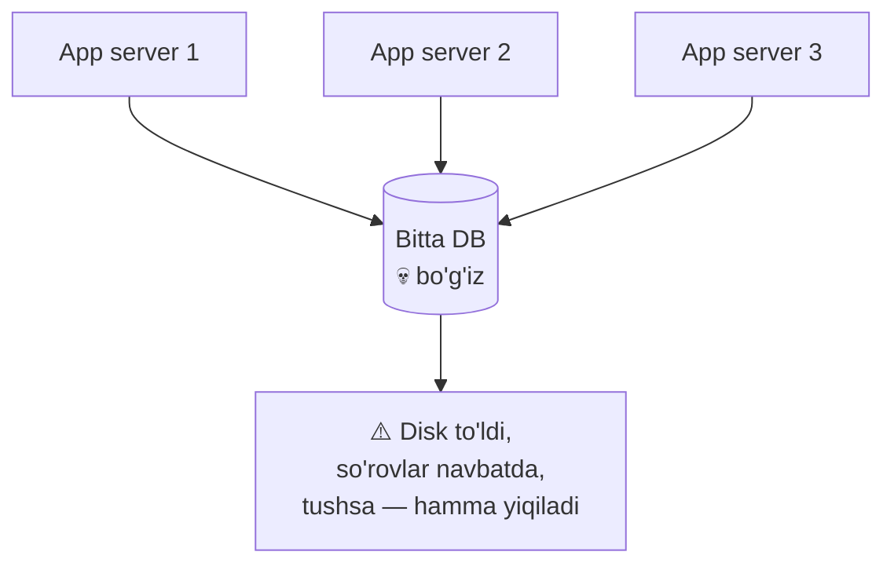

Ikki alohida muammo yashiringan:
1. **Ishonchlilik:** bu DB tushsa — butun tizim o'ladi (single point of failure).
2. **Sig'im:** ma'lumot va yuk bitta serverga sig'may qoladi.

Ikkalasi ikki xil yechim talab qiladi: birinchisi — **replication** (nusxalash),
ikkinchisi — **sharding** (bo'lish). Ularni alohida, keyin birga ko'ramiz.

---

## Qism A — Replication (nusxalash)

### 2. Analogiya — muhim hujjatning nusxalari

Muhim shartnomangning bitta nusxasi bo'lsa va u yonib ketsa — hammasi tugadi.
Shuning uchun uni **bir necha nusxada** — seyfda, bankda, bulutda — saqlaysan.
Biri yo'qolsa, boshqasidan tiklaysan.

**Replication** — ma'lumotni bir nechta serverda (replica) nusxalab saqlash.
Bir server tushsa, boshqasi ishlashda davom etadi.

> ⚠️ **Analogiya chegarasi:** hujjat statik. DB'da ma'lumot **doim o'zgaradi**, shuning uchun
> nusxalarni **sinxron ushlab turish** — asosiy qiyinchilik (replication lag shundan kelib chiqadi).

### 3. Leader-follower modeli

Eng keng tarqalgan model: bitta **leader** (ba'zan primary/master) — barcha yozuvlarni qabul qiladi.
Bir necha **follower** (replica/slave) — leaderdan nusxa oladi va faqat o'qishga xizmat qiladi.

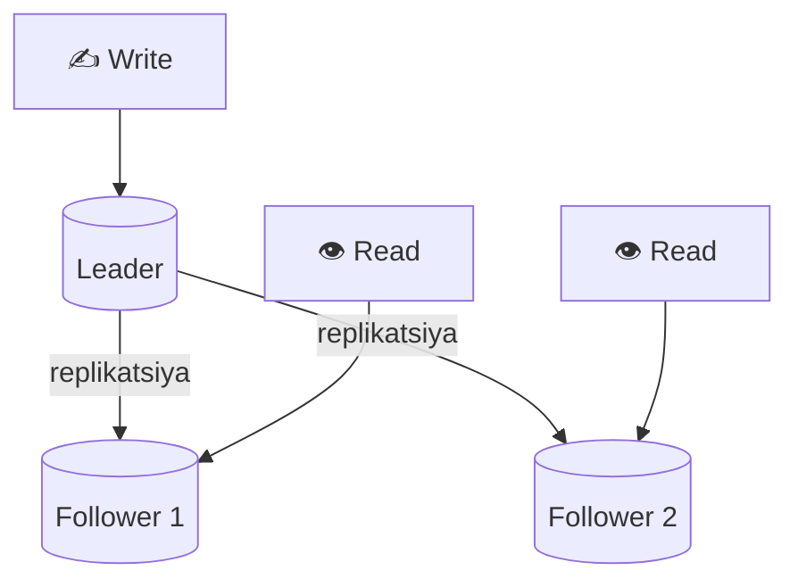

Nega foydali: ko'p ilovada **o'qish yozishdan ancha ko'p** (masalan 90% read, 10% write).
Yozuvni bitta leader ko'taradi, o'qishni esa followerlar bo'lishib oladi — o'qish sig'imi bir necha barobar oshadi.

### 4. Sync vs Async replikatsiya

Leader followerga qachon "yozildi" deb ishonch hosil qiladi? Ikki yo'l:

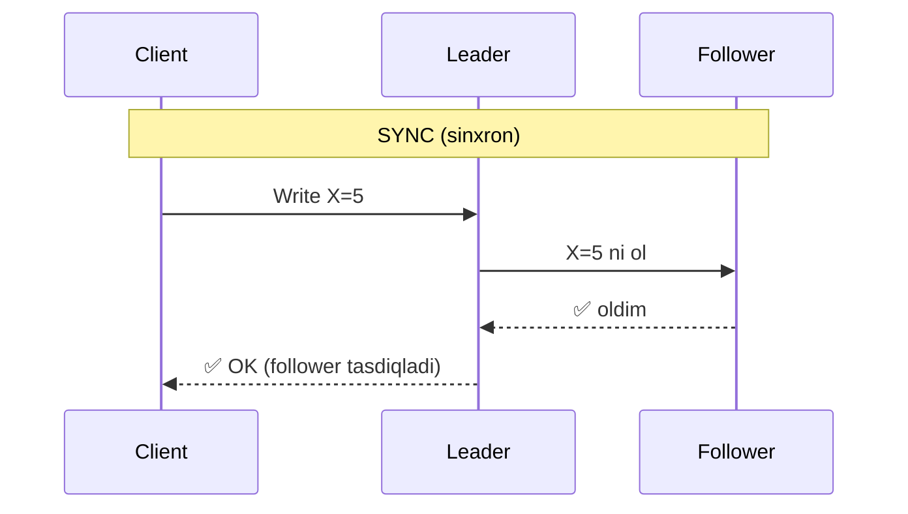

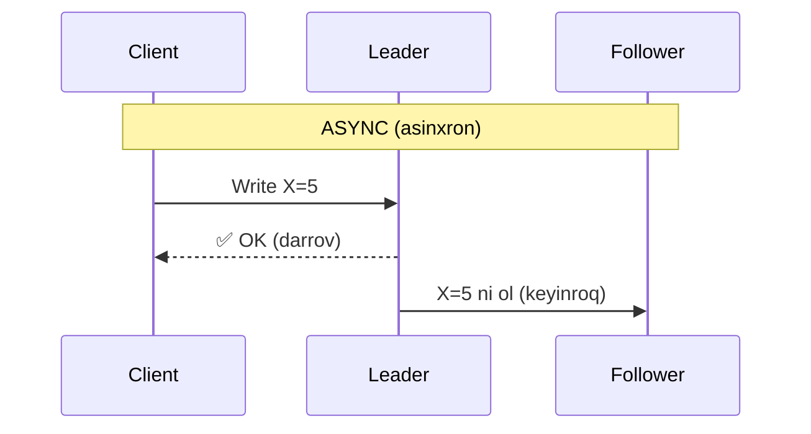

| | Sync (sinxron) | Async (asinxron) |
|--|----------------|------------------|
| **Leader kutadimi?** | Ha, follower tasdig'ini | Yo'q, darrov OK |
| **Tezlik** | Sekinroq | Tez |
| **Xavf** | Follower sekin bo'lsa hamma sekinlashadi | Leader tushsa oxirgi yozuvlar yo'qolishi mumkin |
| **Ishlatish** | Pul, kritik ma'lumot | Ko'p oddiy ilova |

> **Oltin qoida:** sync — xavfsizroq, lekin sekin va follower sekinligiga bog'liq.
> Async — tez, lekin leader tushsa hali ko'chmagan yozuvlar yo'qolishi mumkin. Ko'pincha aralash ishlatiladi (kamida bitta sync follower).

### 5. Replication lag — kechikishning yon ta'siri

Async replikatsiyada follower leaderdan bir necha millisekund/soniya **orqada** qoladi.
Bu **replication lag**. Yon ta'siri "read-your-own-write" muammosi:

```
1. Foydalanuvchi profil rasmini o'zgartirdi → leaderga yozildi
2. Sahifa qayta yuklandi → o'qish followerga ketdi
3. Follower hali yangilanmagan → foydalanuvchi ESKI rasmni ko'radi 😕
```

Yechimlar: shu foydalanuvchining o'qishlarini vaqtincha leaderdan olish; yoki
"o'z yozuvidan keyin" followerni tanlashda lag'ni hisobga olish.

### 6. Failover — leader tushganda

Leader tushsa, followerlardan biri **yangi leader** bo'ladi (failover — avtomatik almashish).

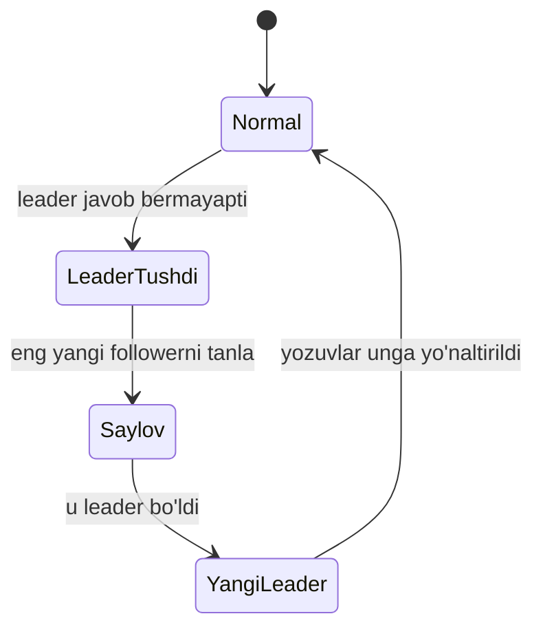

Nozik joylar: (a) leader haqiqatan tushdimi yoki shunchaki tarmoq sekinmi (noto'g'ri failover xavfli);
(b) async lag tufayli yangi leader eski leaderning oxirgi yozuvlarini yo'qotishi mumkin;
(c) **split-brain** — ikki node o'zini leader deb hisoblab, ma'lumot bo'linib ketishi.

---

## Qism B — Sharding (bo'lish)

### 7. Muammo — ma'lumot bitta serverga sig'maydi

Replication o'qishni va ishonchlilikni hal qiladi, lekin **har follower to'liq nusxani**
saqlaydi. Agar ma'lumot 10 TB bo'lsa — har serverda 10 TB kerak, va **barcha yozuv baribir bitta leaderga** tushadi.
Yozuv sig'imi va umumiy hajm muammosi qoladi.

**Sharding** — ma'lumotni bo'laklarga (shard) bo'lib, **har bo'lakni boshqa serverga** joylash.
Endi har server ma'lumotning faqat bir qismini saqlaydi va o'z yozuvini o'zi ko'taradi.

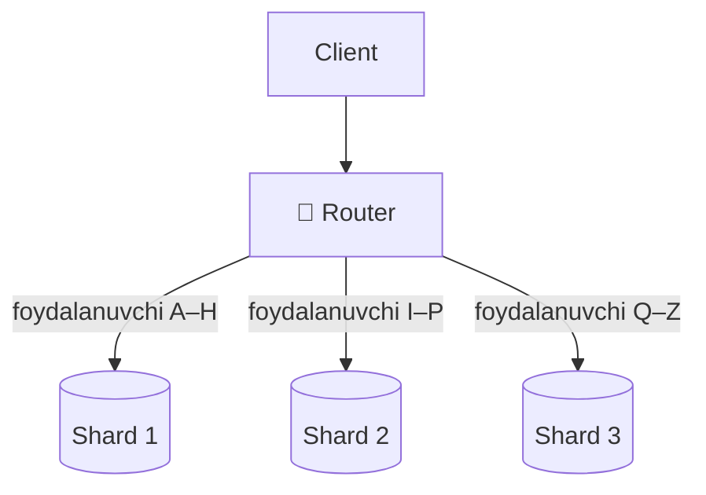

> **Farqni yodda tut:** replication — **butun** ma'lumotni ko'p joyda nusxalash.
> Sharding — ma'lumotni **bo'lib**, har qismini bir joyda saqlash. Ikkalasi boshqa muammoni hal qiladi.

### 8. Range vs Hash sharding

Ma'lumotni qaysi shardga yuborishni **shard key** (bo'lish kaliti) hal qiladi. Ikki asosiy usul:

**Range-based:** kalit oralig'i bo'yicha bo'lish.
```
Shard 1: user_id 1 – 1M
Shard 2: user_id 1M – 2M
Shard 3: user_id 2M – 3M
```
Afzalligi: oraliq so'rovlar (`WHERE id BETWEEN`) tez. Kamchiligi: **hot partition** —
yangi foydalanuvchilar (eng katta id) doim oxirgi shardga tushadi, u bo'g'iladi.

**Hash-based:** kalitning hash'i bo'yicha bo'lish.
```
shard = hash(user_id) % N
```
Afzalligi: **teng taqsimlash** (hot partition kamroq). Kamchiligi: oraliq so'rovlar tarqalib ketadi;
va (keyingi bo'limdagi) resharding muammosi.

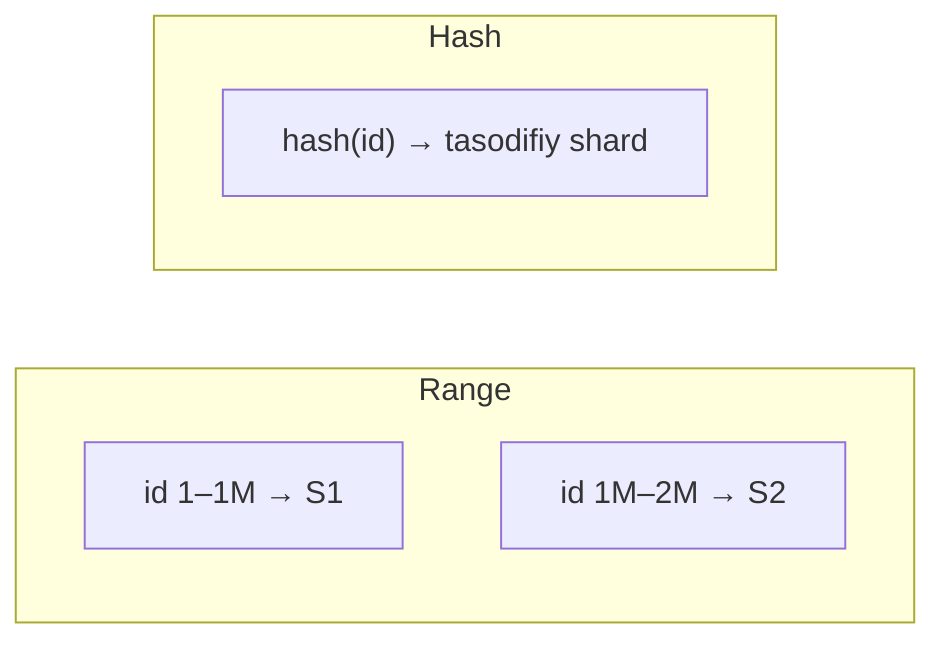

### 9. Shard key tanlash va hot partition

Shard key — sharding'dagi **eng muhim qaror**. Yomon kalit **hot partition**ga olib keladi:
bir shard boshqalardan ko'p yuk oladi va bo'g'iladi.

Misol: `country` bo'yicha shardlasang va foydalanuvchilarning 60% bitta mamlakatdan bo'lsa —
o'sha shard bir o'zi butun tizimni sekinlashtiradi.

> **Yaxshi shard key qoidasi:** (1) yuqori kardinallik (ko'p xilma-xil qiymat), (2) yukni teng taqsimlaydi,
> (3) ko'p so'rovlar bitta shardga tushadigan qilib tanlangan (cross-shard so'rovni kamaytiradi).

Cross-shard muammosi: agar `users` bir shardda, `orders` boshqasida bo'lsa, `JOIN` bitta serverda
bajarilmaydi — application-level join yoki denormalizatsiya kerak (2-darsdagi document DB g'oyasi shu yerda foydali).

### 10. Consistent hashing — nega oddiy `hash % N` yomon

Oddiy `hash(key) % N` da bitta jiddiy muammo: **N o'zgarsa** (server qo'shsang yoki o'chsang),
deyarli **hamma kalit boshqa shardga ko'chadi**.

```
3 shard: hash(key) % 3
Yangi server qo'shdik → hash(key) % 4
→ deyarli BARCHA kalitlarning joyi o'zgardi → ulkan ma'lumot ko'chishi 💀
```

**Consistent hashing** buni hal qiladi. Serverlar va kalitlar bitta **halqa** (ring, 0–360°)
ustiga joylashtiriladi. Kalit — soat mili yo'nalishida **keyingi serverga** tegishli.

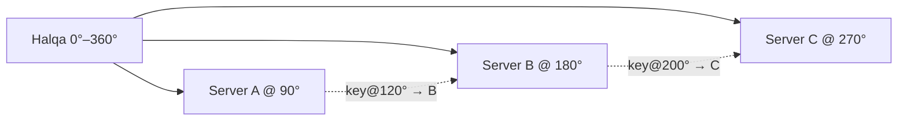

Sehr shundaki: server B **o'chsa**, faqat B'ga tegishli kalitlar keyingi serverga (C) o'tadi —
**qolgan hamma kalit joyida qoladi**. `% N` da hamma ko'chardi, bu yerda faqat kichik qism.

Amaliyot: har server ringga bir necha "virtual tugun" (vnode) sifatida qo'yiladi — yukni yanada tekislaydi.
Cassandra va DynamoDB aynan shu g'oyaga tayanadi.

### 11. Go misoli — oddiy hash sharding

```go
// --- 1-qadam: kalitni raqamli hashga aylantiramiz ---
func shardIndex(key string, numShards int) int {
    h := fnv.New32a()          // tez, taqsimlovchi hash
    h.Write([]byte(key))
    return int(h.Sum32()) % numShards
}

// --- 2-qadam: kalit bo'yicha to'g'ri shardni tanlaymiz ---
func (r *Router) getShard(userID string) *sql.DB {
    idx := shardIndex(userID, len(r.shards))
    return r.shards[idx]        // shu shardga so'rov yuboriladi
}
```

**Output (3 shard):**
```
shardIndex("user123", 3) → 1   // Shard 1
shardIndex("user456", 3) → 0   // Shard 0
shardIndex("user789", 3) → 2   // Shard 2
```

Diqqat: bu **oddiy `% N`** — yuqoridagi ko'chish muammosiga ega. Production'da consistent hashing yoki
DB'ning o'z sharding mexanizmi ishlatiladi.

---

## Predict savoli (PRIMM)

Yuqoridagi Go kodida 3 shard bor edi. Tizim o'sib, **4-shard qo'shding** (`numShards = 4`).
Endi eski `user123` so'rovi to'g'ri shardni topadimi?

<details>
<summary>💡 Javobni ko'rish</summary>

Ehtimol **yo'q**. `hash("user123") % 3` va `hash("user123") % 4` deyarli har doim **turli natija** beradi.
Ya'ni `user123` ilgari Shard 1'da edi, endi kod uni Shard 3'da izlaydi — u yerda ma'lumot yo'q.

Bu aynan `% N` ning falokati: N o'zgarganda deyarli hamma kalit "adashadi", ulkan ma'lumot
ko'chirish (rebalancing) kerak bo'ladi. Aynan shuning uchun **consistent hashing** ishlatiladi —
u yangi shard qo'shilganda faqat kichik qismni ko'chiradi.
</details>

---

## Replication va Sharding birga

Real tizimda ikkalasi **birga** ishlatiladi: sharding hajm/yozuv sig'imini beradi,
har shardni replikatsiya qilish esa ishonchlilikni beradi.

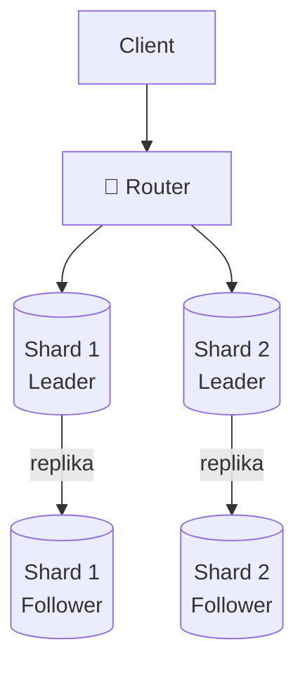

Ya'ni: ma'lumot avval shardlarga **bo'linadi** (har shard — bir bo'lak),
keyin har shard **nusxalanadi** (leader + follower). Natijada tizim ham katta hajmni ko'taradi,
ham bitta server tushsa yiqilmaydi.

---

## Master-master (multi-primary) — ikkala node ham yozadi

Leader-follower'da **bitta** leader yozadi. Lekin ikki data-markaz turli qit'alarda bo'lsa-chi?
Har safar okean ortidagi bitta leaderga yozish sekin. **Master-master** (multi-primary) modelida
**har ikkala node ham yozuvni qabul qiladi** va bir-biriga o'zgarishni tarqatadi.

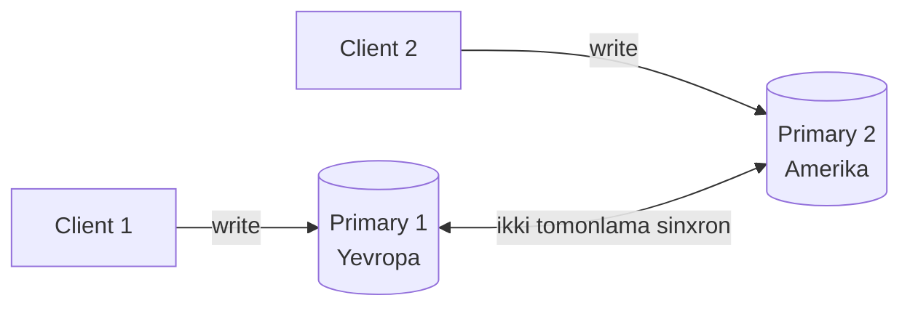

- **Afzalligi:** har mintaqa o'ziga yaqin node'ga yozadi (past latency), bittasi tushsa ikkinchisi yozishda davom etadi.
- **Kamchiligi:** **conflict** — ikki node bir vaqtda bir xil qatorni o'zgartirsa, kim yutadi? Buni yechish kerak
  (masalan "oxirgi yozuv yutadi" (last-write-wins) yoki application-level birlashtirish).

> **Diqqat:** master-master oson ko'rinadi, lekin conflict yechish qiyin. Ko'p jamoa avval leader-follower'da qoladi;
> multi-primary faqat geografik taqsimlanish chindan kerak bo'lganda tanlanadi.

---

## Uchinchi sharding strategiyasi — directory-based

8-bo'limda range va hash sharding'ni ko'rgan eding. Uchinchi yo'l — **directory-based**:
har kalit qaysi shardda ekanini **alohida lookup jadval** aytadi.

```
Lookup jadval:
  user 1-500   -> Shard A
  user 501-900 -> Shard B
  user 901+    -> Shard C
```

- **Afzalligi:** eng moslashuvchan — istalgan kalitni istalgan shardga ko'chirish mumkin, jadvalni yangilaysan xolos.
  Hot partition'ni qo'lda qayta muvozanatlash oson.
- **Kamchiligi:** lookup jadval har so'rovda o'qiladi — u **yangi bo'g'iz** (bottleneck) va single point of failure
  bo'lishi mumkin (odatda uni ham keshlanadi).

| Strategiya | Qanday tanlaydi | Kuchli tomoni | Zaifligi |
|-----------|-----------------|---------------|----------|
| Range | kalit oralig'i | oraliq so'rov tez | hot partition |
| Hash | `hash(key) % N` | teng taqsimlash | resharding qiyin, oraliq so'rov tarqaladi |
| Directory | lookup jadval | eng moslashuvchan | lookup — bo'g'iz/SPOF |

---

## Cross-shard muammolar — join va distributed transaction

Sharding ma'lumotni bo'ladi. Lekin ba'zi amallar **bir necha shardga** tegadi — mana shu yerda qiyinchilik boshlanadi.
(Hot partition'ni 9-bo'limda ko'rgan eding — u ham cross-shard muammoning bir turi.)

### Cross-shard JOIN

```sql
-- users Shard 1'da, orders Shard 2'da bo'lsa — bu bitta serverda ishlamaydi:
SELECT u.name, o.amount
FROM users u JOIN orders o ON u.id = o.user_id;
```

Bitta DB'da JOIN oson, lekin jadvallar turli serverda bo'lsa, ma'lumotni tarmoq orqali tashish kerak — sekin.
**Yechim:** application-level join (ikki shard'dan alohida o'qib, kodda birlashtir) yoki **denormalizatsiya**
(2-darsdagi document g'oyasi — bog'liq ma'lumotni bitta shardga yig'ib qo'y).

### Distributed transaction — shardlar bo'ylab atomiklik

Eng og'riqli muammo. "Shard 1'dan pul yech, Shard 2'ga pul qo'sh" — bu ikkalasi **atomik** (yoki ikkalasi, yoki
hech biri) bo'lishi kerak. Lekin ular turli serverda — bitta DB transaction ishlamaydi.

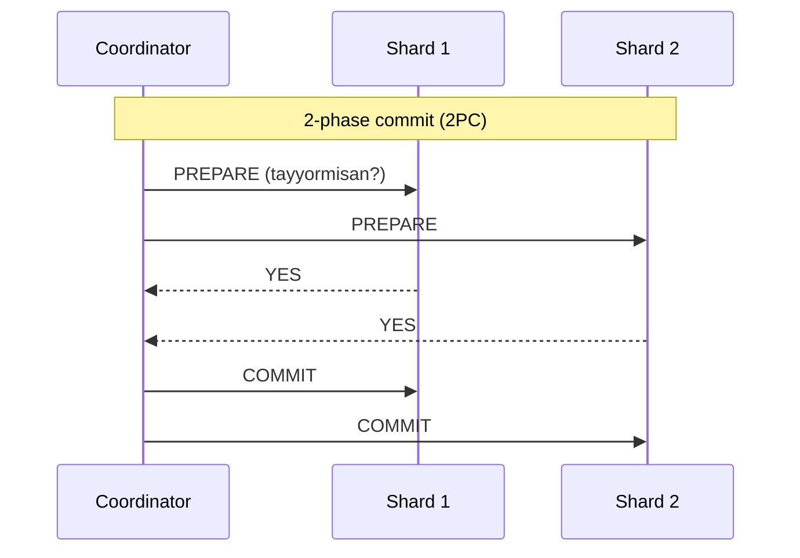

Ikki asosiy yondashuv:

| Usul | G'oyasi | Zaifligi |
|------|---------|----------|
| **2-phase commit (2PC)** | Koordinator avval hammadan "tayyormisan?" so'raydi, hammasi "ha" desa COMMIT beradi | Sekin va **bloklovchi** — koordinator tushsa, shardlar qulflangan kutadi |
| **Saga pattern** | Katta transactionni kichik lokal qadamlarga bo'l; xato bo'lsa **compensating** (teskari) amal bilan orqaga qaytar | Oraliqda tizim vaqtincha nomuvofiq (eventual consistency) |

> **Oltin qoida:** eng yaxshi distributed transaction — **umuman kerak bo'lmagani**. Shard key'ni shunday tanla-ki,
> bitta biznes-amal bitta shardga tushsin. Muntazam cross-shard transaction kerak bo'lsa — ma'lumot modeli
> yoki shard key noto'g'ri tanlangan belgisi.

### 🤔 O'ylab ko'r (PRIMM predict)

2PC'da koordinator PREPARE yubordi, ikkala shard "YES" dedi, lekin koordinator COMMIT yuborishdan **oldin** tushib qoldi.
Shardlar nima qiladi?

<details>
<summary>💡 Javobni ko'rish</summary>

Ular **qulflangan holda kutadi** — "YES" deb va'da bergani uchun o'zgarishni orqaga qaytara olmaydi, lekin COMMIT ham
kelmadi. Bu 2PC'ning eng katta zaifligi: koordinator single point of failure, u tushsa shardlar resurslarni ushlab
**bloklanadi**. Aynan shuning uchun ko'p tizim 2PC o'rniga **saga** (bloklamaydigan) yondashuvni tanlaydi.
</details>

---

## Qachon sharding kerak? — checklist

Sharding kuchli, lekin **murakkablik narxi** yuqori (cross-shard join, distributed transaction, resharding).
Shuning uchun uni oxirgi chora sifatida qo'llaydilar. Quyidagi signallardan **bir nechtasi** bir vaqtda paydo
bo'lsa — sharding haqida o'ylash vaqti keldi:

| Signal | Taxminiy chegara |
|--------|------------------|
| DB hajmi | > 1 TB (bitta serverga sig'maydi) |
| Write throughput | > 10K yozuv/s (bitta leader ko'tarolmaydi) |
| Read throughput | > 100K o'qish/s (read replica + kesh ham yetmayapti) |
| Latency | to'g'ri indeks va kesh bilan ham > 100ms |

> **Ketma-ketlik qoidasi:** avval **indeks** (3-dars) va **kesh** (4-modul), keyin **read replica**,
> va faqat shulardan keyin — **sharding**. Sharding eng qimmat, eng murakkab qadam; uni birinchi qilma.

---

## Go amaliyoti — to'liq ShardRouter

11-bo'limdagi `shardIndex` funksiyasini to'liq, ishlaydigan **router**ga aylantiramiz: u bir necha
`*sql.DB` ulanishini ushlaydi va kalit bo'yicha to'g'risini tanlaydi.

```go
// --- 1-qadam: router bir necha shard ulanishini saqlaydi ---
type ShardRouter struct {
    shards []*sql.DB
}

// --- 2-qadam: kalitni hashlab, mos shardni tanlaymiz ---
func (r *ShardRouter) getShard(userID string) *sql.DB {
    h := fnv.New32a()
    h.Write([]byte(userID))
    idx := h.Sum32() % uint32(len(r.shards))
    return r.shards[idx]         // shu shardga so'rov ketadi
}

// --- 3-qadam: bitta foydalanuvchi -> bitta shard (cross-shard yo'q) ---
func (r *ShardRouter) GetUser(userID string) (*User, error) {
    shard := r.getShard(userID)
    var u User
    err := shard.QueryRow(
        "SELECT id, name FROM users WHERE id = $1", userID,
    ).Scan(&u.ID, &u.Name)
    return &u, err
}
```

Bir kalit doim bitta shardga tushgani uchun `GetUser` **cross-shard emas** — tez. Ammo "barcha shard'dagi
foydalanuvchilar soni" kabi so'rov **har shardga** borishni talab qiladi (scatter-gather):

```go
// --- Har shardga parallel so'rov yuborib, natijalarni yig'amiz ---
func (r *ShardRouter) CountAllUsers(ctx context.Context) (int, error) {
    var wg sync.WaitGroup
    counts := make([]int64, len(r.shards))
    for i, sh := range r.shards {
        wg.Add(1)
        go func(i int, sh *sql.DB) {       // har shard alohida goroutine
            defer wg.Done()
            sh.QueryRowContext(ctx, "SELECT count(*) FROM users").Scan(&counts[i])
        }(i, sh)
    }
    wg.Wait()                              // hamma shard javob berguncha kutamiz
    var total int64
    for _, c := range counts {
        total += c
    }
    return int(total), nil
}
```

**Output (3 shard):**
```
getShard("user123") -> Shard 1
getShard("user456") -> Shard 0
CountAllUsers()      -> Shard0=1200 + Shard1=1180 + Shard2=1210 = 3590
```

**Notional machine:** `getShard` faqat hash hisoblaydi (RAM'da, tarmoqsiz) va massivdan indeksni tanlaydi —
so'rov to'g'ridan-to'g'ri bitta shardga ketadi, router "o'rtada turgan pochtachi" xolos.
`CountAllUsers` esa `len(shards)` ta goroutine ochib, hammasiga parallel boradi va `WaitGroup` bilan kutadi —
bu **scatter-gather** pattern. Diqqat: bu ham `% N`ga tayangani uchun shard qo'shilsa consistent hashing kerak (10-bo'lim).

---

## Ko'p uchraydigan xatolar

⚠️ **Xato 1: replication va sharding'ni chalkashtirish**
Noto'g'ri: "ma'lumotni 3 serverga bo'ldim, endi replikatsiyam bor". Yo'q — bo'lish sharding,
nusxalash replication. Sharding ishonchlilik bermaydi (shard tushsa, o'sha bo'lak yo'qoladi);
replication hajmni oshirmaydi (har nusxa to'liq).

⚠️ **Xato 2: async replikatsiyada "yozdim, darrov o'qiyman" deb ishonish**
Noto'g'ri: async'da follower orqada (lag). Yozgan foydalanuvchi darrov o'qisa eski qiymatni
ko'rishi mumkin. Kerak bo'lsa o'sha o'qishni leaderdan ol.

⚠️ **Xato 3: yomon shard key tanlash**
Noto'g'ri: kam xilma-xil yoki notekis taqsimlanuvchi kalit (masalan `country`) hot partition beradi —
bir shard bo'g'iladi. Yuqori kardinallikli, teng taqsimlaydigan kalit tanla.

⚠️ **Xato 4: oddiy `hash % N` bilan production sharding**
Noto'g'ri: server qo'shilishi/o'chishida deyarli hamma ma'lumot ko'chadi. Consistent hashing ishlat.

---

## Xulosa

- Bitta DB — single point of failure va sig'im chegarasi; ikki alohida muammo.
- **Replication** — ma'lumotni nusxalash; ishonchlilik va o'qish sig'imini oshiradi.
- **Leader-follower:** leader yozadi, followerlar o'qiydi (read-heavy ilovaga zo'r).
- **Sync** — xavfsiz lekin sekin; **async** — tez lekin lag va yozuv yo'qolishi xavfi.
- **Sharding** — ma'lumotni bo'lish; hajm va yozuv sig'imini oshiradi.
- **Shard key** — eng muhim qaror; yomoni hot partition beradi.
- **Consistent hashing** oddiy `hash % N` ning ommaviy ko'chish muammosini hal qiladi.
- Real tizim ikkalasini birga ishlatadi: shard + har shardda replika.

## 🧠 Eslab qol

- Replication = nusxalash (ishonchlilik). Sharding = bo'lish (hajm).
- Sync xavfsiz-sekin; async tez-lag.
- Yomon shard key = hot partition.
- `hash % N` yomon: N o'zgarsa hamma ko'chadi → consistent hashing.
- Real tizim: shard + replika birga.

## ✅ O'z-o'zini tekshir (retrieval practice)

**1.** 5 serverga ma'lumotni bo'lib qo'ydim (sharding). Endi bitta server tushsa nima bo'ladi va nega bu replication emas?
<details>
<summary>Javob</summary>
O'sha serverdagi ma'lumot **yo'qoladi/mavjud emas** — chunki sharding har bo'lakni faqat bitta joyda saqlaydi, nusxasi yo'q. Bu replication emas: replication butun ma'lumotni ko'p joyda nusxalaydi, sharding esa bo'ladi. Ishonchlilik uchun har shardni alohida replikatsiya qilish kerak.
</details>

**2.** Foydalanuvchi profilni yangiladi, lekin qayta yuklaganda eski qiymatni ko'rdi. Sabab nima va bir yechim ayt.
<details>
<summary>Javob</summary>
Async replication lag: yozuv leaderga tushdi, o'qish esa hali yangilanmagan followerga ketdi ("read-your-own-write" muammosi). Yechim: shu foydalanuvchining yozuvidan keyingi o'qishlarni vaqtincha leaderdan olish (yoki lag'ni hisobga oluvchi routing).
</details>

**3.** Nega `country` bo'yicha shardlash ko'pincha yomon g'oya?
<details>
<summary>Javob</summary>
Foydalanuvchilar mamlakatlar bo'yicha notekis taqsimlangan — ko'pchilik bitta-ikkita mamlakatda. O'sha shardlar hot partition bo'ladi (butun yukni ko'taradi), qolganlari bo'sh turadi. Shard key yuqori kardinallikli va yukni teng taqsimlaydigan bo'lishi kerak.
</details>

**4.** Consistent hashing'da yangi server qo'shilganda nega faqat oz qism ma'lumot ko'chadi?
<details>
<summary>Javob</summary>
Serverlar halqa (ring) ustida joylashgan; kalit soat mili bo'yicha keyingi serverga tegishli. Yangi server halqaning bir kichik yoyini "egallaydi" — faqat o'sha yoydagi kalitlar ko'chadi, qolganlarning "keyingi server"i o'zgarmaydi. `% N` da esa N o'zgargani uchun deyarli hamma kalit qayta hisoblanadi.
</details>

## 🛠 Amaliyot

**1. Oson (savol/diagramma).** "Replication va Sharding birga" diagrammasiga uchinchi shardni
(leader + follower) qo'shib qayta chiz. Router endi nechta node bilan gaplashadi?
<details>
<summary>Hint</summary>
3 shard × 2 (leader+follower) = 6 node. Router yozuvni 3 leaderga yo'naltiradi, o'qishni followerlarga ham bera oladi.
</details>

**2. O'rta (kamchilik topish).** Bir dizayn: "10 TB ma'lumotni 3 followerli leader-follower replikatsiya
bilan hal qildik". Yozuv oqimi juda yuqori va disk to'lyapti. Muammo va to'g'ri yechim nima?
<details>
<summary>Hint</summary>
Replication har followerga **to'liq 10 TB** nusxa qo'yadi (disk muammosi hal bo'lmaydi) va barcha yozuv baribir **bitta leaderga** tushadi (yozuv sig'imi hal bo'lmaydi). Kerak bo'lgan narsa — **sharding**: ma'lumotni bo'lib har shardni alohida serverga qo'yish, so'ng har shardni replikatsiya qilish.
</details>

**3. Qiyin (kichik dizayn).** Instagramga o'xshash ilovada `posts` jadvali juda katta.
Shard key sifatida `user_id` yoki `post_id` — qaysinisini tanlaysan? "Bir foydalanuvchining barcha postlari"
so'rovi va hot partition xavfini hisobga olib asosla. Mashhur bloger muammosini qanday yumshatasan?
<details>
<summary>Hint</summary>
`user_id` — bir foydalanuvchining postlari bitta shardga tushadi (so'rov tez, cross-shard yo'q), lekin mashhur bloger o'sha shardni qizdiradi (hot partition). Yumshatish: mashhur akkountlarni alohida ajratish, keshlash (Redis), yoki `user_id`+vaqt kompozit kaliti bilan tarqatish. `post_id` — teng taqsimlaydi, lekin foydalanuvchi postlarini yig'ish cross-shard bo'ladi.
</details>

## 🔁 Takrorlash

**Bog'liq oldingi mavzular:**
- [2-modul: Kengayish va load balancing](../2-kengayish-usullari/) — app serverlarni tarqatish; bu darsda DB darajasiga tushdik.
- [01-acid-va-tranzaksiyalar.md](01-acid-va-tranzaksiyalar.md) — shardlar bo'ylab tranzaksiya (distributed transaction) nega qiyin.
- [02-malumotlar-ombori-oilalari.md](02-malumotlar-ombori-oilalari.md) — column-family DB'lar sharding va consistent hashing'ni ichiga qurgan.

**Shu modul ichida keyingi:**
- [05-cap-teoremasi.md](05-cap-teoremasi.md) — ko'p node tarmoq bilan bog'langanda uzilish (partition) bo'lsa qanday tanlov qilinadi.

**Takrorlash jadvali:**
| Qachon | Nima qilish |
|--------|-------------|
| Ertaga | Replication va sharding farqini bitta jumlada ayt |
| 3 kundan keyin | `hash % N` nega yomonligini misol raqamlar bilan tushuntir |
| 1 haftadan keyin | "O'z-o'zini tekshir" savollariga qayta javob ber |

**Feynman testi:** Kod so'zlarini ishlatmasdan, do'stingga 3 jumlada tushuntir:
replication va sharding farqi, sync va async farqi, va consistent hashing nega kerak.
