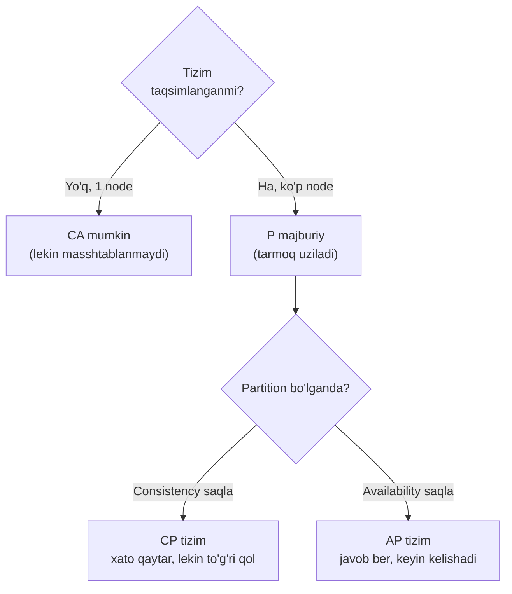
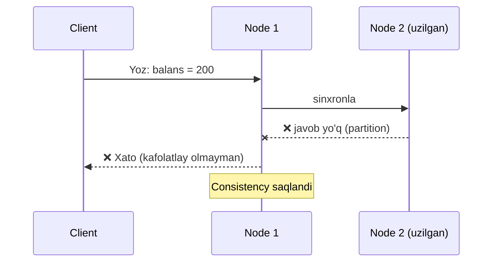
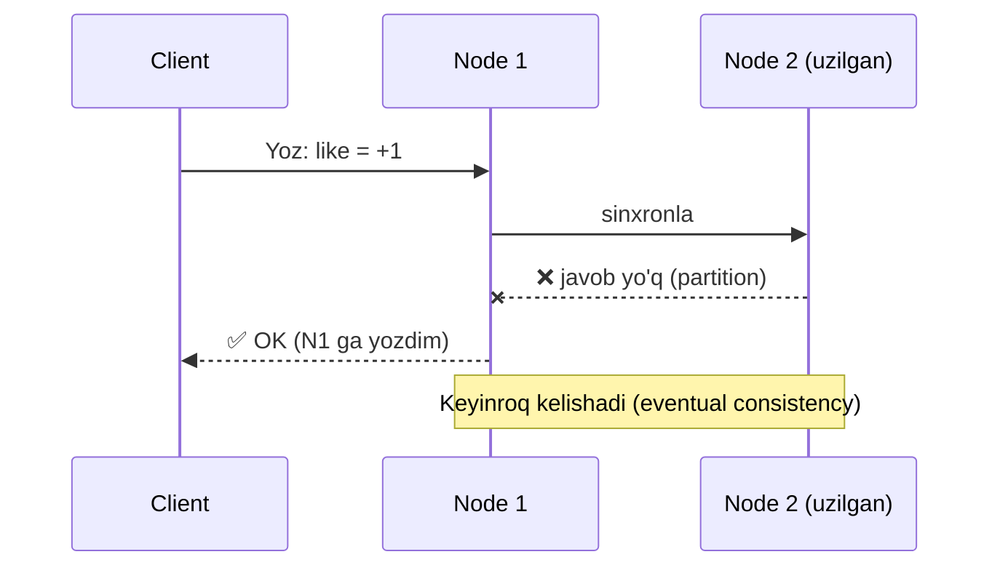
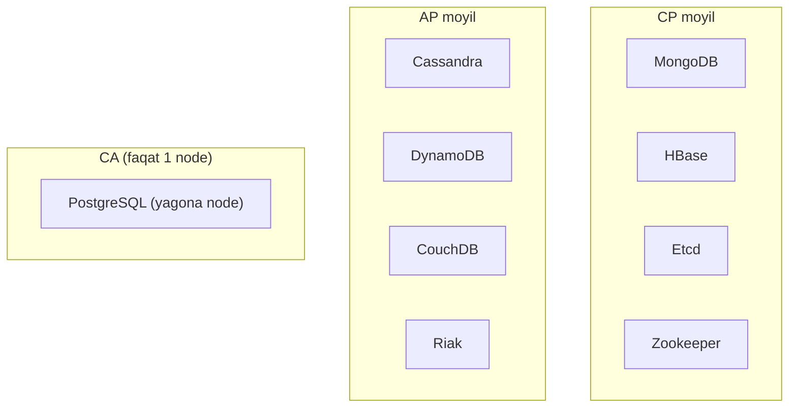
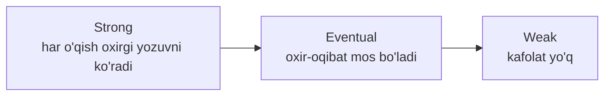

# 05 — CAP teoremasi

> **Modul 3, Dars 5 (qo'shimcha).** 4-darsda ma'lumotni ko'p node'ga tarqatdik. Endi tabiiy savol: node'lar orasidagi tarmoq uzilsa, tizim nima qilishi kerak? CAP teoremasi bu savolga tanlov qo'yadi.

---

## 1. Muammo — ikki node bir-birini eshitmay qoldi

4-darsda leader va follower bor edi, ular tarmoq orqali gaplashardi. Endi tasavvur qil:
ular orasidagi **tarmoq uzildi** (kabel uzildi, data-markaz o'chdi). Leader va follower
ikkalasi ham ishlaydi, lekin bir-birini **eshitmaydi**.

Foydalanuvchi yozmoqchi. Endi tizim oldida **ikki yomon variant**:
1. "Yozishga ruxsat beraman" — lekin follower buni ko'rmaydi, ikki tomon **turli ma'lumotga** ega bo'ladi.
2. "Yozishni rad etaman" — ma'lumot bir xil qoladi, lekin foydalanuvchi **xizmat ololmaydi**.

Uchinchi, "ikkalasini ham qilaman" degan yo'q — mana shu CAP teoremasining mohiyati.

---

## 2. Analogiya — telefon aloqasi uzilgan ikki menejer

Bir kompaniyaning ikki filialida bitta oxirgi mahsulot bor, ikki menejer uni sotishi mumkin.
Odatda ular telefonda gaplashib turadi: "men sotdim, sen sotma". Bir kuni **telefon liniyasi uzildi**.

Endi mijoz keldi. Menejer ikki yomon variantdan birini tanlashi shart:
- **Sotaman** (availability) — lekin ehtimol ikkinchi filial ham sotib qo'ygan, ortiqcha buyurtma xatosi.
- **Sotmayman** (consistency) — "hozir tasdiqlay olmayman" — mijoz quruq ketadi, lekin xato bo'lmaydi.

Aloqa borligida bunday dilemma yo'q edi. **Aloqa uzilganda** (partition) tanlash majburiy bo'ladi.

> ⚠️ **Analogiya chegarasi:** menejer "biroz kutaman" deyishi mumkin. Kompyuter tizimida ham
> "kutish" bor, lekin cheksiz kutib bo'lmaydi — timeout kelganda baribir A yoki C ni tanlash kerak.

---

## 3. Sodda ta'rif

> **CAP teoremasi** — tarmoq uzilishi (partition) yuz berganda, taqsimlangan tizim
> **Consistency** (barcha node bir xil ma'lumot) va **Availability** (har so'rovga javob)
> dan faqat **bittasini** to'liq saqlay oladi, ikkalasini emas.

Uch harf:

| Harf | Ma'nosi |
|------|---------|
| **C** — Consistency | Har o'qish **eng oxirgi** yozilgan qiymatni qaytaradi (barcha node kelishgan) |
| **A** — Availability | Har so'rovga (xato emas) **javob** qaytariladi, eski bo'lsa ham |
| **P** — Partition tolerance | Node'lar orasidagi tarmoq uzilsa ham tizim **ishlashda davom etadi** |

> **Diqqat:** bu yerdagi `C` — 1-darsdagi ACID `C` emas. ACID `C` — bitta DB qoidalari.
> CAP `C` — node'lar orasidagi kelishuv (bir xil ma'lumot ko'rish).

---

## 4. Nega P dan qochib bo'lmaydi

Ko'pchilik "3 tadan 2 tasini tanla" deb tushunadi, go'yo CA, CP, AP teng variantlar.
Aslida **P — tanlov emas, real olamning fakti**. Tarmoq kabellari uziladi, paketlar yo'qoladi,
data-markazlar o'chadi. Taqsimlangan tizimda partition **albatta** yuz beradi.



Shuning uchun amalda CAP **"C yoki A"** degan tanlovga aylanadi (P berilgan). "CA tizim" —
faqat **bitta node**li (taqsimlanmagan) tizim, u masshtablanmaydi va bizning muammoni hal qilmaydi.

---

## 5. CP tizim — to'g'rilikni saqla, xizmatdan voz kech

**CP** (Consistency + Partition tolerance): partition bo'lganda, tizim **noto'g'ri javob berishdan**
ko'ra **umuman javob bermaslikni** afzal ko'radi.



**Qachon:** ma'lumot noto'g'ri bo'lishi **falokat** bo'lsa. Bank hisobi, inventar, buyurtma,
 id generatsiya, konfiguratsiya (Zookeeper/etcd). Bu yerda "xatoni ko'rsatib qo'yaqol,
lekin ikki xil balans bo'lmasin".

Real vaziyat — **bank o'tkazmasi**: ikki data-markaz uzilganda "hozir o'tkaza olmayman"
degan xato — ikki marta sarflangan puldan yaxshiroq.

---

## 6. AP tizim — xizmatni saqla, kelishuvni keyinga qoldir

**AP** (Availability + Partition tolerance): partition bo'lganda, tizim **javob berishda davom etadi**,
hatto ma'lumot vaqtincha bir xil bo'lmasa ham. Tarmoq tiklanganda node'lar **kelishib oladi** (eventual consistency).



**Qachon:** biroz eskirgan yoki vaqtincha mos kelmagan ma'lumot **falokat emas** bo'lsa.
Ijtimoiy tarmoq like/view hisoblagichi, kesh, DNS, mahsulot ko'rishlar soni.

Real vaziyat — **Instagram like**: 1 million odam bir vaqtda like bossa, hisoblagich
1 soniya kechiksa hech kim sezmaydi. Muhimi — like tugmasi "xato" bermasin (availability).

> **Oltin qoida:** CP — "yaxshisi javob bermayman, lekin yolg'on aytmayman" (pul).
> AP — "yaxshisi javob beraman, keyin to'g'rilanadi" (like). Tanlov biznes talabidan kelib chiqadi.

---

## 7. Real DB'lar CAP xaritasida

Diqqat: ko'p zamonaviy DB **sozlanadigan** (tunable) — bir xil DB rejimga qarab CP yoki AP bo'lishi mumkin.
Umumiy joylashuv:



| DB | Odatiy moyillik | Nega |
|----|-----------------|------|
| PostgreSQL/MySQL (yagona) | CA | Taqsimlanmagan; partition yo'q |
| MongoDB | CP | Default'da leaderdan izchil o'qish |
| HBase, Zookeeper, etcd | CP | Kelishuv (consensus) ustiga qurilgan |
| Cassandra, DynamoDB | AP (sozlanadi) | Availability va eventual consistency ustuvor |

Cassandra/DynamoDB'da hatto **per-so'rov** darajada tanlash mumkin (masalan `QUORUM` o'qish
kuchliroq izchillik beradi) — CAP qattiq chiziq emas, ko'pincha rostlanuvchan.

---

## 8. Worked example — Go'da AP uslubidagi yozuv

Ko'p node'ga yozib, "yetarlicha node tasdiqladimi" (quorum) tekshiruvchi soddalashtirilgan mantiq:

```go
// --- 1-qadam: barcha replikaga parallel yozamiz ---
ok := make(chan bool, len(replicas))
for _, r := range replicas {
    go func(r *Replica) { ok <- r.Write(key, val) }(r)  // partition'da ba'zilari xato beradi
}

// --- 2-qadam: yetarli tasdiqni (quorum) kutamiz, hammani emas ---
got := 0
for i := 0; i < len(replicas); i++ {
    if <-ok { got++ }
    if got >= quorum { break }   // masalan 3 tadan 2 tasi yetarli
}

// --- 3-qadam: quorum yetsa muvaffaqiyat (ba'zi node uzilgan bo'lsa ham) ---
if got >= quorum { return nil }
return errors.New("quorum yetmadi")
```

**Output (3 replika, 1 tasi uzilgan, quorum=2):**
```
Replika A: ✅
Replika B: ✅   → 2 ta tasdiq, quorum yetdi → OK
Replika C: ❌ (partition) — kutmaymiz
```

**Notional machine:** biz **hamma** node javobini kutmadik — bu availability'ni saqladi
(uzilgan node bizni bloklamaydi). Buning evaziga C uzilgan node tiklanguncha vaqtincha
buzilishi mumkin (eventual consistency). Aynan AP tanlovi.

---

## Predict savoli (PRIMM)

Yuqoridagi kodda `quorum` ni **replikalar soniga teng** qilib qo'ysak (`quorum = len(replicas)`),
tizim CAP bo'yicha qaysi tomonga suriladi va nega?

<details>
<summary>💡 Javobni ko'rish</summary>

**CP tomonga.** Endi biz **hamma** replika tasdig'ini kutamiz. Bitta node uzilgan bo'lsa,
quorum hech qachon yetmaydi → yozuv **rad etiladi** (xato). Ya'ni availability'ni yo'qotdik,
lekin barcha node aniq bir xil ma'lumotga ega bo'ladi (izchillik kuchaydi).

Bu CAP'ning "rostlanuvchi" tabiatini ko'rsatadi: quorum kattaligini o'zgartirib, bir xil kodni
AP'dan CP'ga suramiz. Kichik quorum = A tomon; to'liq quorum = C tomon.
</details>

---

## 9. PACELC — CAP'ning to'liqroq davomi

CAP faqat **partition bo'lganda**gi tanlovni aytadi. Lekin tizim vaqtining ko'p qismida
partition **yo'q** — o'shanda ham tanlov bor. **PACELC** shuni qo'shadi:

```
if Partition:  A yoki C  ← (bu CAP)
Else (normal): L yoki C  ← Latency (tezlik) yoki Consistency
```

Ya'ni normal ishlashda ham: kuchli izchillik uchun ko'proq node bilan kelishish kerak (sekinroq),
yoki tezlik uchun kamroq kutish (izchillik bo'shroq).

| Tizim | Partition'da | Normal'da |
|-------|--------------|-----------|
| DynamoDB | A (availability) | L (past latency) → **PA/EL** |
| Cassandra | A | L → **PA/EL** |
| MongoDB | C (consistency) | C → **PC/EC** |
| PostgreSQL | — (yagona: CA) | C → **EC** |

Xulosa: PACELC eslatadiki, izchillik uchun **doim** narx bor — partition'da availability,
normal holatda esa latency.

---

## 10. Consistency darajalari — strong, eventual, weak

CAP va PACELC "qancha izchillik" degan savolni qo'ydi. Lekin izchillik **yo'q/bor** emas —
u **spektr**. Uchta asosiy daraja bor; yuqorida strong va eventual bilan uchrashding, endi
uchalasini bitta chiziqda ko'ramiz.



| Daraja | Yozgandan keyin o'qish | Tezlik | Mos misol |
|--------|------------------------|--------|-----------|
| **Strong** | Doim yangi qiymat | Sekinroq, qimmat | Bank balansi, inventar |
| **Eventual** | Vaqtincha eski, keyin mos | Tez | Like soni, feed, DNS |
| **Weak** | Umuman kafolat yo'q | Eng tez | Video oqim, real-time o'yin koordinatasi, jonli chat |

- **Strong consistency:** yozish tugagach, **har qanday** node'dan o'qish **darhol** yangi qiymatni qaytaradi.
  Ishonchli, lekin node'lar kelishuvini kutgani uchun sekinroq (CP moyil).
- **Eventual consistency:** yozgandan keyin qisqa vaqt ba'zi o'qishlar **eski** qiymatni ko'radi, lekin
  **oxir-oqibat** hammasi yangilanadi. AP tizimlarning odatiy kafolati.
- **Weak consistency:** yangi o'qish eski qiymat ko'rishi mumkin va **hech qachon** "mos bo'ladi" deb
  kafolatlanmaydi. Buning o'rniga eng past latency olinadi — yo'qolgan ma'lumot muhim bo'lmaganda
  (masalan jonli video kadri yoki o'yindagi lahzalik koordinatalar) maqbul.

> **Oltin qoida:** past qatorga tushgan sari tezlik oshadi, kafolat pasayadi. Tanlov "ma'lumot bir lahza
> noto'g'ri bo'lsa qancha zarar?" savoliga bog'liq — bank uchun strong, like uchun eventual, jonli oqim uchun weak.

⚠️ **Ko'p uchraydigan xato:** eventual va weak'ni bir deb bilish. Eventual **kafolat beradi** — oxir-oqibat
hamma node mos bo'ladi. Weak esa bunday kafolatni ham bermaydi; ba'zi yozuv umuman ko'rinmasdan qolishi mumkin.

---

## Ko'p uchraydigan xatolar

⚠️ **Xato 1: "P ni tanlamasa ham bo'ladi (CA tizim quraman)"**
Noto'g'ri: taqsimlangan tizimda tarmoq uzilishi muqarrar. "CA" faqat bitta node'da mantiqan mavjud,
u masshtablanmaydi. Ko'p node bo'lsa — P majburiy, tanlov C va A orasida.

⚠️ **Xato 2: CAP `C` ni ACID `C` bilan chalkashtirish**
Noto'g'ri: ular butunlay boshqa. ACID `C` — bitta DB ichidagi qoidalar (constraint). CAP `C` —
node'lar orasida bir xil ma'lumot ko'rish. Bir jumlada ikkalasini aralashtirib yubormaslik kerak.

⚠️ **Xato 3: "AP tizim izchillikni umuman bermaydi"**
Noto'g'ri: AP tizim **kuchli** (strong) izchillikni kafolatlamaydi, lekin ko'pi **eventual consistency**
beradi — partition tiklangach node'lar kelishadi. "Umuman izchillik yo'q" degani emas.

⚠️ **Xato 4: DB'ni qattiq "CP" yoki "AP" deb yorliqlash**
Noto'g'ri: ko'p DB (Cassandra, DynamoDB, MongoDB) sozlanadi — quorum/read preference orqali
CP va AP orasida suriladi. "Bu DB — AP" degani ko'pincha soddalashtirish.

---

## Xulosa

- Partition (tarmoq uzilishi) taqsimlangan tizimda **muqarrar** — undan qochib bo'lmaydi.
- Partition bo'lganda **C yoki A** tanlash shart, ikkalasi emas — bu CAP'ning mohiyati.
- **CP** — to'g'rilikni saqlab, xizmatdan voz kechadi (bank, inventar, etcd).
- **AP** — xizmatni saqlab, izchillikni keyinga qoldiradi (like, kesh, DNS); eventual consistency.
- "CA tizim" faqat yagona node'da mavjud — masshtablanmaydi.
- Ko'p real DB sozlanadi (tunable) — quorum orqali CP↔AP orasida suriladi.
- **PACELC** qo'shadi: normal holatda ham Latency yoki Consistency tanlovi bor.

## 🧠 Eslab qol

- P majburiy → tanlov C yoki A.
- CP = to'g'ri qol, xizmat berma (bank).
- AP = xizmat ber, keyin kelish (like).
- CAP `C` ≠ ACID `C`.
- PACELC: normal holatda Latency vs Consistency.

## ✅ O'z-o'zini tekshir (retrieval practice)

**1.** Nega "P ni tanlamayman, faqat C va A ni olaman" degan tizim quruib bo'lmaydi?
<details>
<summary>Javob</summary>
Chunki ko'p node'li tizimda tarmoq uzilishi (partition) fizik jihatdan muqarrar — kabel uziladi, paket yo'qoladi. P dan "voz kechish" imkonsiz. Yagona chinakam CA tizim — bitta node'li tizim, u esa masshtablanmaydi va bizning muammoni hal qilmaydi.
</details>

**2.** Instagram like va bank o'tkazmasi — qaysi biri AP, qaysi biri CP, nega?
<details>
<summary>Javob</summary>
Like → AP: hisoblagich bir soniya kechiksa falokat emas, muhimi tugma xato bermasligi (availability). Bank o'tkazma → CP: ikki xil balans yoki ikki marta sarflangan pul falokat, shuning uchun yaxshisi "hozir o'tkaza olmayman" xatosi (consistency). Tanlov biznes narxidan kelib chiqadi.
</details>

**3.** AP tizim "izchillikni umuman bermaydi" degan gap nega noto'g'ri?
<details>
<summary>Javob</summary>
AP tizim **kuchli** izchillikni (har o'qish oxirgi qiymat) kafolatlamaydi, lekin odatda **eventual consistency** beradi: partition tiklangach node'lar sinxronlashib bir xil holatga keladi. Ya'ni izchillik bor, faqat kechiktirilgan/yumshoq.
</details>

**4.** 8-bo'limdagi kodda quorum'ni oshirsak, nega tizim CP tomonga suriladi?
<details>
<summary>Javob</summary>
Ko'proq node tasdig'ini kutish demak — barcha (yoki ko'p) node bir xil qiymatga ega bo'lguncha yozuv "OK" bo'lmaydi (izchillik kuchayadi). Lekin bitta node uzilsa quorum yetmaydi va yozuv rad etiladi (availability yo'qoladi). Kutish qancha ko'p — shuncha C tomon.
</details>

## 🛠 Amaliyot

**1. Oson (savol/diagramma).** 4-bo'limdagi CAP qaror flowchartini xotiradan qayta chiz va
har tarmoqqa bittadan real DB nomini yoz (CP va AP tarmoqlariga).
<details>
<summary>Hint</summary>
CP shoxiga: MongoDB / etcd. AP shoxiga: Cassandra / DynamoDB. CA shoxiga: yagona node PostgreSQL.
</details>

**2. O'rta (kamchilik topish).** Bir jamoa: "Biz Cassandra ishlatamiz, u AP, shuning uchun bank
balansini ham unga saqlaymiz — u har doim availability beradi". Bu qarordagi xatoni ayt.
<details>
<summary>Hint</summary>
Bank balansi kuchli izchillik (CP) talab qiladi — ikki marta sarflangan pul falokat. AP + eventual consistency partition paytida ikki xil balansga yo'l qo'yadi. To'g'risi: pul uchun CP moyil tizim (yoki Cassandra'ni QUORUM/strong rejimda, izchillik narxini to'lab). "Availability" o'zi to'g'rilikni kafolatlamaydi.
</details>

**3. Qiyin (kichik dizayn).** Global chat ilovasi loyihalayapsan: (a) xabar yetkazish, (b) "oxirgi ko'rilgan"
statusi, (c) hisobingdan pul yechib premium sotib olish. Har biriga CP yoki AP tanla va bir jumlada asosla.
Ikki data-markaz orasidagi partition har biriga qanday ta'sir qiladi?
<details>
<summary>Hint</summary>
(a) Xabar → AP moyil: kechikkan xabar tartibi tuzatiladi, availability muhim. (b) "Oxirgi ko'rilgan" → AP: biroz eskirgan status falokat emas. (c) To'lov → CP: ikki marta yechilgan pul falokat, partition'da rad etilgani ma'qul. Bir ilovada uch xil CAP tanlovi bo'lishi normal — bu 2-darsdagi polyglot fikriga bog'lanadi.
</details>

## 🔁 Takrorlash

**Bog'liq oldingi mavzular:**
- [04-replication-va-sharding.md](04-replication-va-sharding.md) — sync/async va quorum CAP tanlovining amaliy dvigateli.
- [01-acid-va-tranzaksiyalar.md](01-acid-va-tranzaksiyalar.md) — ACID `C` va CAP `C` farqini pishitib ol.
- [02-malumotlar-ombori-oilalari.md](02-malumotlar-ombori-oilalari.md) — DB oilalari qaysi CAP moyilligiga ega.

**Takrorlash jadvali:**
| Qachon | Nima qilish |
|--------|-------------|
| Ertaga | CP va AP'ga bittadan real misol ayt (bank/like) |
| 3 kundan keyin | Nega P majburiyligini bir jumlada tushuntir |
| 1 haftadan keyin | "O'z-o'zini tekshir" savollariga qayta javob ber; butun 3-modulni Feynman testi bilan takrorla |

**Feynman testi:** Kod so'zlarini ishlatmasdan, do'stingga 3 jumlada tushuntir:
partition nima va nega undan qochib bo'lmaydi, CP va AP farqi, va nega bank bilan Instagram like
turli tomonni tanlaydi.
