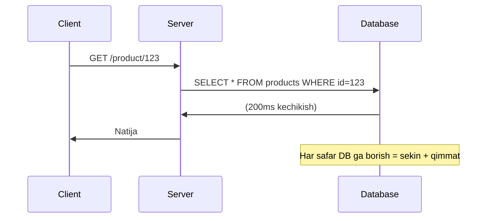
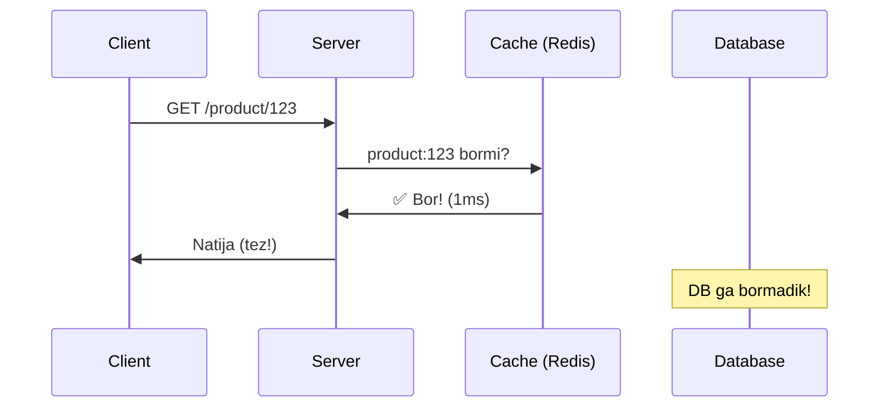
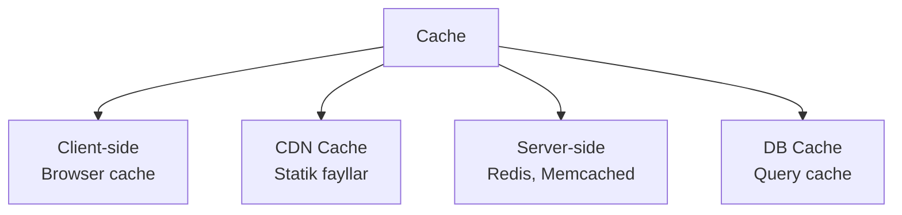
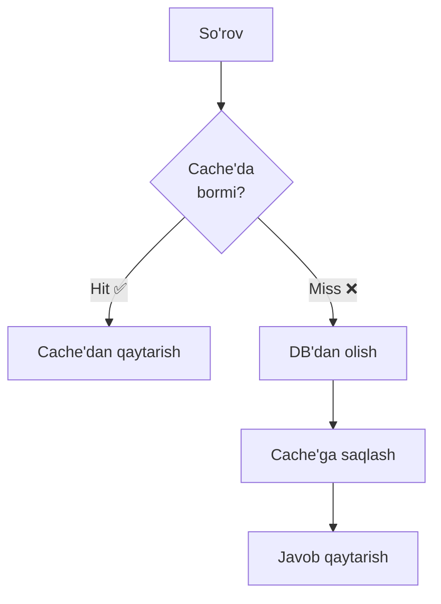
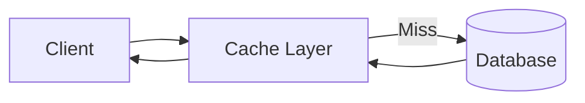
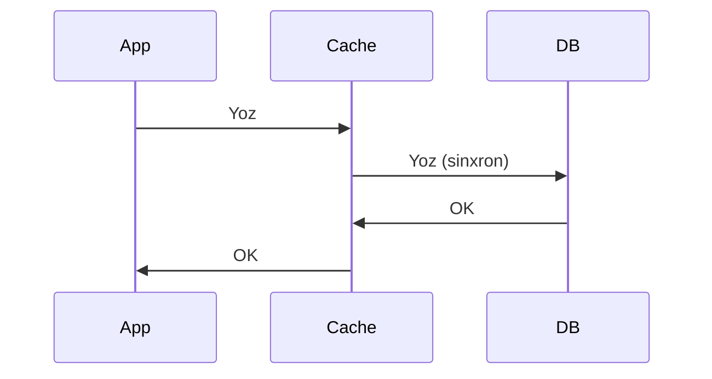
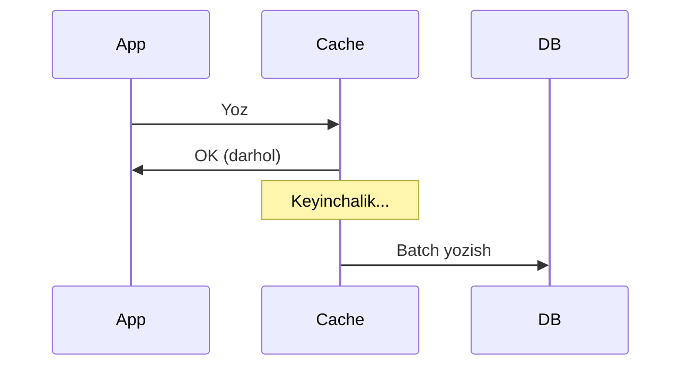
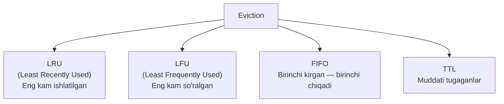

# Caching — Keshlash

## Muammo



---

## Kesh nima?

**Cache** — tez-tez so'raladigan ma'lumotlarni tezroq xotiraga saqlash.



---

## Cache Turlari



---

## Cache Read Strategiyalari

### 1. Cache-Aside (Lazy Loading)



```go
func GetProduct(id string) (*Product, error) {
    // 1. Cache tekshir
    cached, err := redis.Get("product:" + id)
    if err == nil {
        var p Product
        json.Unmarshal([]byte(cached), &p)
        return &p, nil
    }

    // 2. DB dan ol
    p, err := db.QueryProduct(id)
    if err != nil {
        return nil, err
    }

    // 3. Cache ga yoz
    data, _ := json.Marshal(p)
    redis.Set("product:"+id, data, 10*time.Minute)

    return p, nil
}
```

**Afzalligi:** Faqat kerakli ma'lumot keshlanadi
**Kamchiligi:** Birinchi so'rov sekin (cache miss)

---

### 2. Read-Through



Cache kutubxonasi o'zi DB ga boradi. Dasturchi faqat cache bilan ishlaydi.

**Afzalligi:** Kod soddroq
**Kamchiligi:** Birinchi so'rov sekin

---

## Cache Write Strategiyalari

### 1. Write-Through



- Ma'lumot doim yangi
- Yozish sekin (ikkita yozish)

### 2. Write-Behind (Write-Back)



- Yozish tez
- Ma'lumot yo'qolishi riski (cache o'chsa)

### 3. Write-Around

```
Yozish → To'g'ridan-to'g'ri DB
O'qish → Cache-Aside

Foydalanish: bir marta yoziladigan, ko'p o'qiladigan ma'lumot
```

---

## Cache Eviction Strategiyalari

Cache to'lganda qaysi ma'lumotni o'chirish?



### LRU (eng ko'p ishlatiladigan)
```
Cache (max 3):
[A, B, C] ← to'liq

D so'raladi (miss):
LRU = A (eng eski ishlatilgan)
[B, C, D] ← A chiqarildi
```

---

## Redis'da Asosiy Operatsiyalar (Go)

```go
package main

import (
    "context"
    "encoding/json"
    "time"

    "github.com/redis/go-redis/v9"
)

var rdb = redis.NewClient(&redis.Options{
    Addr: "localhost:6379",
})

type Product struct {
    ID    string  `json:"id"`
    Name  string  `json:"name"`
    Price float64 `json:"price"`
}

func CacheSet(ctx context.Context, key string, val any, ttl time.Duration) error {
    data, err := json.Marshal(val)
    if err != nil {
        return err
    }
    return rdb.Set(ctx, key, data, ttl).Err()
}

func CacheGet[T any](ctx context.Context, key string) (*T, error) {
    data, err := rdb.Get(ctx, key).Bytes()
    if err != nil {
        return nil, err // redis.Nil = topilmadi
    }
    var result T
    if err := json.Unmarshal(data, &result); err != nil {
        return nil, err
    }
    return &result, nil
}

func GetProduct(ctx context.Context, id string) (*Product, error) {
    key := "product:" + id

    // Cache tekshir
    if p, err := CacheGet[Product](ctx, key); err == nil {
        return p, nil
    }

    // DB dan ol (simulyatsiya)
    p := &Product{ID: id, Name: "Telefon", Price: 500}

    // 10 daqiqa keshla
    CacheSet(ctx, key, p, 10*time.Minute)

    return p, nil
}
```

---

## Cache Muammolari

### Cache Stampede (Thundering Herd)

```
TTL tugadi → 1000 so'rov bir vaqtda DB'ga bordi → DB o'ldi!

Yechim: Mutex Lock yoki probabilistic early expiration
```

```go
// Mutex Lock yechimi
var mu sync.Map

func GetProductSafe(ctx context.Context, id string) (*Product, error) {
    key := "product:" + id

    // Cache tekshir
    if p, _ := CacheGet[Product](ctx, key); p != nil {
        return p, nil
    }

    // Lock ol
    lock, _ := mu.LoadOrStore(key, &sync.Mutex{})
    mtx := lock.(*sync.Mutex)
    mtx.Lock()
    defer mtx.Unlock()

    // Lock olgach qayta tekshir (boshqa goroutine to'ldirgan bo'lishi mumkin)
    if p, _ := CacheGet[Product](ctx, key); p != nil {
        return p, nil
    }

    // DB dan ol va keshla
    p := &Product{ID: id, Name: "Telefon", Price: 500}
    CacheSet(ctx, key, p, 10*time.Minute)
    return p, nil
}
```

### Cache Poisoning
```
Yechim: Ma'lumotni keshga saqlashdan oldin tekshiring
```

### Cold Start
```
Tizim qayta ishga tushganda cache bo'sh
Yechim: Cache warm-up — startup da ma'lumotlarni keshla
```

---

## Qanday o'lchaymiz?

```
Cache Hit Rate = Hit / (Hit + Miss) × 100%

70-90% = yaxshi
< 50%  = cache samarasiz (nima keshlanayotganini ko'ring)
```

---

## Keyingi Qadam

→ [2. Cache Strategiyalari.md](2.%20Cache%20Strategiyalari.md)
