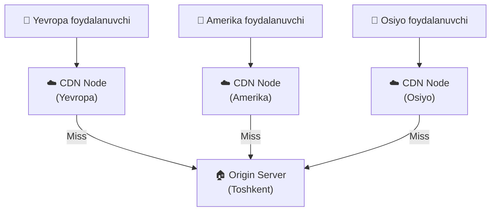
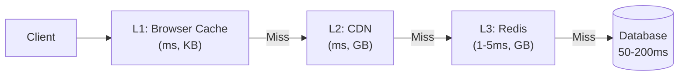
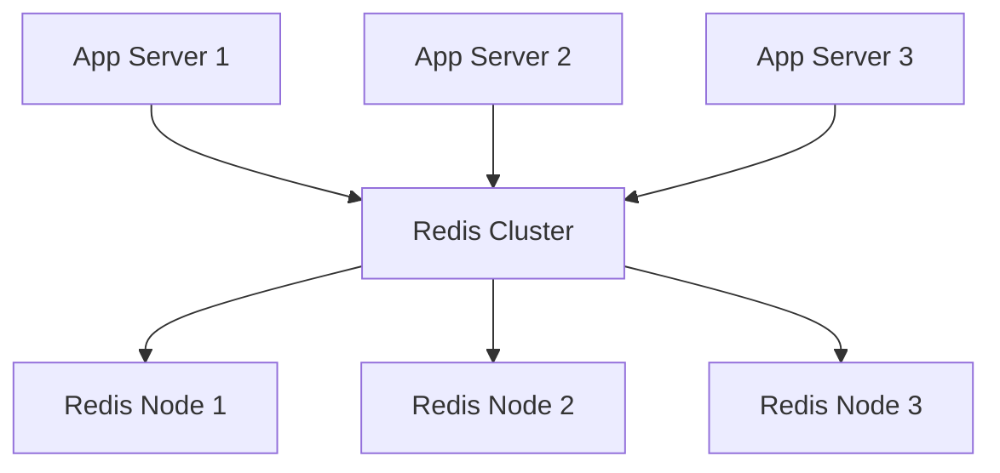
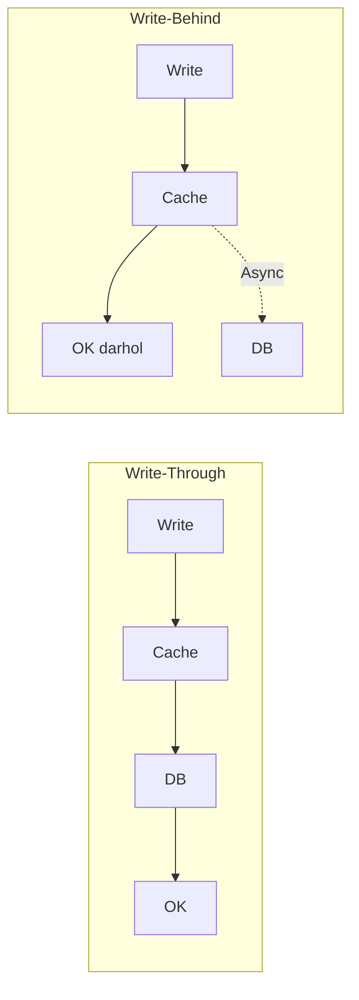

# Cache Strategiyalari

## CDN — Content Delivery Network

Statik kontent (rasm, video, CSS, JS) ni foydalanuvchiga **eng yaqin server**dan berish.



**Misollar:** Cloudflare, AWS CloudFront, Akamai

**Foydalanish:** Rasm, video, JS/CSS, statik HTML

---

## Multi-Level Cache



```
L1 (Browser): 0-1ms, 10MB
L2 (CDN):     5-30ms, unlimited
L3 (Redis):   1-5ms, GB
DB:           50-200ms, TB
```

---

## Distributed Cache

Bir necha Redis node'da cache saqlash:



### Redis Cluster

```go
import "github.com/redis/go-redis/v9"

rdb := redis.NewClusterClient(&redis.ClusterOptions{
    Addrs: []string{
        "redis1:6379",
        "redis2:6379",
        "redis3:6379",
    },
})
```

---

## Cache Invalidation (Keshni tozalash)

> "There are only two hard things in Computer Science:
> cache invalidation and naming things." — Phil Karlton

### TTL (Time-To-Live)
```go
// 10 daqiqadan keyin avtomatik o'chadi
redis.Set(ctx, key, value, 10*time.Minute)
```

### Event-based Invalidation
```go
// Mahsulot o'zgarsa — keshdan o'chir
func UpdateProduct(p *Product) error {
    // DB yangilash
    db.Update(p)
    // Cache o'chirish
    redis.Del(ctx, "product:"+p.ID)
    return nil
}
```

### Cache Versioning
```go
// Versiya raqami qo'shish
key := fmt.Sprintf("product:v2:%s", productID)
// Yangi deploy'da versiya o'zgarsa — eski kesh avtomatik eskiradi
```

---

## Write-Through vs Write-Behind Taqqoslash



| | Write-Through | Write-Behind |
|--|--------------|--------------|
| Yozish tezligi | Sekin | Tez |
| Ma'lumot xavfi | Kam | Bor (cache o'chsa) |
| DB yuki | Yuqori | Past |
| Foydalanish | Bank | Analytics, log |

---

## Session Cache

```go
type SessionStore struct {
    rdb *redis.Client
    ttl time.Duration
}

func (s *SessionStore) Save(sessionID, userID string) error {
    return s.rdb.Set(
        context.Background(),
        "session:"+sessionID,
        userID,
        s.ttl,
    ).Err()
}

func (s *SessionStore) Get(sessionID string) (string, error) {
    return s.rdb.Get(
        context.Background(),
        "session:"+sessionID,
    ).Result()
}

func (s *SessionStore) Delete(sessionID string) error {
    return s.rdb.Del(
        context.Background(),
        "session:"+sessionID,
    ).Err()
}
```

---

## Rate Limiting uchun Cache

```go
func RateLimit(rdb *redis.Client, userID string, limit int, window time.Duration) (bool, error) {
    ctx := context.Background()
    key := fmt.Sprintf("ratelimit:%s", userID)

    count, err := rdb.Incr(ctx, key).Result()
    if err != nil {
        return false, err
    }

    if count == 1 {
        rdb.Expire(ctx, key, window)
    }

    return count <= int64(limit), nil
}

// Ishlatish:
// allowed, _ := RateLimit(rdb, "user:123", 100, time.Minute)
// if !allowed { return "Too many requests" }
```

---

## Leaderboard (Redis Sorted Set)

```go
// O'yinchi balini yangilash
func UpdateScore(rdb *redis.Client, playerID string, score float64) {
    rdb.ZAdd(context.Background(), "leaderboard", redis.Z{
        Score:  score,
        Member: playerID,
    })
}

// Top 10 o'yinchilarni olish
func GetTop10(rdb *redis.Client) []redis.Z {
    result, _ := rdb.ZRevRangeWithScores(
        context.Background(), "leaderboard", 0, 9,
    ).Result()
    return result
}
```

---

## Keyingi Qadam

→ [../4. API Dizayn/1. REST vs GraphQL vs gRPC.md](../4.%20API%20Dizayn/1.%20REST%20vs%20GraphQL%20vs%20gRPC.md)
