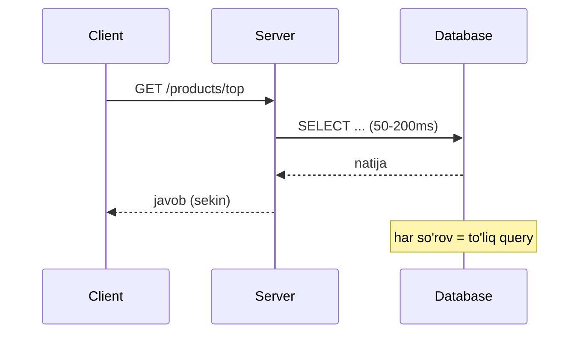
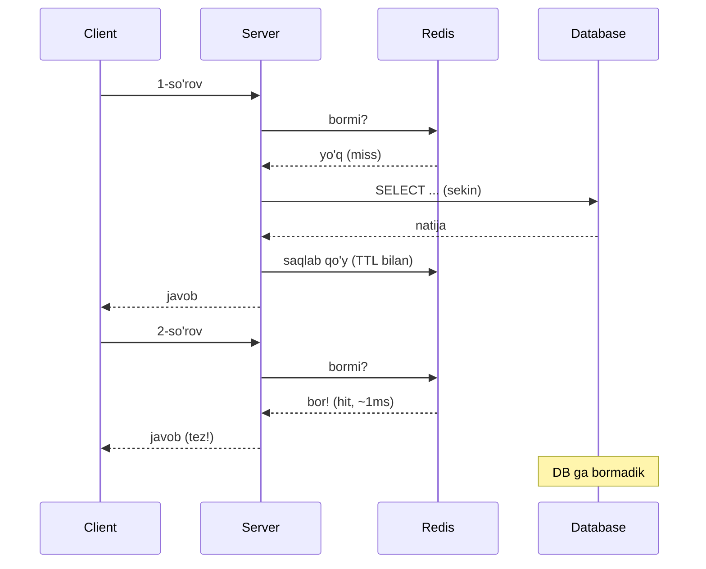
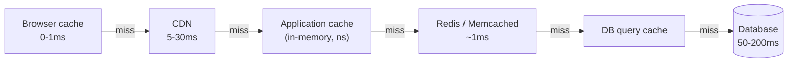
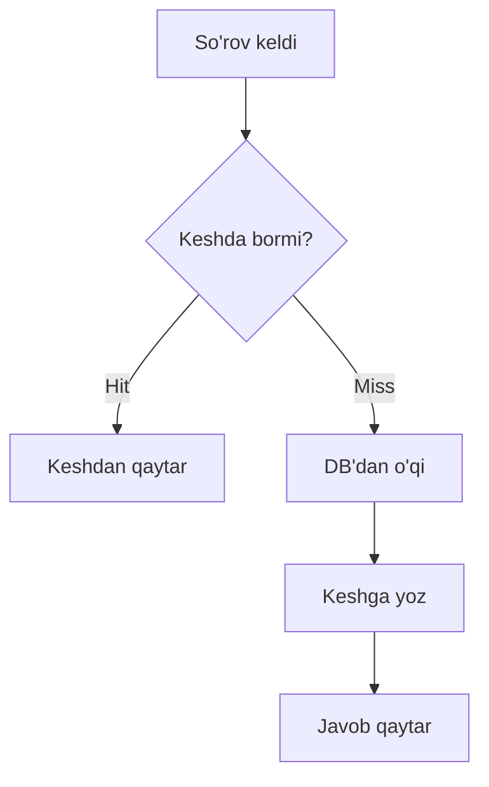
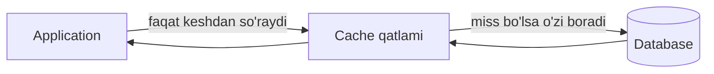
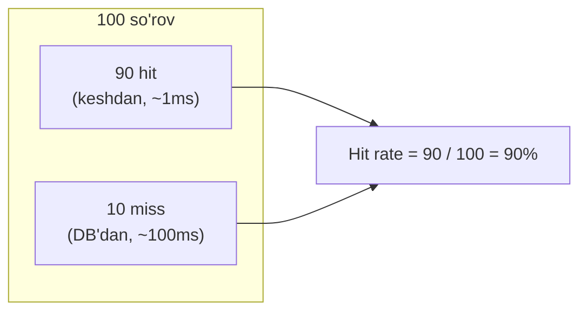
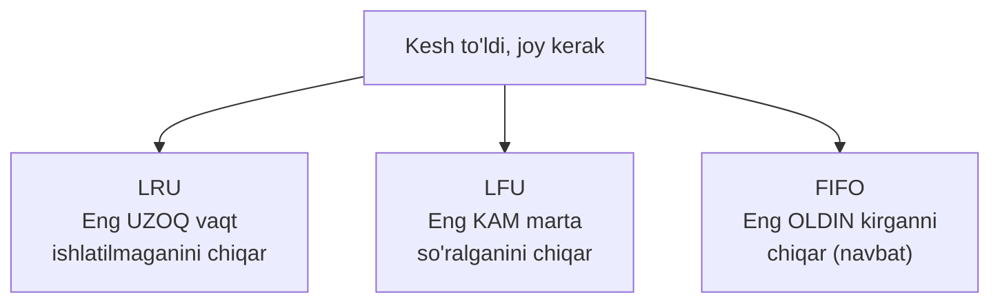

# 04.1 — O'qish strategiyalari (Read strategies)

> **Modul 4 — Keshlash (Caching), 1-dars**
> Oldingi bilim: 1-modulda kompyuter anatomiyasi (RAM tez, disk sekin), 2-modulda kengayish va **CDN** ([`../02-kengayish-usullari/04-cdn.md`](../02-kengayish-usullari/04-cdn.md)), 3-modulda ma'lumotlar ombori va replication. Bu darsda o'sha bilimlarni ustiga qo'yamiz.

---

## 1. Muammo — nega har so'rovda DB ga borish qimmat?

Tasavvur qil: sen internet-do'kon backend'ini yozyapsan. Bosh sahifada **eng ko'p sotilgan 20 ta mahsulot** ko'rsatiladi. Har bir foydalanuvchi sahifani ochganda kod DB ga boradi:

```sql
SELECT * FROM products ORDER BY sales DESC LIMIT 20;
```

Bir foydalanuvchi uchun bu ~50-200 ms. Lekin sekundiga **5000 foydalanuvchi** kelsa? DB bir xil so'rovni 5000 marta bajaradi — CPU 100% ga chiqadi, disk o'qishdan bo'g'iladi va sayt sekinlashadi.

Bu yerda **ikkita og'riq** bor:
1. **Latency** (kechikish) — foydalanuvchi javobni sekin oladi.
2. **Yuk** (load) — DB bir xil ishni takror-takror bajaradi, resurs behuda ketadi.

### Latency raqamlari — his qilib ko'r

Xotira turlarining tezligi bir-biridan **ming baravar** farq qiladi. 1-moduldagi "RAM tez, disk sekin" bilimini eslaysanmi? Kesh aynan shu farqdan foyda oladi:

| Manba | Odatiy latency | Nisbat |
|-------|---------------|--------|
| RAM (dastur ichi) | ~100 nanosekund | 1x |
| Redis (tarmoq orqali) | **~1 ms** | ~10 000x |
| SSD disk o'qish | ~1 ms | ~10 000x |
| DB query (index bilan) | ~10-50 ms | ~100 000x |
| DB query (murakkab JOIN) | ~50-200 ms | ~1 000 000x |

> **Oltin qoida:** Redis'dan o'qish DB query'dan ~50-200 baravar tez. Agar bir xil ma'lumot qayta-qayta so'ralsa, uni keshlash — eng arzon unumdorlik yutug'i.

---

## 2. Analogiya — kesh = stol ustidagi eng kerakli kitoblar

Kutubxonachi ishlayapsan. Har kitob **omborda** (DB), lekin omborga borib-kelish 10 daqiqa (sekin). Eng ko'p so'raladigan 20 ta kitobni **stol ustiga** (kesh, ya'ni RAM) qo'yasan — cho'zilib olasan, 2 soniya.

- Kimdir mashhur kitob so'rasa — stoldan berasan (**cache hit**, tez).
- Kimdir noyob kitob so'rasa — omborga borasan (**cache miss**, sekin), keyin uni ham stolga qo'yasan.

**Analogiya chegarasi:** stol chekli — hamma kitob sig'maydi. Qachondir eng kam so'raladiganini olib, joy bo'shatasan (**eviction**). Aynan shu nuqta keshning eng nozik joyi.

---

## 3. Sodda ta'rif

> **Cache** (kesh) — tez-tez so'raladigan ma'lumotning nusxasini asosiy manbadan (DB) ko'ra tezroq joyga (odatda RAM'ga) vaqtincha saqlash usuli.

Ikki yangi atama darhol:
- **Cache hit** — so'ralgan ma'lumot keshda topildi (tez javob).
- **Cache miss** — keshda yo'q, asosiy manbaga borish kerak (sekin javob).

---

## 4. Diagramma — keshsiz vs keshli oqim

Keshsiz holatda har so'rov DB ga tushadi:



Keshli holatda ikkinchi so'rov DB ga umuman bormaydi:



---

## 5. Kesh qatlamlari (cache layers) — bitta emas, ko'p qavat

Kesh faqat Redis emas. Foydalanuvchidan DB gacha **butun yo'lda** har bosqichda kesh bo'lishi mumkin. Har qatlam o'zidan keyingisining yukini yengillashtiradi.



| Qatlam | Qayerda | Latency | Nima saqlaydi |
|--------|---------|---------|---------------|
| Browser cache | Foydalanuvchi kompyuterida | 0-1 ms | Rasm, CSS, JS, `Cache-Control` bilan |
| **CDN** | Foydalanuvchiga yaqin server | 5-30 ms | Statik fayllar (2-modulda o'rgangan edik) |
| Application cache | Server RAM'ida (masalan Go map) | nanosekund | Juda tez-tez kerakli kichik ma'lumot |
| **Redis / Memcached** | Alohida kesh server | ~1 ms | Umumiy (shared) kesh — bir necha server ishlatadi |
| DB query cache | DB ichida | o'zgaruvchan | Takroriy query natijalari |

Eslatma: `Application cache` faqat bitta server RAM'ida yashaydi — 3 ta server bo'lsa, 3 xil nusxa bo'ladi. **Redis** esa hammaga umumiy (shared), shuning uchun bir server yangilagan ma'lumotni boshqalar ham ko'radi.

---

## 6. Ikki asosiy o'qish strategiyasi

Keshni "kim to'ldiradi?" degan savolga qarab ikki xil yondashuv bor: **Cache-Aside** va **Read-Through**.

### 6.1 Cache-Aside (Lazy Loading) — "o'zim boshqaraman"

**Muammo:** dastlab kesh bo'sh. Uni qanday to'ldiramiz? Cache-aside'da mantiq oddiy: **avval keshga qara, yo'q bo'lsa DB'dan ol va keshga yoz.** "Lazy" (dangasa) deyilishi — ma'lumot faqat **birinchi so'ralganda** keshga tushadi.



Go + Redis misoli (subgoal label'lar bilan):

```go
func GetProduct(ctx context.Context, id string) (*Product, error) {
    key := "product:" + id

    // --- 1-qadam: avval keshga qaraymiz (cache hit'ni umid qilamiz) ---
    if data, err := rdb.Get(ctx, key).Bytes(); err == nil {
        var p Product
        json.Unmarshal(data, &p)
        return &p, nil // HIT — DB ga bormadik
    }

    // --- 2-qadam: miss bo'ldi, asosiy manbadan (DB) o'qiymiz ---
    p, err := db.QueryProduct(ctx, id)
    if err != nil {
        return nil, err
    }

    // --- 3-qadam: keyingi safar hit bo'lishi uchun keshga yozamiz ---
    if data, err := json.Marshal(p); err == nil {
        rdb.Set(ctx, key, data, 10*time.Minute) // 10 daqiqa yashaydi
    }
    return p, nil
}
```

Notional machine (aslida nima bo'ladi): `rdb.Get` tarmoq orqali Redis serveriga TCP paket yuboradi. Redis o'z RAM'idagi hash-jadvaldan `key`ni qidiradi. Topsa — baytlarni qaytaradi (`err == nil`). Topmasa — `redis.Nil` xatosini qaytaradi, biz DB'ga tushamiz. `json.Unmarshal` esa o'sha baytlarni Go struct'iga aylantiradi (RAM'da yangi `Product` obyekti paydo bo'ladi).

### 6.2 Read-Through — "kutubxona o'zi olib keladi"

**Muammo:** Cache-aside'da har chaqiruvchi joyda "keshga qara → DB → keshga yoz" mantiqini takrorlaysan. 10 ta funksiyada 10 marta yozasan — xato qilish oson.

**Yechim:** bu mantiqni **kesh qatlami o'zi** ichiga oladi. Dastur faqat keshdan so'raydi; miss bo'lsa, keshning o'zi DB'ga borib to'ldiradi. Dastur DB'ni ko'rmaydi ham.



Go'da buni bitta "loader" funksiya bilan modellaymiz:

```go
// --- Read-through: DB'ga borish mantig'i keshning O'ZIDA yashiringan ---
func (c *Cache) GetOrLoad(ctx context.Context, key string,
    loader func() (*Product, error)) (*Product, error) {

    // 1-qadam: kesh ichkarida hit'ni tekshiradi
    if p, err := c.get(ctx, key); err == nil {
        return p, nil
    }
    // 2-qadam: miss — kesh loader'ni CHAQIRIB, o'zi DB'dan yuklaydi
    p, err := loader()
    if err != nil {
        return nil, err
    }
    // 3-qadam: kesh o'zini o'zi to'ldiradi
    c.set(ctx, key, p, 10*time.Minute)
    return p, nil
}

// Chaqiruvchi DB ni umuman ko'rmaydi:
p, _ := cache.GetOrLoad(ctx, "product:123", func() (*Product, error) {
    return db.QueryProduct(ctx, "123")
})
```

### Cache-Aside vs Read-Through — farqi nima?

| Xususiyat | Cache-Aside | Read-Through |
|-----------|-------------|--------------|
| DB'ga kim boradi? | Dastur kodi o'zi | Kesh qatlami |
| Dastur DB'ni biladimi? | Ha | Yo'q (yashirin) |
| Kod takrorlanishi | Ko'p (har joyda) | Kam (bir marta) |
| Moslashuvchanlik | Yuqori (istalgan mantiq) | Cheklangan (qat'iy shakl) |
| Odatiy ishlatilishi | Eng keng tarqalgan | Kutubxona/framework ichida |

> **Oltin qoida:** Ikkalasida ham "avval keshga qara, miss bo'lsa DB'dan yukla" mantig'i bir xil. Yagona farq — **bu mantiq kimning ichida yashaydi**: dasturingda (aside) yoki kesh qatlamida (through).

### 🤔 O'ylab ko'r (PRIMM predict)

`GetProduct`da 3-qadam — keshga yozishni **butunlay olib tashlasak** nima bo'ladi?

<details>
<summary>💡 Javobni ko'rish</summary>

Har so'rov **doim cache miss** bo'ladi va **doim DB'ga** boradi. Kesh hech qachon to'lmaydi, hit rate = 0%. Ya'ni kod "keshdan o'qishga urinadi, topmaydi, DB'ga boradi" — bu keshsiz holatga qaraganda hatto **sekinroq**, chunki har safar ortiqcha Redis so'rovi ham qo'shiladi. Keshdan foyda faqat **yozib qo'yganingda** paydo bo'ladi.
</details>

---

## 7. Cache hit rate — nega bu raqam eng muhim?

**Muammo:** kesh qo'yding, lekin foyda bormi? Buni bitta raqam ko'rsatadi — **hit rate**.

> **Hit rate** = `hitlar / (hitlar + misslar)` — so'rovlarning necha foizi keshdan (DB'siz) javob oldi.



Nega muhim? Chunki hit rate to'g'ridan-to'g'ri **o'rtacha latency**ni belgilaydi:

- **90% hit:** o'rtacha ≈ `0.9 × 1ms + 0.1 × 100ms` = **~11 ms**
- **50% hit:** o'rtacha ≈ `0.5 × 1ms + 0.5 × 100ms` = **~50 ms**

Ya'ni hit rate 50% dan 90% ga ko'tarilishi latency'ni ~5 baravar kamaytiradi.

Go'da hisoblash uchun oddiy hisoblagich:

```go
type Stats struct {
    hits, misses atomic.Int64 // atomic — bir vaqtda ko'p goroutine yozadi
}

func (s *Stats) HitRate() float64 {
    h, m := s.hits.Load(), s.misses.Load()
    if h+m == 0 {
        return 0
    }
    return float64(h) / float64(h+m) * 100
}
```

Baholash mezoni:
- **70-90%+** — yaxshi, kesh ishlayapti.
- **< 50%** — kesh samarasiz: noto'g'ri narsa keshlanayapti yoki TTL juda qisqa (2-darsda ko'ramiz).

---

## 8. Eviction siyosatlari — kesh to'lganda kimni chiqarish?

**Muammo:** RAM chekli. Redis 4 GB, lekin ma'lumot 40 GB. Kesh to'lganda **yangi element uchun joy bo'shatish** kerak — lekin kimni o'chirish? Bu qaror **eviction policy** (chiqarish siyosati) deyiladi.

Analogiya: kichik muzlatgich. Yangi mahsulot sig'maydi — eskisidan birini olib tashlaysan. Qaysi birini? Uch xil qoida bor:



| Siyosat | Qoida | Qachon yaxshi | Zaifligi |
|---------|-------|---------------|----------|
| **LRU** (Least Recently Used) | Eng uzoq vaqt tegilmaganini chiqar | "Yaqinda ishlatilgan — yana ishlatiladi" (temporal locality). Eng keng tarqalgan | Bir martalik katta skan keshni "yuvib" yuboradi |
| **LFU** (Least Frequently Used) | Eng kam marta so'ralganini chiqar | Ba'zi elementlar doim mashhur bo'lsa | Eski mashhurlar "yopishib" qoladi, yangilariga joy bermaydi |
| **FIFO** (First In First Out) | Eng oldin kelganini chiqar (ishlatilishiga qaramay) | Sodda, tartib muhim bo'lganda | Mashhur bo'lsa ham eng eski element chiqib ketadi |

### LRU'ni qadamma-qadam ko'ramiz (eng ko'p ishlatilgani)

Kesh sig'imi = 3. Kvadrat qavs ichida — ishlatilish tartibi (chapda eng eski):

```
Boshlang'ich:   [A, B, C]        (A eng eski ishlatilgan)
B so'raldi:     [A, C, B]        (B endi eng yangi — o'ngga o'tdi)
D so'raldi:     to'la! LRU = A → A chiqadi → [C, B, D]
```

E'tibor ber: `B` so'ralgani uchun "eng eski" holatidan chiqdi. Keyin `D` kelganda chiqarish uchun `A` tanlandi, chunki u eng uzoq tegilmagan edi.

Redis'da buni sozlash (kod emas, konfiguratsiya):

```bash
# redis.conf — RAM to'lganda LRU bilan chiqar
maxmemory 4gb
maxmemory-policy allkeys-lru   # yoki: allkeys-lfu, volatile-ttl
```

### ⚠️ Ko'p uchraydigan xatolar

1. **"LRU = eng eski qo'shilgan"** — noto'g'ri. LRU **eng uzoq ishlatilmagan**ni chiqaradi, "eng eski qo'shilgan"ni emas. "Eng eski qo'shilgan" — bu **FIFO**. Farq: LRU'da har o'qish elementni "yangilaydi", FIFO'da o'qish tartibga ta'sir qilmaydi.

2. **Eviction'ni TTL bilan aralashtirish** — ular boshqa narsa. **TTL** = vaqt tugagani uchun o'chirish (2-darsda). **Eviction** = joy yetmagani uchun o'chirish. TTL hali tugamagan element ham eviction'da chiqib ketishi mumkin.

3. **Har muammoga LRU** — agar bir necha element **abadiy mashhur** bo'lsa (masalan bosh sahifa), LRU ba'zan ularni ham chiqarib yuboradi. Bunday holatda **LFU** to'g'riroq.

---

## Xulosa

- Har so'rovda DB'ga borish **latency** (50-200ms) va **yuk** jihatidan qimmat; kesh (Redis ~1ms) buni ~100 baravar tezlashtiradi.
- Kesh bitta emas — **qatlamlar**: browser → CDN → application → Redis → DB query cache. Har biri keyingisining yukini kamaytiradi.
- **Cache-aside**da DB'ga borish mantig'i dasturda, **read-through**da esa kesh qatlamida yashiringan; asosiy mantiq ikkalasida bir xil.
- **Cache hit/miss** — keshda topildi/topilmadi; **hit rate** = hitlar foizi va u o'rtacha latency'ni bevosita belgilaydi (70-90%+ = yaxshi).
- Kesh to'lganda **eviction** ishlaydi: **LRU** (eng uzoq ishlatilmagan), **LFU** (eng kam so'ralgan), **FIFO** (eng oldin kirgan).
- LRU eng keng tarqalgan, lekin abadiy mashhur ma'lumot uchun LFU to'g'riroq.

## 🧠 Eslab qol

- Kesh = asosiy manbadan tez joyga (RAM) qo'yilgan vaqtinchalik nusxa.
- Cache-aside: "avval keshga qara, miss bo'lsa DB'dan yukla va keshga yoz".
- Hit rate qancha yuqori — o'rtacha latency shuncha past.
- LRU eng uzoq **ishlatilmagan**ni chiqaradi (eng eski **qo'shilgan**ni emas — u FIFO).
- Eviction (joy yetmadi) va TTL (vaqt tugadi) — ikki boshqa sabab.

## ✅ O'z-o'zini tekshir (retrieval practice)

1. Cache-aside va read-through o'rtasidagi asosiy farq nima?
<details>
<summary>Javob</summary>
DB'dan yuklash mantig'i **kimning ichida** ekani. Cache-aside'da bu mantiqni dastur kodi o'zi yozadi va bajaradi; read-through'da esa kesh qatlamining o'zi miss bo'lganda DB'ga boradi — dastur DB'ni ko'rmaydi ham.
</details>

2. Hit rate 50% dan 90% ga ko'tarilsa, o'rtacha latency'ga nima bo'ladi? (miss ~100ms, hit ~1ms)
<details>
<summary>Javob</summary>
50% da ≈ 50ms, 90% da ≈ 11ms — taxminan **5 baravar** kamayadi. Chunki misslar (sekin so'rovlar) ulushi kamayadi.
</details>

3. Kesh sig'imi 3, holat `[A, B, C]` (A eng eski ishlatilgan). Ketma-ket `C` so'raldi, keyin `D` so'raldi. LRU bo'yicha kim chiqadi?
<details>
<summary>Javob</summary>
`C` so'ralgach holat `[A, B, C]` → `C` eng yangi bo'ldi, ya'ni `[A, B, C]` da tartib `A, B, C`. `D` kelganda eng uzoq ishlatilmagan `A` chiqadi → `[B, C, D]`.
</details>

4. Nega "cache-aside'da keshga yozishni unutsak" hech qanday tezlik yutig'i bo'lmaydi?
<details>
<summary>Javob</summary>
Kesh hech qachon to'lmaydi — har so'rov miss bo'lib DB'ga boradi. Hatto sekinroq: har safar ortiqcha (befoyda) Redis so'rovi ham qo'shiladi.
</details>

5. Bir element "abadiy mashhur" (doim so'raladi), lekin oralarda ko'p bir martalik so'rovlar bo'lsa — LRU yoki LFU, qaysi biri uni yaxshi saqlaydi?
<details>
<summary>Javob</summary>
**LFU** — u chastotani (necha marta so'ralgani) hisoblaydi, shuning uchun mashhur elementni saqlaydi. LRU esa faqat "oxirgi qachon" ga qaraydi va katta bir martalik oqim uni chiqarib yuborishi mumkin.
</details>

## 🛠 Amaliyot

**1. Oson (Modify).** Yuqoridagi `flowchart TD` cache-aside diagrammasini o'zgartir: `Miss` tarmog'iga "DB xato qaytarsa keshga YOZMA" degan qadam qo'sh. Nega bu muhim? (Ipucha ichida.)
<details>
<summary>Ipucha</summary>
Agar DB vaqtincha xato bersa va biz `nil`/xato'ni keshlasak, keyingi 10 daqiqa hamma xato javob oladi. Xatoni hech qachon keshlama — faqat muvaffaqiyatli natijani.
</details>

**2. O'rta (kamchilik top).** Quyidagi kodda kamida 2 ta muammo bor, top:
```go
func GetUser(ctx context.Context, id string) (*User, error) {
    data, _ := rdb.Get(ctx, "user:"+id).Bytes() // xato tekshirilmagan
    var u User
    json.Unmarshal(data, &u)
    return &u, nil
}
```
<details>
<summary>Ipucha</summary>
(1) `rdb.Get` xatosi (`redis.Nil` = miss) e'tiborsiz qoldirilgan — miss bo'lsa `data` bo'sh, natijada bo'sh `User` qaytadi. (2) Miss bo'lganda DB'dan yuklab keshga yozish qadami umuman yo'q — kesh hech qachon to'lmaydi. To'g'risi: `err` ni tekshir; `redis.Nil` bo'lsa DB'dan ol va `Set` qil.
</details>

**3. Qiyin (Make — kichik dizayn).** Sekundiga 20 000 so'rov keladigan "trending mahsulotlar" endpoint'ini loyihala. Qanday qatlam(lar) qo'yasan, TTL taxminan qancha, eviction siyosati qaysi? Bir paragraf bilan asosla.
<details>
<summary>Ipucha</summary>
Trending ro'yxati hamma uchun bir xil (personalizatsiya yo'q) → juda yaxshi keshlanadi. Application in-memory cache (nanosekund) + Redis (shared, ~1ms). TTL qisqa (30-60s), chunki "trending" tez o'zgaradi. Eviction: bu bitta kalit doim mashhur, shuning uchun sig'im muammosi yo'q — LRU yetarli. Hit rate 99%+ bo'lishi kerak, chunki hamma bir xil narsani so'raydi.
</details>

## 🔁 Takrorlash

**Bog'liq oldingi mavzular:**
- [`../01-tizimlar-negizi/`](../01-tizimlar-negizi/) — RAM vs disk tezligi, latency asoslari (kesh nima uchun tez).
- [`../02-kengayish-usullari/04-cdn.md`](../02-kengayish-usullari/04-cdn.md) — CDN ham kesh qatlami (browser bilan Redis oralig'ida).
- [`../03-malumotlar-ombori/`](../03-malumotlar-ombori/) — replication va read replica: kesh bilan birga DB o'qish yukini kamaytiradi.

**Takrorlash jadvali:**
- **Ertaga:** "O'z-o'zini tekshir" 1, 3, 5-savollarga qaytib javob ber.
- **3 kundan keyin:** LRU misolini boshqa harflar bilan qaytadan chiz.
- **1 haftadan keyin:** Cache-aside `GetProduct`ni xotiradan (kodga qaramay) qayta yoz.

**Feynman testi:** Kod so'zlarisiz, bir do'stingga 3 jumlada tushuntir: (1) nega kesh kerak, (2) cache hit/miss nima, (3) kesh to'lganda nima bo'ladi.

---

**Keyingi dars:** [`02-malumot-eskirishi-etag-ttl-jitter.md`](02-malumot-eskirishi-etag-ttl-jitter.md) — keshdagi ma'lumot eskirsa (staleness) nima bo'ladi, TTL qanday tanlanadi va cache stampede muammosi.
