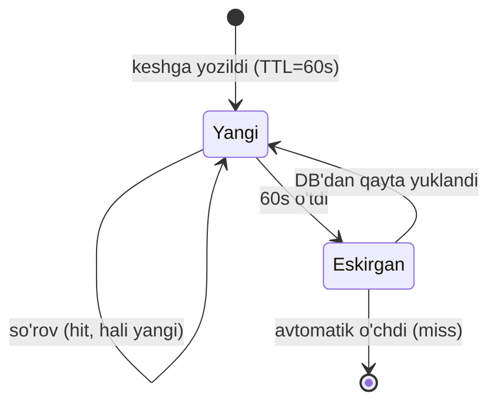
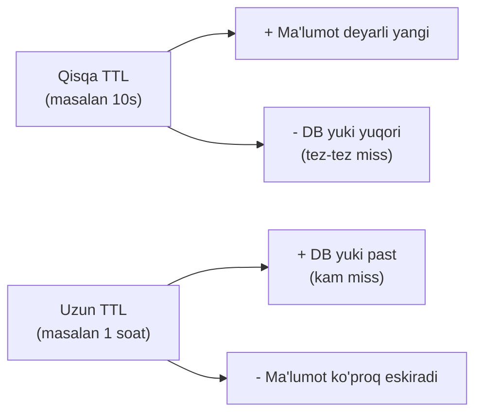
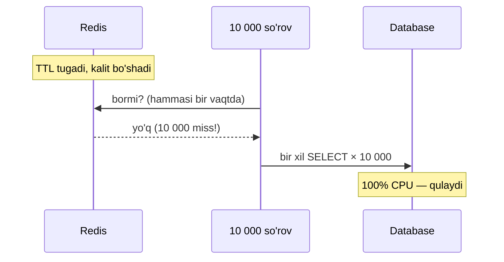
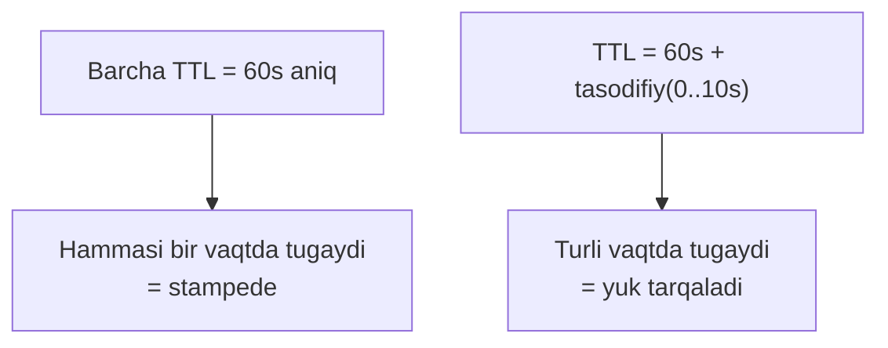
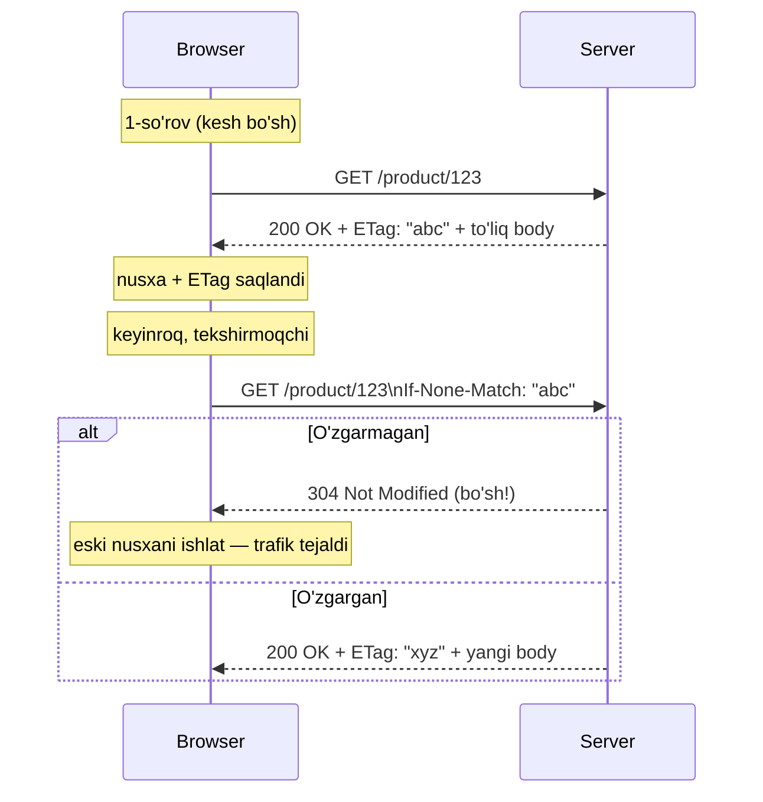
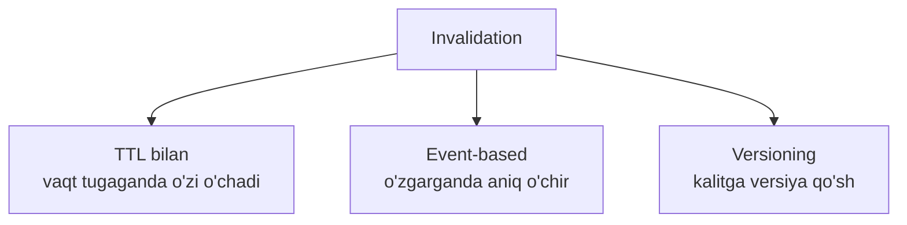

# 04.2 — Ma'lumot eskirishi: ETag, TTL va jitter

> **Modul 4 — Keshlash (Caching), 2-dars**
> Oldingi bilim: 1-darsda cache-aside, cache hit/miss, hit rate va eviction'ni o'rgandik. Endi eng nozik savolga kelamiz: keshdagi nusxa **eskirsa** nima bo'ladi va uni qanday nazorat qilamiz.

---

## 1. Muammo — keshdagi ma'lumot "yolg'onchi"ga aylanadi

1-darsda mahsulot narxini keshladik: `product:123 → {narx: 500}`, TTL 10 daqiqa.

Endi tasavvur qil: admin narxni **400** ga tushirdi. DB'da narx yangilandi, lekin **keshda hali 500** turibdi. Keyingi 10 daqiqa davomida hamma foydalanuvchi **eski narxni** (500) ko'radi. Xaridor 400 kutgan edi, 500 to'lash so'raldi — bu haqiqiy pul yo'qotish yoki ishonch buzilishi.

Bu **staleness** (eskirish) muammosi: kesh — asosiy manbaning **nusxasi**, va nusxa har doim asl bilan bir xil bo'lib turmaydi.

> **Oltin qoida:** Kesh — ma'lumotning haqiqati emas, **eski nusxasi**. Har keshda "bu nusxa qancha vaqtgacha ishonchli?" degan savolga javob berish shart.

### Analogiya — muzlatilgan sut yorlig'i

Keshdagi ma'lumot = muzlatgichdagi sut. Yorliqdagi **muddat** (TTL) o'tsa, ichmaysan — tashlaysan va yangisini olasan. Muddat yetarli qisqa bo'lsa — hech qachon buzilgan sut ichmaysan, lekin tez-tez do'konga (DB'ga) borasan. Muddat uzun bo'lsa — kam borasan, lekin ba'zan buzuq sut xavfi bor.

**Analogiya chegarasi:** sutning haqiqiy holatini ochib hidlab bo'ladi; keshda esa "hozir eskirdimi?" ni bilishning yagona yo'li — asl manbaga solishtirish (buni ETag hal qiladi, pastda).

---

## 2. TTL — ma'lumotning "yaroqlilik muddati"

**TTL** (Time-To-Live) — keshdagi element qancha vaqt yashashini belgilaydigan taymer. Muddat tugagach, element **avtomatik o'chadi** va keyingi so'rov miss bo'lib, yangilanadi.



Go + Redis'da TTL — `Set`ning oxirgi argumenti:

```go
// --- Ma'lumotni 60 soniyalik "yaroqlilik muddati" bilan keshlaymiz ---
rdb.Set(ctx, "product:123", data, 60*time.Second)

// TTL'ni tekshirish — element qancha yashaydi?
ttl, _ := rdb.TTL(ctx, "product:123").Result()
fmt.Println(ttl) // masalan: 42s
```

Notional machine: Redis har kalit uchun "amal qilish vaqti"ni saqlaydi. Ikki mexanizm ishlaydi: **lazy** — kalit so'ralganda muddati tekshiriladi, o'tgan bo'lsa o'sha zahoti o'chiriladi; **active** — Redis fonda tasodifiy kalitlarni tekshirib, muddati o'tganlarini tozalaydi. Shuning uchun "TTL 60s" — kafolatlangan yuqori chegara, aniq millisekund emas.

### Qisqa vs uzun TTL — trade-off

Bu eng muhim qaror. Ikki uch bir-biriga qarama-qarshi:



| | Qisqa TTL | Uzun TTL |
|--|-----------|----------|
| Ma'lumot yangiligi | Yuqori | Past (ko'proq stale) |
| DB yuki | Yuqori | Past |
| Hit rate | Pastroq | Yuqoriroq |
| Mos ma'lumot | Tez o'zgaradigan (narx, stok) | Kam o'zgaradigan (davlat kodlari, kategoriya) |

TTL'ni tanlashning amaliy qoidasi: **"bu ma'lumot eskirsa qancha zarar?"** degan savolga qara.
- Bank balansi eskirsa — katta zarar → juda qisqa TTL yoki umuman keshlama.
- Blog maqolasi eskirsa — kichik zarar → uzun TTL (masalan 1 soat) bemalol.

### ⚠️ Ko'p uchraydigan xato

**"TTL yechim, invalidation shart emas"** — noto'g'ri. TTL — bu "eng ko'p qancha vaqt eski qolishi mumkin"ning chegarasi. TTL 10 daqiqa bo'lsa, ma'lumot **10 daqiqagacha** eski bo'lishi mumkin. Agar narx o'zgarishi darhol ko'rinishi kerak bo'lsa, TTL yetmaydi — o'zgarganda keshni **aniq o'chirish** (event-based invalidation, pastda) kerak.

---

## 3. Cache stampede (thundering herd) — hamma bir vaqtda DB'ga yuguradi

**Muammo (hook):** Bosh sahifa mahsuloti sekundiga 10 000 marta so'raladi, TTL 60s. TTL tugagan **aniq o'sha soniyada** kesh bo'shaydi. Endi 10 000 so'rov **bir vaqtda** miss bo'ladi va **hammasi bir vaqtda DB'ga** yuguradi. DB bitta so'rov o'rniga 10 000 bir xil so'rovni bajarishga majbur — CPU 100%, DB qulaydi.

Bu **cache stampede** yoki **thundering herd** (poda bosishi) deyiladi.



### Analogiya
Kontsert chiptasi soat 12:00 da sotuvga chiqadi. Aynan 12:00:00 da millionlab odam bir vaqtda saytga uriladi — server ko'tarolmaydi. Yechim: hammani bir soniyada emas, biroz **tarqoq** kiritish.

### Yechim 1 — Jitter (tasodifiy tarqatish)

**Muammo:** hamma kalit TTL'i aynan bir vaqtda tugaydi. **Yechim:** TTL'ga kichik **tasodifiy qo'shimcha** (jitter) qo'shamiz — shunda kalitlar biroz turli vaqtlarda tugaydi va misslar vaqt bo'ylab **tarqaladi**, bir soniyaga to'planmaydi.



Go misoli (subgoal label'lar bilan):

```go
// --- 1-qadam: asosiy TTL va tasodifiy qo'shimcha (jitter) ---
func ttlWithJitter(base time.Duration, maxJitter time.Duration) time.Duration {
    // 0 dan maxJitter gacha tasodifiy qo'shimcha
    jitter := time.Duration(rand.Int63n(int64(maxJitter)))
    return base + jitter
}

// --- 2-qadam: har kalitga biroz boshqacha TTL beramiz ---
ttl := ttlWithJitter(60*time.Second, 10*time.Second) // 60..70s oralig'ida
rdb.Set(ctx, "product:123", data, ttl)
```

Endi 10 000 kalit 60-70s oralig'ida turli soniyalarda tugaydi — DB'ga bir vaqtda emas, tekis tarqalgan holda boradi.

### Yechim 2 — Lock (faqat bittasi DB'ga borsin)

**Muammo:** hatto jitter bilan ham bitta mashhur kalit tugaganda ko'p so'rov bir vaqtda kelishi mumkin. **Yechim:** miss bo'lganda **faqat bitta** goroutine DB'ga borsin (lock oladi), qolganlari u to'ldirguncha kutsin.

```go
var group singleflight.Group // golang.org/x/sync/singleflight

func GetProduct(ctx context.Context, id string) (*Product, error) {
    key := "product:" + id

    // --- 1-qadam: hit'ni tekshiramiz ---
    if p, err := cacheGet(ctx, key); err == nil {
        return p, nil
    }

    // --- 2-qadam: bir vaqtdagi ko'p miss'dan FAQAT BITTASI DB'ga boradi ---
    v, err, _ := group.Do(key, func() (any, error) {
        p, err := db.QueryProduct(ctx, id) // faqat 1 marta bajariladi
        if err == nil {
            cacheSet(ctx, key, p, ttlWithJitter(60*time.Second, 10*time.Second))
        }
        return p, err
    })
    if err != nil {
        return nil, err
    }
    return v.(*Product), nil
}
```

`singleflight.Group` — Go standart ekotizimidagi vosita: bir xil `key` uchun bir vaqtda kelgan chaqiruvlarni **bittaga birlashtiradi**, DB faqat 1 marta so'raladi, natija hammaga tarqatiladi.

### 🤔 O'ylab ko'r (PRIMM predict)

`singleflight.Group` ishlatilgan holatda 500 ta so'rov bir vaqtda miss bo'lsa, DB nechta query oladi?

<details>
<summary>💡 Javobni ko'rish</summary>

**Faqat 1 ta.** `group.Do(key, ...)` bir xil `key` uchun birinchi chaqiruvni bajaradi, qolgan 499 tasi shu natijani **kutadi va ulashadi**. DB 500 emas, 1 query oladi. Jitter esa turli kalitlarni vaqt bo'ylab tarqatadi — ikkalasi birga stampede'ni to'liq bartaraf qiladi.
</details>

### ⚠️ Ko'p uchraydigan xato

**Jitter'ni faqat kichik qo'shimcha deb qo'shmaslik** — ba'zilar jitter'ni TTL'dan **ayirib** qo'yadi (`60s - jitter`), natijada ba'zi kalitlar juda tez tugaydi va foyda kamayadi. To'g'risi: base TTL saqlanib, ustiga tasodifiy qo'shimcha (`base + jitter`) qo'shiladi.

---

## 4. HTTP caching — brauzer va serverni gaplashtirish

**Muammo:** 1-darsda "browser cache" qatlamini ko'rgan edik. Lekin brauzer qanday biladi — saqlagan nusxasi hali yangimi yoki qayta yuklash kerakmi? Buni **HTTP caching header'lari** hal qiladi.

Ikki asosiy mexanizm bor:
1. **Cache-Control** — "bu javobni qancha vaqt saqla" (TTL, lekin HTTP darajasida).
2. **ETag + If-None-Match** — "nusxam hali to'g'rimi?" deb serverga arzon savol berish.

### 4.1 Cache-Control

Server javob header'ida ma'lumot qancha yashashini aytadi:

```http
HTTP/1.1 200 OK
Cache-Control: max-age=3600   # brauzer 1 soat saqla, qayta so'rama
```

`max-age=3600` — brauzer bu javobni 1 soat davomida DB'ga/serverga bormasdan o'z xotirasidan beradi. Bu **browser cache TTL**si.

### 4.2 ETag va 304 Not Modified — arzon "yangimi?" savoli

**Muammo:** `max-age` tugagach, brauzer **butun** javobni qayta yuklashi kerakmi? Agar ma'lumot o'zgarmagan bo'lsa, katta javobni qayta yuborish behuda trafik.

**Yechim:** **ETag** (entity tag) — javob mazmunining "barmoq izi" (masalan hash). Brauzer keyingi safar "menda `ETag: "abc"` bor, o'zgardimi?" deb so'raydi. O'zgarmagan bo'lsa server **304 Not Modified** (bo'sh, arzon) qaytaradi — brauzer eski nusxasini ishlatadi.



Go'da ETag bilan handler (subgoal label'lar):

```go
func productHandler(w http.ResponseWriter, r *http.Request) {
    p := loadProduct(r)                      // 1-qadam: ma'lumotni ol
    etag := fmt.Sprintf(`"%x"`, sha1.Sum(serialize(p))) // 2-qadam: barmoq izi

    // 3-qadam: brauzerdagi ETag bilan solishtiramiz
    if r.Header.Get("If-None-Match") == etag {
        w.WriteHeader(http.StatusNotModified) // 304 — body yubormaymiz
        return
    }

    // 4-qadam: o'zgargan — yangi ETag bilan to'liq javob
    w.Header().Set("ETag", etag)
    w.Header().Set("Cache-Control", "max-age=60")
    json.NewEncoder(w).Encode(p)
}
```

| Header | Kim yuboradi | Vazifasi |
|--------|--------------|----------|
| `Cache-Control: max-age=N` | Server → brauzer | N soniya keshda tut, so'rama |
| `ETag: "abc"` | Server → brauzer | Javob versiyasining barmoq izi |
| `If-None-Match: "abc"` | Brauzer → server | "Menda shu versiya bor, o'zgardimi?" |
| `304 Not Modified` | Server → brauzer | "O'zgarmadi, eskisini ishlat" |

> **Oltin qoida:** `Cache-Control` — "qachon qayta so'rash"ni belgilaydi; `ETag`/`304` — "qayta so'raganda, o'zgarmagan bo'lsa katta body'ni qayta yubormaslik"ni tejaydi. Birinchisi so'rovlar sonini, ikkinchisi trafik hajmini kamaytiradi.

---

## 5. Cache invalidation — "informatikadagi ikkita qiyin muammodan biri"

> "There are only two hard things in Computer Science: cache invalidation and naming things." — Phil Karlton

**Cache invalidation** (keshni bekor qilish) — asosiy manbadagi ma'lumot o'zgarganda keshdagi eski nusxani **o'chirish yoki yangilash**. Nega qiyin? Chunki ma'lumot ko'p joyda keshlangan bo'lishi mumkin (browser, CDN, Redis, application) va hammasini **to'g'ri vaqtda** yangilash oson emas.

Uch asosiy usul:



**1. TTL bilan (passiv).** Eng oddiy: shunchaki muddati tugashini kut. Kamchiligi: TTL tugaguncha eski qoladi.

**2. Event-based (aniq o'chirish).** Ma'lumot o'zgarganda keshni **darhol** o'chir:

```go
func UpdateProduct(ctx context.Context, p *Product) error {
    if err := db.Update(ctx, p); err != nil { // 1-qadam: DB'ni yangila
        return err
    }
    return rdb.Del(ctx, "product:"+p.ID).Err()  // 2-qadam: eski keshni o'chir
}
```

Keyingi o'qish miss bo'lib, yangi ma'lumotni DB'dan oladi. E'tibor ber: bu yerda tartib muhim — 3-darsda "avval DB, keyin keshni o'chir" nima uchun to'g'ri ekanini chuqur ko'ramiz.

**3. Versioning.** Kalitga versiya qo'shasan: `product:v2:123`. Yangi deploy'da versiyani `v3` ga oshirsang, barcha `v2` kalitlar avtomatik "o'lik" bo'lib qoladi (hech kim so'ramaydi, TTL bilan o'zi o'chadi). Katta ommaviy invalidatsiya uchun qulay.

### ⚠️ Ko'p uchraydigan xato

**Faqat keshni yangilab, DB'ni unutish** yoki teskarisi. Invalidation'da ikkalasi ham to'g'ri va **to'g'ri tartibda** yangilanishi shart. Faqat keshni o'chirib DB'ni yangilamasang — keyingi miss eski DB qiymatini qayta keshlaydi va muammo qaytadi.

---

## Xulosa

- Kesh — asl manbaning nusxasi; nusxa **eskirishi** (staleness) mumkin, shuning uchun har keshda "qancha vaqtgacha ishonchli?" degan javob bo'lishi shart.
- **TTL** — element yashash muddati; **qisqa TTL** = yangi ma'lumot, ko'p DB yuki; **uzun TTL** = kam yuk, ko'proq eskirish. Tanlov "eskirsa qancha zarar?" ga bog'liq.
- **Cache stampede** — TTL bir vaqtda tugaganda minglab so'rov bir vaqtda DB'ga yuguradi; yechim **jitter** (TTL'ni tarqatish) + **lock/singleflight** (faqat bittasi DB'ga boradi).
- **HTTP caching**: `Cache-Control` so'rovlar sonini, `ETag`+`304 Not Modified` trafik hajmini kamaytiradi.
- **Cache invalidation** — o'zgargan ma'lumotni keshdan olib tashlash; usullari: TTL, event-based (aniq `Del`), versioning.

## 🧠 Eslab qol

- TTL — "eng ko'p qancha vaqt eski qolishi mumkin"ning chegarasi, aniq yangilanish kafolati emas.
- Stampede'ni ikki qurol hal qiladi: jitter (tarqat) + singleflight (bitta so'rov).
- `Cache-Control` = qachon so'rash; `ETag`/304 = so'raganda body'ni tejash.
- O'zgarganda TTL'ni kutma — event-based `Del` bilan darhol invalidatsiya qil.
- Invalidation qiyin, chunki bir ma'lumot ko'p qatlamda keshlangan.

## ✅ O'z-o'zini tekshir (retrieval practice)

1. TTL 30 daqiqa. Admin narxni hozir o'zgartirdi. Foydalanuvchi eng ko'p qancha vaqt eski narxni ko'rishi mumkin, va buni qanday tezlashtirasan?
<details>
<summary>Javob</summary>
Eng ko'p **30 daqiqa** (TTL tugaguncha). Tezlashtirish uchun event-based invalidation: `UpdateProduct` ichida DB yangilangach `rdb.Del(key)` — keyingi so'rov darhol yangi narxni oladi.
</details>

2. Nega aynan bir xil TTL (jitter'siz) stampede xavfini oshiradi?
<details>
<summary>Javob</summary>
Bir vaqtda keshlangan barcha kalit **aynan bir soniyada** tugaydi. O'sha zahoti hamma so'rov miss bo'lib bir vaqtda DB'ga boradi. Jitter TTL'larni tarqatib, misslarni vaqt bo'ylab yoyadi.
</details>

3. `ETag` + `If-None-Match` `Cache-Control: max-age`dan nimasi bilan farq qiladi?
<details>
<summary>Javob</summary>
`max-age` — brauzer umuman so'ramasdan N soniya nusxasini ishlatadi (so'rovlar **sonini** kamaytiradi). `ETag`/`If-None-Match` — brauzer so'raydi, lekin o'zgarmagan bo'lsa server 304 (bo'sh) qaytaradi (**trafik hajmini** kamaytiradi). Ular birga ishlaydi.
</details>

4. `singleflight` bilan 1000 ta bir vaqtdagi miss DB'ga nechta query yuboradi va nega?
<details>
<summary>Javob</summary>
**1 ta.** `group.Do(key, ...)` bir xil kalit uchun faqat birinchi chaqiruvni bajaradi; qolganlari o'sha natijani kutib ulashadi. Shu tarzda DB bitta so'rov oladi.
</details>

5. Cache invalidation nega "qiyin muammo" deb ataladi?
<details>
<summary>Javob</summary>
Bitta ma'lumot ko'p qatlamda (browser, CDN, Redis, application) nusxalanadi. O'zgarganda hammasini **to'g'ri vaqtda va to'g'ri tartibda** yangilash kerak; bittasi qolib ketsa — eski qiymat qayta tarqaladi.
</details>

## 🛠 Amaliyot

**1. Oson (savol/diagramma).** ETag sequence diagrammasini xotiradan qayta chiz: 1-so'rov (200 + ETag), 2-so'rov (`If-None-Match` → 304). Nega 304 javobida body bo'lmaydi?
<details>
<summary>Ipucha</summary>
304 = "sen so'ragan versiya o'zgarmadi". Brauzerda allaqachon body bor, shuning uchun uni qayta yuborish behuda — faqat "eskisini ishlat" signali yuboriladi.
</details>

**2. O'rta (kamchilik top).** Quyidagi jitter kodida muammo bor, top:
```go
ttl := 60*time.Second - time.Duration(rand.Int63n(int64(30*time.Second)))
rdb.Set(ctx, key, data, ttl)
```
<details>
<summary>Ipucha</summary>
Jitter TTL'dan **ayirilyapti** (`60s - random(0..30s)` = 30..60s). Ba'zi kalitlar 30s'da tugaydi — hit rate pasayadi va hali ham to'planish xavfi bor. To'g'risi: base'ga **qo'shish** — `60s + random(0..10s)`.
</details>

**3. Qiyin (kichik dizayn).** "Valyuta kurslari" endpoint'i har 5 daqiqada yangilanadi, sekundiga 50 000 so'rov oladi va hamma bir xil natija ko'radi. TTL, jitter, stampede himoyasi va HTTP header'larini birga loyihala.
<details>
<summary>Ipucha</summary>
TTL ≈ 5 daqiqa (yangilanish davriga mos), jitter ±20s. Bitta kalit juda mashhur → `singleflight` bilan bitta DB/API chaqiruvi. HTTP darajasida `Cache-Control: max-age=300` + `ETag` (kurs o'zgarmasa 304). Redis + CDN kombinatsiyasi bilan origin deyarli tegilmaydi.
</details>

## 🔁 Takrorlash

**Bog'liq oldingi mavzular:**
- [`01-oqish-strategiyalari.md`](01-oqish-strategiyalari.md) — cache-aside, hit/miss, TTL bu yerda birinchi paydo bo'lgan.
- [`../02-kengayish-usullari/04-cdn.md`](../02-kengayish-usullari/04-cdn.md) — CDN ham `Cache-Control`/`ETag`ga tayanadi; HTTP caching CDN'ning yuragidir.
- [`../03-malumotlar-ombori/`](../03-malumotlar-ombori/) — replication lag ham "eskirgan nusxa" muammosining bir turi.

**Takrorlash jadvali:**
- **Ertaga:** "O'z-o'zini tekshir" 2 va 4-savollarga qaytib javob ber (stampede + singleflight).
- **3 kundan keyin:** ETag sequence diagrammasini xotiradan chiz.
- **1 haftadan keyin:** `ttlWithJitter` funksiyasini xotiradan qayta yoz.

**Feynman testi:** Kod so'zlarisiz bir do'stingga 3 jumlada tushuntir: (1) staleness nima, (2) cache stampede qanday sodir bo'ladi, (3) ETag brauzer trafigini qanday tejaydi.

---

**Keyingi dars:** [`03-yozishni-kechiktirish-eventual-consistency.md`](03-yozishni-kechiktirish-eventual-consistency.md) — yozish strategiyalari (write-through / write-back / write-around) va eventual consistency.
