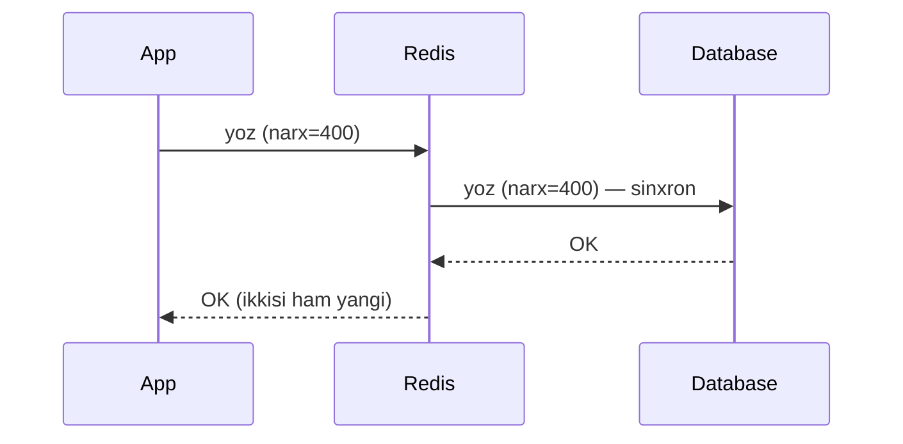
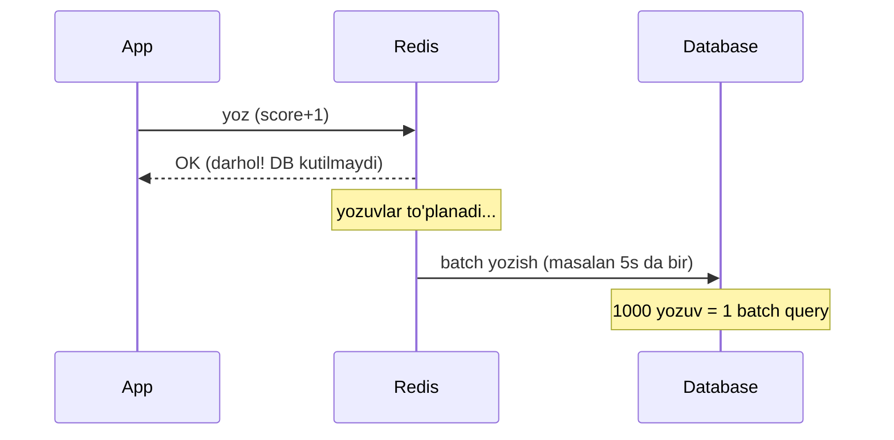
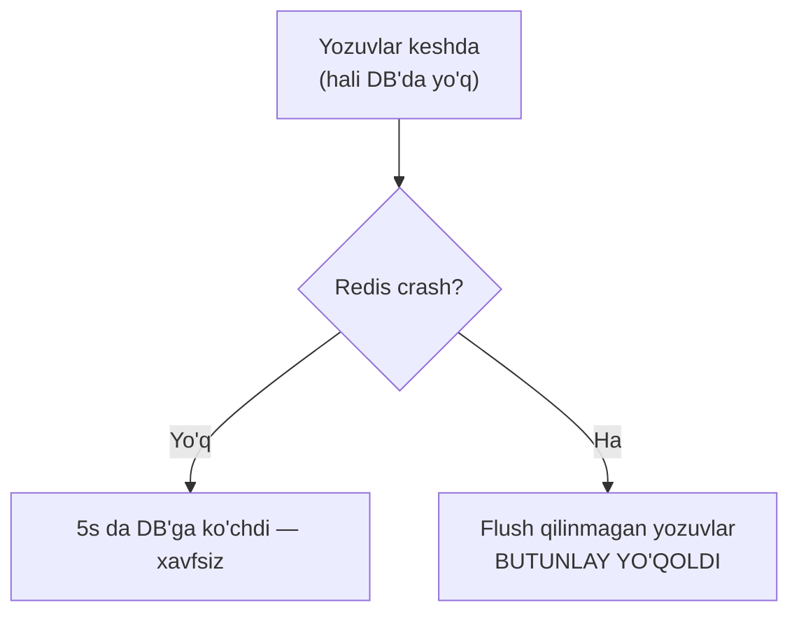
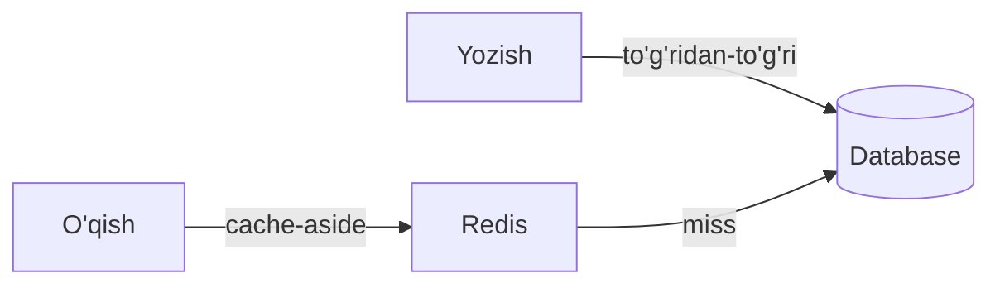
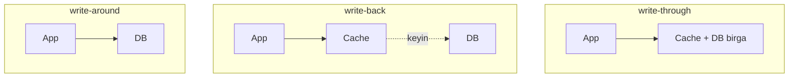
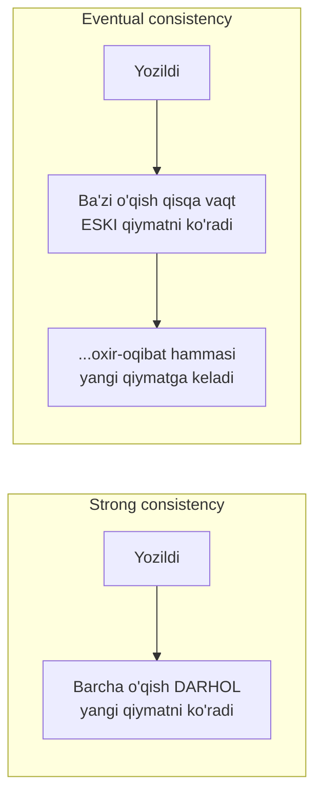
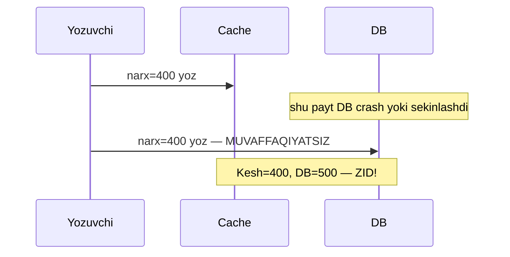
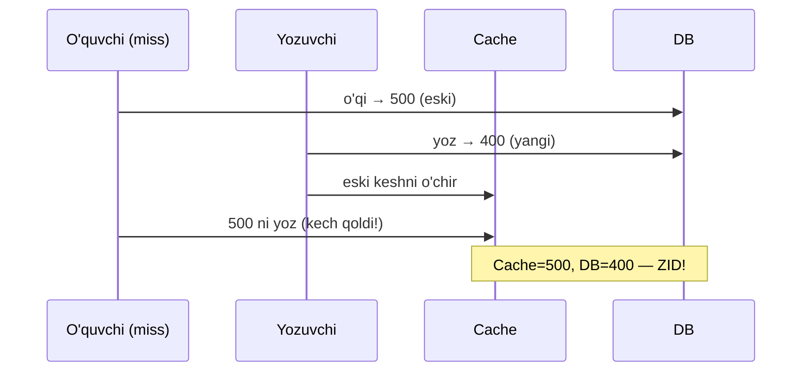

# 04.3 — Yozishni kechiktirish va eventual consistency

> **Modul 4 — Keshlash (Caching), 3-dars**
> Oldingi bilim: 1-darsda o'qish strategiyalari (cache-aside, read-through), 2-darsda staleness, TTL va invalidation. Endi teskari yo'nalishga qaraymiz: ma'lumot **yozilganda** kesh va DB qanday sinxronlanadi.

---

## 1. Muammo — yozganda ikkita joyni qanday yangilaymiz?

Shu paytgacha asosan **o'qishni** tezlashtirdik. Lekin foydalanuvchi mahsulot narxini o'zgartirsa — bu **yozish**. Endi ikkita nusxa bor: **kesh** (Redis) va **asosiy manba** (DB). Yozganda ikkalasini ham yangilash kerak, aks holda ular bir-biriga zid bo'lib qoladi.

Uch savol tug'iladi:
1. Avval qaysi biriga yozamiz — keshgami, DB'gami?
2. Ikkalasiga sinxron (birga) yozamizmi yoki keshga yozib, DB'ni keyinroq yangilaymizmi?
3. Yozish tugagach, foydalanuvchi darhol yangi qiymatni ko'radimi?

Bu savollarga uch xil **yozish strategiyasi** javob beradi: **write-through**, **write-back (write-behind)** va **write-around**.

> **Oltin qoida:** Yozish strategiyasi — bu "tezlik" bilan "ishonchlilik" o'rtasidagi savdo. Tez yozish uchun DB'ni kechiktirasan, lekin kesh o'chsa ma'lumot yo'qolish xavfi tug'iladi.

### Analogiya — daftar va rasmiy jurnal

Buxgalter ishlayapsan:
- **Write-through**: har yozuvni **bir vaqtda** ham qoralama daftarga (kesh), ham rasmiy jurnalga (DB) yozasan. Sekin, lekin ikkalasi doim mos.
- **Write-back**: tez ishlash uchun faqat qoralama daftarga yozasan, kun oxirida hammasini jurnalga ko'chirasan. Tez, lekin kun oxiriga yetmay daftar yo'qolsa — yozuvlar yo'qoladi.
- **Write-around**: yozuvni to'g'ridan-to'g'ri rasmiy jurnalga yozasan, qoralamaga tegmaysan. Keyin o'qiganda kerak bo'lsa qoralamaga ko'chirasan.

---

## 2. Write-through — ikkalasiga birga yoz

**Muammo:** ma'lumot doim yangi bo'lishi shart (masalan bank balansi). **Yechim:** har yozishda **avval keshga, keyin sinxron DB'ga** yoz. Ikkalasi bir tranzaksiyada yangilanadi — foydalanuvchi javob olganda ikkala joyda ham yangi qiymat turadi.



```go
func UpdatePriceWriteThrough(ctx context.Context, id string, price float64) error {
    // --- 1-qadam: asosiy manbaga (DB) yozamiz — haqiqat shu yerda ---
    if err := db.UpdatePrice(ctx, id, price); err != nil {
        return err
    }
    // --- 2-qadam: keshni ham darhol yangilaymiz (sinxron) ---
    data, _ := json.Marshal(Product{ID: id, Price: price})
    return rdb.Set(ctx, "product:"+id, data, 10*time.Minute).Err()
}
```

- **Afzalligi:** kesh va DB doim mos, keyingi o'qish darhol yangi qiymatni oladi (hit).
- **Kamchiligi:** yozish sekin — ikki marta yozamiz; kam o'qiladigan ma'lumot uchun kesh behuda to'ladi.

Notional machine: `db.UpdatePrice` diskka yozadi (fsync, sekin), keyin `rdb.Set` Redis RAM'iga yozadi (tez). Foydalanuvchi `OK` olganda ikkala nusxa ham yangilangan — hech qanday "oraliq eskirish oynasi" yo'q.

---

## 3. Write-back (write-behind) — keshga yoz, DB'ni keyinroq

**Muammo:** sekundiga 100 000 yozish (masalan o'yin skorlari, metrikalar). Har birini darhol DB'ga yozsak — DB ko'tarolmaydi. **Yechim:** faqat **keshga** yoz, foydalanuvchiga darhol `OK` de, DB'ni esa **keyinroq** (batch qilib, fon rejimida) yangila.



```go
// --- 1-qadam: yozuv faqat keshga tushadi, foydalanuvchi kutmaydi ---
func IncrScore(ctx context.Context, player string) error {
    return rdb.Incr(ctx, "score:"+player).Err() // tez, DB'ga tegmaydi
}

// --- 2-qadam: fon goroutine har 5s da keshdan DB'ga ko'chiradi ---
func flusher(ctx context.Context) {
    ticker := time.NewTicker(5 * time.Second)
    for range ticker.C {
        dirty := collectDirtyKeys(ctx)     // o'zgargan kalitlar
        db.BatchUpsertScores(ctx, dirty)   // bitta katta yozish
    }
}
```

- **Afzalligi:** yozish juda tez; DB yuki keskin kamayadi (1000 yozuv = 1 batch).
- **Kamchiligi:** **ma'lumot yo'qolish xavfi**.

### Write-back xavfi — kesh o'chsa ma'lumot yo'qoladi

Bu eng muhim ogohlantirish. Yozuvlar hali DB'ga ko'chirilmagan holda **faqat kesh RAM'ida** turadi. Agar Redis qulasa (server o'chdi, crash), o'sha "flush qilinmagan" yozuvlar **butunlay yo'qoladi** — DB'da ular hech qachon paydo bo'lmagan.



> **Oltin qoida:** Write-back'ni faqat **yo'qolishi mumkin bo'lgan** ma'lumot uchun ishlat (metrikalar, o'yin skori, view count). Bank pulini, buyurtmani **hech qachon** write-back qilma.

---

## 4. Write-around — DB'ga yoz, keshni chetlab o't

**Muammo:** ba'zi ma'lumot **bir marta yoziladi, kam o'qiladi** (masalan log, tarix yozuvlari). Uni yozganda keshga qo'ysak — kesh hech kim o'qimaydigan ma'lumot bilan to'ladi (**cache pollution**). **Yechim:** yozishni **to'g'ridan-to'g'ri DB'ga** qil, keshga tegma. O'qish esa 1-darsdagi oddiy cache-aside bilan ishlaydi — kerak bo'lsa o'shanda keshga tushadi.



```go
func WriteLog(ctx context.Context, entry LogEntry) error {
    // --- Yozishni to'g'ridan-to'g'ri DB'ga — keshga qo'ymaymiz ---
    return db.InsertLog(ctx, entry) // kesh ifloslanmaydi
}
```

- **Afzalligi:** kam o'qiladigan ma'lumot keshni to'ldirib bermaydi (yaxshi hit rate saqlanadi).
- **Kamchiligi:** yangi yozilgan ma'lumotni **darhol** o'qisang — miss bo'ladi (keshda yo'q, DB'dan olinadi).

### Uch strategiyani taqqoslash



| | write-through | write-back | write-around |
|--|---------------|------------|--------------|
| Yozish tezligi | Sekin | Eng tez | O'rtacha |
| DB yuki | Yuqori | Past (batch) | O'rtacha |
| Ma'lumot yo'qolish xavfi | Yo'q | **Bor** (kesh o'chsa) | Yo'q |
| Kesh yangiligi | Doim yangi | Doim yangi | Yangi yozuv keshda yo'q |
| Mos ma'lumot | Bank, buyurtma | Metrika, skor, log count | Log, arxiv, kam o'qiladigan |

### 🤔 O'ylab ko'r (PRIMM predict)

Write-back tizimida yozuvlar har 5s da flush bo'ladi. Redis 4-soniyada crash bo'ldi. Nima yo'qoladi?

<details>
<summary>💡 Javobni ko'rish</summary>

Oxirgi flush'dan keyingi **barcha yozuvlar** (0-4 soniyada kelganlar) yo'qoladi, chunki ular faqat Redis RAM'ida edi va hali DB'ga ko'chirilmagan. Xavfni kamaytirish uchun flush oralig'ini qisqartirish (masalan 1s) yoki Redis persistence (AOF/RDB) yoqish kerak — lekin baribir 0 xavf kafolatlanmaydi. Shuning uchun muhim ma'lumot write-back qilinmaydi.
</details>

### ⚠️ Ko'p uchraydigan xato

**Buyurtma/to'lovni write-back bilan yozish** — halokatli. Foydalanuvchi "buyurtma qabul qilindi" javobini oladi, lekin Redis crash bo'lsa buyurtma DB'ga hech qachon yozilmaydi — mijoz to'lagan, tovar yo'q. Pul va biznes-muhim yozuvlar doim write-through (yoki to'g'ridan-to'g'ri DB).

---

## 5. Eventual consistency vs strong consistency

**Muammo:** yuqoridagi strategiyalarda "kesh va DB qachon mos bo'ladi?" degan savol paydo bo'ldi. Bu **consistency** (muvofiqlik) modeliga olib keladi — 2-modulda CAP teoremasida uchratgan tushuncha, endi kesh kontekstida.

Ikki model bor:



- **Strong consistency** (kuchli muvofiqlik): yozish tugagach, **har qanday** keyingi o'qish **darhol** yangi qiymatni ko'radi. Kafolatli, lekin sekinroq va qimmatroq.
- **Eventual consistency** (oxir-oqibat muvofiqlik): yozgandan keyin qisqa vaqt (masalan TTL yoki replication lag davomida) ba'zi o'qishlar **eski** qiymatni ko'rishi mumkin, lekin **oxir-oqibat** hammasi yangi qiymatga keladi.

| | Strong | Eventual |
|--|--------|----------|
| Yozgandan keyin o'qish | Doim yangi | Vaqtincha eski bo'lishi mumkin |
| Tezlik / kengayish | Pastroq | Yuqoriroq |
| Murakkablik | Yuqori | Past |
| Mos misol | Bank balansi | Like soni, follower count, feed |

> **Oltin qoida:** Kesh ishlatish, tabiatan, ko'pincha **eventual consistency**ga rozilikdir. TTL 60s = "ma'lumot 60 soniyagacha eski bo'lishi mumkin" — bu aynan eventual consistency. Savol "eskirish bo'ladimi?" emas, "qancha eskirish maqbul?".

Amaliy misol: Instagram'da like bosasan — soningni darhol ko'rasan (o'zingga strong), lekin do'sting bir necha soniyadan keyin ko'radi (unga eventual). Bu ataylab tanlangan — milliardlab like'ni strong consistency bilan tarqatish juda qimmat.

---

## 6. Kesh va DB nomuvofiqligi — stsenariylar va yechimlar

**Muammo:** invalidation'ni (2-dars) noto'g'ri tartibda qilsak, kesh va DB **doimiy** zid bo'lib qolishi mumkin — TTL'gacha tuzalmaydi. Ikki klassik stsenariyni ko'ramiz.

### Stsenariy A — noto'g'ri tartib: avval keshga, keyin DB'ga



Muammo: keshga yozdik, lekin DB yozish muvaffaqiyatsiz bo'ldi. Endi kesh=400, DB=500 — TTL tugaguncha noto'g'ri. **Yechim:** avval DB'ga yoz (haqiqat DB'da), keyin keshni yangila/o'chir.

### Stsenariy B — poyga (race): eski o'qish yangi yozuvni bosib yozadi

Bu cache-aside'ning mashhur race condition'i:



O'quvchi eski 500 ni DB'dan olib, sekin qolib, yozuvchidan **keyin** keshga yozib qo'ydi. Endi kesh eski 500 ni saqlaydi.

**Yechimlar:**

1. **Cache-aside + invalidation (delete, update emas):** yozishda keshni **yangilamang**, **o'chiring** (`Del`). Keyingi o'qish miss bo'lib DB'dan yangisini oladi. O'chirish yozishdan keyin bo'lgani uchun eski qiymat qolib ketmaydi (ko'pchilik holatni hal qiladi).

```go
func UpdatePrice(ctx context.Context, id string, price float64) error {
    if err := db.UpdatePrice(ctx, id, price); err != nil { // 1-qadam: avval DB
        return err
    }
    return rdb.Del(ctx, "product:"+id).Err() // 2-qadam: keshni O'CHIR (yangilama)
}
```

2. **Delete-after-write kechikish (delayed double delete):** yozgach keshni o'chir, so'ng qisqa kechikishdan (masalan 500ms) keyin **yana bir marta** o'chir — race'da kech qolgan eski yozuvni ham tozalash uchun.

3. **Qisqa TTL — himoya to'ri:** har ehtimolga qarshi TTL qo'y. Race sodir bo'lsa ham, ma'lumot eng ko'p TTL davomida zid qoladi, keyin avtomatik tuzaladi.

### ⚠️ Ko'p uchraydigan xato

**Yozishda keshni `Set` (yangilash) qilish** cache-aside'da race'ga ochiq. `Set` — konkret qiymat yozadi, eski o'qish poygada uni bosib o'tishi mumkin. `Del` esa "keshda yo'q" holatiga o'tkazadi — keyingi o'qish majburan DB'dan (haqiqatdan) oladi. Cache-aside'da **update emas, invalidate (delete)** ishlat.

---

## Xulosa

- Yozganda kesh va DB ikkalasini yangilash kerak; uchta strategiya: **write-through**, **write-back**, **write-around**.
- **Write-through** — ikkalasiga birga yoz: doim mos, lekin sekin (bank, buyurtma).
- **Write-back** — keshga yoz, DB'ni keyin: eng tez, lekin **kesh o'chsa ma'lumot yo'qoladi** (faqat metrika/skor uchun).
- **Write-around** — DB'ga yoz, keshni chetla: kam o'qiladigan ma'lumot keshni ifloslantirmaydi (log, arxiv).
- **Strong consistency** = doim yangi; **eventual consistency** = vaqtincha eski, oxir-oqibat mos. Kesh ishlatish ko'pincha eventual consistency'ga rozilik.
- Nomuvofiqlikning oldini olish: **avval DB'ga yoz**, keyin keshni **o'chir** (`Set` emas `Del`); qo'shimcha himoya — qisqa TTL.

## 🧠 Eslab qol

- Write-through = ishonchli lekin sekin; write-back = tez lekin xavfli; write-around = keshni toza tutadi.
- Write-back'da flush qilinmagan yozuv Redis crash'da yo'qoladi — pul uchun ishlatma.
- Kesh = ko'pincha eventual consistency; savol "eskirish bormi?" emas, "qancha maqbul?".
- Invalidation tartibi: avval DB, keyin kesh.
- Cache-aside'da yozishda `Del` ishlat, `Set` emas — race'dan himoya.

## ✅ O'z-o'zini tekshir (retrieval practice)

1. Write-through va write-back o'rtasidagi asosiy tavakkalchilik farqi nima?
<details>
<summary>Javob</summary>
Write-through DB'ga sinxron yozadi — kesh o'chsa ham ma'lumot DB'da xavfsiz. Write-back esa avval faqat keshga yozadi; flush'gacha kesh crash bo'lsa, o'sha yozuvlar **butunlay yo'qoladi**. Ya'ni write-back tezlik uchun ma'lumot xavfsizligini qurbon qiladi.
</details>

2. Nega buyurtma/to'lovni write-back bilan yozish xavfli?
<details>
<summary>Javob</summary>
Foydalanuvchi "muvaffaqiyatli" javobini oladi, lekin yozuv hali faqat keshda. Redis crash bo'lsa buyurtma DB'ga umuman yetib bormaydi — mijoz to'lagan, tizimda buyurtma yo'q. Pul yo'qoladi.
</details>

3. Eventual consistency nima va kesh bilan qanday bog'liq?
<details>
<summary>Javob</summary>
Yozgandan keyin ba'zi o'qishlar qisqa vaqt eski qiymatni ko'radi, lekin oxir-oqibat hammasi yangilanadi. TTL bilan keshlash aynan shu — TTL davomida eski nusxa qaytariladi, keyin yangilanadi. Kesh tabiatan eventual consistency keltiradi.
</details>

4. Cache-aside'da yozishda nega `Del` `Set`dan xavfsizroq?
<details>
<summary>Javob</summary>
`Set` konkret qiymat yozadi — poygada eski o'qish uni bosib o'tib, eski qiymatni keshda qoldirishi mumkin. `Del` esa keshni "bo'sh" qiladi; keyingi o'qish majburan DB'dan (haqiqatdan) yangisini oladi, shuning uchun eski qiymat yopishib qolmaydi.
</details>

5. Yozish tartibi "avval kesh, keyin DB" bo'lsa qanday nomuvofiqlik yuzaga keladi?
<details>
<summary>Javob</summary>
Keshga yozib, DB yozish muvaffaqiyatsiz bo'lsa — kesh yangi, DB eski qoladi va TTL tugaguncha zid bo'ladi. To'g'risi: avval DB (haqiqat), keyin kesh — DB muvaffaqiyatsiz bo'lsa keshga umuman tegilmaydi.
</details>

## 🛠 Amaliyot

**1. Oson (savol/diagramma).** Uch yozish strategiyasi uchun bittadan real misol tanla (write-through, write-back, write-around) va nega mos kelishini bir jumlada yoz.
<details>
<summary>Ipucha</summary>
Write-through: hisob balansi (yo'qotib bo'lmaydi). Write-back: video view count (bittasi yo'qolsa muhim emas, juda ko'p yozish). Write-around: audit log (yoziladi, kam o'qiladi).
</details>

**2. O'rta (kamchilik top).** Quyidagi update kodida nomuvofiqlik xavfi bor, top:
```go
func UpdatePrice(ctx context.Context, id string, price float64) error {
    data, _ := json.Marshal(Product{ID: id, Price: price})
    rdb.Set(ctx, "product:"+id, data, time.Hour) // avval kesh
    return db.UpdatePrice(ctx, id, price)         // keyin DB
}
```
<details>
<summary>Ipucha</summary>
Ikki muammo: (1) tartib teskari — avval kesh yangilanyapti; DB yozish xato qaytarsa kesh=yangi, DB=eski (1 soat zid). (2) Cache-aside'da `Set` o'rniga `Del` xavfsizroq. To'g'risi: avval `db.UpdatePrice`, xato bo'lmasa `rdb.Del(key)`.
</details>

**3. Qiyin (kichik dizayn).** "Video ko'rishlar soni" (view count) tizimini loyihala: sekundiga 500 000 increment, aniqlik ±1% maqbul, lekin son oxir-oqibat DB'da to'g'ri bo'lishi kerak. Qaysi yozish strategiyasi, flush oralig'i, crash himoyasi?
<details>
<summary>Ipucha</summary>
Write-back ideal: Redis `INCR` (tez), fon flusher har 5-10s da DB'ga batch upsert. ±1% xato maqbul bo'lgani uchun crash'da kichik yo'qotish qabul qilinadi. Xavfni kamaytirish: qisqa flush oralig'i + Redis AOF persistence. View count strong consistency talab qilmaydi — eventual yetarli.
</details>

## 🔁 Takrorlash

**Bog'liq oldingi mavzular:**
- [`01-oqish-strategiyalari.md`](01-oqish-strategiyalari.md) — cache-aside o'qish; bu darsda uning yozish tomonini yopdik.
- [`02-malumot-eskirishi-etag-ttl-jitter.md`](02-malumot-eskirishi-etag-ttl-jitter.md) — invalidation va TTL; nomuvofiqlik yechimlari shu yerga tayanadi.
- [`../2-kengayish-usullari/04-cdn.md`](../2-kengayish-usullari/04-cdn.md) — CDN invalidation ham xuddi shu "avval origin, keyin edge" tartibiga amal qiladi.
- [`../3-malumotlar-ombori/`](../3-malumotlar-ombori/) — CAP teoremasi va replication: strong vs eventual consistency shu yerdan keladi.

**Takrorlash jadvali:**
- **Ertaga:** "O'z-o'zini tekshir" 1 va 4-savollarga qaytib javob ber.
- **3 kundan keyin:** uch yozish strategiyasi jadvalini xotiradan qayta tuz.
- **1 haftadan keyin:** Stsenariy B (race condition)ni xotiradan sequence diagramma qilib chiz.

**Feynman testi:** Kod so'zlarisiz bir do'stingga 3 jumlada tushuntir: (1) write-through va write-back farqi, (2) write-back nega ma'lumot yo'qotishi mumkin, (3) eventual consistency nima.

---

**Modul yakuni:** Uch dars bilan keshlashning o'qish, eskirish va yozish tomonlarini yopdik. Keyingi modul: API dizayn (REST/gRPC/GraphQL) va rate limiting — u yerda ham Redis kesh sifatida qaytadi.
