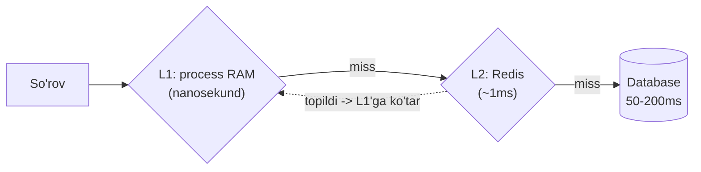
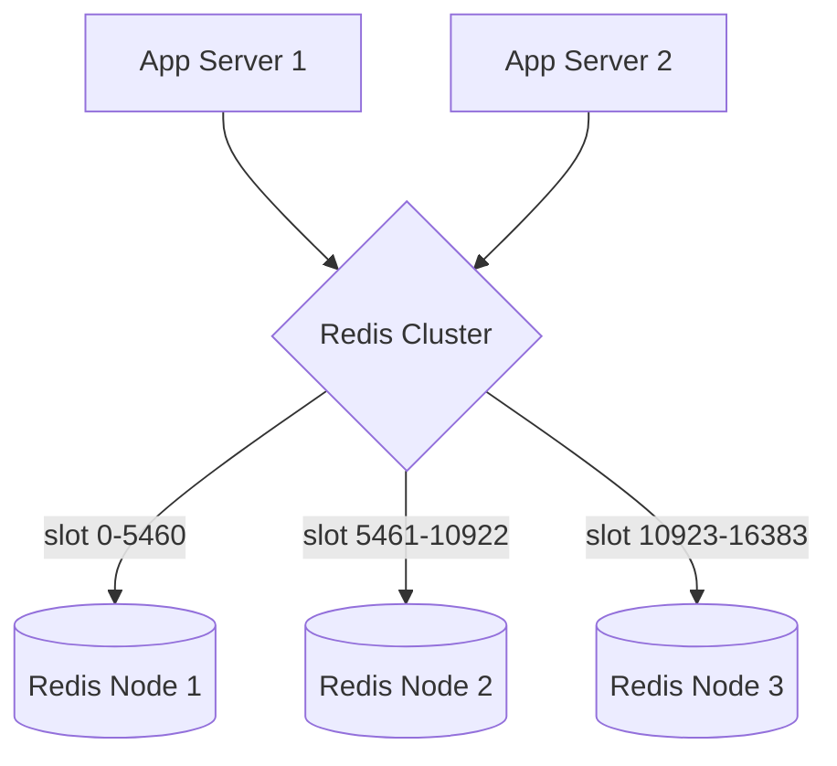
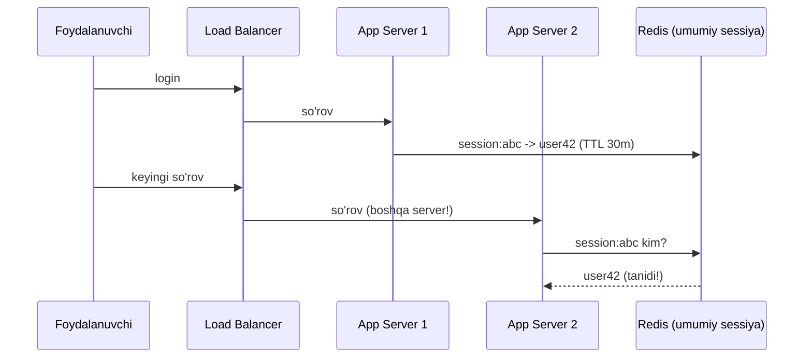
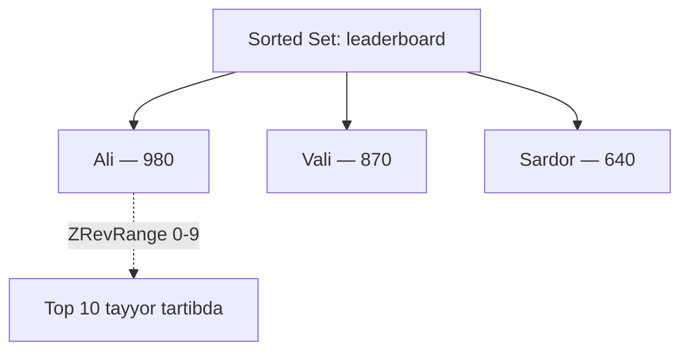

# 04.4 — Kesh amaliyotda: Redis pattern'lari

> **Modul 4 — Keshlash (Caching), 4-dars**
> Oldingi bilim: 1-darsda o'qish strategiyalari va eviction, 2-darsda TTL/staleness/stampede, 3-darsda yozish strategiyalari. Bu dars — o'sha g'oyalarni **Redis bilan amalda** qo'llash: ma'lumot turlari, ko'p qatlamli kesh, distributed cache, sessiya va leaderboard.

---

## 1. Muammo — nazariyani asbobga ulash

Uch dars davomida kesh **strategiyalarini** o'rgandik: cache-aside, TTL, write-through va h.k.
Lekin savol qoladi: buni **amalda** nima bilan quramiz? Ko'p tizimda javob bitta — **Redis**.

Redis'ni faqat "tez kalit -> qiymat quti" deb bilish — yarim bilim. Aslida Redis bir necha
**ma'lumot turi** (data type) beradi va har biri ma'lum kesh vazifasini deyarli tekin hal qiladi:
leaderboard, sessiya, hisoblagich, navbat. To'g'ri turni tanlash — kodning yarmini yozdirmaydi.

> **Oltin qoida:** Redis'da "qanday saqlayman?" degan savol ko'pincha "qaysi **ma'lumot turini**
> ishlataman?" degan savolga aylanadi. To'g'ri tur — tayyor yechim.

### Analogiya — oshxona asboblari

Redis — pichoq emas, butun **asboblar to'plami**. String — oddiy qoshiq (hamma joyda), Hash —
bo'limli laganda (bitta obyekt maydonlari), Sorted Set — o'lchov tarozisi (ballar bo'yicha tartib).
Bitta pichoq bilan hammasini qilsang bo'ladi, lekin to'g'ri asbob ishni bir necha barobar osonlashtiradi.

---

## 2. Redis ma'lumot turlari va asosiy operatsiyalar (Go)

Har tur — o'z vazifasi uchun. Quyida eng ko'p ishlatiladigan beshtasi va ikkita yordamchi amal:

| Tur | Nima saqlaydi | Odatiy kesh vazifasi |
|-----|---------------|----------------------|
| **String** | oddiy kalit -> qiymat | keshlangan JSON, sessiya, feature flag |
| **Hash** | bitta obyekt maydonlari | user profili (bir kalitda ko'p maydon) |
| **List** | tartibli ketma-ketlik | navbat, oxirgi N element (feed) |
| **Set** | takrorlanmas to'plam | teglar, unikal tashrif buyurganlar |
| **Sorted Set** | ball bo'yicha tartiblangan | leaderboard, "top N" |

```go
// --- String: oddiy kalit -> qiymat (kesh, sessiya) ---
rdb.Set(ctx, "user:42:name", "Ali", time.Hour)

// --- Hash: bitta obyektning maydonlari bir kalitda ---
rdb.HSet(ctx, "user:42", "name", "Ali", "age", 25)

// --- List: navbat yoki oxirgi N element (feed) ---
rdb.LPush(ctx, "feed:42", "post1", "post2")

// --- Set: takrorlanmas to'plam (teglar, unikal tashrif) ---
rdb.SAdd(ctx, "tags:post1", "go", "redis")

// --- Sorted Set: ball bo'yicha tartiblangan (leaderboard) ---
rdb.ZAdd(ctx, "leaderboard", redis.Z{Score: 100, Member: "Ali"})

// --- INCR: atomik hisoblagich (view count) ---
rdb.Incr(ctx, "views:post1")

// --- EXPIRE: kalitga TTL berish (2-darsdagi staleness nazorati) ---
rdb.Expire(ctx, "user:42", 10*time.Minute)
```

Amalda struct'ni keshlaganda ko'pincha uni JSON qilib **String**da saqlaymiz. Generic yordamchi
(1 va 2-darslardagi cache-aside shu ustiga quriladi):

```go
// --- Har qanday obyektni JSON qilib TTL bilan keshlaymiz ---
func CacheSet[T any](ctx context.Context, key string, val T, ttl time.Duration) error {
    data, err := json.Marshal(val)
    if err != nil {
        return err
    }
    return rdb.Set(ctx, key, data, ttl).Err()
}

// --- Keshdan o'qib, struct'ga qaytaramiz (miss bo'lsa redis.Nil) ---
func CacheGet[T any](ctx context.Context, key string) (*T, error) {
    data, err := rdb.Get(ctx, key).Bytes()
    if err != nil {
        return nil, err // redis.Nil = topilmadi (miss)
    }
    var result T
    if err := json.Unmarshal(data, &result); err != nil {
        return nil, err
    }
    return &result, nil
}
```

**Notional machine:** `rdb.Set` tarmoq orqali Redis serveriga TCP paket yuboradi; Redis o'z RAM'idagi
hash-jadvalga kalit va baytlarni yozadi. `HSet` esa alohida String yaratmasdan, bitta kalit ostida
maydonlar mini-jadvalini saqlaydi — 10 ta maydonli user uchun 10 ta kalit emas, **bitta** kalit.

---

## 3. Multi-level cache — L1 (RAM) + L2 (Redis)

**Muammo:** Redis tez (~1ms), lekin baribir **tarmoq** orqali. Bir server o'zining RAM'ida (nanosekund)
ushlab tursa yanada tez bo'lardi. 1-darsdagi "kesh qatlamlari" g'oyasini eslaysanmi
([`01-oqish-strategiyalari.md`](01-oqish-strategiyalari.md) 5-bo'lim)? Endi uni **amalda** ikki qatlam
qilib quramiz: **L1** — process RAM (mahalliy), **L2** — Redis (umumiy).



```go
type TwoLevelCache struct {
    l1 *sync.Map      // process RAM (nanosekund, faqat shu server)
    l2 *redis.Client  // Redis (shared, ~1ms, hamma serverga umumiy)
}

func (c *TwoLevelCache) Get(ctx context.Context, key string) (string, bool) {
    // --- 1-qadam: L1 (mahalliy RAM) — eng tez ---
    if v, ok := c.l1.Load(key); ok {
        return v.(string), true
    }
    // --- 2-qadam: L2 (Redis) — umumiy kesh ---
    if v, err := c.l2.Get(ctx, key).Result(); err == nil {
        c.l1.Store(key, v)   // L1'ga ko'tarib qo'yamiz (keyingi safar tezroq)
        return v, true
    }
    // --- 3-qadam: ikkalasida yo'q — miss (chaqiruvchi DB'ga boradi) ---
    return "", false
}
```

> **Oltin qoida:** L1 — eng tez, lekin **har serverda alohida nusxa**. L2 (Redis) — sekinroq, lekin
> **hamma serverga umumiy**. Ko'p qatlam eng ko'p so'raladigan ozgina ma'lumotni process RAM'ida tutib,
> Redis yukini ham kamaytiradi.

### ⚠️ Ko'p uchraydigan xato — L1 invalidation

L1 har serverda alohida bo'lgani uchun, ma'lumot o'zgarganda **hamma server L1'ini** yangilash qiyin.
Server A L1'ini tozalasa, server B'da eski nusxa qoladi. Shuning uchun L1'ga **juda qisqa TTL** ber
(masalan 5-10s) yoki faqat kam o'zgaradigan ma'lumotni L1'da tut. Invalidation batafsil:
[`02-malumot-eskirishi-etag-ttl-jitter.md`](02-malumot-eskirishi-etag-ttl-jitter.md).

---

## 4. Distributed cache va Redis Cluster

**Muammo:** bitta Redis serverning ham RAM'i va throughput'i chekli. 100 GB kesh yoki sekundiga millionlab
so'rov bitta node'ga sig'maydi. Yechim — keshni **bir necha Redis node'ga tarqatish** (distributed cache).

Bu 3-modulda ko'rgan **sharding** g'oyasining aynan o'zi, faqat DB emas, kesh uchun. Redis buni
o'zining **cluster** rejimida qiladi.



Redis Cluster **16384 ta hash slot**ga bo'linadi: `CRC16(key) % 16384` -> slot -> shu slotga egalik
qiladigan node. Ya'ni kalitning o'zi qaysi node'da yashashini belgilaydi — bu 3-moduldagi hash sharding'ning
aynan ko'rinishi.

```go
// --- Cluster clienti bir necha node manzilini biladi, slotni o'zi hisoblaydi ---
rdb := redis.NewClusterClient(&redis.ClusterOptions{
    Addrs: []string{"redis1:6379", "redis2:6379", "redis3:6379"},
})
// Oddiy Set/Get bir xil ishlaydi — client kalitni to'g'ri node'ga yuboradi
rdb.Set(ctx, "user:42", data, time.Hour)
```

> **Bog'lanish:** node qo'shilganda/o'chganda slotlar qayta taqsimlanadi — bu 3-darsdagi
> **consistent hashing** muammosi ([`../03-malumotlar-ombori/04-replication-va-sharding.md`](../03-malumotlar-ombori/04-replication-va-sharding.md)).
> Redis slotlarni ko'chiradi, lekin faqat kerakli qismini.

### ⚠️ Ko'p uchraydigan xato — cross-slot amallar

Cluster'da bir vaqtda ko'p kalitga tegadigan amal (masalan `MGET a b c`) faqat **shu kalitlar bir slotda**
bo'lsa ishlaydi. Bog'liq kalitlarni bir node'da tutish uchun **hash tag** ishlatiladi: `{user42}:name`,
`{user42}:cart` — `{...}` ichidagi qism bo'yicha slot hisoblanadi, ikkalasi bir node'ga tushadi.

---

## 5. Session cache — sessiyani Redis'da saqlash

**Muammo:** foydalanuvchi login qilganda uni "eslab qolish" kerak. Sessiyani app server RAM'ida saqlasak —
ikkinchi so'rov boshqa serverga tushsa, u foydalanuvchini tanimaydi (2-modul: load balancer). Sessiya
**umumiy** joyda bo'lishi kerak, va u tabiatan key-value + TTL — ya'ni Redis uchun ideal.



```go
type SessionStore struct {
    rdb *redis.Client
    ttl time.Duration // masalan 30 daqiqa
}

func (s *SessionStore) Save(ctx context.Context, sid, userID string) error {
    return s.rdb.Set(ctx, "session:"+sid, userID, s.ttl).Err()
}

func (s *SessionStore) Get(ctx context.Context, sid string) (string, error) {
    return s.rdb.Get(ctx, "session:"+sid).Result() // redis.Nil = sessiya tugagan
}

func (s *SessionStore) Delete(ctx context.Context, sid string) error {
    return s.rdb.Del(ctx, "session:"+sid).Err() // logout
}
```

**Notional machine:** har app server holatsiz (stateless) qoladi — "kim login qilgan?" bilimi
serverda emas, **Redis'da**. Shuning uchun load balancer istalgan serverga yo'naltira oladi va sessiya
buzilmaydi. TTL esa "faolsizlikdan keyin avtomatik logout"ni tekin beradi.

---

## 6. Leaderboard — Redis Sorted Set

**Muammo:** o'yin yoki reyting: millionlab o'yinchi, real-time "top 10" va "mening o'rnim nechanchi?".
SQL'da har so'rovda `ORDER BY score DESC` + `count` — millionlab qatorda sekin. Redis **Sorted Set**
elementlarni ball bo'yicha **doim tartiblangan** holda saqlaydi — top N va rank amallari logarifmik tez.



```go
// --- Ball qo'yish/yangilash (bir amal, tartib avtomatik saqlanadi) ---
func UpdateScore(ctx context.Context, rdb *redis.Client, player string, score float64) {
    rdb.ZAdd(ctx, "leaderboard", redis.Z{Score: score, Member: player})
}

// --- Top 10 o'yinchi (eng yuqori balldan) ---
func Top10(ctx context.Context, rdb *redis.Client) []redis.Z {
    res, _ := rdb.ZRevRangeWithScores(ctx, "leaderboard", 0, 9).Result()
    return res
}

// --- "Mening o'rnim nechanchi?" (0-based rank -> 1-based) ---
func MyRank(ctx context.Context, rdb *redis.Client, player string) int64 {
    rank, _ := rdb.ZRevRank(ctx, "leaderboard", player).Result()
    return rank + 1
}
```

**Output:**
```
UpdateScore("Ali", 980)
Top10() -> [{Ali 980} {Vali 870} {Sardor 640} ...]
MyRank("Sardor") -> 3
```

### 🤔 O'ylab ko'r (PRIMM predict)

Bir xil o'yinchi (`Ali`) uchun `ZAdd`ni ikki marta chaqirsak — avval 500, keyin 980 ball bilan —
Sorted Set'da nechta `Ali` bo'ladi?

<details>
<summary>💡 Javobni ko'rish</summary>

**Bitta.** Sorted Set'da har `Member` **noyob**. Ikkinchi `ZAdd` yangi element qo'shmaydi —
mavjud `Ali`ning ballini 500 dan 980 ga **yangilaydi** va uni tartibda to'g'ri joyga suradi.
Aynan shuning uchun leaderboard uchun ideal: yangilash va tartiblash bitta amalda.
</details>

---

## 7. Cache poisoning va cold start

Ikkita amaliy xavf — ko'pincha production'da paydo bo'ladi.

### Cache poisoning — "zaharlangan" nusxa

**Muammo:** noto'g'ri yoki buzuq ma'lumot keshga tushib qolsa, u TTL tugaguncha **hamma** foydalanuvchiga
tarqaladi. Masalan DB xato qaytardi, biz `nil`ni yoki bo'sh natijani keshladik — endi 10 daqiqa hamma
bo'sh javob oladi.

```mermaid
flowchart TD
    A["DB xato/bo'sh qaytardi"] --> B{Keshga yozamizmi?}
    B -->|Ha (xato!)| C["10 daqiqa hamma buzuq javob oladi"]
    B -->|Yo'q (to'g'ri)| D["Faqat muvaffaqiyatli natijani keshla"]
```

> **Yechim:** keshga yozishdan oldin ma'lumotni **tekshir**; **xatoni yoki `nil`ni hech qachon keshlama** —
> faqat to'g'ri, muvaffaqiyatli natijani sakla. (Bu 1-darsdagi "DB xato qaytarsa keshga YOZMA" amaliyotining aynan o'zi.)

### Cold start — bo'sh kesh bilan qayta ishga tushish

**Muammo:** tizim qayta ishga tushdi (deploy, crash), kesh **bo'sh**. Endi hamma so'rov miss bo'lib
bir vaqtda DB'ga yuguradi — bu 2-darsdagi **cache stampede**ning bir turi
([`02-malumot-eskirishi-etag-ttl-jitter.md`](02-malumot-eskirishi-etag-ttl-jitter.md) 3-bo'lim).

```go
// --- Cache warm-up: startup'da eng mashhur ma'lumotni oldindan keshlaymiz ---
func WarmUp(ctx context.Context) error {
    top, err := db.QueryTopProducts(ctx, 100) // eng ko'p so'raladigan 100 ta
    if err != nil {
        return err
    }
    for _, p := range top {
        CacheSet(ctx, "product:"+p.ID, p, 10*time.Minute)
    }
    return nil // endi birinchi foydalanuvchilar hit oladi
}
```

> **Yechim:** **cache warm-up** — startup'da eng kerakli ma'lumotni oldindan keshga yuklash, shunda
> birinchi to'lqin DB'ni bosmaydi. Stampede himoyasi (jitter + singleflight) bilan birga ishlaydi.

---

## Xulosa

- Redis faqat "quti" emas — **ma'lumot turlari** to'plami; to'g'ri tur (String, Hash, List, Set, Sorted Set) ishni yengillashtiradi.
- **Multi-level cache**: L1 (process RAM, tez lekin har serverda alohida) + L2 (Redis, sekinroq lekin umumiy).
- **Distributed cache / Redis Cluster** — keshni node'larga tarqatadi (16384 slot, `CRC16(key)`); bu 3-modul sharding'ining aynan o'zi.
- **Session cache** — sessiyani Redis'da tutib, app serverlarni stateless qiladi; TTL avtomatik logout beradi.
- **Leaderboard** — Sorted Set ball bo'yicha doim tartibli saqlaydi; top N va rank tez.
- **Cache poisoning** — xato/`nil`ni keshlama; **cold start** — warm-up bilan bo'sh keshni to'ldir.

## 🧠 Eslab qol

- To'g'ri Redis turi = tayyor yechim (Sorted Set -> leaderboard, Hash -> obyekt).
- L1 har serverda alohida — unga qisqa TTL ber.
- Redis Cluster = kesh sharding (16384 slot); bog'liq kalitlarga hash tag `{...}`.
- Sessiyani Redis'da tut -> app server stateless.
- Xatoni hech qachon keshlama; startup'da warm-up qil.

## ✅ O'z-o'zini tekshir (retrieval practice)

1. Bir user'ning 10 ta maydonini saqlamoqchisan. 10 ta String kalit yoki bitta Hash — qaysi biri va nega?
<details>
<summary>Javob</summary>
Bitta **Hash** (`HSet user:42 name Ali age 25 ...`). Bitta kalit ostida barcha maydon turadi: kam xotira, bitta amalda o'qish/yozish, TTL ham bitta. 10 ta alohida String — 10 ta kalit, 10 ta TTL, ko'proq tarmoq amali.
</details>

2. L1 (process RAM) qatlami har serverda alohida bo'lsa, ma'lumot o'zgarganda qanday muammo tug'iladi?
<details>
<summary>Javob</summary>
Bitta server L1'ini yangilaydi/tozalaydi, lekin boshqa serverlarning L1'ida **eski nusxa** qoladi — ular hali eskirgan qiymatni beradi. Shuning uchun L1'ga juda qisqa TTL beriladi yoki faqat kam o'zgaradigan ma'lumot L1'da tutiladi.
</details>

3. Redis Cluster'da kalit qaysi node'ga tushishini nima belgilaydi va bu 3-moduldagi qaysi tushunchaga o'xshaydi?
<details>
<summary>Javob</summary>
`CRC16(key) % 16384` -> slot -> shu slotga egalik qiluvchi node. Ya'ni kalitning hash'i node'ni belgilaydi — bu 3-moduldagi **hash-based sharding**ning aynan o'zi. Node qo'shilganda/o'chganda slot ko'chirish — consistent hashing muammosi.
</details>

4. Nima uchun sessiyani app server RAM'ida emas, Redis'da saqlash kerak?
<details>
<summary>Javob</summary>
Load balancer keyingi so'rovni boshqa serverga yuborishi mumkin. Sessiya server RAM'ida bo'lsa — yangi server foydalanuvchini tanimaydi (qayta login). Redis'da bo'lsa — hamma server bir umumiy sessiyani ko'radi, app server stateless bo'ladi.
</details>

5. `ZAdd` bir xil member uchun ikki marta chaqirilsa nima bo'ladi, va nega bu leaderboard uchun qulay?
<details>
<summary>Javob</summary>
Yangi element qo'shilmaydi — mavjud member'ning **balli yangilanadi** (member noyob) va tartibda to'g'ri joyga suriladi. Shuning uchun "ballni yangilash + qayta tartiblash" bitta amalda bajariladi.
</details>

## 🛠 Amaliyot

**1. Oson (Modify).** 6-bo'limdagi leaderboard'ga `Bottom5` funksiyasini qo'sh — eng past 5 o'yinchini qaytarsin.
<details>
<summary>Ipucha</summary>
`ZRevRange` teskarisi — `ZRange(ctx, "leaderboard", 0, 4)` eng past balldan boshlab qaytaradi (Sorted Set o'sish tartibida). Yoki `ZRangeWithScores` ball bilan.
</details>

**2. O'rta (faded example).** Quyidagi in-memory L1 keshni to'ldir — miss bo'lganda Redis'dan olib L1'ga ko'tarsin:
```go
func (c *TwoLevelCache) Get(ctx context.Context, key string) (string, bool) {
    if v, ok := c.l1.Load(key); ok {
        return v.(string), true
    }
    // TODO: L2 (Redis)'dan o'qi
    // TODO: topilsa L1'ga Store qilib, qiymat va true qaytar
    // TODO: topilmasa "" va false qaytar
}
```
<details>
<summary>Ipucha</summary>
`v, err := c.l2.Get(ctx, key).Result()` -> `err == nil` bo'lsa `c.l1.Store(key, v)` va `return v, true`; aks holda `return "", false`. Diqqat: `redis.Nil` xatosi = miss.
</details>

**3. Qiyin (Make).** Sekundiga 100 000 "video ko'rildi" hodisasi keladigan view-counter tizimini loyihala:
qaysi Redis turi/amali (hint: `INCR`), DB'ga qanday ko'chiriladi (3-darsdagi qaysi yozish strategiyasi), cold start himoyasi.
<details>
<summary>Ipucha</summary>
`INCR views:videoID` (atomik, tez). DB'ga **write-back** (3-dars): fon goroutine har 5-10s da batch upsert. ±1% xato maqbul bo'lgani uchun crash'da kichik yo'qotish qabul qilinadi (Redis AOF bilan yumshatiladi). Startup'da mashhur videolar hisoblagichini warm-up bilan tikla.
</details>

## 🔁 Takrorlash

**Bog'liq oldingi mavzular:**
- [`01-oqish-strategiyalari.md`](01-oqish-strategiyalari.md) — cache-aside, hit/miss, eviction (LRU/LFU/FIFO), kesh qatlamlari.
- [`02-malumot-eskirishi-etag-ttl-jitter.md`](02-malumot-eskirishi-etag-ttl-jitter.md) — TTL, stampede va invalidation (bu darsdagi warm-up va poisoning shu yerga tayanadi).
- [`03-yozishni-kechiktirish-eventual-consistency.md`](03-yozishni-kechiktirish-eventual-consistency.md) — write-back (view-counter amaliyoti shundan).
- [`../03-malumotlar-ombori/04-replication-va-sharding.md`](../03-malumotlar-ombori/04-replication-va-sharding.md) — hash sharding va consistent hashing (Redis Cluster shunga tayanadi).

**Takrorlash jadvali:**
| Qachon | Nima qilish |
|--------|-------------|
| Ertaga | 5 ta Redis turini va har biriga bittadan vazifa ayt (xotiradan) |
| 3 kundan keyin | Leaderboard `Top10` va `MyRank` funksiyalarini kodga qaramay qayta yoz |
| 1 haftadan keyin | "O'z-o'zini tekshir" savollariga qayta javob ber; L1+L2 kesh oqimini xotiradan chiz |

**Feynman testi:** Kod so'zlarisiz bir do'stingga 3 jumlada tushuntir: (1) nega sessiyani Redis'da saqlaymiz,
(2) leaderboard uchun nega Sorted Set qulay, (3) cold start nima va warm-up uni qanday yumshatadi.

---

**Modul yakuni:** Bu dars bilan keshlashning **amaliy** tomonini — Redis turlari, ko'p qatlam, distributed cache,
sessiya va leaderboard — yopdik. Keyingi modul: API dizayn (REST/gRPC/GraphQL) va rate limiting — u yerda Redis
`INCR` yana qaytadi.
