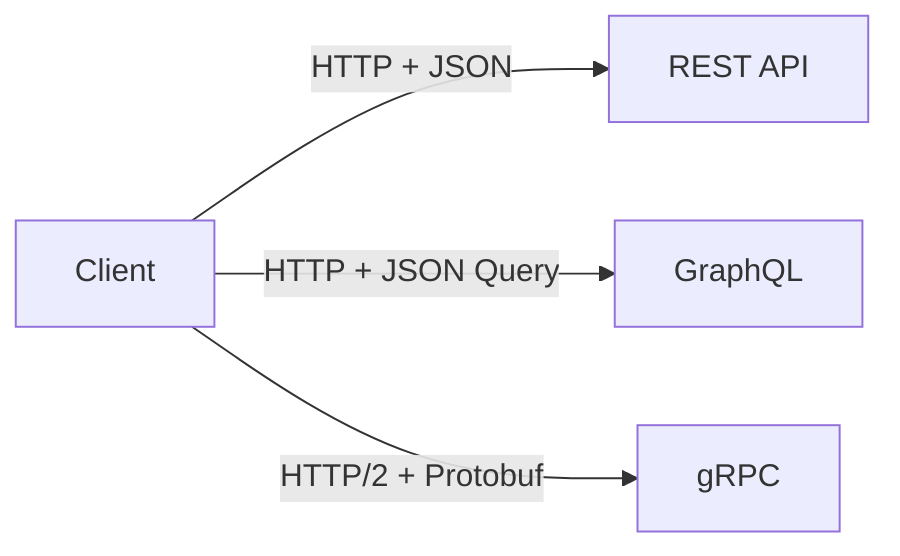
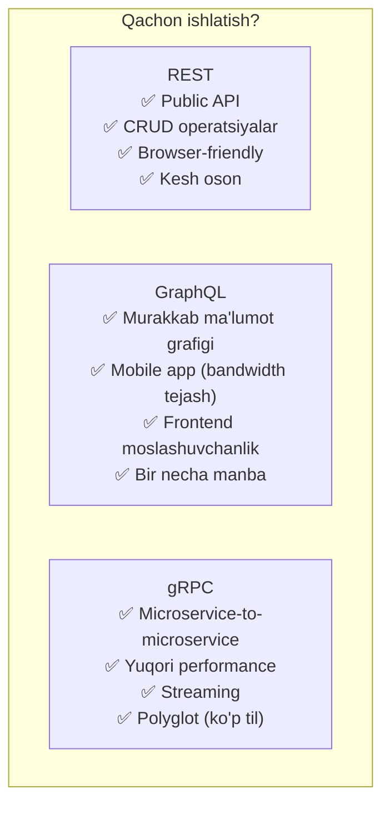
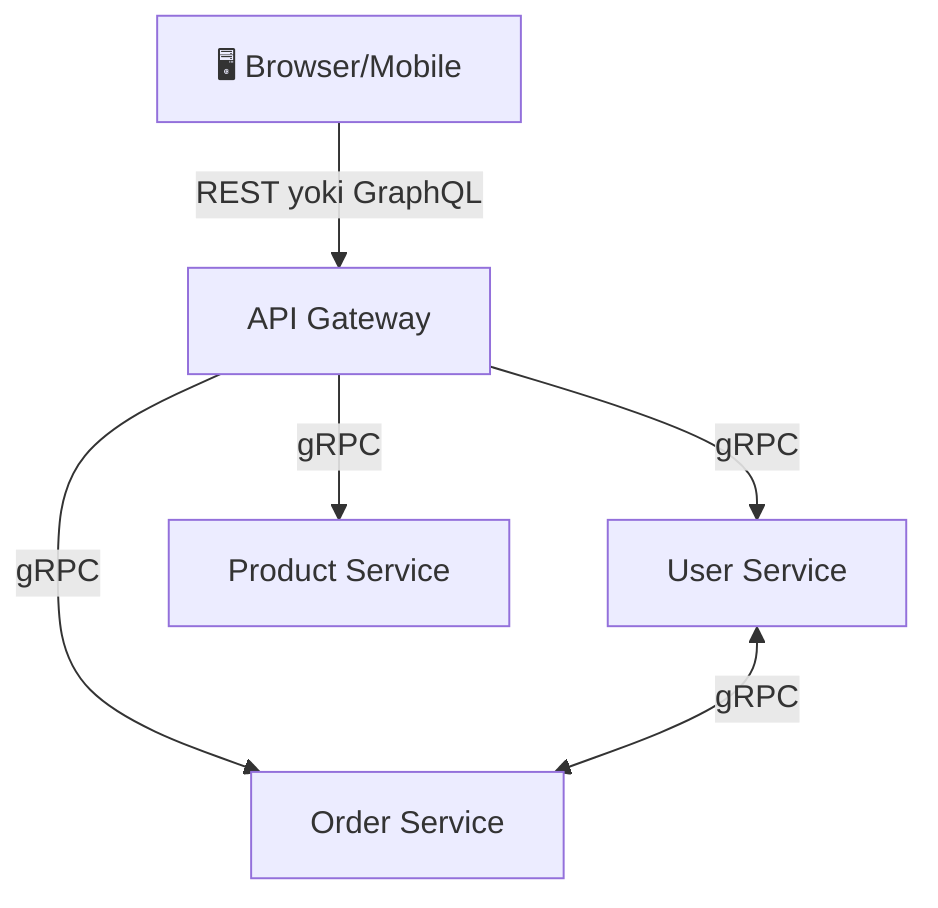

# REST vs GraphQL vs gRPC

## Umumiy Ko'rinish



---

## REST (Representational State Transfer)

### Asosiy Tamoyillar
- **Resource** asosida (`/users`, `/orders`)
- **HTTP metodlari**: GET, POST, PUT, DELETE, PATCH
- **Stateless**: Har so'rov mustaqil
- **JSON** format (asosan)

```
GET    /users          → barcha foydalanuvchilar
GET    /users/123      → bitta foydalanuvchi
POST   /users          → yangi foydalanuvchi
PUT    /users/123      → to'liq yangilash
PATCH  /users/123      → qisman yangilash
DELETE /users/123      → o'chirish
```

### Go'da REST

```go
package main

import (
    "encoding/json"
    "net/http"

    "github.com/go-chi/chi/v5"
)

type User struct {
    ID    int    `json:"id"`
    Name  string `json:"name"`
    Email string `json:"email"`
}

func main() {
    r := chi.NewRouter()

    r.Get("/users/{id}", func(w http.ResponseWriter, r *http.Request) {
        id := chi.URLParam(r, "id")
        user := User{ID: 1, Name: "Ali", Email: "ali@example.com"}
        _ = id
        w.Header().Set("Content-Type", "application/json")
        json.NewEncoder(w).Encode(user)
    })

    http.ListenAndServe(":8080", r)
}
```

### Muammolar
```
Over-fetching: Faqat name kerak, lekin butun user obekt keladi
Under-fetching: User + uning orderlari → 2 ta so'rov kerak
```

---

## GraphQL

Mijoz **aynan qancha ma'lumot** kerakligini belgilaydi.

### So'rov Misoli
```graphql
query {
  user(id: "123") {
    name
    email
    orders {
      id
      amount
    }
  }
}
```

```json
{
  "data": {
    "user": {
      "name": "Ali",
      "email": "ali@example.com",
      "orders": [
        { "id": 1, "amount": 50000 }
      ]
    }
  }
}
```

### Go'da GraphQL (gqlgen)

```go
// schema.graphqls
type Query {
    user(id: ID!): User
}

type User {
    id: ID!
    name: String!
    email: String!
    orders: [Order!]!
}

type Order {
    id: ID!
    amount: Float!
}
```

```go
// resolver.go
func (r *queryResolver) User(ctx context.Context, id string) (*model.User, error) {
    return &model.User{
        ID:    id,
        Name:  "Ali",
        Email: "ali@example.com",
    }, nil
}
```

### Afzalliklari
- Over/Under-fetching yo'q
- Bitta endpoint
- Kuchli typing
- Real-time (subscriptions)

### Kamchiliklari
- Murakkab kesh (URL asosida emas)
- N+1 muammo (DataLoader kerak)
- Yuqori complexity

---

## gRPC (Google Remote Procedure Call)

**Protocol Buffers** (protobuf) bilan binary format, HTTP/2.

### Protobuf Ta'rif

```protobuf
// user.proto
syntax = "proto3";
package user;
option go_package = "./proto";

service UserService {
    rpc GetUser (GetUserRequest) returns (User);
    rpc ListUsers (ListUsersRequest) returns (stream User);
}

message GetUserRequest {
    string id = 1;
}

message User {
    string id = 1;
    string name = 2;
    string email = 3;
}

message ListUsersRequest {}
```

### Go'da gRPC Server

```go
package main

import (
    "context"
    "net"

    pb "myapp/proto"
    "google.golang.org/grpc"
)

type server struct {
    pb.UnimplementedUserServiceServer
}

func (s *server) GetUser(ctx context.Context, req *pb.GetUserRequest) (*pb.User, error) {
    return &pb.User{
        Id:    req.Id,
        Name:  "Ali",
        Email: "ali@example.com",
    }, nil
}

func main() {
    lis, _ := net.Listen("tcp", ":50051")
    s := grpc.NewServer()
    pb.RegisterUserServiceServer(s, &server{})
    s.Serve(lis)
}
```

### Streaming

```go
// Server-side streaming
func (s *server) ListUsers(req *pb.ListUsersRequest, stream pb.UserService_ListUsersServer) error {
    users := []pb.User{
        {Id: "1", Name: "Ali"},
        {Id: "2", Name: "Vali"},
    }
    for _, u := range users {
        stream.Send(&u)
    }
    return nil
}
```

---

## Taqqoslash



| | REST | GraphQL | gRPC |
|--|------|---------|------|
| **Format** | JSON | JSON | Binary (Protobuf) |
| **Protokol** | HTTP/1.1 | HTTP/1.1 | HTTP/2 |
| **Performance** | O'rtacha | O'rtacha | Yuqori (3-10x) |
| **Kesh** | Oson (URL) | Qiyin | Qiyin |
| **Browser** | ✅ | ✅ | ❌ (grpc-web kerak) |
| **Streaming** | ❌ (WebSocket kerak) | ✅ | ✅ |
| **Type safety** | ❌ | ✅ | ✅ |
| **Learning curve** | Past | O'rta | Yuqori |

---

## Arxitektura Tavsiyasi



---

## Keyingi Qadam

→ [2. Rate Limiting va API Gateway.md](2.%20Rate%20Limiting%20va%20API%20Gateway.md)
