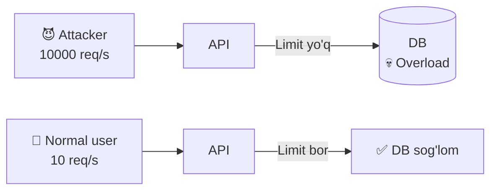
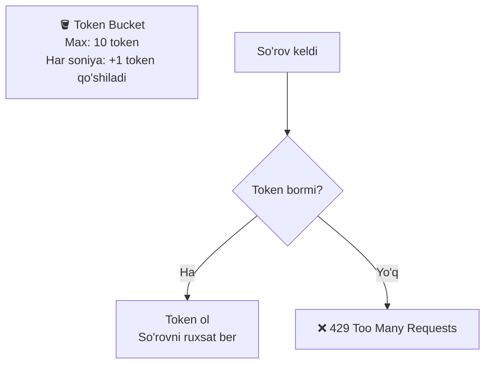
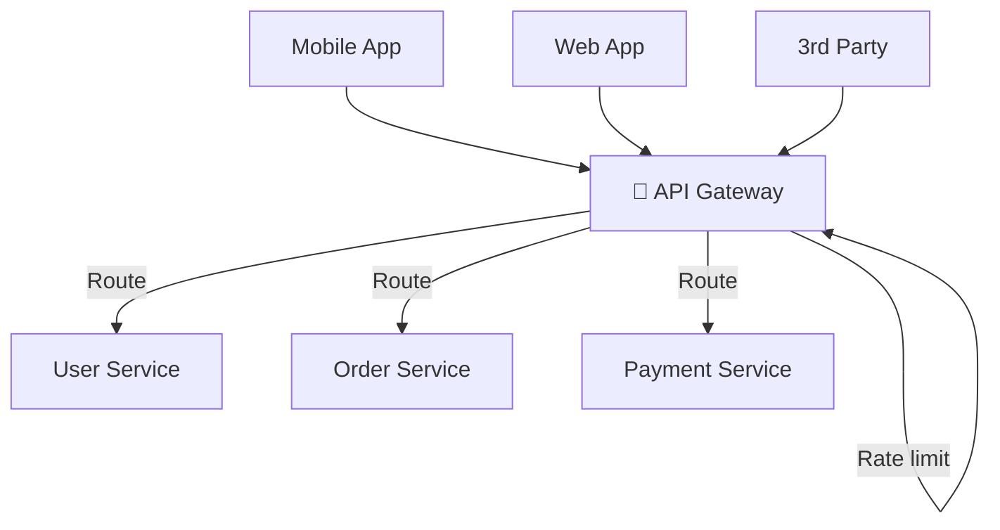
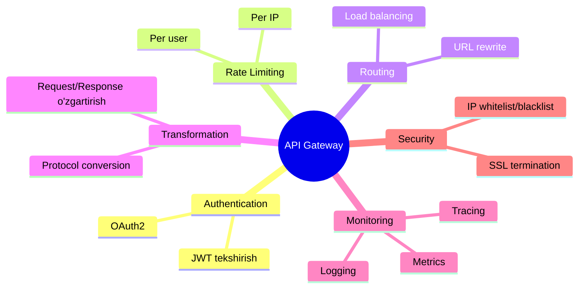

# Rate Limiting va API Gateway

## Rate Limiting

**Rate Limiting** — foydalanuvchining ma'lum vaqt ichida qilishi mumkin bo'lgan so'rovlar sonini cheklash.

### Nima uchun kerak?



---

## Algoritmlar

### 1. Token Bucket



```go
type TokenBucket struct {
    tokens     float64
    maxTokens  float64
    refillRate float64 // soniyada
    lastRefill time.Time
    mu         sync.Mutex
}

func NewTokenBucket(maxTokens, refillRate float64) *TokenBucket {
    return &TokenBucket{
        tokens:     maxTokens,
        maxTokens:  maxTokens,
        refillRate: refillRate,
        lastRefill: time.Now(),
    }
}

func (tb *TokenBucket) Allow() bool {
    tb.mu.Lock()
    defer tb.mu.Unlock()

    now := time.Now()
    elapsed := now.Sub(tb.lastRefill).Seconds()
    tb.tokens = min(tb.maxTokens, tb.tokens+elapsed*tb.refillRate)
    tb.lastRefill = now

    if tb.tokens >= 1 {
        tb.tokens--
        return true
    }
    return false
}
```

### 2. Sliding Window Counter

```
Oxirgi 1 daqiqadagi so'rovlarni sanab tur.

t=0s:  so'rov 1
t=10s: so'rov 2
...
t=55s: so'rov 100 → LIMIT!
t=70s: t=10s so'rovi "eskirdi" → yana ruxsat

Afzalligi: Aniq
Kamchiligi: Ko'p xotira (har so'rov vaqti yoziladi)
```

### 3. Fixed Window Counter (oddiy)

```go
func RateLimitFixed(rdb *redis.Client, key string, limit int, window time.Duration) bool {
    ctx := context.Background()
    windowKey := fmt.Sprintf("%s:%d", key, time.Now().Unix()/int64(window.Seconds()))
    
    count, _ := rdb.Incr(ctx, windowKey).Result()
    if count == 1 {
        rdb.Expire(ctx, windowKey, window)
    }
    return count <= int64(limit)
}
```

---

## Rate Limit Strategiyalari

| Strategiya | Misol |
|-----------|-------|
| **Per user** | Har foydalanuvchi 100 req/min |
| **Per IP** | Har IP 1000 req/min |
| **Per API key** | Har developer 10000 req/day |
| **Per endpoint** | /login 5 req/min |
| **Global** | Barcha 1M req/s |

---

## HTTP Rate Limit Javoblari

```
HTTP 429 Too Many Requests

Headers:
X-RateLimit-Limit: 100
X-RateLimit-Remaining: 0
X-RateLimit-Reset: 1640000060
Retry-After: 60
```

---

## API Gateway

**API Gateway** — barcha API so'rovlarining bitta kirish nuqtasi.



### Vazifalar



---

## Go'da Sodda API Gateway

```go
package main

import (
    "fmt"
    "net/http"
    "net/http/httputil"
    "net/url"
    "strings"
)

type Gateway struct {
    routes map[string]string
}

func NewGateway() *Gateway {
    return &Gateway{
        routes: map[string]string{
            "/users":    "http://user-service:8081",
            "/orders":   "http://order-service:8082",
            "/products": "http://product-service:8083",
        },
    }
}

func (g *Gateway) ServeHTTP(w http.ResponseWriter, r *http.Request) {
    // 1. Auth tekshir
    token := r.Header.Get("Authorization")
    if !validateToken(token) {
        http.Error(w, "Unauthorized", http.StatusUnauthorized)
        return
    }

    // 2. Rate limit tekshir
    userID := getUserFromToken(token)
    if !checkRateLimit(userID) {
        w.Header().Set("Retry-After", "60")
        http.Error(w, "Too Many Requests", http.StatusTooManyRequests)
        return
    }

    // 3. Route aniqlash
    target := g.findTarget(r.URL.Path)
    if target == "" {
        http.Error(w, "Not Found", http.StatusNotFound)
        return
    }

    // 4. Proxy
    targetURL, _ := url.Parse(target)
    proxy := httputil.NewSingleHostReverseProxy(targetURL)
    proxy.ServeHTTP(w, r)
}

func (g *Gateway) findTarget(path string) string {
    for prefix, target := range g.routes {
        if strings.HasPrefix(path, prefix) {
            return target
        }
    }
    return ""
}

func validateToken(token string) bool {
    return strings.HasPrefix(token, "Bearer ")
}

func getUserFromToken(token string) string {
    return "user:123" // JWT parse bo'lishi kerak
}

func checkRateLimit(userID string) bool {
    return true // Redis bilan tekshirish
}

func main() {
    gw := NewGateway()
    fmt.Println("API Gateway :8080 da ishlayapti")
    http.ListenAndServe(":8080", gw)
}
```

---

## Mashhur API Gateway'lar

| Gateway | Xususiyat |
|---------|-----------|
| **Kong** | Open-source, plugin ekotizimi |
| **AWS API Gateway** | Serverless, AWS bilan integratsiya |
| **Nginx** | Tez, oddiy |
| **Traefik** | Kubernetes uchun |
| **Envoy** | Service mesh uchun (Istio) |

---

## Keyingi Qadam

→ [../5. Microservices/1. Monolith vs Microservices.md](../5.%20Microservices/1.%20Monolith%20vs%20Microservices.md)
