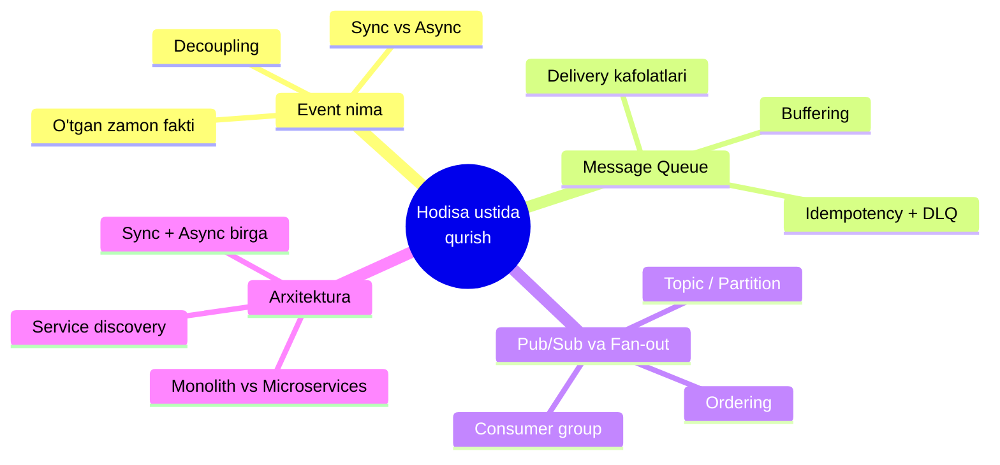
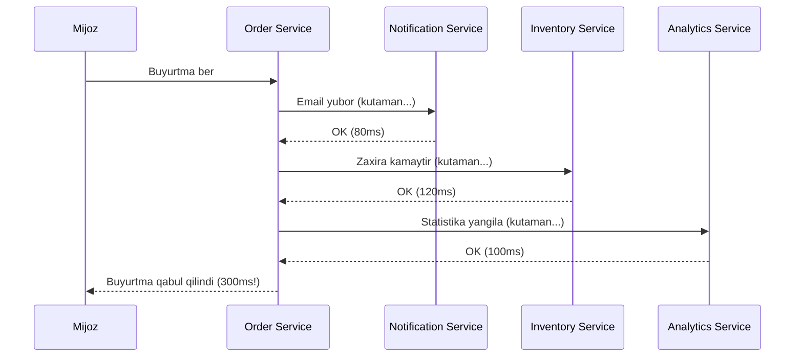
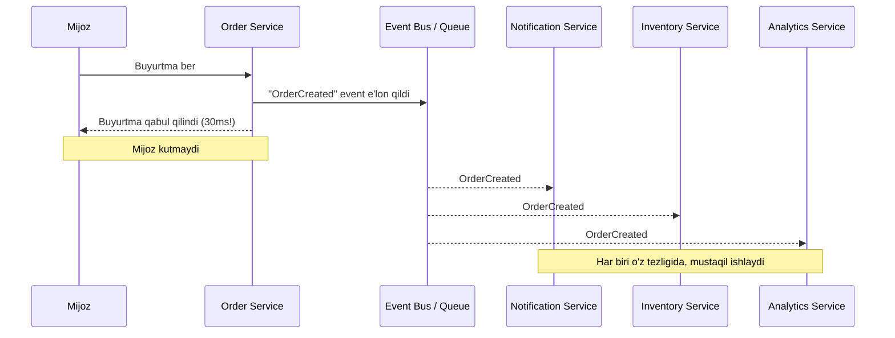
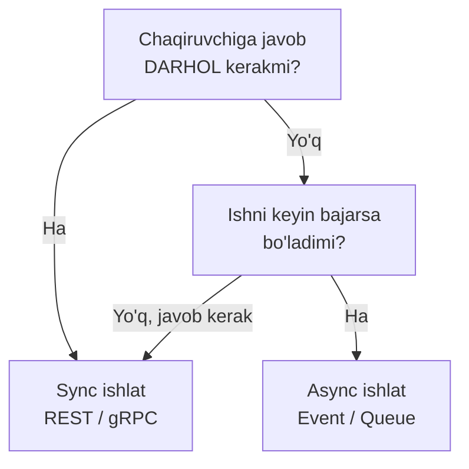
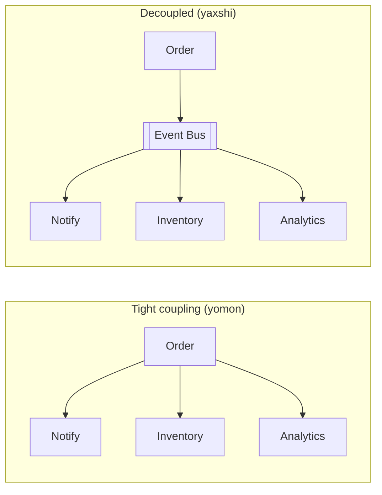
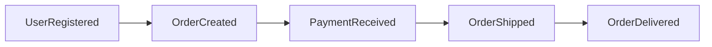

# 5.1 — Event-Driven Development: Hodisa ustida qurish

> Modul 1-4 da tizimni **so'rov-javob** (request-response) mantig'ida qurdik: mijoz so'raydi, server javob beradi. Bu modulda butunlay boshqa fikrlash usulini o'rganamiz — tizim **hodisalar** (event) atrofida quriladi. Bu yerda kimdir kimnidir kutib turmaydi.

## Bu modulda nima o'rganamiz (mavzu xaritasi)



---

## 1. Muammo: bir-biriga "yopishib qolgan" servislar

Tasavvur qil: onlayn do'kon yozyapsan. Foydalanuvchi tugmani bosdi — **buyurtma yaratilishi** kerak. Lekin buyurtma yaratilgach yana bir nechta ish bo'lishi shart:

- foydalanuvchiga email yuborish,
- omborda mahsulot zaxirasini kamaytirish,
- analitika (statistika) yangilash.

Eng oddiy yechim — buyurtma servisi shu uch ishni **birma-bir o'zi chaqiradi** va har biridan javob kutadi:



Ikki jiddiy og'riq bor:

1. **Sekin** — mijoz 300ms kutadi, holbuki unga faqat "buyurtma qabul qilindi" degan javob kerak edi. Email va statistika uni qiziqtirmaydi.
2. **Mo'rt (fragile)** — agar Analytics Service tushib qolsa, **butun buyurtma xato bo'ladi**. Statistika yangilanmagani uchun mijoz mahsulotni sotib ololmay qoladi. Bu mantiqsiz.

> Bu holatga **tight coupling** (qattiq bog'lanish) deyiladi: servislar bir-biriga shunchalik yopishib qolganki, biri tushsa hammasini yiqitadi.

---

## 2. Analogiya: telefon qo'ng'irog'i vs xabar qoldirish

Ikki xil aloqa turini kundalik hayotdan solishtiraylik:

| Aloqa | Hayotda | Xususiyati |
| --- | --- | --- |
| **Sync (request-response)** | Telefon qo'ng'irog'i | Ikkalasi ham ayni damda bo'lishi shart, gaplashib javob olguncha kutasan |
| **Async (event)** | E'lon taxtasiga qog'oz osish | Sen osasan-u ketasan; kimga kerak — o'zi kelib o'qiydi |

Buyurtma servisi "email yubor" deb **telefon qilib** o'tirmasligi kerak. U shunchaki e'lon taxtasiga **"Buyurtma yaratildi"** deb qog'oz osib qo'yadi va ishini davom ettiradi. Email servisi bo'lsa o'zi shu e'lonni ko'rib, o'z ishini bajaradi.

**Analogiya chegarasi:** e'lon taxtasidan farqi — bizning tizimda e'lonlar yo'qolmaydi va tartib bilan saqlanadi. Lekin muhim o'xshashlik shu: **e'lon qo'ygan odam kim o'qishini bilishi shart emas**.

Bu senga tanish tuyulmayaptimi? Go'da **goroutine**'lar aynan shunday gaplashadi — biri `channel`'ga yozadi, ikkinchisi o'qiydi, bir-birini shaxsan tanimaydi. Event-driven arxitektura — bu o'sha g'oyaning butun tizim miqyosidagi ko'rinishi.

---

## 3. Event nima — sodda ta'rif

> **Event (hodisa)** — bu allaqachon **sodir bo'lib bo'lgan faktning** e'loni. Uni o'zgartirib yoki "bekor qilib" bo'lmaydi, chunki u o'tmishda ro'y bergan.

Muhim nozik farq — **command** (buyruq) bilan **event** (hodisa) bir xil emas:

| | Command (buyruq) | Event (hodisa) |
| --- | --- | --- |
| **Zamon** | Kelasi/hozirgi: "Buyurtma yarat" | O'tgan: "Buyurtma yaratildi" |
| **Maqsad** | Bir ishni **buyuradi** | Bir fakt haqida **xabar beradi** |
| **Qabul qiluvchi** | Aniq bitta (kim bajarishi kerak) | Noaniq (kimga kerak bo'lsa) |
| **Rad etish** | Rad etilishi mumkin | Rad etib bo'lmaydi — bo'lib bo'lgan |
| **Nomi** | `CreateOrder`, `SendEmail` | `OrderCreated`, `EmailSent` |

Nom qo'yishda oddiy qoida: **o'tgan zamon fe'li** ishlat — `OrderCreated`, `PaymentReceived`, `UserRegistered`.

---

## 4. Diagramma — event orqali oqim

Endi o'sha buyurtma sahnasini event bilan qayta chizamiz:



E'tibor ber: mijoz endi **30ms** da javob oldi, chunki Order Service faqat bitta ish qildi — eventni e'lon qildi. Qolgan hammasi **fon rejimida**, mustaqil davom etadi. Analytics tushsa ham buyurtma muvaffaqiyatli o'tadi.

---

## 5. Worked example — Go'da event e'lon qilish

Avval eng sodda, tanish holatdan boshlaylik: **Go channel** aynan bitta dastur ichidagi mini event bus. Keyin haqiqiy tizimga o'tamiz.

```go
// --- 1-qadam: Event faktni ifodalovchi struct (o'tgan zamon nomi) ---
type OrderCreated struct {
    OrderID string  // qaysi buyurtma
    UserID  string  // kimning buyurtmasi
    Amount  float64 // summa
}

// --- 2-qadam: "event bus" o'rnida oddiy channel ---
bus := make(chan OrderCreated, 10) // buffered: e'lon qiluvchi kutmaydi

// --- 3-qadam: iste'molchi (consumer) — fon rejimida tinglaydi ---
go func() {
    for ev := range bus { // event kelishini kutib turadi
        fmt.Printf("Email yuborildi: buyurtma %s, user %s\n", ev.OrderID, ev.UserID)
    }
}()

// --- 4-qadam: producer eventni e'lon qiladi va DARHOL davom etadi ---
bus <- OrderCreated{OrderID: "o-1", UserID: "u-7", Amount: 50000}
fmt.Println("Buyurtma qabul qilindi") // consumer'ni kutmadik
```

**Output** (tartib o'zgarishi mumkin, chunki mustaqil ishlaydi):

```
Buyurtma qabul qilindi
Email yuborildi: buyurtma o-1, user u-7
```

**Notional machine — parda ortida nima bo'ldi?** `bus <- ...` satri eventni channel ichidagi buferga (xotirada) qo'yadi va **bloklanmaydi**, chunki bufer bo'sh emas. `main` goroutine keyingi qatorga o'tadi. Scheduler qulay paytda ikkinchi goroutine'ni uyg'otadi, u buferdan eventni oladi. Ikki goroutine bir-birini kutmaydi — **decoupling** shu.

Haqiqiy tizimda `channel` o'rnida **Kafka** yoki **RabbitMQ** turadi, goroutine o'rnida esa alohida servis bo'ladi. G'oya bir xil.

---

## 6. Predict savoli (o'zing o'yla)

> 🤔 **O'ylab ko'r:** Yuqoridagi kodda `bus` ni `make(chan OrderCreated, 10)` emas, `make(chan OrderCreated)` (buffersiz) qilib qo'ysak, `bus <- ...` satrida nima bo'ladi?

<details>
<summary>💡 Javobni ko'rish</summary>

Buffersiz channel'da e'lon qiluvchi (`main`) **consumer o'qib olguncha bloklanadi** — ya'ni sinxronlashadi. Bu bizning "e'lon qo'yib ketaman" g'oyamizga qarshi: Order Service email servisini kutib qolardi.

Bu — buffered vs unbuffered channel farqining aynan shu yerda ahamiyat kasb etishi. Buffer — "e'lon taxtasi"ning sig'imi. Keyingi darsda buni **queue buffering** deb ko'ramiz: navbat spike'larni yutib turadigan bufer vazifasini bajaradi.
</details>

---

## 7. Ko'p uchraydigan xatolar

⚠️ **Xato 1: eventni command deb ishlatish.**
Yangi o'rganuvchilar ko'pincha `bus <- SendEmail{...}` deb yozadi. Bu — buyruq, event emas. Order Service "email yubor" deb buyurmasligi kerak; u "buyurtma yaratildi" deb faqat **xabar berishi** kerak. Email yuborish — bu Notification Service'ning o'z qarori. To'g'risi: eventga **o'tgan zamon nomi** ber.

⚠️ **Xato 2: "e'lon qildim = bajarildi" deb o'ylash.**
Event e'lon qilinishi — ishning bajarilganini bildirmaydi. Email hali yuborilmagan bo'lishi mumkin (consumer keyinroq ishlaydi). Bu **eventual consistency** (vaqti kelib bir xillik): tizim bir zumda emas, bir necha lahzadan keyin izchil holatga keladi.

⚠️ **Xato 3: hamma joyda async ishlatish.**
Foydalanuvchining paroli to'g'ri-noto'g'riligini event bilan tekshirib bo'lmaydi — bu yerda **darhol javob** kerak. Async — javobni kutish shart bo'lmagan ishlar uchun.

---

## Sync vs Async — qachon qaysi

Bu eng muhim amaliy qaror. Sodda qoida:



| Vaziyat | Tanlov | Sabab |
| --- | --- | --- |
| Login: parol to'g'rimi? | **Sync** | Javob darhol kerak |
| Buyurtmadan keyin email | **Async** | Mijoz kutmasin |
| Narxni hisoblab ko'rsatish | **Sync** | Ekranga darhol chiqishi kerak |
| Statistika yangilash | **Async** | Kechiksa muammo yo'q |
| To'lovni tekshirish (natija kerak) | **Sync** | Muvaffaqiyat/xato darhol bilinishi shart |

---

## Tight coupling → decoupling

Event'ning eng katta yutug'i — **decoupling** (bog'lanishni bo'shatish). Buni vizual solishtiraylik:



Chapda: yangi servis qo'shsang (masalan "Sodiqlik ballari"), Order Service **kodini o'zgartirishing** kerak. O'ngda: yangi servis shunchaki event bus'ga ulanadi — Order Service haqida **hech narsa bilmaydi**. Bu xuddi 4-modulda ko'rgan **loose coupling** tamoyilining tizim darajasidagi ko'rinishi.

---

## Afzalliklar va kamchiliklar

Event-driven — sehrli tayoqcha emas. Narxi bor:

| ✅ Afzalliklari | ❌ Kamchiliklari |
| --- | --- |
| Servislar mustaqil (decoupled) | **Debugging qiyin** — oqim ko'rinmaydi, "email nega yuborilmadi?" ni izlash qiyin |
| Yuqori throughput (spike yutiladi) | **Eventual consistency** — darhol izchil emas |
| Xatoga chidamli (biri tushsa boshqalar ishlaydi) | Umumiy murakkablik oshadi |
| Yangi consumer qo'shish oson | Xabar tartibini kafolatlash qiyin (keyingi darslar) |
| Yuk vaqtga taqsimlanadi | Takroriy xabar muammosi (idempotency kerak) |

> **Oltin qoida:** Async — bepul emas. Uni **javob darhol kerak bo'lmagan**, mustaqil ishlar uchun ishlat. Har joyga tiqishtirsang, kuzatib bo'lmaydigan tizim quriladi.

---

## Event Storming — g'oya bilan tanishuv

Loyihani boshlashda **qanday event'lar bo'lishi kerak** degan savolga javob topish uchun **Event Storming** degan ustaxona usuli bor. G'oyasi juda sodda:

1. Butun jamoa (dasturchi, biznes, tester) bir devor atrofiga yig'iladi.
2. Har kim **stikerlarga** biznesda sodir bo'ladigan faktlarni o'tgan zamonda yozadi: `OrderCreated`, `PaymentReceived`, `OrderShipped`.
3. Stikerlarni **vaqt bo'yicha** chapdan o'ngga tartib bilan devorga yopishtiradi.



Natijada tizimning **butun hayoti event'lar ketma-ketligi** sifatida ko'rinadi. Bu — texnik kod yozishdan **oldin** biznesni birgalikda tushunish usuli. Batafsil texnik dizaynga o'tishdan avval mana shu event xaritasi juda foydali.

---

## Xulosa

- **Event** — o'tgan zamonda sodir bo'lgan, o'zgartirib bo'lmaydigan **fakt** ("OrderCreated").
- **Command** buyuradi, **event** xabar beradi — nomlashda o'tgan zamon fe'li ishlat.
- **Sync** (telefon) — javob darhol kerak bo'lganda; **async** (e'lon) — kutish shart bo'lmaganda.
- **Tight coupling** tizimni mo'rt qiladi; event **decoupling** beradi — servislar bir-birini bilmaydi.
- Event-driven Go **channel** g'oyasining tizim miqyosidagi ko'rinishi.
- Afzalligi: mustaqillik, throughput, chidamlilik; narxi: debugging qiyin, **eventual consistency**.
- **Event Storming** — kod yozishdan oldin biznes event'larini devorga chizib chiqish usuli.

## 🧠 Eslab qol

- Event = o'tgan zamon fakti; command = buyruq.
- E'lon qo'ygan kim o'qishini bilmasligi kerak (decoupling).
- Async'ni javob kutish shart bo'lmagan ishlarga ishlat.
- Event e'lon qilish ≠ ish bajarildi (eventual consistency).
- Chidamlilik uchun to'lovni: sekinroq, lekin mustaqillik bilan.

## ✅ O'z-o'zini tekshir (retrieval practice)

<details>
<summary>1. Nega Analytics Service tushib qolsa, sinxron variantda buyurtma xato bo'ladi-yu, event variantda bo'lmaydi?</summary>

Sinxron variantda Order Service Analytics'dan **javob kutadi** — javob kelmasa, Order Service ham xato qaytaradi (tight coupling). Event variantda Order Service faqat eventni e'lon qilib davom etadi; Analytics'ning tushib qolishi Order'ga umuman ta'sir qilmaydi (decoupled).
</details>

<details>
<summary>2. "SendEmail" va "EmailSent" — qaysi biri event, qaysi biri command? Nega?</summary>

`SendEmail` — **command** (buyruq, "email yubor"). `EmailSent` — **event** (fakt, "email yuborildi"). Farqi: command kelasi ishni buyuradi va rad etilishi mumkin; event o'tgan faktni bildiradi va rad etib bo'lmaydi.
</details>

<details>
<summary>3. Login uchun parolni tekshirish — sync yoki async? Nega?</summary>

**Sync.** Foydalanuvchiga "kirdingiz/parol xato" degan javob **darhol** kerak. Async ishlatib bo'lmaydi, chunki javobni kutmasdan davom etib bo'lmaydi.
</details>

<details>
<summary>4. "Eventual consistency" nima degani va u nega event-driven'ning narxi?</summary>

Tizim bir zumda emas, **bir necha lahzadan keyin** izchil holatga keladi. Masalan buyurtma yaratildi, lekin email hali yuborilmagan bo'lishi mumkin. Async'da ishlar mustaqil va turli tezlikda bajarilgani uchun, "hozir barcha joyda holat bir xil" degan kafolat yo'q — bu murakkablikning narxi.
</details>

## 🛠 Amaliyot

1. **Oson (Modify):** Yuqoridagi mavzu xaritasi (mindmap) va sync/async jadvaliga qarab, o'zingning loyihangdan (yoki tasavvurdagi ilovadan) 5 ta event nomini o'tgan zamonda yozib chiq. Har biri uchun: sync bo'lsin yoki async — belgila.

2. **O'rta (kamchilik top):** Quyidagi dizaynda xato bor, top:
   > "Foydalanuvchi login qilganda, biz `LoginRequested` eventini queue'ga yuboramiz va foydalanuvchiga darhol 'muvaffaqiyatli kirdingiz' deb javob qaytaramiz."

   <details>
   <summary>💡 Hint</summary>

   Login — bu javob **darhol** kerak bo'lgan sync ish. Event yuborib "muvaffaqiyatli" deyish — parol hali tekshirilmagan! Foydalanuvchi noto'g'ri parol bilan ham "kirdingiz" javobini oladi. Autentifikatsiya sync bo'lishi shart.
   </details>

3. **Qiyin (kichik dizayn):** Kichik "kitob buyurtma" tizimini event'lar bilan loyihalab, Mermaid sequence diagram chiz: `OrderCreated`, `PaymentReceived`, `InventoryReserved`, `OrderShipped`. Qaysi qadamlar sync, qaysilari async bo'lishini asosla.

   <details>
   <summary>💡 Hint</summary>

   To'lov (`PaymentReceived`) — natija darhol kerak, ehtimol sync. Inventory va shipping — async bo'lishi mumkin, chunki mijoz "buyurtma qabul qilindi" javobini olgach, qolgani fon rejimida davom etaveradi. Diagrammada Order Service bir marta event bus'ga yozadi, qolganlar mustaqil.
   </details>

## 🔁 Takrorlash

- **Bog'liq oldingi mavzular:**
  - [../2-kengayish-usullari/](../2-kengayish-usullari/) — throughput va yukni taqsimlash (async spike'larni yutadi)
  - [../3-malumotlar-ombori/](../3-malumotlar-ombori/) — eventual consistency va replikatsiya bilan bog'liq
  - [../4-caching/](../4-caching/) — cache invalidatsiyani ko'pincha event orqali qilishadi
- **Keyingi dars:** [02-messaging-queue.md](02-messaging-queue.md) — event'lar aslida qayerda saqlanadi va tashiladi?
- **Takrorlash jadvali:** bu "O'z-o'zini tekshir" savollariga → **ertaga** → **3 kundan keyin** → **1 haftadan keyin** qaytib javob ber.
- **Feynman testi:** Event-driven arxitekturani kod so'zlarini ishlatmasdan, do'stingga 3 jumlada tushuntirib ber. (Maslahat: "e'lon taxtasi" analogiyasidan boshla.)
