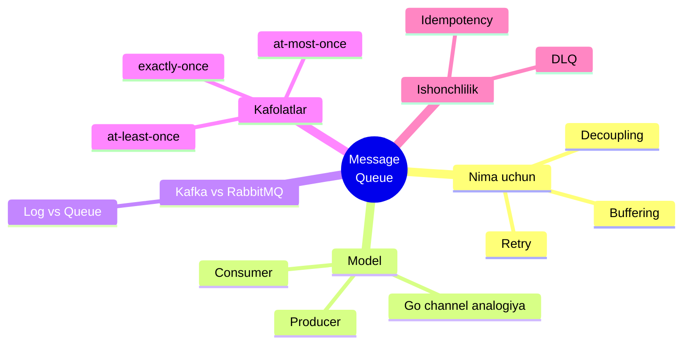
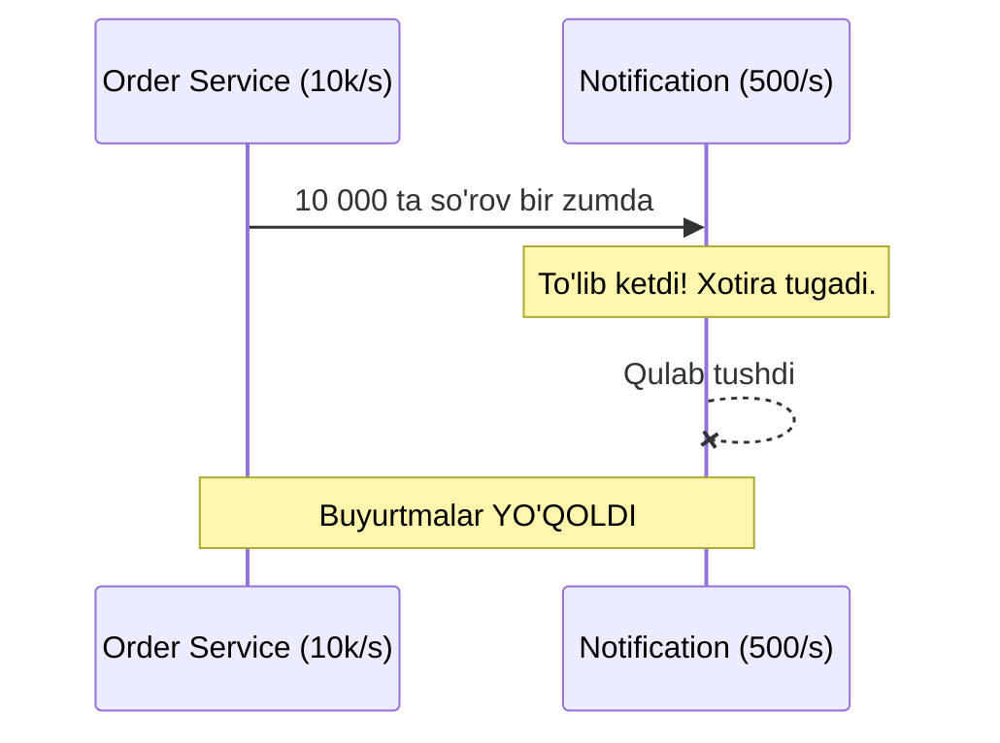
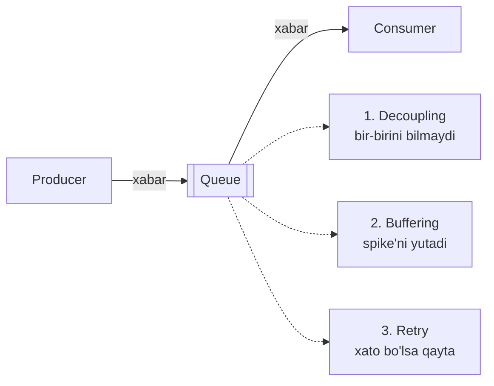
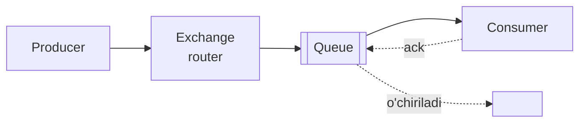
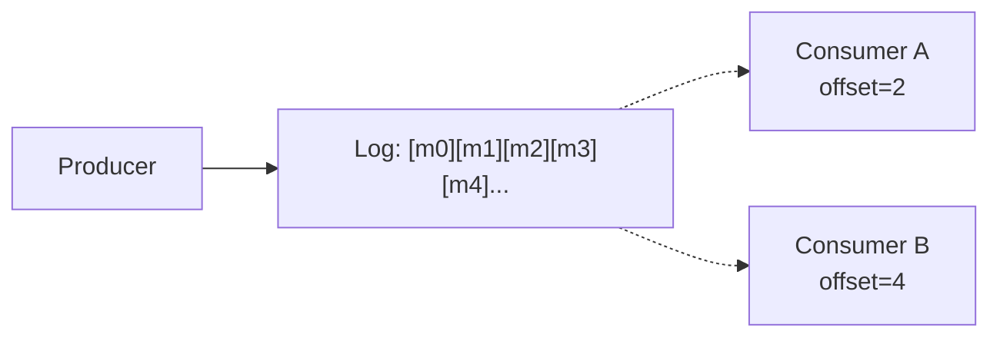
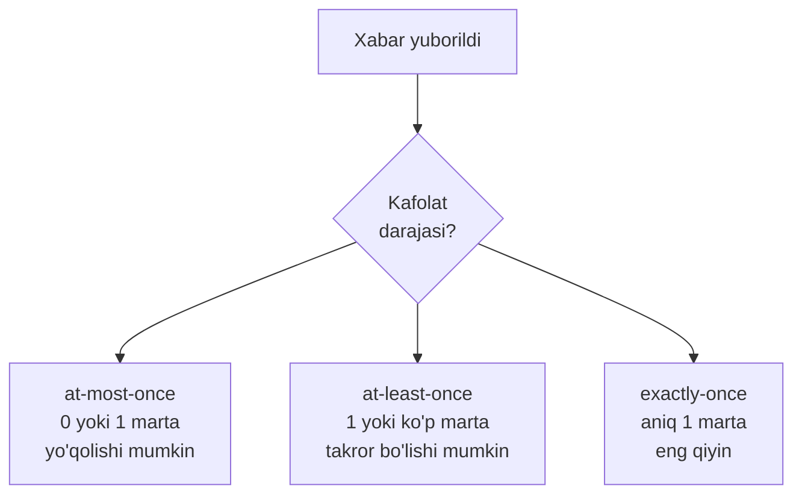
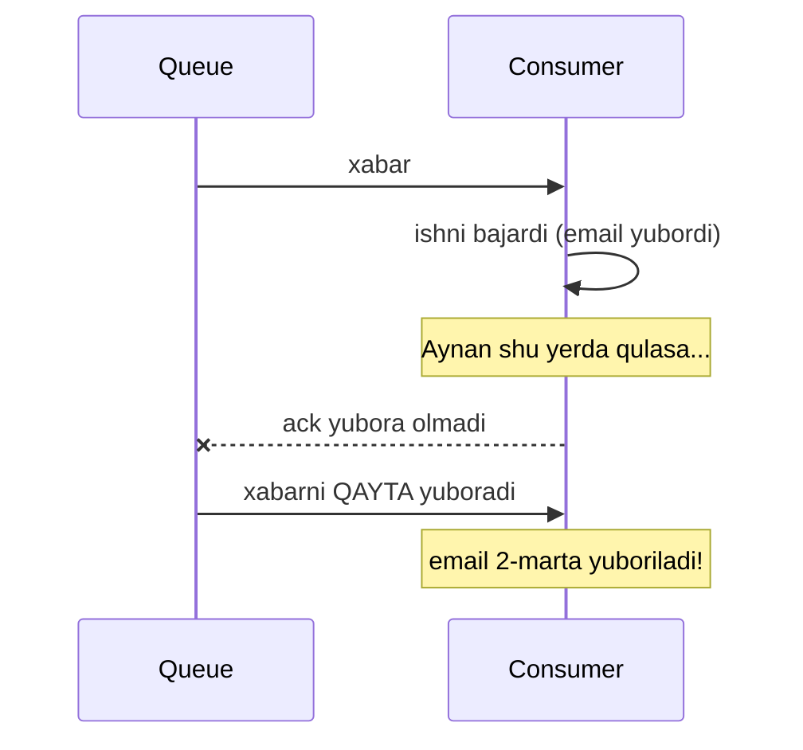
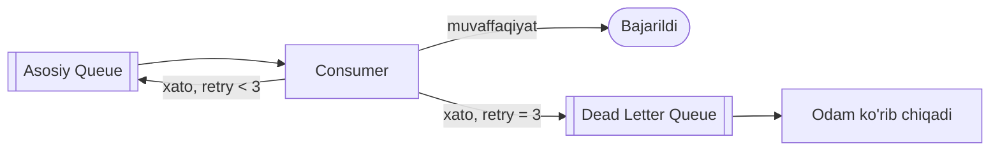

# 5.2 — Messaging Queue: xabarlar navbati

> O'tgan darsda event'ni "e'lon taxtasiga qog'oz osish" deb tasavvur qildik. Endi asosiy savol: **o'sha e'lon qayerda saqlanadi, kim tashiydi, agar o'quvchi band bo'lsa nima bo'ladi?** Javob — **Message Queue** (xabarlar navbati).

## Bu darsning xaritasi



---

## 1. Muammo: producer tez, consumer sekin

O'tgan darsda channel'ga `10` sig'imli bufer qo'ygandik. Endi savol: **agar shu bufer to'lib qolsa-chi?** Real hayotda bu doim bo'ladi.

Tasavvur qil: "Black Friday" chegirmasi. Bir soniyada **10 000** buyurtma keladi. Email servisi esa sekundiga faqat **500** ta email yubora oladi. Agar Order Service email servisini to'g'ridan-to'g'ri chaqirsa:



Notification Service **bosim ostida qulaydi**, undan keyin xabarlar butunlay yo'qoladi. Bu — **backpressure** (orqa bosim) muammosi: tez producer sekin consumer'ni bo'g'ib qo'yadi.

---

## 2. Analogiya: kassadagi navbat

Do'kondagi kassani tasavvur qil. Mijozlar tez keladi (producer), kassir sekin xizmat qiladi (consumer). Nima ular bir-birini to'xtatib qo'yadimi? Yo'q — **navbat** (queue) hosil bo'ladi:

- Mijoz keladi, **navbatga turadi** va ketaverishi mumkin (raqam oladi).
- Kassir **o'z tezligida** navbatdan bittalab oladi.
- Navbat — bu ikkalasi orasidagi **bufer**: mijozlar to'lqini navbatda "kutib turadi", kassirni bo'g'ib qo'ymaydi.

> **Message Queue** — producer va consumer orasida turadigan aynan shu "elektron navbat". Producer xabarni navbatga qo'yadi va ketadi; consumer o'z tezligida oladi.

**Analogiya chegarasi:** oddiy navbatdan farqi — xabar consumer olib bo'lguncha **saqlanadi**, agar consumer tushib qolsa xabar yo'qolmaydi (odam navbatdan chiqib ketishi mumkin, xabar esa turaveradi).

Bu senga tanish: Go'dagi **buffered channel** — aynan shu navbat, faqat bitta dastur ichida. Message Queue — o'sha channel'ning tarmoq bo'ylab, alohida servislar orasidagi, **doimiy saqlaydigan** versiyasi.

---

## 3. Queue nima uchun kerak — 3 sabab



1. **Decoupling** — producer consumer haqida hech narsa bilmaydi (o'tgan darsdagi g'oya).
2. **Buffering** — spike (to'satdan yuk) navbatda kutib turadi, consumer o'z tezligida hazm qiladi. 10 000 buyurtma navbatga tushadi, email servisi ularni asta-sekin yuboradi. Hech narsa yo'qolmaydi.
3. **Retry** — consumer xabarni qayta ishlashda xato qilsa, xabar navbatda qoladi va **qayta urinib** ko'riladi. Sinxron chaqiruvda bunday "ikkinchi imkoniyat" yo'q edi.

---

## 4. Producer / Consumer modeli — Go channel bilan boshlaymiz

Eng tanish holatdan boshlaylik. Message Queue g'oyasini bitta Go dastur ichida channel bilan namoyish qilamiz:

```go
// --- 1-qadam: navbat = buffered channel (100 ta xabar sig'adi) ---
queue := make(chan string, 100)

// --- 2-qadam: consumer — navbatdan o'z tezligida oladi ---
go func() {
    for msg := range queue { // xabar kelguncha kutadi
        time.Sleep(50 * time.Millisecond) // sekin ish (email yuborish)
        fmt.Println("Ishlangan:", msg)
    }
}()

// --- 3-qadam: producer — navbatga tez tashlaydi va kutmaydi ---
for i := 1; i <= 5; i++ {
    queue <- fmt.Sprintf("buyurtma-%d", i)
    fmt.Println("Navbatga qo'yildi:", i) // darhol davom etadi
}
```

**Output** (producer tez tugaydi, consumer sekin quvib yetadi):

```
Navbatga qo'yildi: 1
Navbatga qo'yildi: 2
Navbatga qo'yildi: 3
Navbatga qo'yildi: 4
Navbatga qo'yildi: 5
Ishlangan: buyurtma-1
Ishlangan: buyurtma-2
...
```

**Notional machine:** producer 5 xabarni buferga (xotirada) tez tashlaydi va sikldan chiqadi. Bufer 100 sig'imli bo'lgani uchun bloklanmaydi. Consumer goroutine har 50ms da bittadan oladi. **Bufer ular orasidagi zarbani yumshatuvchi "yostiq"** — spike'ni yutish shu.

Haqiqiy tizimda `channel` o'rnida **Kafka/RabbitMQ** turadi, `go func()` o'rnida **alohida servis**, `queue <-` o'rnida esa tarmoq orqali xabar yuborish bo'ladi. Farqi: haqiqiy queue xabarni **diskka saqlaydi**, shuning uchun servis o'chib yonsa ham xabar yo'qolmaydi.

---

## 5. Predict savoli

> 🤔 **O'ylab ko'r:** Yuqoridagi kodda producer 5 emas, **1000** ta xabar tashlasa, lekin channel bufer sig'imi hali ham `100` bo'lsa — producer 101-xabarda nima qiladi?

<details>
<summary>💡 Javobni ko'rish</summary>

Bufer to'lgach (100 ta), producer **bloklanadi** — consumer birontasini olib bufer bo'shatguncha kutadi. Bu — Go channel'da tabiiy **backpressure**: navbat to'lsa, producer sekinlashadi.

Haqiqiy Kafka/RabbitMQ'da esa navbat diskda bo'lgani uchun sig'im ancha katta, lekin u ham cheksiz emas. Navbat to'lsa nima qilish (producer'ni bloklash, eski xabarlarni o'chirish, yoki xato qaytarish) — bu dizayn qarori. Shu sabab **monitoring** muhim: navbat uzunligi o'sib borsa, consumer yetishmayapti degani.
</details>

---

## 6. Ko'p uchraydigan xatolar (birinchi qism)

⚠️ **Xato 1: "queue = cheksiz bufer" deb o'ylash.**
Navbat spike'ni yutadi, lekin **cheksiz emas**. Agar consumer producer'dan doim sekin bo'lsa, navbat cheksiz o'sadi va oxiri diskni to'ldiradi. Navbat — vaqtinchalik to'lqinlarni yumshatadi, **doimiy nomutanosiblikni** emas. Yechim: consumer'larni ko'paytirish (keyingi dars).

⚠️ **Xato 2: xabar ichiga katta ma'lumot solish.**
Xabarga butun rasmni yoki 10MB hujjatni solma. Xabar **kichik va faktga oid** bo'lsin (`OrderID`, `UserID`). Katta ma'lumotni obyekt ombariga (S3) qo'yib, xabarda faqat **havolasini** yubor.

---

## 7. Kafka vs RabbitMQ — ikki xil falsafa

Ikki eng mashhur queue tizimi butunlay boshqa modelda ishlaydi. Farqni tushunish — bu darsning yuragi.

### RabbitMQ — "navbat" (queue) modeli

Xabar consumer olib, **tasdiqlagach (ack)**, navbatdan **o'chiriladi**. Xuddi kassa navbati: xizmat ko'rsatilgan mijoz ketadi.



### Kafka — "log" (jurnal) modeli

Xabar **o'chirilmaydi** — u diskka ketma-ket yozilgan **jurnalga (log)** qo'shiladi. Consumer o'zining **offset** (qaysi joygacha o'qiganini bildiruvchi ko'rsatkich) ini saqlaydi. Xuddi kitob: har kim o'z **xatcho'pini** yuritadi, kitob esa hammaga umumiy bo'lib turaveradi.



Kafka'ning kuchli tomoni: xabar o'chirilmagani uchun consumer **offsetni orqaga surib, xabarlarni qaytadan o'qiy oladi** (replay). RabbitMQ'da xabar o'chgach, uni qaytarib bo'lmaydi.

### Taqqoslash jadvali

| | RabbitMQ | Kafka |
| --- | --- | --- |
| **Model** | Queue (o'chiriladi) | Log (saqlanadi) |
| **Xabar taqdiri** | ack keyin o'chadi | retention muddatigacha turadi |
| **Yetkazish uslubi** | Push (broker itaradi) | Pull (consumer tortadi) |
| **Replay (qayta o'qish)** | Yo'q | Bor (offset orqaga) |
| **Routing** | Murakkab (exchange, binding) | Oddiy (topic + partition) |
| **Throughput** | O'rtacha (yaxshi) | Juda yuqori (millionlab/s) |
| **Eng mos** | Task queue, murakkab routing | Event stream, log, analitika |

> **Oltin qoida:** "Vazifani bittagina ishchi bajarsin, bajarilgach unutilsin" kerak bo'lsa — **RabbitMQ**. "Hodisalar oqimi saqlansin, ko'p iste'molchi o'z tezligida o'qisin, kerak bo'lsa qayta o'qisin" kerak bo'lsa — **Kafka**.

---

## 8. Delivery kafolatlari — xabar necha marta yetadi?

Tarmoq ishonchsiz: xabar yo'qolishi yoki tasdiq (ack) yo'lda adashishi mumkin. Shuning uchun uchta kafolat darajasi bor:



| Kafolat | Ma'nosi | Xavf | Qachon |
| --- | --- | --- | --- |
| **at-most-once** | Ko'pi bilan 1 marta | Xabar **yo'qolishi** mumkin | Metrikalar, log — bittasi yo'qolsa mayli |
| **at-least-once** | Kamida 1 marta | Xabar **takrorlanishi** mumkin | Ko'p tizimlarning standarti |
| **exactly-once** | Aniq 1 marta | Sekin va murakkab | Pul o'tkazmasi kabi kritik ishlar |

### Nega at-least-once eng ko'p ishlatiladi?

Consumer xabarni oldi, ishladi, lekin **ack yuborishdan oldin** tushib qoldi. Broker ack olmagani uchun xabarni **qayta yuboradi** — natijada xabar 2 marta ishlanadi. Bu at-least-once: yo'qotmaymiz, lekin takror bo'lishi mumkin.

### Nega exactly-once shunchalik qiyin?

Chunki "ishni bajarish" va "ack yuborish" — ikki **alohida** qadam, ular orasida tizim tushishi mumkin:



"Ishlash + ack"ni **bitta atomik amal** qilib bo'lmaydi (biri queue'da, biri sizning kodingizda). Shuning uchun sof exactly-once amalda deyarli erishib bo'lmas narsa. Yechim boshqa tomondan keladi — **idempotency**.

---

## 9. Idempotency — takrorga qarshi qalqon

> **Idempotent amal** — bir necha marta bajarilsa ham, natija **bir marta bajarilgandagidek** bo'ladigan amal.

Amaliy g'oya: at-least-once beramiz (yo'qotmaymiz), consumer esa har xabarni **idempotent** qilib ishlaydi (takror kelsa ta'sir qilmaydi). Natijada "effektiv exactly-once"ga erishamiz.

```go
// --- 1-qadam: har xabarda noyob ID bo'ladi ---
type Payment struct {
    ID     string  // noyob event ID
    Amount float64
}

// --- 2-qadam: allaqachon ishlanganlarni eslab qolamiz ---
var processed = map[string]bool{}

// --- 3-qadam: idempotent handler ---
func handle(p Payment) {
    if processed[p.ID] { // bu ID allaqachon ishlangan
        fmt.Println("Takror xabar, o'tkazib yuboraman:", p.ID)
        return // hech narsa qilmaymiz
    }
    fmt.Printf("Pul o'tkazildi: %.0f\n", p.Amount)
    processed[p.ID] = true // belgilab qo'yamiz
}
```

Endi bir xil `p.ID` bilan xabar 2 marta kelsa ham, pul **faqat bir marta** o'tkaziladi. Haqiqiy tizimda `map` o'rnida DB (unique constraint) yoki Redis ishlatiladi, chunki servis qayta ishga tushsa `map` yo'qoladi.

> 🤔 **O'ylab ko'r:** Nega xabarga ID'ni **producer** qo'yishi kerak, consumer o'zi generatsiya qilmasligi kerak?

<details>
<summary>💡 Javobni ko'rish</summary>

Chunki takror kelgan xabar — bu **aynan bir xil** xabarning ikkinchi nusxasi. Agar ID'ni consumer generatsiya qilsa, ikki nusxaga **ikki xil ID** beriladi va ular "har xil xabar" deb qabul qilinadi — takror aniqlanmaydi. ID producer tomonida, xabarning o'zi bilan birga kelishi shart, shunda ikkala nusxada bir xil bo'ladi.
</details>

---

## 10. Dead Letter Queue (DLQ) — "muammoli xabarlar" burchagi

Ba'zi xabar hech qachon muvaffaqiyatli ishlanmaydi (buzuq JSON, o'chirilgan foydalanuvchi). Uni cheksiz qayta urinib ko'rish — **navbatni tiqib qo'yadi** (bitta yomon xabar hammani to'sib qo'yadi, "poison message"). Yechim — bir necha urinishdan keyin uni **Dead Letter Queue**'ga surish:



- **DLQ** — muammoli xabarlar to'planadigan alohida navbat.
- Bu yerdagi xabarlarni keyin dasturchi ko'rib chiqadi, tuzatadi yoki qayta yuboradi.
- Foydasi: bitta buzuq xabar butun oqimni to'xtatib qo'ymaydi.

---

## Ko'p uchraydigan xatolar (ikkinchi qism)

⚠️ **Xato 3: "exactly-once queue'dan keladi" deb ishonish.**
Marketing va'da qilsa ham, tarmoq sharoitida sof exactly-once amalda kafolatlanmaydi. To'g'ri yondashuv: **at-least-once + idempotent consumer**.

⚠️ **Xato 4: idempotency'ni xotiradagi `map` bilan qilish.**
Servis qayta ishga tushsa `map` yo'qoladi va takror xabarlar yana ishlanadi. Ishlangan ID'larni **doimiy joyda** saqla (DB unique constraint yoki Redis).

⚠️ **Xato 5: DLQ'ni yaratib, unutib qo'yish.**
DLQ'ga xabar tushsa, uni **kimdir ko'rishi** kerak. Monitoring/alert qo'ymasang, muammoli xabarlar jimgina yig'ilaveradi va hech kim bilmaydi.

---

## Xulosa

- **Message Queue** — producer va consumer orasidagi doimiy "navbat" (elektron kassa navbati).
- Uch foydasi: **decoupling**, **buffering** (spike yutish), **retry**.
- Go **buffered channel** — bitta dastur ichidagi mini queue; haqiqiy queue diskka saqlaydi.
- **RabbitMQ** — queue modeli (ack keyin o'chadi); **Kafka** — log modeli (saqlanadi, replay bor).
- Uch kafolat: **at-most-once** (yo'qoladi), **at-least-once** (takror), **exactly-once** (qiyin).
- Amaliy yechim: **at-least-once + idempotent consumer** = effektiv exactly-once.
- **DLQ** — bir necha urinishdan keyin muammoli xabar surib qo'yiladigan navbat.

## 🧠 Eslab qol

- Queue = bufer: spike'ni yutadi, lekin cheksiz emas.
- RabbitMQ o'chiradi, Kafka saqlaydi (replay).
- Amalda: at-least-once + idempotency.
- Idempotency uchun ID'ni producer qo'yadi.
- DLQ'siz poison message butun oqimni to'sadi.

## ✅ O'z-o'zini tekshir (retrieval practice)

<details>
<summary>1. Nega consumer sekin bo'lsa ham queue xabarlarni yo'qotmaydi, to'g'ridan-to'g'ri chaqiruv esa yo'qotadi?</summary>

Queue xabarni **saqlab turadi** — consumer o'z tezligida oladi, spike navbatda kutadi. To'g'ridan-to'g'ri chaqiruvda esa consumer bosim ostida qulaydi va yangi so'rovlar hech qayerda saqlanmay yo'qoladi (bufer yo'q).
</details>

<details>
<summary>2. Kafka'da consumer bir hafta oldingi xabarlarni qayta o'qiy oladi, RabbitMQ'da esa yo'q. Nega?</summary>

Kafka **log** modeli: xabar o'chirilmaydi, retention muddatigacha diskda turadi, consumer offsetni orqaga surib qayta o'qiy oladi (replay). RabbitMQ **queue** modeli: xabar ack qilingach o'chiriladi, shuning uchun qaytarib bo'lmaydi.
</details>

<details>
<summary>3. Nega sof "exactly-once" ga erishish deyarli imkonsiz, lekin amalda muammo hal bo'ladi?</summary>

"Ishni bajarish" va "ack yuborish" ikki alohida qadam; orasida tizim tushib, xabar qayta yuborilishi mumkin. Ularni bitta atomik amal qilib bo'lmaydi. Amalda muammo **idempotent consumer** bilan hal bo'ladi: at-least-once beramiz, consumer takror xabarni ID orqali aniqlab e'tiborsiz qoldiradi.
</details>

<details>
<summary>4. DLQ bo'lmasa, buzuq (poison) xabar tizimga qanday zarar yetkazadi?</summary>

Buzuq xabar hech qachon muvaffaqiyatli ishlanmaydi, doim qayta urinib ko'riladi va navbat boshida turib qolib, **orqasidagi barcha xabarlarni to'sib qo'yadi**. DLQ uni bir necha urinishdan keyin chetga surib, oqimni ochib qo'yadi.
</details>

## 🛠 Amaliyot

1. **Oson (savol/diagramma):** RabbitMQ va Kafka modellarini bitta Mermaid diagrammada yonma-yon chizib, "xabar taqdiri" (o'chadi / saqlanadi) farqini strelkalar bilan ko'rsat.

2. **O'rta (kamchilik top):** Quyidagi consumer kodida idempotency muammosi bor, top:
   ```go
   func handle(p Payment) {
       id := uuid.New().String()   // har safar yangi ID
       if !processed[id] {
           transfer(p.Amount)
           processed[id] = true
       }
   }
   ```
   <details>
   <summary>💡 Hint</summary>

   ID har chaqiruvda `uuid.New()` bilan **yangidan** generatsiya qilinyapti. Takror kelgan bir xil xabar ham har safar yangi ID oladi, shuning uchun `processed[id]` doim `false` bo'ladi va pul **har safar qayta** o'tkaziladi. ID xabarning o'zidan (`p.ID`, producer qo'ygan) olinishi kerak.
   </details>

3. **Qiyin (kichik dizayn):** Kunlik 5 million email yuboradigan, spike'larda sekundiga 50 000 buyurtma keladigan tizim uchun queue tanla (Kafka yoki RabbitMQ?), delivery kafolatini tanla va idempotency'ni qanday qilishni tasvirla. Qaroringni asosla.
   <details>
   <summary>💡 Hint</summary>

   Yuqori throughput va event oqimi — Kafka mos. At-least-once + email'ni idempotent qilish (masalan `order_id + email_type` bo'yicha "yuborilgan"ligini DB'da belgilash). Spike'ni partition'lar va ko'p consumer bilan parallel yutish (keyingi dars mavzusi).
   </details>

## 🔁 Takrorlash

- **Bog'liq oldingi mavzular:**
  - [01-event-driven-development.md](01-event-driven-development.md) — event g'oyasi (bu darsda uni qayerda saqlashni ko'rdik)
  - [../2-kengayish-usullari/](../2-kengayish-usullari/) — buffering va backpressure yuk boshqaruvi bilan bog'liq
  - [../3-malumotlar-ombori/](../3-malumotlar-ombori/) — idempotency uchun DB unique constraint
  - [../4-caching/](../4-caching/) — ishlangan ID'larni Redis'da saqlash
- **Keyingi dars:** [03-pub-sub-va-fan-out.md](03-pub-sub-va-fan-out.md) — bitta xabarni ko'p iste'molchiga qanday tarqatamiz?
- **Takrorlash jadvali:** "O'z-o'zini tekshir" savollariga → **ertaga** → **3 kundan keyin** → **1 haftadan keyin** qaytib javob ber.
- **Feynman testi:** "at-least-once + idempotency" g'oyasini kod ishlatmasdan, do'stingga 3 jumlada tushuntir. (Maslahat: "xat ikki marta kelsa ham, bir marta o'qigandek qilib qo'yamiz".)
