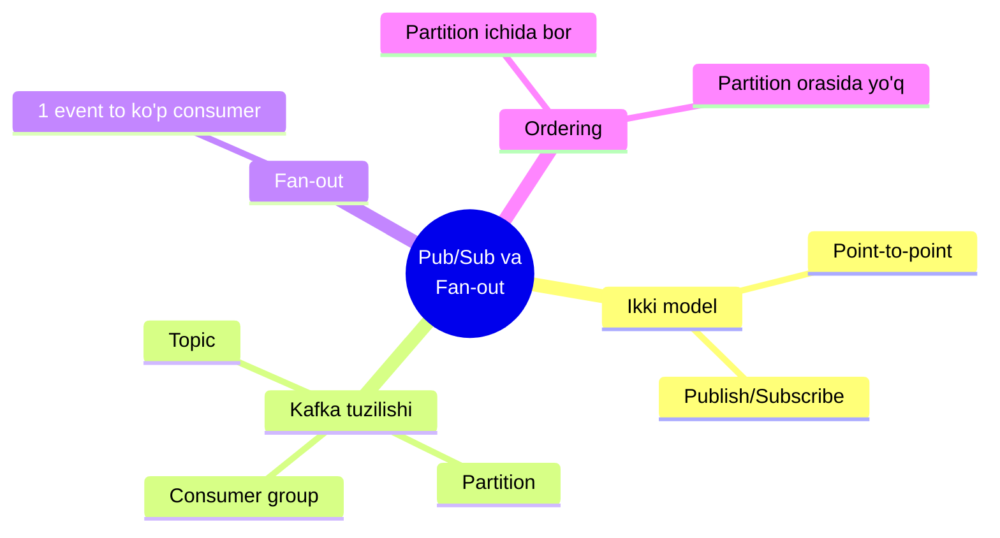
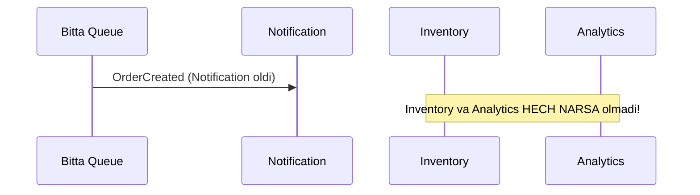
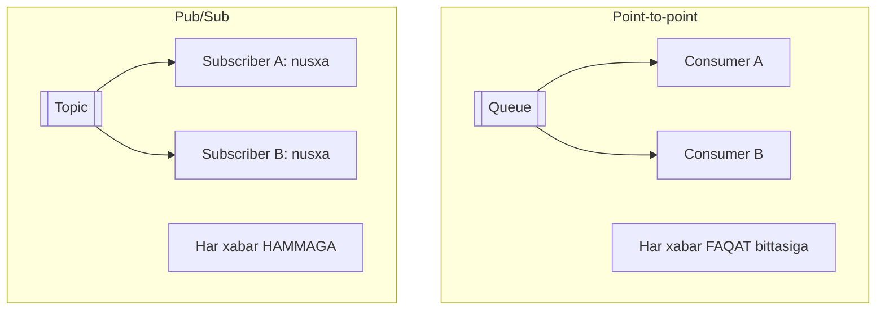
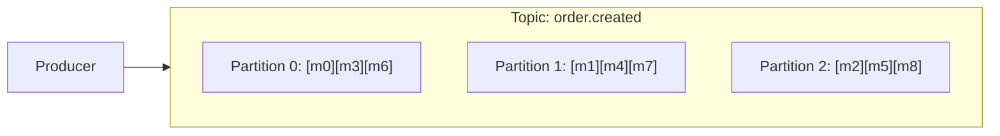
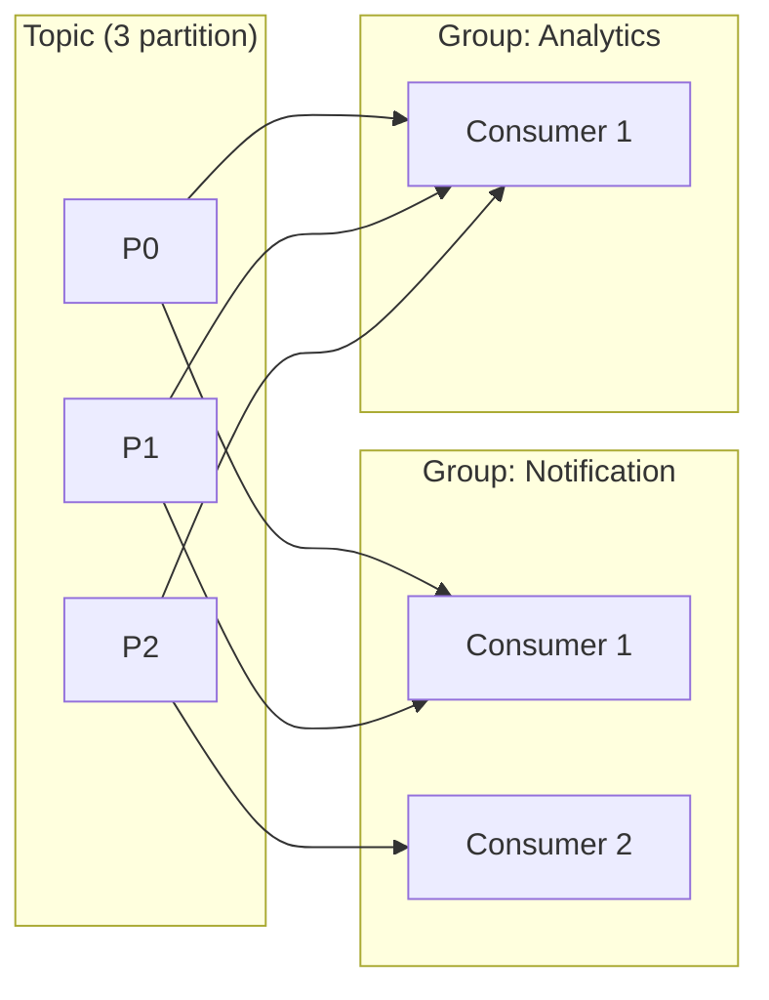
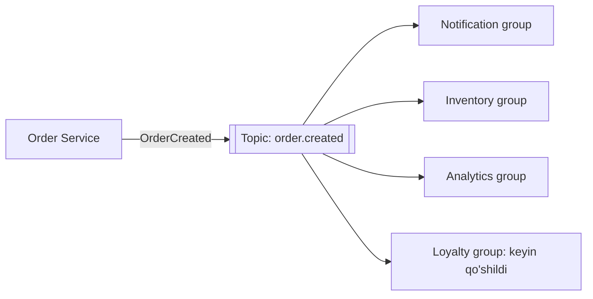
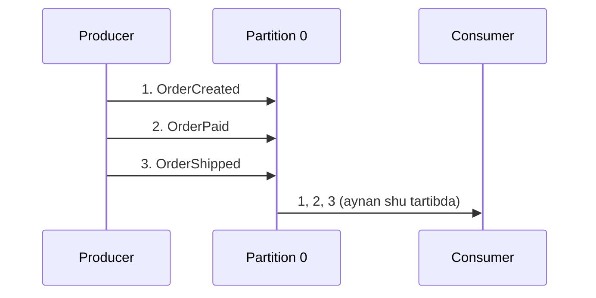
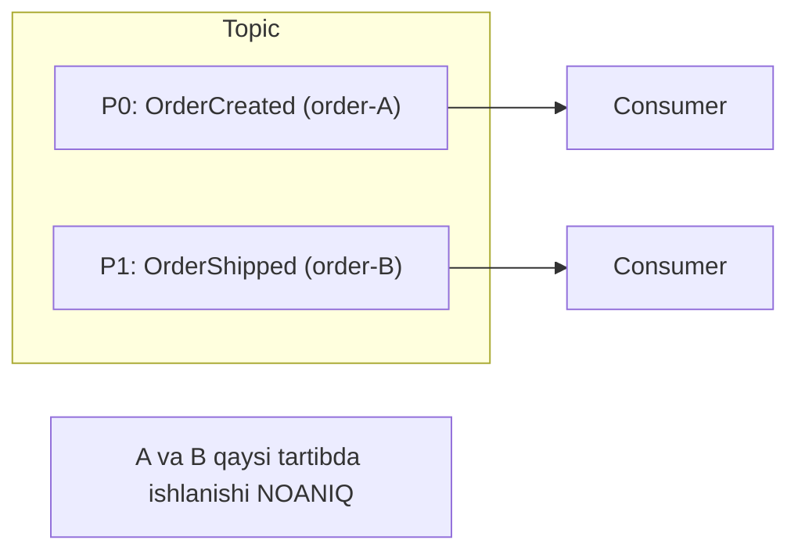

# 5.3 — Pub/Sub va Fan-out: bitta hodisa, ko'p iste'molchi

> O'tgan darsda navbatni kassa navbatiga o'xshatdik: **bitta** kassir bitta mijozni oladi. Lekin ba'zan bitta hodisani **hamma eshitishi** kerak — email ham, ombor ham, analitika ham. Bu darsda ana shu tarqatish (broadcast) mexanizmini o'rganamiz.

## Bu darsning xaritasi



---

## 1. Muammo: bitta xabarni faqat bittasi oladi

O'tgan darsdagi queue'da xabar consumer olib bo'lgach **o'chib ketardi**. Endi tasavvur qil: `OrderCreated` hodisasini **uch servis** olishi kerak — Notification, Inventory, Analytics.

Agar hammasi **bitta navbatdan** o'qisa, muammo chiqadi:



Xabarni **Notification** birinchi bo'lib "tortib" oldi va u o'chdi. Inventory va Analytics quruq qoldi. Bu **point-to-point** (nuqtadan-nuqtaga) model: xabar **faqat bitta** iste'molchiga tegadi.

Bizga esa **har bir** qiziqqan servis **o'z nusxasini** olishi kerak. Bu — boshqa model, **pub/sub**.

---

## 2. Analogiya: shaxsiy xat vs jurnal obunasi

| Model | Hayotda | Xususiyati |
| --- | --- | --- |
| **Point-to-point** | Bitta ish topshirig'i | Bir kishi oladi va bajaradi, boshqasi ololmaydi |
| **Pub/Sub** | Jurnalga obuna | Nashr chiqadi — **har bir obunachi** o'z nusxasini oladi |

Gazeta tahririyati (**publisher**) bitta son chiqaradi. Ming kishi obuna bo'lgan (**subscriber**) — har biriga **alohida nusxa** yetkaziladi. Tahririyat kim o'qishini bilmaydi, obunachilar bir-birini bilmaydi.

> **Pub/Sub (Publish/Subscribe)** — nashr etuvchi hodisani **e'lon qiladi**, unga obuna bo'lgan **har bir** iste'molchi **o'z nusxasini** oladi.

**Analogiya chegarasi:** jurnaldan farqi — obunachi guruh bo'lib ishlashi mumkin (bir tahririyatning 3 kuryeri bitta obunachiga xizmat qiladi — buni "consumer group" deb ko'ramiz).

---

## 3. Point-to-point vs Pub/Sub — asosiy farq



| | Point-to-point | Pub/Sub |
| --- | --- | --- |
| **Xabarni oladi** | Faqat bitta consumer | Har bir subscriber |
| **Maqsad** | Ishni taqsimlash (load balancing) | Xabar tarqatish (broadcast) |
| **Misol** | Email yuborish ishini 3 ishchi bo'lib bajarsin | OrderCreated'ni 3 xil servis eshitsin |

Diqqat: bular **qarama-qarshi emas**. Kafka ikkalasini **birga** beradi — buni endi ko'ramiz.

---

## 4. Kafka tuzilishi: Topic, Partition, Consumer Group

Kafka uch tushuncha ustiga qurilgan. Ularni birma-bir, sodda holatdan boshlab yig'amiz.

### Topic — hodisalar kategoriyasi

**Topic** — bir turdagi hodisalar oqimi, nom bilan ("order.created"). Producer topic'ga yozadi, consumer topic'dan o'qiydi. Bu — "jurnal nomi".

### Partition — parallellik uchun bo'linma

Bitta topic juda ko'p xabar oqsa, uni bitta faylga yozish sekin. Shuning uchun topic **partition**'larga bo'linadi — har biri mustaqil, ketma-ket log:



> **Partition** — topic ichidagi mustaqil ketma-ket bo'lim. Ko'p partition = ko'p parallel o'qish = yuqori throughput.

Xabar qaysi partition'ga tushishini **key** (kalit) belgilaydi: bir xil key'li xabarlar doim **bir xil** partition'ga tushadi (masalan `key = user_id`).

### Consumer Group — ishni bo'lishuvchi jamoa

Mana bu yerda sehr bor. **Consumer group** — bitta ishni bo'lib bajaradigan consumer'lar jamoasi. Kafka'ning qoidasi:

- **Bir group ichida:** har partition'ni **faqat bitta** consumer o'qiydi (ish bo'linadi = point-to-point).
- **Group'lar orasida:** har group **butun topic'ni mustaqil** o'qiydi (broadcast = pub/sub).



E'tibor ber:
- **Notification group** ichida ish 2 consumer'ga bo'lingan (P0,P1 → C1; P2 → C2). Har xabarni group ichida **bittasi** oladi.
- **Analytics group** esa **butun topic'ni** mustaqil o'qiydi — u Notification bilan bir xil xabarlarni **yana bir bor** oladi.

> **Oltin qoida:** Consumer group = pub/sub (group'lar orasi) va point-to-point (group ichi) ni **birlashtiradi**. Yangi servis qo'shmoqchimisan? Unga **yangi group ID** ber — u butun oqimni o'zi oladi.

---

## 5. Worked example — Go'da consumer group (kafka-go)

Avval tanish g'oyaga ko'prik: har servis o'z `GroupID`'sini beradi. Bir xil GroupID = ishni bo'lishadi; har xil GroupID = har biri butun oqimni oladi.

```go
// --- 1-qadam: Notification servisi o'z group'i bilan ulanadi ---
notif := kafka.NewReader(kafka.ReaderConfig{
    Brokers: []string{"localhost:9092"},
    Topic:   "order.created",
    GroupID: "notification-service", // <-- shu servisning group'i
})

// --- 2-qadam: Analytics servisi BOSHQA group bilan ulanadi ---
analytics := kafka.NewReader(kafka.ReaderConfig{
    Brokers: []string{"localhost:9092"},
    Topic:   "order.created",
    GroupID: "analytics-service", // <-- boshqa group => o'z nusxasini oladi
})

// --- 3-qadam: har biri mustaqil o'qiydi ---
msg, _ := notif.ReadMessage(ctx)     // Notification bu xabarni oladi
msg2, _ := analytics.ReadMessage(ctx) // Analytics HAM shu xabarni oladi
```

**Notional machine:** Kafka har `GroupID` uchun **alohida offset** (qaysi joygacha o'qiganini bildiruvchi ko'rsatkich) yuritadi. `notification-service` offseti va `analytics-service` offseti bir-biridan **mustaqil**. Shuning uchun bir xabar `m5` ikkala group'ga ham yetadi — chunki ular alohida xatcho'p yuritadi. Bu — o'tgan darsdagi Kafka log modelining amaliy ko'rinishi.

Agar Notification servisini **ikki nusxada** (bir xil `GroupID` bilan) ishga tushirsak, Kafka partition'larni ular orasida avtomatik **bo'lib beradi** — ish parallellashadi.

> 🤔 **O'ylab ko'r:** Topic'da **3** partition bor. `notification-service` group'iga **5** ta consumer nusxasi qo'shsak, nechta consumer haqiqatan ish qiladi?

<details>
<summary>💡 Javobni ko'rish</summary>

Faqat **3** tasi ish qiladi (har partition'ni bir consumer o'qiydi), qolgan **2** tasi **bo'sh** turadi (idle). Sabab: bir group ichida bir partition'ni bir vaqtda faqat bitta consumer o'qiy oladi.

Xulosa: **consumer parallelligining chegarasi = partition soni**. Ko'proq parallellik kerak bo'lsa — partition'ni ko'paytirish kerak (lekin buni oldindan rejalash muhim, keyin o'zgartirish murakkab).
</details>

---

## 6. Fan-out pattern: bitta hodisa → ko'p iste'molchi

**Fan-out** — bitta hodisani ko'p mustaqil iste'molchiga tarqatish namunasi. Consumer group'lar buni tabiiy beradi: har servis o'z group'i bilan ulanadi.



Fan-out'ning kuchi — **kengaytiriluvchanlik**: yangi "Sodiqlik ballari" (Loyalty) servisini qo'shmoqchimisan? Order Service kodiga **tegmaysan** — Loyalty shunchaki yangi group bilan topic'ga obuna bo'ladi. Bu 1-darsdagi **decoupling** g'oyasining eng aniq mevasi.

⚠️ **Diqqat — fan-out xavfi:** har consumer xabarni **mustaqil** ishlaydi. Notification xabarni muvaffaqiyatli qayta ishlab, Inventory esa xato qilsa — ular **turli holatda** qoladi (biri email yubordi, biri zaxira kamaytirmadi). Bu **eventual consistency**ning amaliy ko'rinishi. Har consumer o'z retry va idempotency'siga ega bo'lishi kerak (o'tgan dars).

---

## 7. Ordering — tartib muammosi

Bu — event tizimlarining eng nozik joyi. Savol: **xabarlar yuborilgan tartibda yetib boradimi?**

### Partition ICHIDA — tartib kafolatlangan

Bitta partition — ketma-ket yozilgan log. Unga yozilgan xabarlar **aynan shu tartibda** o'qiladi:



### Partition'lar ORASIDA — tartib YO'Q

Har partition mustaqil o'qilgani uchun, **turli** partition'dagi xabarlar tartibi kafolatlanmaydi:



> **Oltin qoida:** Kafka faqat **partition ichida** tartibni kafolatlaydi, partition'lar orasida emas. Demak, tartibi muhim bo'lgan xabarlar **bir xil partition'ga** tushishi kerak.

### Yechim: to'g'ri partition key tanlash

Bir buyurtmaning hodisalari (`OrderCreated → OrderPaid → OrderShipped`) doim **to'g'ri tartibda** kelishi uchun, ularni bir partition'ga yo'naltirish kerak. Buning uchun **key** sifatida `order_id` ni ishlatamiz:

```go
// --- Bir xil order_id => bir xil partition => tartib saqlanadi ---
writer.WriteMessages(ctx,
    kafka.Message{Key: []byte("order-42"), Value: created},
    kafka.Message{Key: []byte("order-42"), Value: paid},
    kafka.Message{Key: []byte("order-42"), Value: shipped},
)
// order-42 ning barcha hodisalari bir partition'da, ketma-ket
```

**Notional machine:** Kafka `partition = hash(key) % partitionSoni` formulasi bilan partition tanlaydi. `hash("order-42")` doim bir xil son bergani uchun, "order-42" ning barcha hodisalari **doim bir** partition'ga tushadi va tartibi saqlanadi. Boshqa buyurtmalar boshqa partition'ga tushib, parallel ishlanadi — bu ham tartib, ham tezlik.

---

## Ko'p uchraydigan xatolar

⚠️ **Xato 1: hamma servisni bitta group'ga qo'yish.**
Notification va Analytics'ni bir xil `GroupID` bilan ulasang, ular ishni **bo'lib olishadi** — har xabarni faqat bittasi oladi, ikkinchisi ololmay qoladi. Har mustaqil servis **o'z group'iga** ega bo'lishi kerak.

⚠️ **Xato 2: "Kafka global tartib beradi" deb ishonish.**
Kafka tartibni faqat **partition ichida** beradi. Butun topic bo'ylab global tartib yo'q. Tartib kerak bo'lsa — to'g'ri **key** bilan bir partition'ga jamla.

⚠️ **Xato 3: partition soniga e'tibor bermaslik.**
Partition'dan ko'p consumer qo'ysang, ortiqchalari bo'sh turadi. Parallellik chegarasi = partition soni. Kelajakdagi yukni hisobga olib partition sonini oldindan rejala.

⚠️ **Xato 4: hamma xabarga bir xil key berish.**
Agar barcha xabarga `key = "same"` bersang, hammasi **bitta** partition'ga tushadi — parallellik yo'qoladi, tizim sekinlashadi. Key'ni yaxshi taqsimlanadigan qiymatdan tanla (masalan `user_id`, `order_id`).

---

## Xulosa

- **Point-to-point** — xabarni bitta consumer oladi; **pub/sub** — har subscriber o'z nusxasini oladi.
- **Topic** — hodisalar kategoriyasi; **partition** — parallellik uchun bo'linma; **consumer group** — ish bo'lishuvchi jamoa.
- **Group ichida** ish bo'linadi (point-to-point), **group'lar orasida** broadcast (pub/sub).
- **Fan-out** — bitta hodisa ko'p mustaqil group'ga; yangi servis = yangi group, Order Service'ga tegilmaydi.
- Tartib **partition ichida** kafolatlanadi, **partition'lar orasida** yo'q.
- Tartib kerak bo'lsa — mos **key** (`order_id`) bilan bir partition'ga jamla.
- Consumer parallelligining chegarasi = **partition soni**.

## 🧠 Eslab qol

- Bir xil GroupID = ishni bo'lishadi; boshqa GroupID = o'z nusxasini oladi.
- Yangi consumer qo'shish = yangi group, producer'ga tegmaysan.
- Tartib faqat partition ichida.
- Key partition'ni tanlaydi (bir key = bir partition).
- Consumer soni > partition soni bo'lsa, ortiqchasi bo'sh turadi.

## ✅ O'z-o'zini tekshir (retrieval practice)

<details>
<summary>1. Nega Notification va Analytics servislari bir xil GroupID bilan ulansa muammo bo'ladi?</summary>

Bir group ichida har xabar **faqat bitta** consumer'ga tegadi (ish bo'linadi). Demak ba'zi xabarlarni Notification, ba'zilarini Analytics oladi — ikkalasi ham **to'liq oqimni ololmaydi**. Har mustaqil servis o'z group'iga ega bo'lishi, shunda har biri butun oqimni mustaqil olishi kerak.
</details>

<details>
<summary>2. Topic'da 4 partition bor, group'da 6 consumer. Nechta ishlaydi, qolgani nima qiladi?</summary>

Faqat **4** consumer ishlaydi (har partition'ni bittasi o'qiydi), qolgan **2** tasi **bo'sh** turadi. Parallellik chegarasi partition soniga teng.
</details>

<details>
<summary>3. Bir buyurtmaning OrderCreated, OrderPaid, OrderShipped hodisalari tartib bilan kelishini qanday kafolatlaysan?</summary>

Uchalasiga bir xil **key** (masalan `order_id`) berish kerak. Kafka `hash(key)` orqali ularni **bir xil partition**'ga joylaydi; partition ichida esa tartib kafolatlangan. Shunda ular yozilgan tartibda o'qiladi.
</details>

<details>
<summary>4. Barcha xabarga bir xil key bersang nima bo'ladi va nega yomon?</summary>

Hamma xabar **bitta** partition'ga tushadi. Tartib saqlanadi, lekin **parallellik yo'qoladi** — faqat bitta consumer ishlay oladi, throughput cheklanadi. Key yaxshi taqsimlanadigan qiymat (user_id, order_id) bo'lishi kerak.
</details>

## 🛠 Amaliyot

1. **Oson (diagramma):** 3 partition'li topic va 2 consumer group (Notification: 2 consumer, Analytics: 1 consumer) uchun partition'lar qanday taqsimlanishini Mermaid diagrammada chiz. Har strelkani belgila.

2. **O'rta (kamchilik top):** Quyidagi producer kodida ordering muammosi bor, top:
   ```go
   writer.WriteMessages(ctx,
       kafka.Message{Value: created},  // key yo'q
       kafka.Message{Value: paid},     // key yo'q
       kafka.Message{Value: shipped})  // key yo'q
   ```
   <details>
   <summary>💡 Hint</summary>

   Key berilmagani uchun Kafka bu uch xabarni **turli partition'larga** taqsimlashi mumkin. Natijada `OrderShipped` `OrderPaid`'dan **oldin** ishlanishi mumkin — buyurtma to'lanmasidan "jo'natildi" holatiga o'tadi! Uchalasiga `Key: []byte(orderID)` berish kerak.
   </details>

3. **Qiyin (kichik dizayn):** Ijtimoiy tarmoq uchun `PostCreated` hodisasini loyihalab ber: 4 xil servis (Feed, Notification, Search-index, Analytics) uni olishi kerak. Fan-out'ni consumer group'lar bilan qanday qurasan? Post'ning `PostCreated → PostEdited → PostDeleted` hodisalari tartibda kelishini qanday ta'minlaysan? Diagramma chiz.
   <details>
   <summary>💡 Hint</summary>

   Har servis alohida GroupID (feed, notification, search, analytics) bilan bir topic'ga obuna — bu fan-out. Ordering uchun key = `post_id`, shunda bir post'ning barcha hodisalari bir partition'da tartib bilan keladi. Delete'dan keyin create ishlanib qolmasligi shu bilan kafolatlanadi.
   </details>

## 🔁 Takrorlash

- **Bog'liq oldingi mavzular:**
  - [01-event-driven-development.md](01-event-driven-development.md) — decoupling (fan-out shuning natijasi)
  - [02-messaging-queue.md](02-messaging-queue.md) — Kafka log modeli va offset (bu darsda consumer group offseti)
  - [../02-kengayish-usullari/](../02-kengayish-usullari/) — parallellik va partitioning bilan bog'liq
  - [../03-malumotlar-ombori/](../03-malumotlar-ombori/) — sharding (partition sharding'ga o'xshaydi)
- **Keyingi dars:** [04-monolith-microservices-service-discovery.md](04-monolith-microservices-service-discovery.md) — bu servislarni qanday tashkil qilamiz va ular bir-birini qanday topadi?
- **Takrorlash jadvali:** "O'z-o'zini tekshir" savollariga → **ertaga** → **3 kundan keyin** → **1 haftadan keyin** qaytib javob ber.
- **Feynman testi:** Consumer group tushunchasini kod ishlatmasdan, do'stingga 3 jumlada tushuntir. (Maslahat: "bir jamoa ishni bo'lishadi, jamoalar esa bir-biridan mustaqil".)
