# 5.4 — Monolith, Microservices va Service Discovery

> Bu modulda ko'p "servis" haqida gapirdik — Order Service, Notification Service... Lekin nega ularni umuman bo'lib tashlaymiz? Qachon bir dastur yetarli, qachon ko'p servis kerak? Va ular bir-birini qanday **topadi**? Bu — arxitektura darsi.

## Bu darsning xaritasi

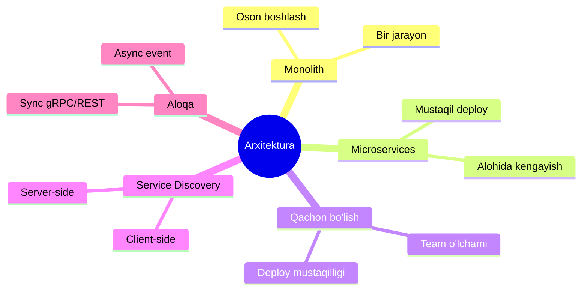

---

## 1. Muammo: hamma narsa bitta ulkan dasturda

Tasavvur qil — do'kon ilovang o'sdi. User, Order, Product, Payment, Notification — **hammasi bitta** dasturda, bitta process bo'lib ishlaydi. Bu **monolith** (yaxlit tizim).

Boshida bu ajoyib edi. Endi 40 dasturchi shu bitta kod ustida ishlayapti. Muammolar:

- Notification kodidagi bitta xatolik — **butun dastur** qulaydi (User ham, Payment ham).
- Bir kishi kichik o'zgarish kiritsa ham, **butun ulkan dasturni** qayta deploy qilish kerak.
- Faqat Product qismiga yuk ko'p, lekin uni alohida kengaytirib bo'lmaydi — **hamma narsani** ko'paytirishga majbursan.

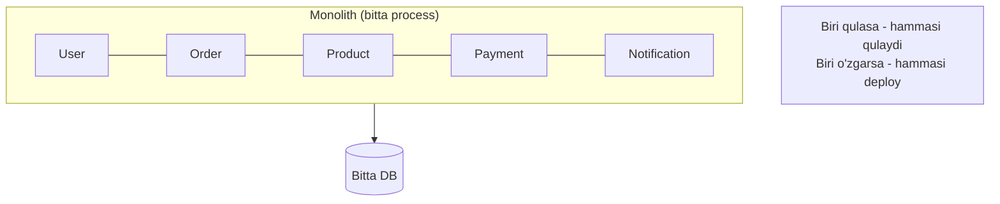

---

## 2. Analogiya: bitta katta do'kon vs savdo markazi

| Model | Hayotda | Xususiyati |
| --- | --- | --- |
| **Monolith** | Hamma narsa bitta katta do'konda | Bitta boshqaruv, oson, lekin do'kon yopilsa hamma yopiladi |
| **Microservices** | Savdo markazidagi alohida do'konlar | Har biri mustaqil, biri yopilsa boshqasi ishlaydi, lekin koordinatsiya kerak |

Savdo markazida oziq-ovqat do'koni yopilsa, kiyim do'koni ishlayveradi. Har do'kon o'z jadvalida ta'mirlanadi, o'zgaradi. Lekin ular orasida yo'lak, ko'rsatkich, umumiy xavfsizlik kerak — **koordinatsiya narxi** bor.

> **Microservices** — bitta katta dasturni **mustaqil, kichik servislarga** bo'lish; har biri alohida deploy qilinadi, alohida kengaytiriladi.

**Analogiya chegarasi:** do'konlar jismonan yonma-yon, microservices esa **tarmoq** orqali gaplashadi — bu tarmoq kechikishi va ishonchsizligini qo'shadi (o'tgan darslardagi barcha muammolar shundan).

---

## 3. Monolith vs Microservices — taqqoslash

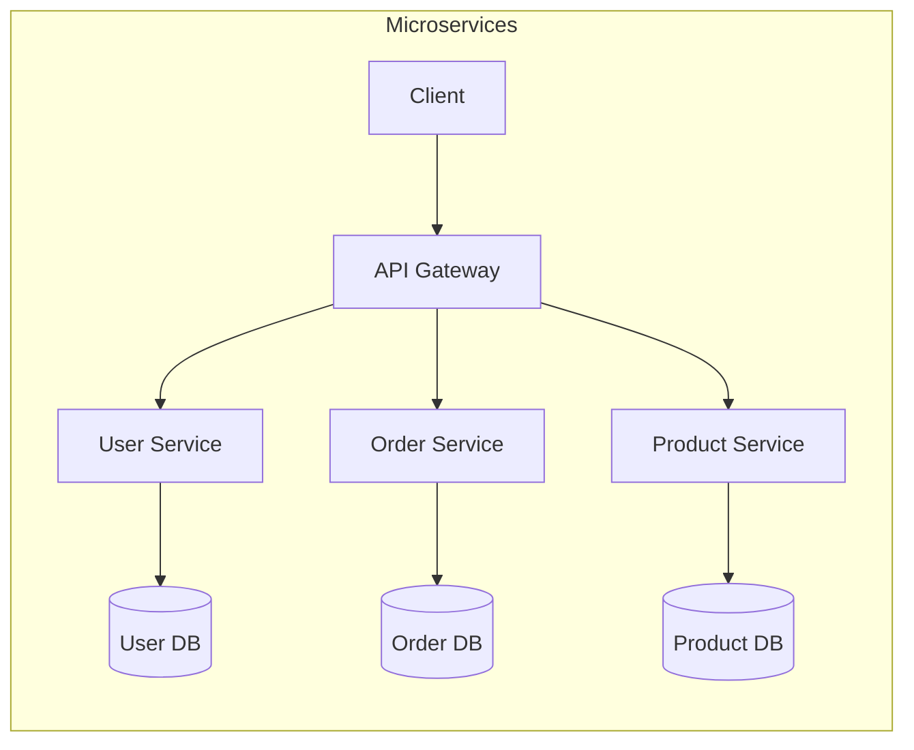

| | Monolith | Microservices |
| --- | --- | --- |
| **Murakkablik** | Past | Yuqori |
| **Deploy** | Oson (bitta artifact) | Murakkab (ko'p servis) |
| **Kengayish** | Hammasi birga | Har biri alohida |
| **Xatoga chidamlilik** | Past (biri qulasa hammasi) | Yuqori (izolyatsiya) |
| **Latency** | Past (in-process) | Yuqori (tarmoq) |
| **Debugging** | Oson (bitta joy) | Qiyin (taqsimlangan) |
| **Team** | Kichik jamoaga qulay | Ko'p mustaqil jamoa |
| **Boshlang'ich tezlik** | Tez | Sekin (infra ko'p) |

E'tibor ber — microservices **hamma joyda g'olib emas**. U latency, debugging va operatsion murakkablikni **oshiradi**. Uning yagona sababi — mustaqillik (deploy, kengayish, jamoa).

---

## 4. Oltin qoida: "avval monolith"

Ko'plab jamoalar yangi loyihani darrov microservices bilan boshlab, adashadi: infra murakkab, taqsimlangan bug'lar, tarmoq muammolari — mahsulot esa hali yo'q.

> **Oltin qoida:** Avval **monolith** (yoki modular monolith) bilan boshla. Faqat aniq og'riq paydo bo'lganda — mustaqil deploy yoki alohida kengayish kerak bo'lganda — microservice'ga bo'l.

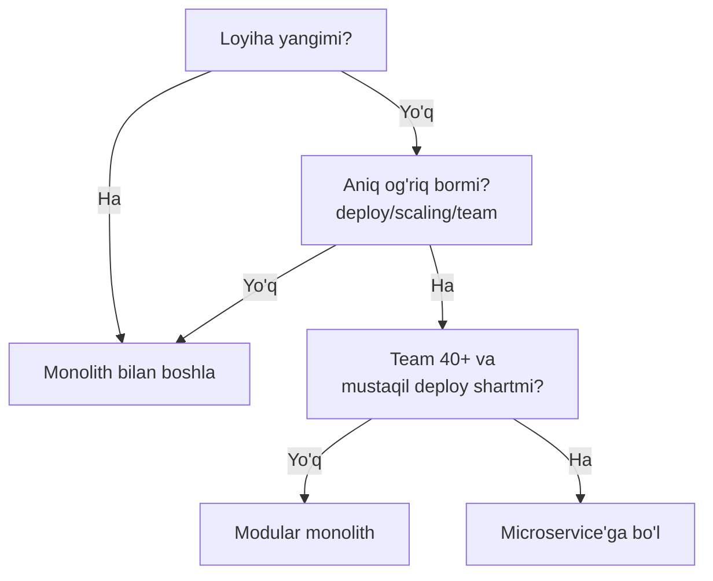

### Qachon microservice'ga bo'lish kerak?

Bo'lishning **texnik** emas, ko'proq **tashkiliy** sabablari bor:

- **Team o'lchami** — 40+ dasturchi bitta kodda bir-birini to'sadi. Kichik mustaqil jamoalar o'z servisini mustaqil rivojlantirsin.
- **Deploy mustaqilligi** — Notification'ni Payment'ga tegmasdan, kuniga 10 marta deploy qilish kerak bo'lsa.
- **Har xil kengayish** — Product qidiruviga ulkan yuk, User'ga oz. Faqat Product'ni ko'paytirish kerak bo'lsa.
- **Xatolik izolyatsiyasi** — bitta qism qulaganda boshqalar ishlashi hayotiy muhim bo'lsa.

Bulardan **hech biri** bo'lmasa, monolith to'g'ri tanlov. "Modul" ("Modular monolith" — ichida toza chegaralangan modullar, lekin bitta deploy) — ko'pincha eng oqilona o'rta yo'l.

⚠️ **Xato:** microservice'ni "zamonaviy" bo'lgani uchun tanlash. Bu — **rezyumega qarab qaror qilish** (resume-driven design). To'g'ri savol: "qaysi aniq muammoni hal qilyapman?"

---

## 5. Muammo: servis boshqasini qanday topadi?

Aytaylik, microservice'ga bo'ldik. Endi Order Service User Service'ni chaqirishi kerak. Lekin **qaysi manzilda?**

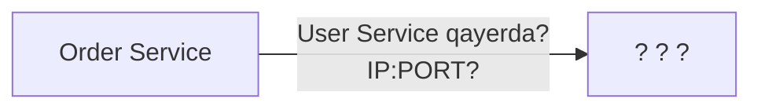

Muammo chinakam: microservices'da manzillar **doim o'zgaradi**:
- Kengayish (scaling)da User Service **3 nusxada** ishlaydi — qaysi biriga yuboramiz?
- Konteynerlar (Kubernetes) o'chib-yonganda **IP o'zgaradi**.
- Bir nusxa qulasa, unga so'rov yuborish — xato.

Manzilni **kodga qattiq yozib** (hardcode) bo'lmaydi. Kerak — dinamik "manzillar kitobi". Bu — **Service Discovery**.

---

## 6. Analogiya: telefon ma'lumotnomasi

Odamning uy manzilini yodlab yurmaysan — **ma'lumotnomadan** ("ismi bo'yicha izla") topasan. Odam ko'chib ketsa, ma'lumotnoma yangilanadi, sen esa doim to'g'ri manzilni olasan.

> **Service Discovery** — servislar bir-birini **nom bo'yicha** (IP emas) topadigan mexanizm. **Service Registry** (servislar reyestri) — barcha servislarning joriy manzillari saqlanadigan "ma'lumotnoma".

Har servis ishga tushganda o'zini registry'ga **"men shu yerdaman"** deb yozadi va vaqti-vaqti bilan **health check** (tirikligini bildiruvchi signal) yuboradi. Qulagan nusxa signal yubormay qoladi va registry'dan chiqariladi.

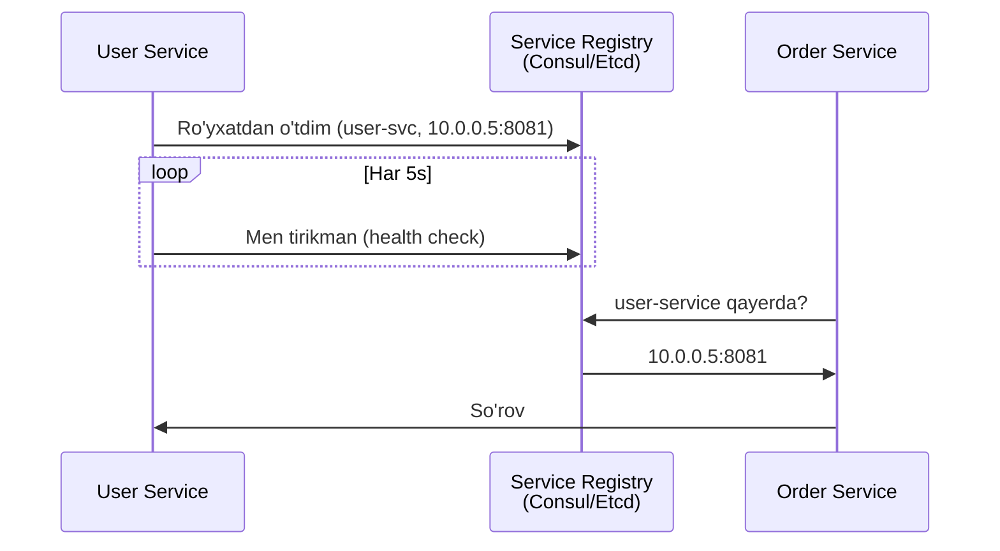

---

## 7. Client-side vs Server-side Discovery

Discovery'ni ikki xil joyda qilish mumkin — asosiy farq **kim registry'ga murojaat qiladi**.

### Client-side — mijoz o'zi topadi

Order Service **o'zi** registry'dan manzilni oladi va to'g'ridan-to'g'ri bog'lanadi:

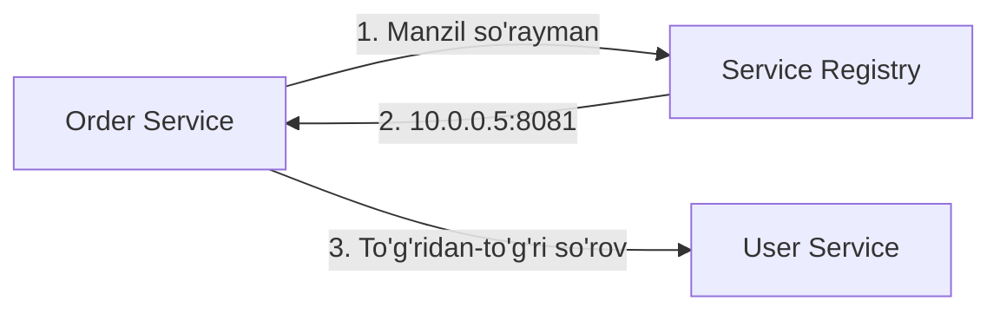

### Server-side — vositachi topadi

Order Service faqat **Load Balancer**'ga yuboradi; LB registry bilan gaplashib, kerakli nusxaga yo'naltiradi:

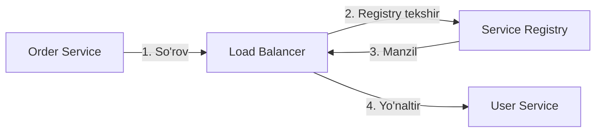

| | Client-side | Server-side |
| --- | --- | --- |
| **Kim topadi** | Mijoz servisning o'zi | Load Balancer / Gateway |
| **Mijoz murakkabligi** | Yuqori (discovery mantiqi mijozda) | Past (LB'ga yuborsa bas) |
| **Nazorat nuqtasi** | Tarqoq | Markazlashgan |
| **Misol** | Netflix Eureka, Consul kutubxona | Kubernetes Service, AWS ELB |

Zamonaviy amaliyotda **Kubernetes** ko'pincha buni o'zi hal qiladi: servis nomiga (`user-service`) so'rov yuborasan, Kubernetes DNS + Service abstraksiyasi orqali server-side discovery'ni avtomatik bajaradi.

---

## 8. Worked example — Go'da sodda service registry

Notional machine'ni ko'rish uchun registry'ni oddiy `map` bilan modellashtiramiz (haqiqiy Consul/Etcd shu g'oyaning tarmoq versiyasi):

```go
// --- 1-qadam: registry = nom -> manzillar ro'yxati ---
type Registry struct {
    mu       sync.RWMutex
    services map[string][]string // "user-service" -> ["10.0.0.5:8081", ...]
}

// --- 2-qadam: servis o'zini ro'yxatga oladi ---
func (r *Registry) Register(name, addr string) {
    r.mu.Lock()
    defer r.mu.Unlock()
    r.services[name] = append(r.services[name], addr)
}

// --- 3-qadam: boshqa servis nom bo'yicha topadi (round-robin) ---
func (r *Registry) Discover(name string) (string, error) {
    r.mu.RLock()
    defer r.mu.RUnlock()
    list := r.services[name]
    if len(list) == 0 {
        return "", fmt.Errorf("servis topilmadi: %s", name)
    }
    return list[rand.Intn(len(list))], nil // nusxalardan birini tanla
}
```

**Notional machine:** `services` map'i — bu "ma'lumotnoma"ning xotiradagi ko'rinishi. `Register` yangi nusxa manzilini ro'yxatga qo'shadi (User Service 3 nusxada bo'lsa, 3 ta manzil), `Discover` esa ulardan birini tanlaydi — bu bir vaqtning o'zida **yuk taqsimlash** (load balancing). Haqiqiy tizimda bu `map` alohida serverda (Consul) turadi va tarmoq orqali so'raladi; qulagan nusxa health check yubormay qolgach ro'yxatdan chiqariladi.

> 🤔 **O'ylab ko'r:** Agar User Service nusxasi qulasa, lekin registry'dan **o'chirilmasa**, `Discover` uni ham qaytaraveradi. Nima bo'ladi va bu qanday hal qilinadi?

<details>
<summary>💡 Javobni ko'rish</summary>

`Discover` qulagan nusxa manzilini ham qaytarishi mumkin, Order Service unga bog'lanmoqchi bo'ladi va **xato** oladi (yoki timeout kutadi). Yechim — **health check**: har nusxa muntazam "tirikman" signali yuboradi; registry belgilangan vaqt signal olmasa, uni ro'yxatdan **avtomatik chiqaradi**. Qo'shimcha himoya sifatida chaqiruvchi tomonda **circuit breaker** (qayta-qayta xato beruvchi nusxaga urinishni to'xtatuvchi qalqon) qo'yiladi.
</details>

---

## 9. Sync va Async'ni birga ishlatish

Eng muhim amaliy xulosa: **microservices'da sync va async raqib emas — sherik**. Real tizim ikkalasini birlashtiradi.

- **Sync (gRPC / REST)** — javob **darhol** kerak bo'lganda. Order Service buyurtma yaratishdan oldin "bu user bormi, bloklanmaganmi?" ni **hozir** bilishi kerak.
- **Async (event)** — javob kutish shart bo'lmaganda. Buyurtma yaratilgach, email/inventory/analytics — bularni event bilan.

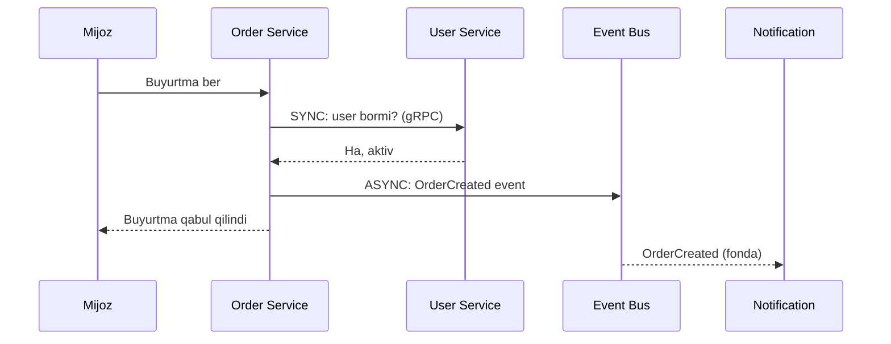

> **Oltin qoida:** So'rov **oqim yo'lida** (mijoz kutmoqda) va natija **darhol** kerak bo'lsa — **sync**. Boshqa hamma narsa — **async event**. Ikkalasini bitta oqimda mohirona birlashtir.

⚠️ **Xato:** hamma narsani sync qilish — tizimni sekin va mo'rt qiladi (1-darsdagi tight coupling). Yoki hamma narsani async qilish — login/to'lov kabi darhol javob kerak joylarni buzadi. To'g'ri javob — **muvozanat**.

---

## 10. Modular Monolith — o'rta yo'lni yaqindan

4-bo'limda "modular monolith" ni tilga oldik. Endi uni ko'rib chiqamiz, chunki bu **eng ko'p tavsiya etiladigan boshlang'ich nuqta**. G'oya: **bitta deploy** (monolith qulayligi), lekin ichida **toza chegaralangan modullar** (microservices tartibi).

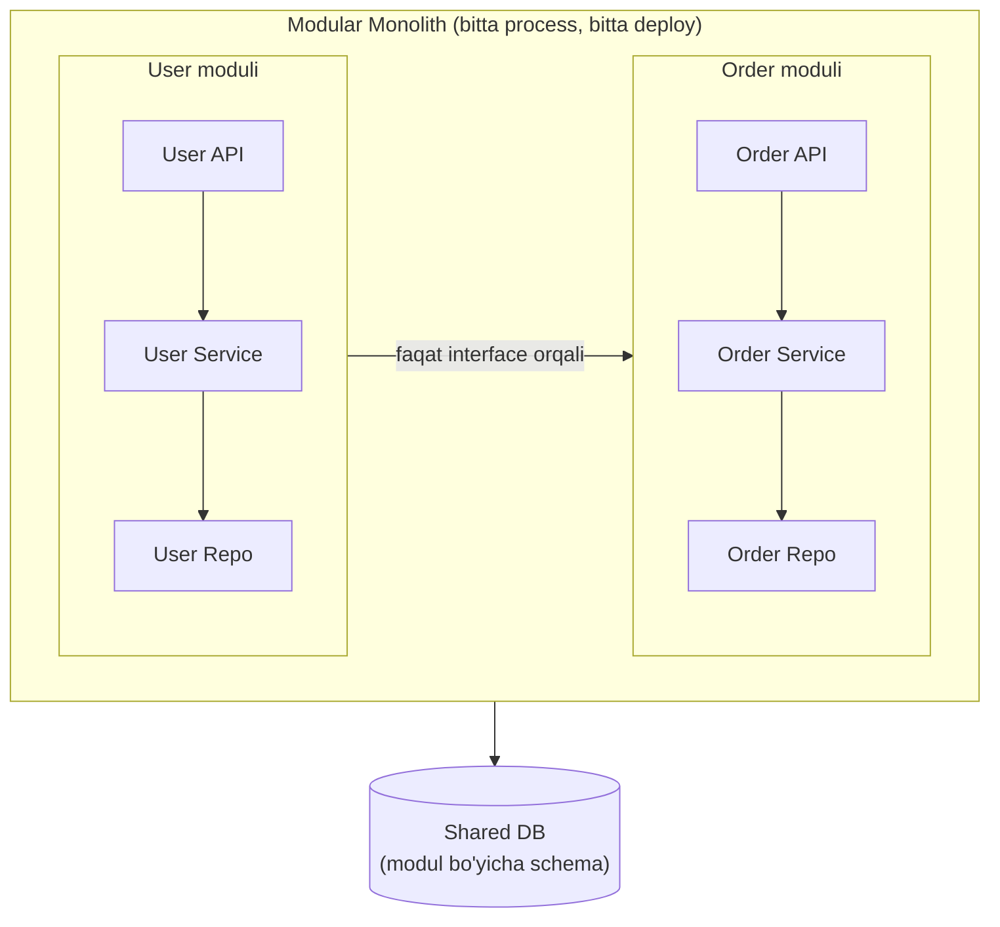

Muhim qoida: modullar bir-biriga **faqat interface orqali** murojaat qiladi, bir-birining ichki jadvaliga to'g'ridan-to'g'ri tegmaydi. Shunda keyinchalik biror modulni **microservice'ga ajratish oson** bo'ladi — chegaralar allaqachon tayyor.

> **Oltin qoida:** Chegaralarni **kod ichida** toza tut (modular monolith), lekin ularni **tarmoq orqali** ajratishga (microservice) faqat aniq ehtiyoj paydo bo'lgandagina o't. Chegara — bepul; tarmoq — qimmat.

---

## 11. Go amaliyoti

Bu bo'limda yuqoridagi tushunchalarni ishlaydigan Go kodiga aylantiramiz: sync microservice chaqiruvi, haqiqiy service registry (Consul), client-side load balancing va circuit breaker.

### 11.1 Microservice misoli — User va Order servislari (sync HTTP)

Ikki alohida servis. Order Service buyurtmani ko'rsatishdan oldin **sync** so'rov bilan User Service'dan foydalanuvchi nomini oladi (9-bo'limdagi "sync — javob darhol kerak" holati).

```go
// user-service/main.go
// --- 1-qadam: User Service /users/{id} endpoint'ini beradi ---
func main() {
    r := chi.NewRouter()
    r.Get("/users/{id}", func(w http.ResponseWriter, req *http.Request) {
        id := chi.URLParam(req, "id")
        user := User{ID: id, Name: "Ali", Email: "ali@example.com"}
        json.NewEncoder(w).Encode(user)
    })
    // --- 2-qadam: health endpoint (registry health check uchun) ---
    r.Get("/health", func(w http.ResponseWriter, req *http.Request) {
        w.Write([]byte(`{"status":"ok"}`))
    })
    http.ListenAndServe(":8081", r)
}
```

```go
// order-service/main.go
// --- 3-qadam: Order Service User Service'ga SYNC so'rov yuboradi ---
func getOrder(w http.ResponseWriter, r *http.Request) {
    order := Order{ID: "o1", UserID: "123", Amount: 50000}

    // User Service'ga bog'lanadi va JAVOBNI KUTADI (sync)
    resp, err := http.Get("http://user-service:8081/users/" + order.UserID)
    if err != nil {
        http.Error(w, "user service ishlamayapti", http.StatusServiceUnavailable)
        return // User Service qulasa, Order ham javob bera olmaydi!
    }
    defer resp.Body.Close()

    var user struct{ Name string `json:"name"` }
    json.NewDecoder(resp.Body).Decode(&user)
    json.NewEncoder(w).Encode(OrderWithUser{Order: order, UserName: user.Name})
}
```

**Notional machine:** `http.Get` — bu **bloklovchi tarmoq chaqiruvi**: Order Service goroutine'i User Service javob qaytarguncha kutadi. Bu 9-bo'limdagi sync coupling'ning aynan o'zi — User Service sekin bo'lsa yoki qulasa, Order Service ham sekinlashadi yoki xato beradi. Aynan shu xavf keyingi ikki asbobni (circuit breaker, discovery) zarur qiladi.

⚠️ E'tibor ber: bu kodda manzil `http://user-service:8081` deb **qattiq yozilgan**. Real tizimda uni service discovery orqali topamiz — buni 11.2'da tuzatamiz.

### 11.2 Service Registry — Consul bilan

8-bo'limdagi `map`li registry — bu g'oyaning o'rgatuvchi modeli edi. Haqiqiy tizimda o'sha `map` alohida serverda (Consul) turadi va tarmoq orqali so'raladi. Kutubxona: `github.com/hashicorp/consul/api`.

```go
// --- 1-qadam: servis o'zini Consul'ga ro'yxatga oladi (health check bilan) ---
func registerService(name, id, host string, port int) error {
    client, _ := api.NewDefaultClient()
    return client.Agent().ServiceRegister(&api.AgentServiceRegistration{
        ID: id, Name: name, Address: host, Port: port,
        Check: &api.AgentServiceCheck{ // Consul har 5s da tirikligini tekshiradi
            HTTP:     fmt.Sprintf("http://%s:%d/health", host, port),
            Interval: "5s",
            Timeout:  "2s",
        },
    })
}

// --- 2-qadam: boshqa servisni nom bo'yicha topadi (faqat SOG'LOM nusxalar) ---
func discoverService(name string) (string, int, error) {
    client, _ := api.NewDefaultClient()
    services, _, err := client.Health().Service(name, "", true, nil) // true = passing only
    if err != nil || len(services) == 0 {
        return "", 0, fmt.Errorf("servis topilmadi: %s", name)
    }
    svc := services[0].Service
    return svc.Address, svc.Port, nil
}
```

**Notional machine:** `ServiceRegister` chaqirilganda Consul o'z ichki jadvaliga "user-service → 10.0.0.5:8081" yozadi va har 5 soniyada `/health` endpoint'ini chaqiradi. Agar nusxa 3 marta javob bermasa, Consul uni **avtomatik "unhealthy"** deb belgilaydi. `Health().Service(..., true, ...)` dagi `true` tufayli `discoverService` faqat **sog'lom** nusxalarni qaytaradi — o'lik nusxa hech qachon qaytarilmaydi (8-bo'limdagi predict savolining amaliy yechimi).

### 11.3 Client-side load balancing — round-robin

Discover bir necha nusxa qaytarsa, yukni ular orasida taqsimlash kerak. Eng sodda usul — **round-robin** (navbatma-navbat).

```go
// --- 1-qadam: klient nusxalar ro'yxatini va hisoblagichni saqlaydi ---
type ServiceClient struct {
    instances []string // ["10.0.0.5:8081", "10.0.0.6:8081", ...]
    counter   uint64
}

// --- 2-qadam: har chaqiruvda keyingi nusxani tanlaydi (aylanma) ---
func (sc *ServiceClient) nextInstance() string {
    if len(sc.instances) == 0 {
        return ""
    }
    idx := atomic.AddUint64(&sc.counter, 1) % uint64(len(sc.instances))
    return sc.instances[idx]
}
```

**Notional machine:** `atomic.AddUint64` hisoblagichni **xavfsiz** (bir necha goroutine bir vaqtda chaqirsa ham) bittaga oshiradi, `% len` esa uni ro'yxat indeksiga o'giradi: 1→2→0→1→2... Shunday qilib so'rovlar nusxalar bo'ylab **teng tarqaladi** — bu client-side (8-bo'lim: mijoz o'zi tanlaydi) load balancing.

### 11.4 Circuit breaker — xato tarqalishini to'xtatish

8-bo'lim predict javobida circuit breaker'ni "qayta-qayta xato beruvchi nusxaga urinishni to'xtatuvchi qalqon" degandik. Endi uni quramiz. G'oya elektr **avtomat o'chirgichi**dan olingan: qisqa tutashuv bo'lsa, avtomat "ochiladi" va tokni uzadi — butun uy yonib ketmasin.

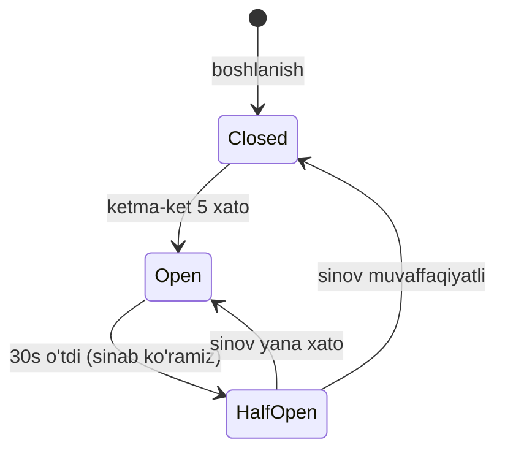

Uch holat: **Closed** (normal, so'rovlar o'tadi), **Open** (servis buzuq, so'rovlar **darhol** rad etiladi — kutib o'tirilmaydi), **HalfOpen** (bir oz o'tgach, bitta sinov so'rovi bilan tuzalganini tekshiramiz).

```go
// --- 1-qadam: chaqiruvni circuit breaker orqali o'tkazamiz ---
func (cb *CircuitBreaker) Call(fn func() error) error {
    cb.mu.Lock()
    defer cb.mu.Unlock()

    // Open holatda: vaqt o'tgan bo'lsa HalfOpen'ga, aks holda darhol rad et
    if cb.state == "open" {
        if time.Since(cb.lastFailure) > cb.timeout {
            cb.state = "half-open"
        } else {
            return fmt.Errorf("circuit ochiq — so'rov rad etildi (servis buzuq)")
        }
    }

    // --- 2-qadam: haqiqiy chaqiruv ---
    err := fn()
    if err != nil { // xato: hisoblagichni oshir, chegaradan oshsa "ochil"
        cb.failures++
        cb.lastFailure = time.Now()
        if cb.failures >= cb.maxFailures {
            cb.state = "open"
        }
        return err
    }
    // --- 3-qadam: muvaffaqiyat: holatni tiklab, hisoblagichni nolla ---
    cb.failures = 0
    cb.state = "closed"
    return nil
}
```

**Notional machine:** User Service qulaganda, `fn()` har safar xato beradi. 5-xatodan keyin `state = "open"` bo'ladi va endi keyingi so'rovlar `fn()`ga **umuman yetib bormaydi** — darhol rad etiladi. Bu ikki foyda beradi: (1) Order Service har chaqiruvda timeout kutib **sekinlashmaydi**, (2) allaqachon qulagan User Service'ga **yuk qo'shilmaydi** (tiklanishiga imkon beriladi). 30 soniyadan keyin bitta sinov so'rovi yuboriladi — o'tsa, "closed"ga qaytadi.

> 🤔 **O'ylab ko'r:** Circuit breaker bo'lmasa, User Service qulagan paytda Order Service har so'rovda 2 soniya timeout kutadi. 1000 so'rov kelsa nima bo'ladi?

<details>
<summary>💡 Javobni ko'rish</summary>

Har so'rov 2 soniya osilib turadi, goroutine'lar to'planib ketadi, Order Service resurslari (thread, xotira, ulanish) tugaydi va **u ham qulaydi**. Bu — **cascading failure** (zanjirli qulash): bitta servisning o'limi qo'shnisiga tarqaladi. Circuit breaker "open" holatda so'rovni **darhol** rad etib (2s kutmasdan), Order Service'ni tik saqlaydi va User Service'ga tiklanish imkonini beradi.
</details>

---

## Ko'p uchraydigan xatolar

⚠️ **Xato 1: erta microservice.**
Mahsulot hali yo'q, foydalanuvchi yo'q — lekin 12 ta servis. Infra murakkabligi mahsulotni bo'g'adi. Avval monolith.

⚠️ **Xato 2: manzilni hardcode qilish.**
`http://10.0.0.5:8081` ni kodga yozish. Nusxa o'chib-yonganda IP o'zgaradi, tizim buziladi. Doim **service discovery** orqali, nom bo'yicha top.

⚠️ **Xato 3: health check'siz registry.**
Registry qulagan nusxalarni ham qaytarsa, so'rovlar xatoga uchraydi. Health check bilan o'lik nusxalarni avtomatik chiqar.

⚠️ **Xato 4: har servisga alohida DB o'rniga umumiy DB.**
Microservices'ning ma'nosi — mustaqillik. Umumiy DB'ga bog'lansang, ular baribir bir-biriga yopishib qoladi (yashirin coupling). Har servis o'z ma'lumotiga egalik qilishi kerak.

---

## Xulosa

- **Monolith** — bitta process, oson boshlash; **microservices** — mustaqil servislar, murakkab lekin mustaqil.
- Microservices latency, debugging va operatsion murakkablikni **oshiradi** — yagona foydasi mustaqillik.
- **Oltin qoida: avval monolith**, aniq og'riq (deploy/scaling/team) paydo bo'lgandagina bo'l.
- Bo'lish sabablari asosan **tashkiliy**: team o'lchami, deploy mustaqilligi, alohida kengayish.
- **Service Discovery** — servislar bir-birini **nom bo'yicha** topadi; **registry** — manzillar "ma'lumotnomasi".
- **Client-side** (mijoz o'zi topadi) vs **server-side** (LB topadi); Kubernetes ko'pincha server-side'ni avtomatlashtiradi.
- **Sync + async birga**: darhol javob kerak joyda sync (gRPC/REST), qolganida async event.
- **Modular monolith** — bitta deploy, lekin toza modul chegaralari; ko'pincha eng oqilona boshlang'ich.
- **Circuit breaker** — qulagan servisga so'rovni darhol rad etib, zanjirli qulashni (cascading failure) to'xtatadi.

## 🧠 Eslab qol

- Avval monolith, keyin kerak bo'lsa bo'l.
- Microservice sababi tashkiliy (team/deploy), texnik moda emas.
- Manzilni hardcode qilma — nom bo'yicha top.
- Health check o'lik nusxalarni chiqaradi.
- Darhol javob = sync; qolgani = async.
- Circuit breaker "open" holatda darhol rad etadi — kutmaydi, qulashni tarqatmaydi.

## ✅ O'z-o'zini tekshir (retrieval practice)

<details>
<summary>1. Startap yangi mahsulotni darrov 10 microservice bilan boshladi. Nega bu ko'pincha xato?</summary>

Microservices latency, taqsimlangan debugging va operatsion murakkablikni oshiradi — bularning **narxi** bor. Startapda hali mahsulot ham, foydalanuvchi ham yo'q, mustaqil deploy/scaling ehtiyoji ham yo'q. Infra murakkabligi mahsulot ustidagi ishni bo'g'adi. Avval monolith bilan tez harakatlanish to'g'riroq.
</details>

<details>
<summary>2. Nega microservice manzilini kodga hardcode qilib bo'lmaydi?</summary>

Nusxalar (konteynerlar) o'chib-yonganda IP o'zgaradi; scaling'da bir nechta nusxa bo'ladi; nusxa qulashi mumkin. Hardcode qilingan manzil tez orada noto'g'ri bo'lib qoladi. Service discovery orqali **nom bo'yicha**, dinamik topish kerak.
</details>

<details>
<summary>3. Client-side va server-side discovery orasidagi asosiy farq nima?</summary>

**Kim registry'ga murojaat qiladi.** Client-side'da mijoz servisning **o'zi** registry'dan manzilni oladi va to'g'ridan-to'g'ri bog'lanadi. Server-side'da mijoz **Load Balancer**'ga yuboradi, LB registry bilan gaplashib yo'naltiradi (mijoz sodda qoladi).
</details>

<details>
<summary>4. Buyurtma oqimida qaysi qadam sync, qaysi qadam async bo'lishi kerak va nega?</summary>

"User bormi/aktivmi?" tekshiruvi — **sync** (buyurtma yaratishdan oldin natija darhol kerak). "OrderCreated" dan keyingi email/inventory/analytics — **async** (mijoz kutmasin, mustaqil ishlansin). Sabab: oqim yo'lida darhol javob kerak bo'lsa sync, aks holda async.
</details>

## 🛠 Amaliyot

1. **Oson (savol/diagramma):** O'z tanish ilovang (masalan taksi buyurtma) uchun monolith va microservices variantlarini ikki Mermaid diagrammada chizib, har birining 2 ta afzallik va 2 ta kamchiligini yoz.

2. **O'rta (kamchilik top):** Quyidagi dizaynda 2 ta muammo bor, top:
   > "Order Service User Service'ga `http://10.0.0.7:8081/users/5` manzili bilan sync so'rov yuboradi va shu so'rov ichida email ham yuboradi, javobni kutadi."
   <details>
   <summary>💡 Hint</summary>

   (1) Manzil **hardcode** qilingan — nusxa o'zgarsa buziladi; service discovery orqali nom bo'yicha topish kerak. (2) Email — javob kutish shart bo'lmagan ish, uni **sync** oqim ichida qilib kutish sekinlik va tight coupling keltiradi; u **async event** bo'lishi kerak.
   </details>

3. **Qiyin (kichik dizayn):** 200 dasturchili, kuniga o'nlab deploy qiladigan e-commerce jamoasi uchun servislarni qanday bo'lasan? Qaysi chegaralarni tanlaysan (bounded context)? Servislar bir-birini qanday topadi (client yoki server-side)? Qaysi aloqalar sync, qaysilari async? Umumiy diagramma chiz va tanlovlaringni asosla.
   <details>
   <summary>💡 Hint</summary>

   Biznes chegaralari bo'yicha bo'l (User, Catalog, Order, Payment, Notification) — har biriga alohida DB. Kubernetes ishlatilsa server-side discovery avtomatik. Sync: to'lov tekshiruvi, user validatsiya. Async: OrderCreated → email/inventory/analytics (fan-out). Har servis mustaqil deploy — bu 200 dasturchi uchun asosiy foyda.
   </details>

## 🔁 Takrorlash

- **Bog'liq oldingi mavzular:**
  - [01-event-driven-development.md](01-event-driven-development.md) — sync vs async, tight coupling (bu darsda arxitektura darajasida)
  - [02-messaging-queue.md](02-messaging-queue.md) — servislar orasidagi async aloqa asboblari
  - [03-pub-sub-va-fan-out.md](03-pub-sub-va-fan-out.md) — bir hodisani ko'p servisga tarqatish
  - [../02-kengayish-usullari/](../02-kengayish-usullari/) — load balancing va horizontal scaling
  - [../03-malumotlar-ombori/](../03-malumotlar-ombori/) — har servisga alohida DB (database per service)
  - [../04-caching/](../04-caching/) — servislar orasida kesh va discovery
- **Takrorlash jadvali:** "O'z-o'zini tekshir" savollariga → **ertaga** → **3 kundan keyin** → **1 haftadan keyin** qaytib javob ber.
- **Feynman testi:** "Avval monolith" qoidasini va service discovery'ni kod ishlatmasdan, do'stingga 3 jumlada tushuntir. (Maslahat: "savdo markazi" va "telefon ma'lumotnomasi" analogiyalaridan boshla.)
- **Modul yakuni:** Tabriklaymiz — 5-modulni tugatding! Endi bilasan: hodisa nima, navbat qanday ishlaydi, hodisa ko'pga qanday tarqaladi va servislar qanday tashkil qilinadi hamda bir-birini topadi. Butun modulni bitta jumlada: **"Servislar bir-birini shaxsan kutmasin — hodisalar orqali mustaqil, chidamli va masshtablanuvchi bo'lib gaplashsin."**
