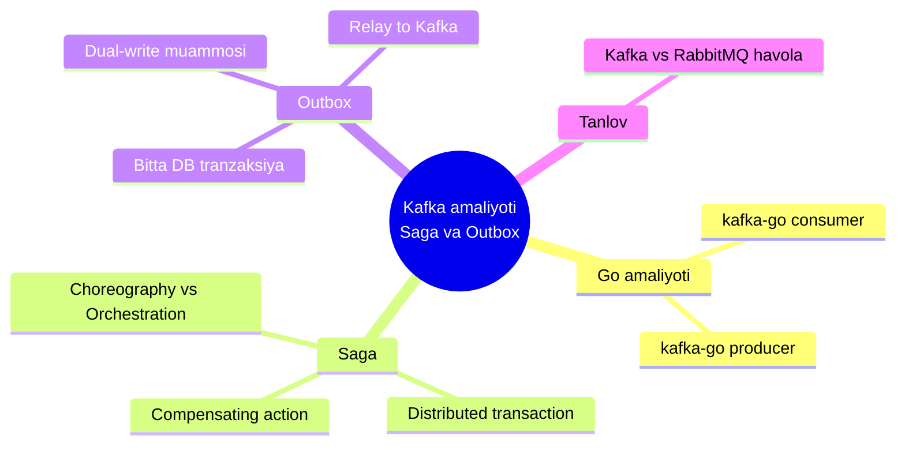
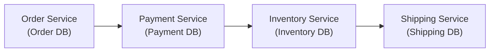
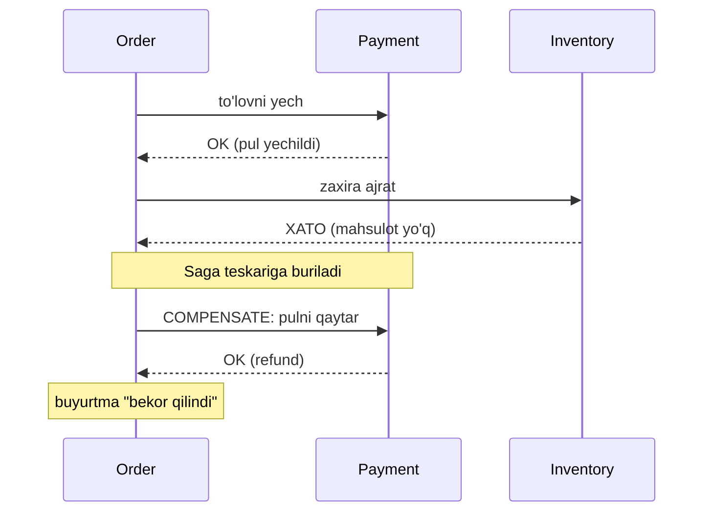
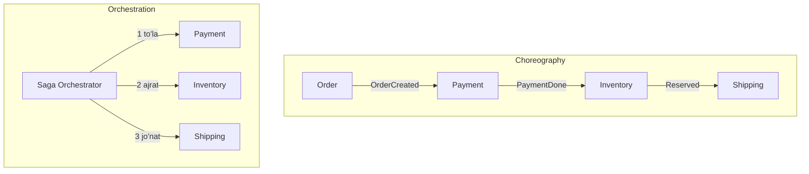
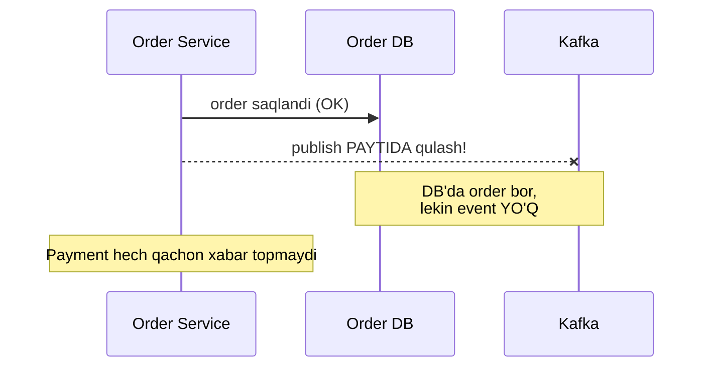
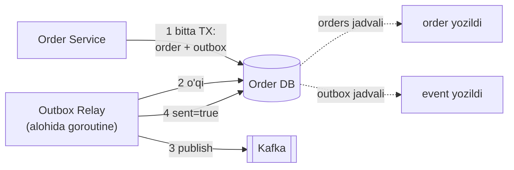

# 5.5 — Kafka amaliyoti, Saga va Outbox

> O'tgan darslarda queue va pub/sub g'oyasini o'rgandik. Endi ikki amaliy savol qoladi: **(1) Go'da Kafka producer/consumer'ni qanday yozamiz?** va **(2) bir necha servisga tarqalgan bitta tranzaksiyani qanday to'g'ri boshqaramiz?** Bu — event-driven arxitekturaning "og'ir artilleriyasi": **Saga** va **Outbox**.

## Bu darsning xaritasi



> Eslatma: **Kafka arxitekturasi** (topic, partition, offset, consumer group) [03-pub-sub-va-fan-out.md](03-pub-sub-va-fan-out.md) darsida, **RabbitMQ vs Kafka** taqqoslashi esa [02-messaging-queue.md](02-messaging-queue.md) darsida to'liq berilgan. Bu darsda ularni takrorlamaymiz — faqat amaliyot va ikki yangi patternga o'tamiz.

---

## 1. Go amaliyoti: kafka-go bilan producer va consumer

O'tgan darsda `kafka.NewReader` va `GroupID` g'oyasini snippet ko'rinishida ko'rgandik. Endi to'liq, ishlaydigan **producer** va **consumer**'ni yig'amiz. Kutubxona: `github.com/segmentio/kafka-go`.

### Producer — event'ni topic'ga yozadi

```go
// --- 1-qadam: yuboriladigan event tuzilmasi ---
type OrderCreated struct {
    OrderID string  `json:"order_id"`
    UserID  string  `json:"user_id"`
    Amount  float64 `json:"amount"`
}

// --- 2-qadam: writer yaratamiz (topic'ga ulanish) ---
writer := &kafka.Writer{
    Addr:     kafka.TCP("localhost:9092"),
    Topic:    "order.created",
    Balancer: &kafka.LeastBytes{}, // partition tanlash strategiyasi
}

// --- 3-qadam: event'ni JSON qilib yozamiz ---
data, _ := json.Marshal(OrderCreated{OrderID: "order-42", UserID: "u7", Amount: 500})
err := writer.WriteMessages(context.Background(), kafka.Message{
    Key:   []byte("order-42"), // key = ordering uchun (03-dars)
    Value: data,
})
```

**Notional machine:** `WriteMessages` event'ni bevosita diskka yozmaydi — u broker'ga (Kafka serveri) tarmoq orqali yuboradi. `Key` maydonini `hash(key) % partitionSoni` formulasi partition tanlashda ishlatadi, shuning uchun `"order-42"`ning barcha eventlari **bir partition**'ga tushadi (03-darsdagi ordering g'oyasi). `Balancer` esa key berilmagan xabarlar uchun partition tanlaydi.

### Consumer — topic'dan o'z group'i bilan o'qiydi

```go
// --- 1-qadam: reader (GroupID = shu servisning identifikatori) ---
reader := kafka.NewReader(kafka.ReaderConfig{
    Brokers: []string{"localhost:9092"},
    Topic:   "order.created",
    GroupID: "notification-service", // 03-dars: group = fan-out birligi
})

// --- 2-qadam: cheksiz siklda xabar o'qiymiz ---
for {
    msg, err := reader.ReadMessage(context.Background()) // xabar kelguncha bloklanadi
    if err != nil {
        log.Printf("o'qish xatosi: %v", err)
        continue
    }
    // --- 3-qadam: JSON'ni parse qilib, ishlaymiz ---
    var event OrderCreated
    json.Unmarshal(msg.Value, &event)
    log.Printf("Email yuborilmoqda: order=%s user=%s", event.OrderID, event.UserID)
}
```

**Output** (topic'ga uch event yozilsa):

```
Email yuborilmoqda: order=order-42 user=u7
Email yuborilmoqda: order=order-43 user=u9
Email yuborilmoqda: order=order-44 user=u3
```

**Notional machine:** `ReadMessage` avtomatik ravishda `notification-service` group'ining **offset**'ini boshqaradi — muvaffaqiyatli o'qilgan joyni Kafka'da belgilab qo'yadi (commit). Shuning uchun servis qayta ishga tushsa, o'zi to'xtagan joydan davom etadi, boshidan o'qimaydi. Boshqa `GroupID`li servis esa o'z mustaqil offseti bilan **shu eventlarni yana** oladi (fan-out).

> 🤔 **O'ylab ko'r:** `notification-service` xabarni o'qidi, email yubordi, lekin offset commit qilinishidan **oldin** servis qulab tushdi. Servis qayta ishga tushganda nima bo'ladi?

<details>
<summary>💡 Javobni ko'rish</summary>

Offset commit qilinmagani uchun Kafka o'sha xabarni **qayta beradi** — email **ikkinchi marta** yuboriladi. Bu aynan o'tgan darsdagi **at-least-once** kafolati: yo'qotmaymiz, lekin takror bo'lishi mumkin. Yechim — [02-messaging-queue.md](02-messaging-queue.md) dagi **idempotent consumer**: har event ID'sini eslab qolib, takrorini e'tiborsiz qoldirish.
</details>

---

## 2. Muammo: bir tranzaksiya, ko'p servis

Monolithda pul o'tkazish oson edi: bitta DB tranzaksiyasi — `BEGIN ... COMMIT` — ichida hamma narsa **atomik** (yo hammasi bajariladi, yo hech biri). Bu ACID kafolati.

Endi microservices'da: buyurtma yaratish uchun **uch alohida servis** kerak, har birining **o'z DB'si** bor:



Muammo: **bularni bitta `BEGIN ... COMMIT` ichiga solib bo'lmaydi**. Payment DB va Inventory DB — alohida serverlar. Agar to'lov o'tdi-yu, zaxira ajratishda xatolik chiqsa — pul yechildi, lekin mahsulot yo'q. **Yarim bajarilgan tranzaksiya** — falokat.

Klassik yechim (ikki fazali commit, 2PC) sekin va mo'rt. Microservices dunyosida boshqacha yo'l tanlanadi — **Saga**.

---

## 3. Saga pattern — bosqichma-bosqich tranzaksiya

### Analogiya: sayohat bron qilish

Sayohatni tasavvur qil: **samolyot** + **mehmonxona** + **avtomobil** bron qilyapsan. Bularni bir vaqtda "atomik" bron qilib bo'lmaydi — har biri alohida kompaniya. Sen ketma-ket bron qilasan:

1. Samolyot — OK.
2. Mehmonxona — OK.
3. Avtomobil — **joy yo'q!**

Endi nima qilasan? Boshidan hammasini **bekor qilasan** (undo): mehmonxonani bekor qil, samolyotni bekor qil. Har muvaffaqiyatli qadamning **teskarisi** (compensating action) bor.

> **Saga** — bir necha lokal tranzaksiyaning ketma-ketligi. Har qadam o'z DB'sida mustaqil commit qiladi; agar keyingi qadam xato bersa, oldingi qadamlar **compensating action** (qaytaruvchi amal) bilan bekor qilinadi.

**Analogiya chegarasi:** DB tranzaksiyasidan farqi — Saga'da "rollback" avtomatik emas. Sen **har qadam uchun teskari amalni o'zing yozishing** kerak (to'lovni qaytarish, zaxirani bo'shatish). Va oraliq holat qisqa vaqt **ko'rinib turadi** (eventual consistency).

### Diagramma — muvaffaqiyat va compensation



Har oldinga qadamning (`to'lovni yech`, `zaxira ajrat`) o'z **teskarisi** bor (`pulni qaytar`, `zaxirani bo'shat`). Xato chiqqan joydan orqaga qarab compensation ishlaydi.

### Ikki uslub: Choreography vs Orchestration

Saga'ni **kim boshqaradi** — mana shu bo'yicha ikki uslub bor:

| | Choreography (raqs) | Orchestration (dirijyor) |
| --- | --- | --- |
| **Boshqaruv** | Markazsiz — har servis eventga qarab o'zi reaksiya qiladi | Markaziy **orchestrator** buyruq beradi |
| **Aloqa** | Event (pub/sub, 03-dars) | Buyruq/javob |
| **Yaxshi tomoni** | Bo'sh bog'langan (loosely coupled), oson qo'shiladi | Oqim bir joyda ko'rinadi, kuzatish oson |
| **Yomon tomoni** | Oqimni tushunish qiyin (tarqoq) | Orchestrator single point, coupling ortadi |
| **Qachon** | Kam qadamli, sodda oqim | Ko'p qadamli, murakkab oqim |



**Choreography**'da markaziy "boshliq" yo'q — har servis event eshitadi va o'z ishini qilib, keyingi event chiqaradi (aynan 03-darsdagi pub/sub). **Orchestration**'da esa bitta **orchestrator** har qadamni chaqiradi va javobni kutadi.

> **Oltin qoida:** Sodda, kam qadamli oqim — **choreography** (event'lar bilan tabiiy). Murakkab, ko'p shartli, kuzatilishi kerak bo'lgan oqim — **orchestration** (markaziy boshqaruv). Ikkalasida ham har qadamning **compensating action**'i bo'lishi shart.

### Ko'p uchraydigan xatolar — Saga

⚠️ **Xato 1: compensating action'ni unutish.** "Zaxira ajrat" yozib, "zaxirani bo'shat"ni yozmaslik. Xato chiqqanda tizim yarim holatda qotib qoladi. Har oldinga qadamga **teskari qadam** yoz.

⚠️ **Xato 2: compensation'ni idempotent qilmaslik.** Retry tufayli "pulni qaytar" ikki marta chaqirilib, mijozga ikki marta refund bo'lishi mumkin. Compensating action ham [idempotent](02-messaging-queue.md) bo'lishi kerak.

⚠️ **Xato 3: Saga'ni ACID deb o'ylash.** Saga oraliqda **ko'rinadigan** yarim holatga ega (pul yechildi, buyurtma hali tasdiqlanmagan). Bu — **eventual consistency**, sof atomiklik emas. UI'da buni hisobga ol ("buyurtma qayta ishlanmoqda").

---

## 4. Muammo: DB va event'ni birga yozish (dual-write)

Endi yana nozik joy. `CreateOrder` **ikki ish** qilishi kerak:

1. Buyurtmani **Order DB**'ga yozish.
2. `OrderCreated` event'ini **Kafka**'ga yuborish (Saga'ning keyingi qadamlari shundan boshlanadi).

Sodda kod shunday yozadi:

```go
db.Save(order)              // 1. DB'ga yoz
kafka.Publish(orderEvent)   // 2. Kafka'ga yubor
```

Lekin bu **bomba**. DB va Kafka — ikki alohida tizim, ular orasida **bitta tranzaksiya yo'q**:



- Agar DB yozildi-yu, Kafka'ga yuborishdan oldin servis qulasa — buyurtma bor, lekin **hech kim bilmaydi** (email yo'q, to'lov yo'q).
- Agar avval Kafka'ga yuborsak-u, DB yozish xato bersa — **event bor, buyurtma yo'q** (arvoh buyurtma).

Bu — **dual-write problem** (ikkilamchi yozuv muammosi): ikki turli tizimga yozishni atomik qilib bo'lmaydi.

---

## 5. Outbox pattern — yechim

### Analogiya: stol ustidagi "jo'natiladigan" lagancha

Ofisda xat yozganingda ikki ish qilasan: xatni **daftaringga** yozib qo'yasan VA nusxasini stoldagi **"jo'natiladigan" laganchaga** (outbox tray) tashlaysan — **bir harakatda**. Keyin pochtachi vaqti-vaqti bilan kelib laganchadan xatlarni oladi va jo'natadi. Sen pochtachini kutmaysan.

> **Outbox pattern** — event'ni Kafka'ga to'g'ridan-to'g'ri yubormaymiz. Uni biznes-ma'lumot bilan **bir xil DB tranzaksiyasi** ichida maxsus `outbox` jadvaliga yozamiz. Alohida jarayon (**relay**/**publisher**) `outbox`ni o'qib, Kafka'ga yuboradi va yuborilganini belgilaydi.

Sehr shu: `orders` va `outbox` — **bitta DB**da, shuning uchun ularni **bitta tranzaksiya** qamrab oladi. Yo ikkalasi ham yoziladi, yo hech biri. Dual-write muammosi yo'qoladi.

### Diagramma



### Worked example — Go'da Outbox

```go
// --- 1-qadam: order va event BITTA tranzaksiyada yoziladi ---
func CreateOrder(db *sql.DB, order Order) error {
    tx, err := db.Begin()
    if err != nil {
        return err
    }
    defer tx.Rollback() // commit bo'lmasa hammasi bekor

    // 1a. biznes-ma'lumot: order
    _, err = tx.Exec("INSERT INTO orders (id, amount) VALUES ($1, $2)",
        order.ID, order.Amount)
    if err != nil {
        return err
    }

    // 1b. SHU tranzaksiyada outbox'ga event ham yoziladi
    payload, _ := json.Marshal(OrderCreated{OrderID: order.ID})
    _, err = tx.Exec(
        "INSERT INTO outbox (topic, payload, sent) VALUES ($1, $2, false)",
        "order.created", payload)
    if err != nil {
        return err
    }

    // --- 2-qadam: commit = order va event birga saqlanadi (atomik) ---
    return tx.Commit()
}
```

Va alohida **relay** (fon jarayoni) `outbox`ni Kafka'ga uzatadi:

```go
// --- 3-qadam: relay outbox'dan yuborilmaganlarni o'qib Kafka'ga uzatadi ---
func RelayLoop(db *sql.DB, writer *kafka.Writer) {
    for {
        rows, _ := db.Query("SELECT id, topic, payload FROM outbox WHERE sent = false")
        for rows.Next() {
            var id int
            var topic string
            var payload []byte
            rows.Scan(&id, &topic, &payload)

            // Kafka'ga yubor, so'ng "sent" deb belgila
            if err := writer.WriteMessages(context.Background(),
                kafka.Message{Topic: topic, Value: payload}); err == nil {
                db.Exec("UPDATE outbox SET sent = true WHERE id = $1", id)
            }
        }
        time.Sleep(time.Second) // har soniyada tekshir
    }
}
```

**Notional machine:** Endi hech qachon "order bor, event yo'q" holati bo'lmaydi. `CreateOrder` commit qilinganda ikkalasi **birga** diskda. Servis relay'dan **oldin** qulasa ham — event `outbox`da xavfsiz turadi, relay keyin uni topib yuboradi. Agar relay Kafka'ga yuborib bo'lib, `sent=true` qilishdan oldin qulasa — keyin o'sha event **yana** yuboriladi (at-least-once). Shuning uchun consumer baribir **idempotent** bo'lishi kerak.

> 🤔 **O'ylab ko'r:** Relay event'ni Kafka'ga muvaffaqiyatli yubordi, lekin `UPDATE outbox SET sent=true` bajarilishidan oldin qulab tushdi. Qayta ishga tushganda nima bo'ladi?

<details>
<summary>💡 Javobni ko'rish</summary>

Event `outbox`da hali `sent=false` bo'lib turibdi, shuning uchun relay uni **yana** Kafka'ga yuboradi — bir event ikki marta ketadi. Bu at-least-once. Yo'qotish yo'q (asosiysi shu), lekin takror bor. Yechim — consumer'ni event ID bo'yicha idempotent qilish. Outbox "yo'qolmaslikni" kafolatlaydi, "takrorlanmaslikni" esa idempotent consumer ta'minlaydi.
</details>

### Ko'p uchraydigan xatolar — Outbox

⚠️ **Xato 1: outbox'ni alohida DB'ga yozish.** Agar `outbox` biznes-ma'lumotdan **boshqa** DB'da bo'lsa, yana dual-write! Outbox biznes-ma'lumot bilan **bir xil DB**da bo'lishi shart — shundagina bir tranzaksiya qamrab oladi.

⚠️ **Xato 2: yuborilgan yozuvlarni tozalamaslik.** `outbox` jadvali cheksiz o'sadi. `sent=true` bo'lganlarni vaqti-vaqti bilan arxivlab yoki o'chirib tur (cron).

⚠️ **Xato 3: relay'ni idempotency o'rniga deb bilish.** Outbox faqat **yo'qolmaslikni** kafolatlaydi. Takror yuborish baribir bo'ladi — consumer idempotent bo'lishi shart.

---

## 6. Kafka yoki RabbitMQ — Saga/Outbox nuqtai nazaridan

To'liq taqqoslash [02-messaging-queue.md](02-messaging-queue.md) darsida. Bu yerda faqat qisqa amaliy maslahat:

- **Saga choreography** uchun ko'pincha **Kafka** qulay — eventlar saqlanadi (log modeli), yangi servis qo'shilsa o'z group'i bilan **eski eventlarni ham** o'qiy oladi (replay), Saga tarixini tiklash mumkin.
- **Orchestration** buyruq/javob uslubi uchun **RabbitMQ** ham yaxshi — aniq marshrutlash (routing) va per-message ack kerak bo'lganda.

> Qisqasi: event oqimi + replay kerak bo'lsa Kafka; murakkab routing + klassik task queue kerak bo'lsa RabbitMQ. Batafsili — 02-dars.

---

## Xulosa

- **kafka-go**: `Writer` bilan produce, `Reader` + `GroupID` bilan consume; offset avtomatik boshqariladi.
- Microservices'da **bir tranzaksiya ko'p servisga** tarqaladi — bitta `BEGIN...COMMIT` ishlamaydi.
- **Saga** — lokal tranzaksiyalar ketma-ketligi; har qadamning **compensating action**'i bor.
- Saga ikki uslub: **choreography** (event, markazsiz) va **orchestration** (markaziy dirijyor).
- **Dual-write** — DB va Kafka'ga birga yozishni atomik qilib bo'lmaydi.
- **Outbox** — event'ni biznes-ma'lumot bilan **bir DB tranzaksiyasida** `outbox` jadvaliga yozib, relay orqali Kafka'ga uzatish.
- Outbox yo'qolmaslikni beradi, takrorni esa **idempotent consumer** hal qiladi.

## 🧠 Eslab qol

- Saga = qadam-qadam tranzaksiya + har qadamga teskari amal.
- Compensating action'ni yozishni unutma va idempotent qil.
- Saga = eventual consistency, ACID emas.
- Outbox: order + event bitta DB tranzaksiyasida.
- Outbox + idempotent consumer = ishonchli event yetkazish.

## ✅ O'z-o'zini tekshir (retrieval practice)

<details>
<summary>1. Nega microservices'da to'lov + zaxira ajratishni bitta DB tranzaksiyasiga solib bo'lmaydi?</summary>

Chunki har servis (Payment, Inventory) **o'z alohida DB'siga** ega — ular turli serverlar. Bitta `BEGIN...COMMIT` faqat **bitta DB** ichida atomiklik beradi, ikki alohida DB'ni qamramaydi. Shuning uchun Saga ishlatiladi: har servis o'z DB'sida mustaqil commit qiladi, xato bo'lsa compensating action bilan orqaga qaytariladi.
</details>

<details>
<summary>2. Saga'da "compensating action" nima va nega u avtomatik emas?</summary>

Compensating action — muvaffaqiyatli bajarilgan qadamning **teskarisi** (to'lovni qaytar, zaxirani bo'shat). DB rollback'idan farqli, uni tizim avtomatik qilmaydi — chunki qadamlar allaqachon **commit** bo'lgan, alohida DB'larda. Shuning uchun har oldinga qadam uchun teskari amalni **dasturchi o'zi yozishi** kerak.
</details>

<details>
<summary>3. Dual-write muammosi aniq qanday ziyon keltiradi?</summary>

DB'ga yozib, Kafka'ga yuborishdan oldin servis qulasa — buyurtma bor, lekin event yo'q, hech kim (Payment, Notification) xabar topmaydi. Teskarisi: avval Kafka'ga yuborib, DB yozish xato bersa — event bor, buyurtma yo'q (arvoh buyurtma). Ikki tizimga yozish atomik emasligi tufayli tizim **nomuvofiq holatda** qoladi.
</details>

<details>
<summary>4. Outbox nima uchun ishlaydi — sehri qayerda?</summary>

`outbox` jadvali biznes-ma'lumot bilan **bir xil DB**da bo'lgani uchun, order yozish va event yozish **bitta DB tranzaksiyasi** ichiga tushadi — yo ikkalasi, yo hech biri (atomik). Kafka'ga yuborish esa keyin, alohida relay tomonidan bajariladi; event `outbox`da xavfsiz turgani uchun servis qulasa ham yo'qolmaydi.
</details>

<details>
<summary>5. Outbox bo'lsa ham nega consumer idempotent bo'lishi kerak?</summary>

Relay event'ni Kafka'ga yuborib, `sent=true` qilishdan oldin qulasa, qayta ishga tushganda o'sha event'ni **yana** yuboradi (at-least-once). Outbox faqat yo'qolmaslikni kafolatlaydi, takrorni emas. Takrorni consumer event ID bo'yicha idempotent ishlab hal qiladi.
</details>

## 🛠 Amaliyot

1. **Oson (Modify):** Yuqoridagi kafka-go consumer'ga **idempotency** qo'sh: ishlangan `OrderID`'larni `map[string]bool`da eslab qolib, takror kelganini o'tkazib yubor (02-darsdagi pattern).

   <details>
   <summary>💡 Hint</summary>

   `var processed = map[string]bool{}`; `ReadMessage`dan keyin `if processed[event.OrderID] { continue }`; ish tugagach `processed[event.OrderID] = true`. Haqiqiy tizimda `map` o'rniga DB unique constraint yoki Redis.
   </details>

2. **O'rta (faded example):** Quyidagi Saga orchestrator skeletini to'ldir (choreography emas, orchestration):

   ```go
   func RunOrderSaga(orderID string) error {
       // TODO: 1) Payment.Charge(orderID) chaqir; xato bo'lsa return
       // TODO: 2) Inventory.Reserve(orderID) chaqir;
       //          xato bo'lsa Payment.Refund(orderID) (compensate) va return
       // TODO: 3) Shipping.Schedule(orderID) chaqir;
       //          xato bo'lsa Inventory.Release + Payment.Refund va return
       return nil
   }
   ```

   <details>
   <summary>💡 Hint</summary>

   Har qadamdan keyin `if err != nil` tekshir va **teskari tartibda** compensating action'larni chaqir. 3-qadam xato bersa: avval `Inventory.Release`, keyin `Payment.Refund` — oxirgi bajarilgandan boshiga qarab. Har compensation'ni idempotent yoz.
   </details>

3. **Qiyin (Make):** "Restoran buyurtmasi" uchun Saga loyihala: `Buyurtma → To'lov → Oshpazga yuborish → Kuryer tayinlash`. Har qadamning compensating action'ini yoz, choreography yoki orchestration tanla va sababini asosla. Har servis event'ini Outbox bilan qanday ishonchli yuborishini tasvirla. Diagramma chiz.

   <details>
   <summary>💡 Hint</summary>

   Ko'p qadamli, shartli oqim — **orchestration** qulayroq (kuzatiladi, bir joyda ko'rinadi). Compensations: to'lovni qaytar, oshpazga "bekor" signali, kuryerni bo'shatish. Har servis o'z DB'siga yozganda event'ni ham outbox'ga bir tranzaksiyada yozadi, relay Kafka'ga uzatadi.
   </details>

## 🔁 Takrorlash

- **Bog'liq oldingi mavzular:**
  - [02-messaging-queue.md](02-messaging-queue.md) — at-least-once, idempotency, RabbitMQ vs Kafka (bu darsda ular ustiga qurdik)
  - [03-pub-sub-va-fan-out.md](03-pub-sub-va-fan-out.md) — Kafka topic/partition/offset/consumer group, key va ordering
  - [04-monolith-microservices-service-discovery.md](04-monolith-microservices-service-discovery.md) — har servisga alohida DB (Saga muammosining ildizi)
  - [../03-malumotlar-ombori/](../03-malumotlar-ombori/) — DB tranzaksiyasi va ACID (Outbox shunga tayanadi)
- **Takrorlash jadvali:** "O'z-o'zini tekshir" savollariga → **ertaga** → **3 kundan keyin** → **1 haftadan keyin** qaytib javob ber.
- **Feynman testi:** Saga va Outbox'ni kod ishlatmasdan, do'stingga 3 jumlada tushuntir. (Maslahat: Saga uchun "sayohat bron qilish va bekor qilish", Outbox uchun "stoldagi jo'natiladigan lagancha" analogiyalaridan boshla.)
