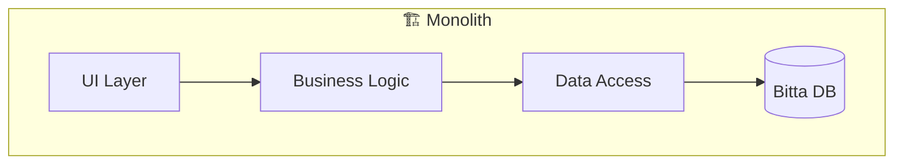
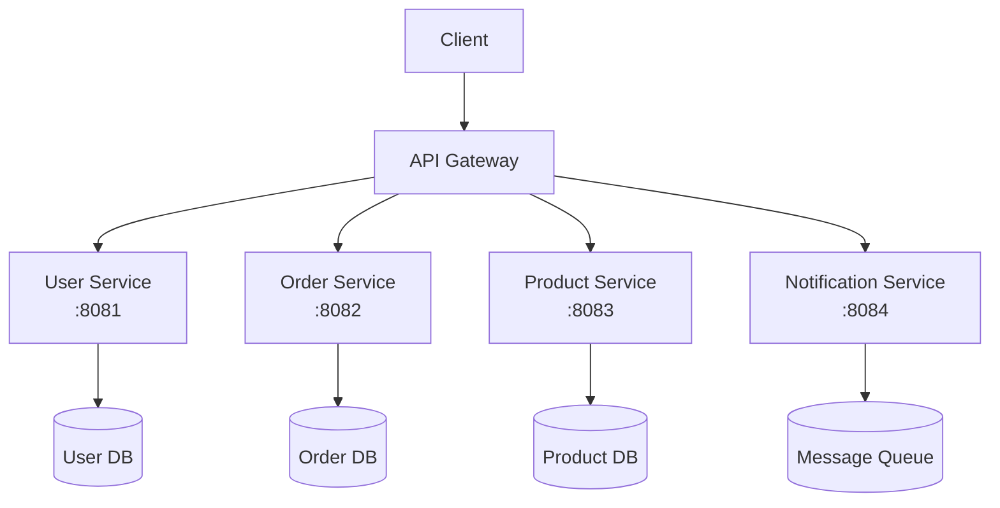
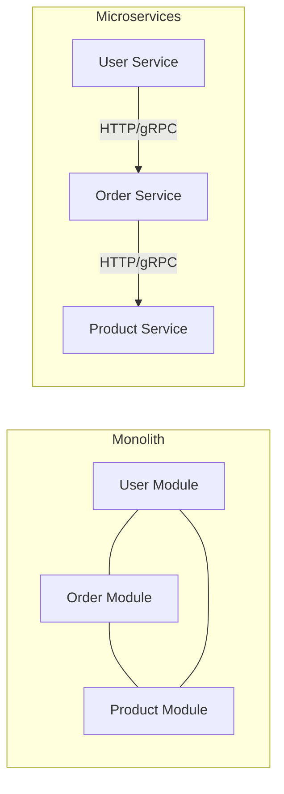
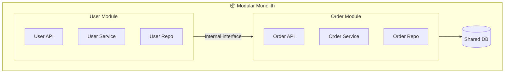
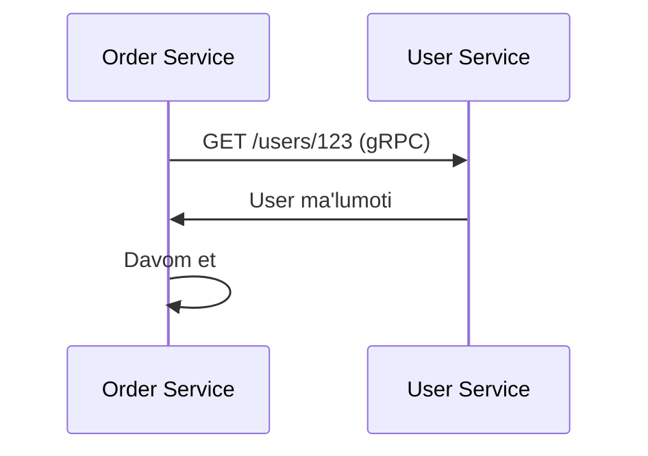
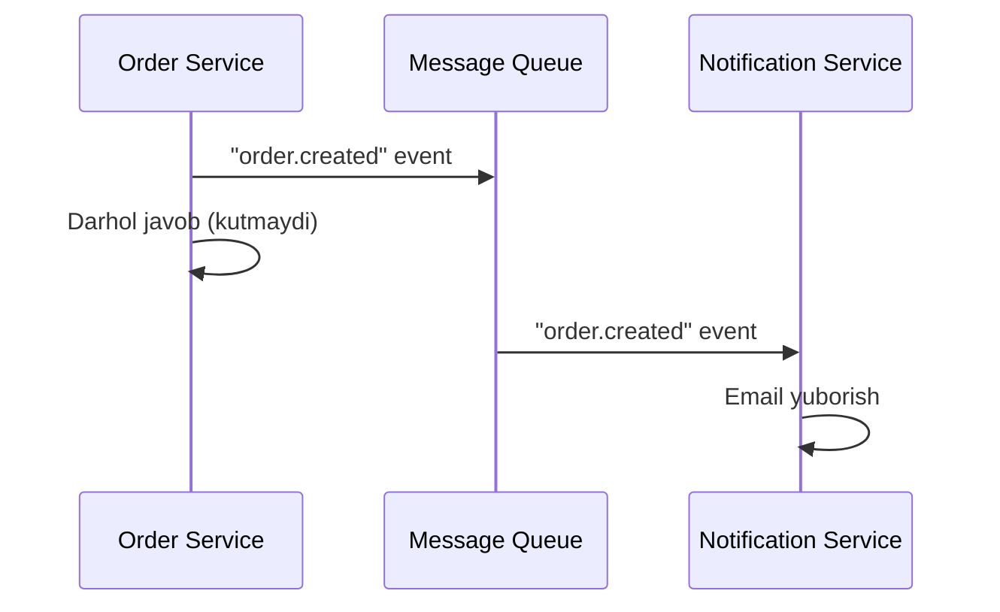
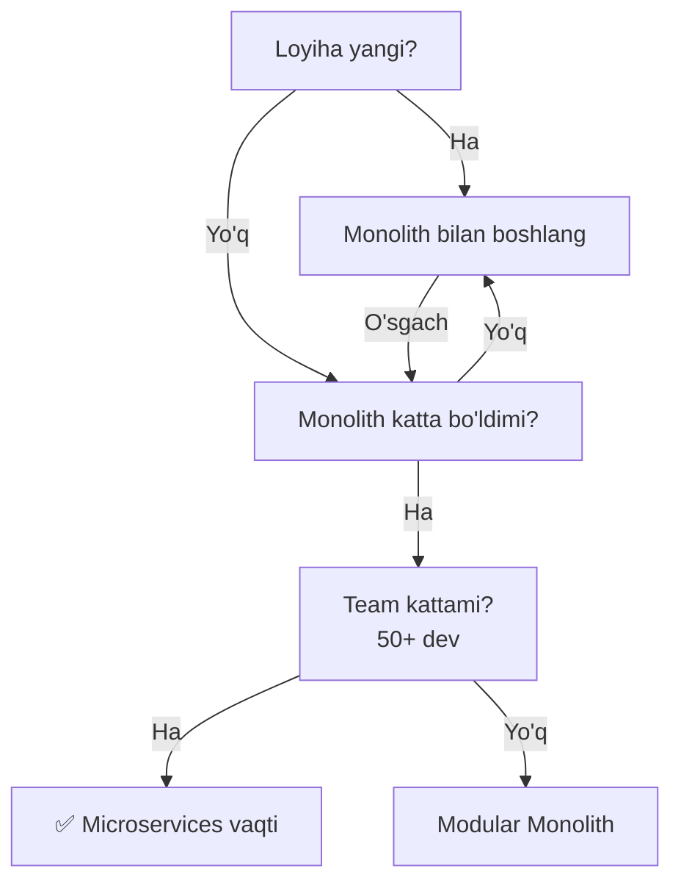

# Monolith vs Microservices

## Monolith (Yaxlit Tizim)

Butun dastur **bitta** jarayon sifatida ishlaydi.



### Afzalliklari
- Ishlab chiqish oson (boshlang'ich)
- Debug oson
- Deploy oson (bitta artifact)
- Latency past (in-process chaqiruvlar)

### Kamchiliklari
- Katta bo'lsa tushunish qiyin
- Bitta qism tushsa — hammasi tushadi
- Mustaqil deploy qilib bo'lmaydi
- Texnologiya qulflangan (bitta til, bitta framework)
- Kengaytirish qiyin

---

## Microservices (Mikroxizmatlar)

Har bir **kichik funksiya** alohida servis sifatida ishlaydi.



### Afzalliklari
- Mustaqil deploy
- Har xil texnologiya ishlatish mumkin
- Xatolikka chidamli (bitta servis tushsa — boshqalar ishlaydi)
- Mustaqil kengaytirish (faqat kerakli servis)
- Kichik team'lar mustaqil ishlaydi

### Kamchiliklari
- Murakkab arxitektura
- Tarmoq kechikishi
- Distributed transaction qiyin
- Monitoring va debugging murakkab
- Ko'p ops yuki

---

## Taqqoslash



| | Monolith | Microservices |
|--|----------|---------------|
| **Murakkablik** | Past | Yuqori |
| **Deploy** | Oson | Murakkab |
| **Kengayish** | Qiyin | Oson |
| **Xatoga chidamlilik** | Past | Yuqori |
| **Latency** | Past | Yuqori (network) |
| **Team o'lchami** | Kichik | Katta |
| **Ishlab chiqish tezligi** | Dastlab tez | Keyinchalik tez |

---

## Modular Monolith — O'rta Yo'l



Keyinchalik microservice'ga o'tish oson.

---

## Microservice Communication

### Sinxron (to'g'ridan-to'g'ri)



- REST yoki gRPC
- Tez javob kerak bo'lganda

### Asinxron (xabar orqali)



- Kafka, RabbitMQ
- Coupling pasayadi
- Xatolikka chidamli

---

## Go'da Microservice Misoli

```go
// user-service/main.go
package main

import (
    "encoding/json"
    "net/http"
    "github.com/go-chi/chi/v5"
)

type User struct {
    ID    string `json:"id"`
    Name  string `json:"name"`
    Email string `json:"email"`
}

func main() {
    r := chi.NewRouter()

    r.Get("/users/{id}", func(w http.ResponseWriter, r *http.Request) {
        id := chi.URLParam(r, "id")
        user := User{ID: id, Name: "Ali", Email: "ali@example.com"}
        w.Header().Set("Content-Type", "application/json")
        json.NewEncoder(w).Encode(user)
    })

    r.Get("/health", func(w http.ResponseWriter, r *http.Request) {
        w.WriteHeader(http.StatusOK)
        w.Write([]byte(`{"status":"ok"}`))
    })

    http.ListenAndServe(":8081", r)
}
```

```go
// order-service/main.go
package main

import (
    "encoding/json"
    "fmt"
    "net/http"
)

type Order struct {
    ID     string  `json:"id"`
    UserID string  `json:"user_id"`
    Amount float64 `json:"amount"`
}

type OrderWithUser struct {
    Order
    UserName string `json:"user_name"`
}

func getOrder(w http.ResponseWriter, r *http.Request) {
    order := Order{ID: "o1", UserID: "123", Amount: 50000}

    // User Service'ga so'rov
    resp, err := http.Get(fmt.Sprintf("http://user-service:8081/users/%s", order.UserID))
    if err != nil {
        http.Error(w, "User service unavailable", http.StatusServiceUnavailable)
        return
    }
    defer resp.Body.Close()

    var user struct{ Name string `json:"name"` }
    json.NewDecoder(resp.Body).Decode(&user)

    result := OrderWithUser{Order: order, UserName: user.Name}
    json.NewEncoder(w).Encode(result)
}
```

---

## Qachon Microservices?



> **Qoida:** Avval monolith, keyin agar kerak bo'lsa microservice'ga o'ting.

---

## Keyingi Qadam

→ [2. Service Discovery.md](2.%20Service%20Discovery.md)
