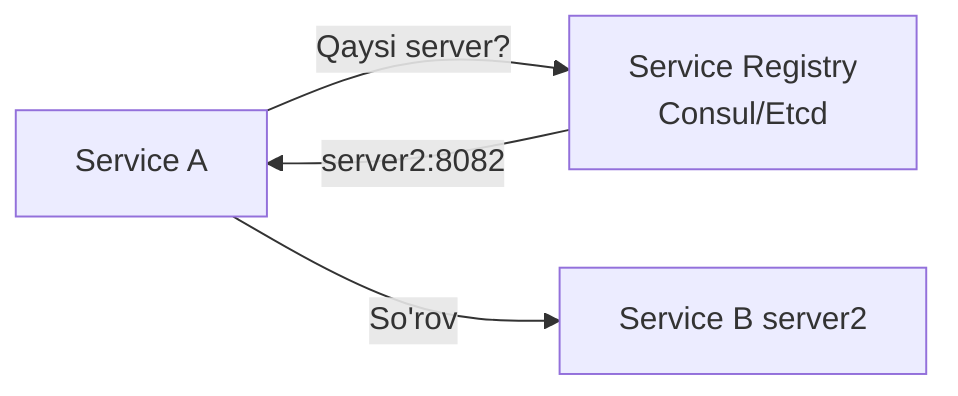
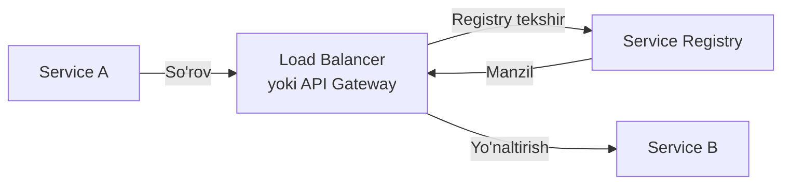
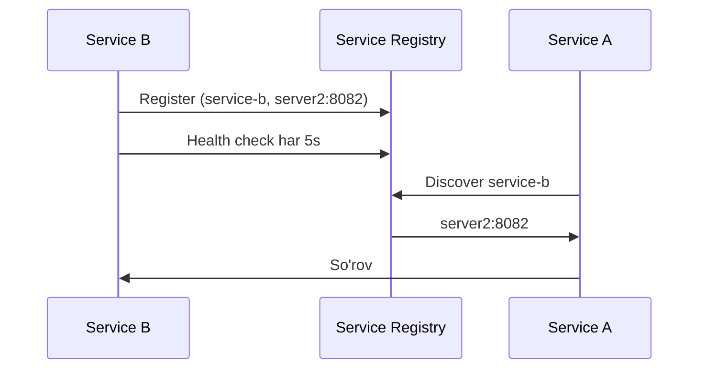
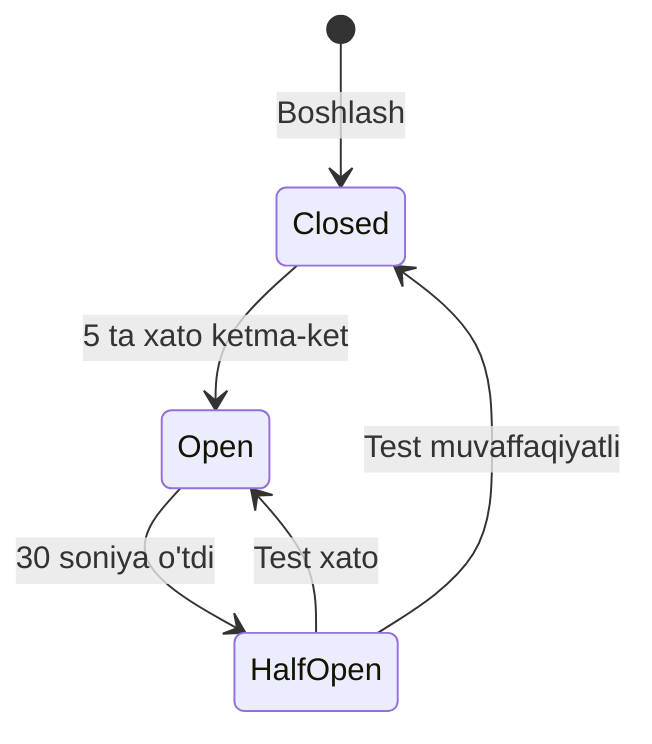

# Service Discovery va Communication

## Muammo

```
Microservice A → Microservice B'ga so'rov yuborish kerak
Lekin B qaysi IP:PORT da?
Agar B ko'paytirilsa (scaling), qaysi biriga yuboramiz?
```

---

## Service Discovery Turlari

### Client-side Discovery



Mijoz (Service A) o'zi registry'dan manzilni oladi va to'g'ridan-to'g'ri bog'lanadi.

### Server-side Discovery



Load Balancer o'zi registry'dan manzilni oladi.

---

## Service Registry

Barcha servislarning manzilini saqlaydigan ma'lumotlar bazasi.



**Mashhur Registry'lar:** Consul, Etcd, Zookeeper

---

## Go'da Service Registry (Consul bilan)

```go
package main

import (
    "fmt"
    "log"
    "github.com/hashicorp/consul/api"
)

// Servisni ro'yxatga olish
func registerService(name, id, host string, port int) error {
    client, err := api.NewDefaultClient()
    if err != nil {
        return err
    }

    return client.Agent().ServiceRegister(&api.AgentServiceRegistration{
        ID:      id,
        Name:    name,
        Address: host,
        Port:    port,
        Check: &api.AgentServiceCheck{
            HTTP:     fmt.Sprintf("http://%s:%d/health", host, port),
            Interval: "5s",
            Timeout:  "2s",
        },
    })
}

// Servis manzilini topish
func discoverService(name string) (string, int, error) {
    client, _ := api.NewDefaultClient()

    services, _, err := client.Health().Service(name, "", true, nil)
    if err != nil || len(services) == 0 {
        return "", 0, fmt.Errorf("servis topilmadi: %s", name)
    }

    svc := services[0].Service
    return svc.Address, svc.Port, nil
}

func main() {
    // Servisni ro'yxatga olish
    err := registerService("order-service", "order-1", "localhost", 8082)
    if err != nil {
        log.Fatal(err)
    }

    // Boshqa servisni topish
    host, port, err := discoverService("user-service")
    if err != nil {
        log.Fatal(err)
    }
    fmt.Printf("User Service: %s:%d\n", host, port)
}
```

---

## Load Balancing (Client-side)

```go
type ServiceClient struct {
    name      string
    instances []string // IP:PORT ro'yxati
    counter   uint64
    mu        sync.RWMutex
}

func (sc *ServiceClient) nextInstance() string {
    sc.mu.RLock()
    defer sc.mu.RUnlock()
    if len(sc.instances) == 0 {
        return ""
    }
    idx := atomic.AddUint64(&sc.counter, 1) % uint64(len(sc.instances))
    return sc.instances[idx]
}

func (sc *ServiceClient) Get(path string) (*http.Response, error) {
    instance := sc.nextInstance()
    if instance == "" {
        return nil, fmt.Errorf("servis mavjud emas: %s", sc.name)
    }
    url := fmt.Sprintf("http://%s%s", instance, path)
    return http.Get(url)
}
```

---

## Circuit Breaker bilan Service Call



```go
type CircuitBreaker struct {
    maxFailures  int
    timeout      time.Duration
    failures     int
    lastFailure  time.Time
    state        string // "closed", "open", "half-open"
    mu           sync.Mutex
}

func (cb *CircuitBreaker) Call(fn func() error) error {
    cb.mu.Lock()
    defer cb.mu.Unlock()

    switch cb.state {
    case "open":
        if time.Since(cb.lastFailure) > cb.timeout {
            cb.state = "half-open"
        } else {
            return fmt.Errorf("circuit breaker ochiq — servis mavjud emas")
        }
    }

    err := fn()
    if err != nil {
        cb.failures++
        cb.lastFailure = time.Now()
        if cb.failures >= cb.maxFailures {
            cb.state = "open"
        }
        return err
    }

    cb.failures = 0
    cb.state = "closed"
    return nil
}
```

---

## Keyingi Qadam

→ [3. Message Queue.md](3.%20Message%20Queue.md)
