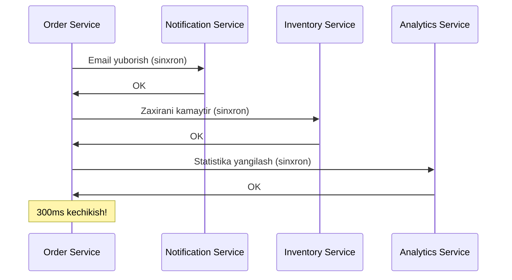
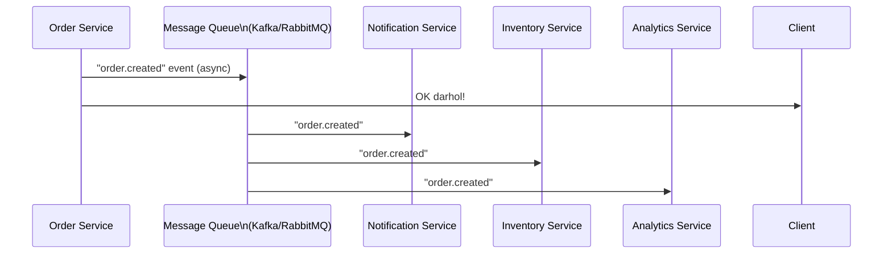
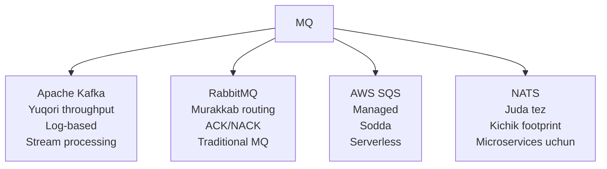
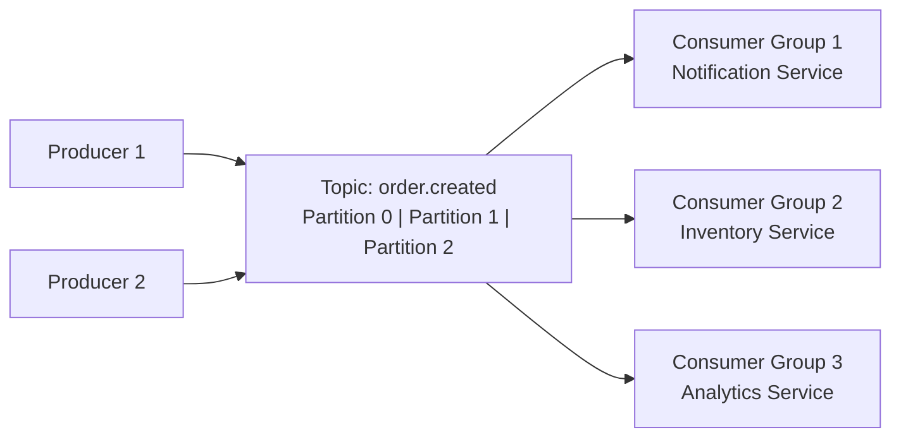
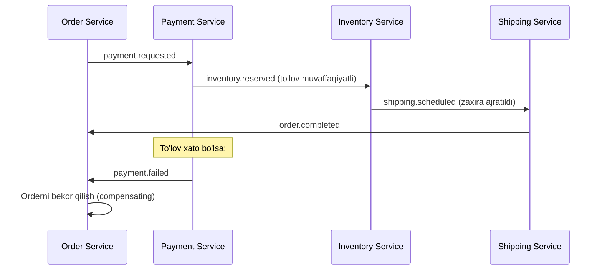

# Message Queue va Event-Driven Arxitektura

## Muammo: Tight Coupling



---

## Yechim: Message Queue



---

## Message Queue Turlari



---

## Kafka Arxitekturasi



**Topic** — xabarlar kategoriyasi
**Partition** — parallel o'qish uchun bo'limlar
**Consumer Group** — bir necha consumer bitta guruhda (har xabar bitta consumer oladi)

---

## Go'da Kafka (segmentio/kafka-go)

### Producer

```go
package main

import (
    "context"
    "encoding/json"
    "log"
    "time"

    "github.com/segmentio/kafka-go"
)

type OrderCreatedEvent struct {
    OrderID  string    `json:"order_id"`
    UserID   string    `json:"user_id"`
    Amount   float64   `json:"amount"`
    CreateAt time.Time `json:"created_at"`
}

type OrderProducer struct {
    writer *kafka.Writer
}

func NewOrderProducer(brokers []string) *OrderProducer {
    return &OrderProducer{
        writer: &kafka.Writer{
            Addr:     kafka.TCP(brokers...),
            Topic:    "order.created",
            Balancer: &kafka.LeastBytes{},
        },
    }
}

func (p *OrderProducer) PublishOrderCreated(event OrderCreatedEvent) error {
    data, err := json.Marshal(event)
    if err != nil {
        return err
    }

    return p.writer.WriteMessages(context.Background(), kafka.Message{
        Key:   []byte(event.OrderID),
        Value: data,
    })
}

func (p *OrderProducer) Close() error {
    return p.writer.Close()
}
```

### Consumer

```go
type NotificationConsumer struct {
    reader *kafka.Reader
}

func NewNotificationConsumer(brokers []string) *NotificationConsumer {
    return &NotificationConsumer{
        reader: kafka.NewReader(kafka.ReaderConfig{
            Brokers:  brokers,
            GroupID:  "notification-service",
            Topic:    "order.created",
            MinBytes: 1,
            MaxBytes: 10e6,
        }),
    }
}

func (c *NotificationConsumer) Start(ctx context.Context) {
    for {
        msg, err := c.reader.ReadMessage(ctx)
        if err != nil {
            if ctx.Err() != nil {
                return
            }
            log.Printf("Xabar o'qish xatosi: %v", err)
            continue
        }

        var event OrderCreatedEvent
        if err := json.Unmarshal(msg.Value, &event); err != nil {
            log.Printf("JSON parse xatosi: %v", err)
            continue
        }

        c.handleOrderCreated(event)
    }
}

func (c *NotificationConsumer) handleOrderCreated(event OrderCreatedEvent) {
    log.Printf("Email yuborilmoqda: order %s uchun user %s ga\n",
        event.OrderID, event.UserID)
    // Email yuborish logikasi...
}
```

---

## Event-Driven Patterns

### 1. Saga Pattern (Distributed Transaction)



### 2. Outbox Pattern

Tranzaksiya va xabar yuborishni atomik qilish:

```go
func CreateOrder(db *sql.DB, producer *OrderProducer, order Order) error {
    tx, err := db.Begin()
    if err != nil {
        return err
    }
    defer tx.Rollback()

    // 1. Orderni DB ga yoz
    _, err = tx.Exec("INSERT INTO orders (id, amount) VALUES ($1, $2)",
        order.ID, order.Amount)
    if err != nil {
        return err
    }

    // 2. Outbox jadvaliga ham yoz (ATOMIK!)
    eventData, _ := json.Marshal(OrderCreatedEvent{OrderID: order.ID})
    _, err = tx.Exec(
        "INSERT INTO outbox (topic, payload, created_at) VALUES ($1, $2, NOW())",
        "order.created", eventData,
    )
    if err != nil {
        return err
    }

    // 3. Commit
    if err = tx.Commit(); err != nil {
        return err
    }

    // 4. Alohida goroutine outbox ni o'qib Kafka ga yuboradi
    return nil
}
```

---

## RabbitMQ vs Kafka

| | RabbitMQ | Kafka |
|--|----------|-------|
| **Model** | Push (broker itaradi) | Pull (consumer oladi) |
| **Saqlash** | O'chiriladi (ack keyin) | Disk (retention period) |
| **Throughput** | O'rtacha | Juda yuqori (M/s) |
| **Routing** | Murakkab (exchange) | Oddiy (topic/partition) |
| **Replay** | ❌ | ✅ (offset) |
| **Foydalanish** | Task queue | Stream, log, event |

---

## Keyingi Qadam

→ [../6. Real-world Misollar/1. URL Shortener.md](../6.%20Real-world%20Misollar/1.%20URL%20Shortener.md)
