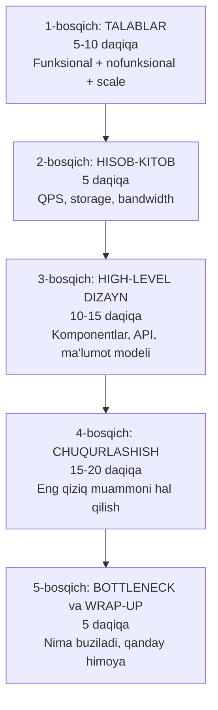
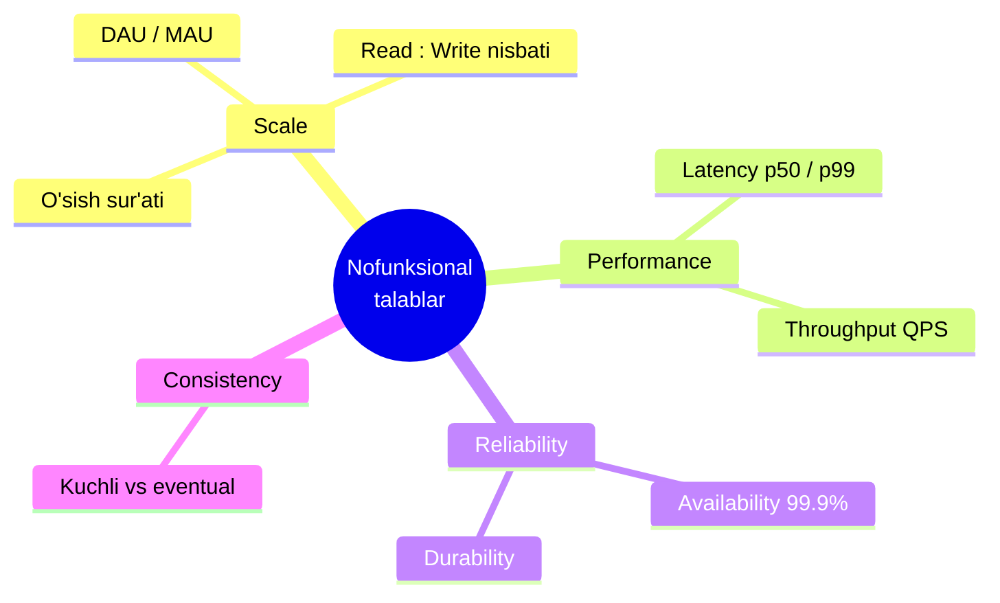
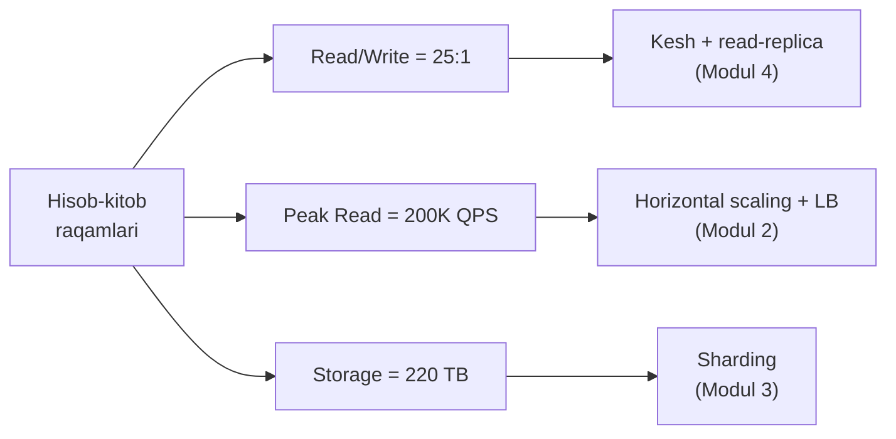

# Tizim talablarini yig'ish — intervyu frameworki

> Bu dars case-study emas — **metodika** darsi. Bu yerda "qanday o'ylash" kerakligini o'rganamiz. Keyingi 4 darsda (URL Shortener, Twitter, WhatsApp, Uber) shu metodikani amalda ishlatamiz.

---

## 1. Muammo / Hook — nega ko'p nomzod birinchi 5 daqiqada yiqiladi?

Tasavvur qil: intervyuer sendan so'raydi — **"Twitter'ni dizayn qil"**.

Ko'pchilik shu zahoti oq doskaga yuguradi va Kafka, Redis, Cassandra chizishni boshlaydi. 30 daqiqadan keyin intervyuer aytadi: *"Sen shaxsiy xabarlar (DM) tizimini quribsan, lekin men timeline haqida so'ragandim"*.

Nomzod **noto'g'ri tizimni** ideal darajada dizayn qildi. Bu — eng ko'p uchraydigan yiqilish sababi.

> Muammo: talabni aniqlashtirmasdan yechimga sakrash. Aynan shuning uchun bu dars birinchi keladi.

---

## 2. Analogiya — arxitektor va uy

System design intervyusi — bu **arxitektor bilan mijozning suhbati**.

Yaxshi arxitektor mijoz "uy quring" deganida darhol g'isht buyurtirmaydi. U avval so'raydi:
- Nechta xona kerak? (funksional talab)
- Nechta odam yashaydi? (yuk / scale)
- Zilzila bo'ladigan hududmi? (ishonchlilik)
- Byudjet qancha? (trade-off)

**Chegarasi:** analogiya bir joyda buziladi — uyni bir marta quriladi, tizim esa har kuni o'zgaradi va o'sadi. Shuning uchun biz "kelajakda 10x o'ssa nima bo'ladi?" degan savolni doim yodda tutamiz.

---

## 3. Sodda ta'rif

**Talab yig'ish (requirements gathering)** — kod yozishdan oldin "aynan nimani va qanday ko'lamda quramiz?" degan savolga aniq javob topish jarayoni.

Talablar ikki turga bo'linadi:

| Tur | Savol | Misol |
|-----|-------|-------|
| **Funksional talab** (nima qiladi) | Tizim qanday amallarni bajaradi? | "Foydalanuvchi post yozadi va uni kuzatuvchilar ko'radi" |
| **Nofunksional talab** (qanchalik yaxshi) | Tizim qanchalik tez / ishonchli / katta? | "Feed 200ms ichida ochilsin, 99.9% ishlasin" |

---

## 4. Diagramma — 45 daqiqalik intervyu xaritasi

Butun intervyuni bitta rasmga sig'diramiz. Bu — sening "kompas"ing.



> Vaqtning **yarmidan ko'pi** (4-bosqich) bitta chuqur muammoga ketadi. Talablar bo'limi qisqa, lekin uni tashlab ketsang — butun intervyu qulaydi.

---

## 5. 1-bosqich: Funksional talablarni qanday so'rab aniqlash

Funksional talab — bu tizimning "fe'llari" (yozadi, o'qiydi, kuzatadi, qidiradi).

Intervyuda **hamma narsani** dizayn qilishga urinma. Aksincha, **scope**'ni (ko'lam) toraytir. 3-4 ta asosiy funksiyani tanlab, intervyuer bilan kelish.

### Namuna dialog (Twitter uchun)

```
Sen:       Aniqlashtirsam bo'ladimi — biz timeline'ga fokuslanamizmi
           yoki DM, qidiruv, trending hammasini quramizmi?
Intervyuer: Timeline'ga fokuslan.
Sen:       Yaxshi. Demak asosiy funksiyalar:
           1. Foydalanuvchi tweet yozadi
           2. Foydalanuvchi boshqasini kuzatadi (follow)
           3. Foydalanuvchi home timeline ko'radi (kuzatganlar tweet'lari)
           Like, retweet, media — hozircha tashqarida qoldiramizmi?
Intervyuer: Ha, faqat shu 3 tasi.
```

Bu dialog **2 daqiqa** vaqt oldi, lekin butun intervyuning yo'nalishini belgiladi.

### Scope toraytirish jadvali

| Funksiya | Ichkarida (in-scope) | Tashqarida (out-of-scope) |
|----------|----------------------|---------------------------|
| Tweet yozish | ✅ | |
| Home timeline | ✅ | |
| Follow | ✅ | |
| DM, qidiruv, reklama | | ❌ (aniq aytib qo'y) |

⚠️ **Muhim:** out-of-scope narsalarni **ovoz chiqarib** ayt. Bu intervyuerga senga "kattaroq rasmni ko'rasan, lekin ataylab soddalash-tiryapman" degan signal beradi.

---

## 6. Nofunksional talablar — tizimning "sifat" o'lchamlari

Bular tizim qanchalik **katta, tez va ishonchli** bo'lishini belgilaydi. Aynan shular arxitekturani tanlashga ta'sir qiladi.



### So'rash kerak bo'lgan 5 ta savol

1. **Nechta foydalanuvchi?** — DAU (Daily Active Users) yoki MAU (Monthly Active Users)
2. **Read ko'pmi, write ko'pmi?** — nisbatni so'ra (masalan 100:1 o'qish : yozish)
3. **Qancha tez?** — latency (masalan p99 < 200ms). *p99 = so'rovlarning 99% shu vaqtdan tez javob beradi.*
4. **Qanchalik ishonchli?** — availability (99.9% = "3 to'qqiz")
5. **Consistency qanchalik muhim?** — bank pulida kuchli (strong), l: layk sonida kechikkan (eventual) bo'lsa yetarli

> **Oltin qoida:** har bir nofunksional talab keyingi arxitektura qaroringni "sotib olishing" kerak. "99.99% availability kerak" desang — replikatsiya, "yozish og'ir" desang — sharding chizasan.

---

## 7. 2-bosqich: Back-of-envelope estimation (konvertning orqasidagi hisob)

Bu — "taxminan qancha resurs kerak?" degan savolga **30 soniyada** aniq raqam berish san'ati. Nomi shundan: muhandis konvertning orqasiga qalam bilan tez hisoblab tashlaydi.

### Analogiya
Do'kon ochmoqchisan. Aniq daromadni bilmaysan, lekin "kuniga ~200 mijoz, har biri ~50 ming so'm = kuniga ~10 mln so'm" deb taxmin qila olasan. Bu — biznes uchun back-of-envelope. Biz xuddi shuni serverlar uchun qilamiz.

### Yod olish kerak bo'lgan raqamlar

**Bir kunda soniyalar:**
```
86 400 soniya ≈ 100 000 (hisobni yengillashtirish uchun yaxlitlaymiz)
```

**Ma'lumot hajmlari:**

| Birlik | Bayt | Nima sig'adi |
|--------|------|--------------|
| 1 KB | 10³ | qisqa matn / tweet |
| 1 MB | 10⁶ | kichik rasm |
| 1 GB | 10⁹ | 1000 ta rasm |
| 1 TB | 10¹² | katta jadval |
| 1 PB | 10¹⁵ | butun ma'lumotlar ombori |

**Latency raqamlari (taxminan):**

| Amal | Vaqt |
|------|------|
| Xotiradan (RAM) o'qish | 100 ns |
| SSD'dan tasodifiy o'qish | 150 µs |
| Datacenter ichida tarmoq | 0.5 ms |
| Diskdan seek | 10 ms |
| Qit'alararo tarmoq | 150 ms |

> Eslab qol: **RAM = tez, disk = sekin, tarmoq = eng sekin.** Shuning uchun kesh (RAM) tizimni tezlashtiradi.

---

## 8. Worked example — Twitter'ni hisoblash (subgoal label'lar bilan)

Keling, formulani real raqamlar bilan bosqichma-bosqich ishlatamiz.

```
// --- 1-qadam: kirish ma'lumotlari (intervyuerdan so'raymiz) ---
DAU               = 200 000 000   (200 mln kunlik faol foydalanuvchi)
Tweet/user/kun    = 2            (o'rtacha har kim 2 ta tweet yozadi)
Timeline o'qish   = 50/user/kun  (har kim kuniga 50 marta feed ochadi)

// --- 2-qadam: yozish QPS (write) ---
Yozish/kun = 200M × 2 = 400M tweet/kun
Write QPS  = 400M / 100 000 ≈ 4 000 QPS

// --- 3-qadam: o'qish QPS (read) ---
O'qish/kun = 200M × 50 = 10 000M = 10 mlrd/kun
Read QPS   = 10 000M / 100 000 ≈ 100 000 QPS

// --- 4-qadam: peak (eng yuqori) yuk = o'rtacha × 2 ---
Peak Write ≈ 8 000 QPS
Peak Read  ≈ 200 000 QPS

// --- 5-qadam: storage (5 yil saqlaymiz) ---
1 tweet ≈ 300 bayt (matn + metadata)
Kunlik  = 400M × 300 ≈ 120 GB/kun
5 yil   = 120 GB × 365 × 5 ≈ 220 TB
```

### Natijadan xulosa (eng muhim qism!)

Raqamlar o'z-o'zidan foydasiz — ulardan **arxitektura qarori** chiqarish kerak:

- Read/Write nisbati **25:1** → o'qish og'ir → **kesh va read-replica** kerak (Modul 4)
- 200 000 read QPS bitta serverga sig'maydi → **horizontal scaling + load balancer** (Modul 2)
- 220 TB bitta diskka sig'maydi → **sharding** kerak (Modul 3)

> **Oltin qoida:** hisob-kitobning maqsadi — chiroyli raqam emas, balki **"qaysi komponent kerak?"** degan qarorni asoslash.

Xuddi shu fikrni vizual ko'rinishda (raqam → qaror):



### Bandwidth (tarmoq o'tkazuvchanligi)

```
// Chiquvchi trafik = Read QPS × javob hajmi
Timeline javobi ≈ 20 tweet × 300 bayt = 6 KB
Bandwidth = 100 000 QPS × 6 KB ≈ 600 MB/s = 4.8 Gbps
```

Bu — bitta serverdan chiqmaydi, demak **CDN va bir nechta chiqish nuqtasi** kerak.

---

## 9. Predict savoli (PRIMM)

> 🤔 **O'ylab ko'r:** Agar intervyuer "DAU 200M emas, 20M" desa, sening arxitekturang qanday o'zgaradi?

<details>
<summary>💡 Javobni ko'rish</summary>

Barcha QPS raqamlari **10 barobar kamayadi**: Read QPS ≈ 10 000, Write ≈ 400.

Bu darajada:
- Sharding **hali shart emas** bo'lishi mumkin — bitta kuchli DB + read-replica yetadi.
- Kesh baribir foydali, lekin murakkab hybrid timeline shart emas.

**Xulosa:** raqam o'zgarsa — arxitektura ham soddalashadi. Aynan shuning uchun avval so'rab olamiz, keyin dizayn qilamiz. Bir xil "to'g'ri javob" yo'q — javob **scale**'ga bog'liq.

</details>

---

## 10. 3-4-5-bosqichlar — qisqacha (keyingi darslarda amalda ko'ramiz)

| Bosqich | Nima qilinadi | Maslahat |
|---------|---------------|----------|
| **High-level dizayn** | Client → LB → Server → Cache → DB chizasan. API'ni (endpoint) sanaysan. Ma'lumot modelini (jadvallar) belgilaysan. | Katta bloklardan boshla, tafsilotga kirma |
| **Chuqurlashish** | Intervyuer bitta komponentni tanlaydi ("timeline'ni qanday quyasan?"). Shu yerda trade-off ko'rsatasan. | Bu — asosiy imtihon. Vaqtning yarmi shu yerda |
| **Wrap-up** | "Nima buziladi?" — single point of failure, bottleneck, monitoring. | O'z dizayningni tanqid qil — bu balog'atlik belgisi |

---

## 11. Ko'p uchraydigan xatolar

⚠️ **Xato 1: Talab so'ramasdan yechimga sakrash**
- Noto'g'ri tasavvur: "Tez kod chizsam — bilimdon ko'rinaman".
- Nega noto'g'ri: noto'g'ri tizimni qurish xavfi + intervyuer sening tahlil qobiliyatingni ko'rmaydi.
- To'g'risi: birinchi 5 daqiqa **faqat savol ber**. "Nima quramiz?" aniq bo'lgach kod chiz.

⚠️ **Xato 2: Hisob-kitobni tashlab ketish**
- Noto'g'ri tasavvur: "Raqamlar zerikarli, arxitektura muhimroq".
- Nega noto'g'ri: sharding kerakmi yoki yo'qmi — buni faqat raqam aytadi.
- To'g'risi: 2-3 ta asosiy raqam (QPS, storage) chiqar va ulardan qaror asoslab ber.

⚠️ **Xato 3: Hamma narsani dizayn qilishga urinish**
- Noto'g'ri tasavvur: "Ko'proq funksiya = ko'proq ball".
- Nega noto'g'ri: 45 daqiqa hech narsani chuqur ko'rsatmasdan yuzaki o'tib ketasan.
- To'g'risi: 3-4 funksiyaga cheklan, bittasini chuqur och.

⚠️ **Xato 4: Jim ishlash**
- Noto'g'ri tasavvur: "O'ylab bo'lib, keyin gapiraman".
- Nega noto'g'ri: intervyuer sening **fikrlash jarayoningni** baholaydi, oxirgi javobni emas.
- To'g'risi: doim ovoz chiqarib o'yla — "hozir kesh qo'shsam, chunki read og'ir..."

---

## Xulosa

- System design intervyusi — arxitektor bilan mijoz suhbati: avval so'ra, keyin qur.
- 45 daqiqa **5 bosqichga** bo'linadi; vaqtning yarmi chuqurlashishga ketadi.
- **Funksional talab** = tizim nima qiladi; **nofunksional talab** = qanchalik katta/tez/ishonchli.
- Scope'ni ataylab torayt: 3-4 funksiya tanla, qolganini out-of-scope deb ayt.
- Back-of-envelope: `QPS = DAU × harakat / 86400`, peak = o'rtacha × 2.
- Har bir raqamdan **arxitektura qarori** chiqar (kesh, sharding, LB).
- Doim ovoz chiqarib o'yla — jarayon natijadan muhimroq.

## 🧠 Eslab qol

- Talab so'ramasdan kod chizish — 1-raqamli yiqilish sababi.
- `QPS = DAU × harakat / 86400`, peak ≈ o'rtacha × 2.
- Read/Write nisbati kesh va replika kerakligini aytadi.
- Storage sharding kerakligini aytadi.
- Out-of-scope narsalarni ovoz chiqarib ayt.

## ✅ O'z-o'zini tekshir (retrieval practice)

**1. Nega "Twitter'ni dizayn qil" deyilishi bilan darhol Kafka chizish xato?**

<details>
<summary>Javob</summary>
Chunki hali "aynan qaysi Twitter" (timeline? DM? qidiruv?) va "qancha ko'lamda" ekani noma'lum. Noto'g'ri tizimni ideal quyish xavfi bor. Avval funksional + nofunksional talablarni aniqlash kerak.
</details>

**2. DAU = 50M, har foydalanuvchi kuniga 20 ta so'rov yuborsa, o'rtacha QPS qancha? Peak-chi?**

<details>
<summary>Javob</summary>
O'rtacha: 50M × 20 = 1 mlrd/kun. 1 000 000 000 / 100 000 ≈ 10 000 QPS.
Peak ≈ 10 000 × 2 = 20 000 QPS.
</details>

**3. Read/Write nisbati 100:1 bo'lsa, arxitekturada birinchi navbatda nima qo'shasan va nega?**

<details>
<summary>Javob</summary>
Kesh (Redis) va read-replica. Chunki o'qish yozishdan 100 barobar ko'p — o'qishni tezlashtirsak, tizimning katta qismini yengillashtiramiz. DB'ni har o'qishda urmaslik uchun kesh birinchi keladi.
</details>

**4. Funksional va nofunksional talabning farqi nima? Har biriga misol ber.**

<details>
<summary>Javob</summary>
Funksional = tizim NIMA qiladi ("foydalanuvchi tweet yozadi"). Nofunksional = qanchalik YAXSHI qiladi ("tweet 200ms ichida saqlansin, 99.9% ishlasin"). Funksional — fe'l, nofunksional — sifat.
</details>

**5. Nega hisob-kitob raqamlarining o'zi yetarli emas?**

<details>
<summary>Javob</summary>
Raqam faqat vosita. Undan **qaror** chiqarish kerak: 200K QPS → LB + horizontal scaling; 220 TB → sharding; 25:1 read → kesh. Raqamsiz bu qarorlarni asoslab bo'lmaydi.
</details>

## 🛠 Amaliyot

**1. Oson (Modify).** 8-bo'limdagi Twitter hisobida DAU'ni 200M dan 500M ga o'zgartir. Yangi Read QPS va 5 yillik storage'ni hisobla.

<details>
<summary>Hint</summary>
Hammasi 2.5 barobar oshadi: Read ≈ 250 000 QPS, storage ≈ 550 TB. Xulosa: sharding yanada shoshilinch bo'ladi.
</details>

**2. O'rta (faded example).** Quyidagi hisob skeletini "Instagram" (rasm yuklash) uchun to'ldir:

```
DAU            = 100M
Rasm/user/kun  = 2
1 rasm hajmi   = 2 MB
// TODO: kunlik yuklanadigan rasmlar soni = ?
// TODO: kunlik storage (GB) = ?
// TODO: 5 yillik storage (TB/PB) = ?
// TODO: qanday xulosa? (qaysi komponent kerak?)
```

<details>
<summary>Hint</summary>
Yuklanish = 100M × 2 = 200M rasm/kun. Kunlik storage = 200M × 2MB = 400 TB/kun (!). 5 yil ≈ 730 PB. Xulosa: object storage (S3) + CDN majburiy, oddiy DB'ga sig'maydi.
</details>

**3. Qiyin (Make).** "Kunlik havolar chekli qisqartiruvchi" (URL shortener) uchun **noldan** to'liq talab hujjatini yoz: funksional (3 ta), nofunksional (4 ta), va back-of-envelope (write QPS, read QPS, storage). Keyingi darsda o'zingni tekshir.

<details>
<summary>Hint</summary>
Funksional: qisqartir, redirect, statistika. Nofunksional: 100M yozish/kun, 10:1 read, redirect < 10ms, 99.9%. Keyingi dars (URL Shortener) aynan shu bilan boshlanadi — solishtir.
</details>

## 🔁 Takrorlash

**Bog'liq oldingi mavzular:**
- [Kengayish usullari — Load Balancing](../02-kengayish-usullari/02-load-balancing.md) — QPS katta bo'lganda
- [Ma'lumotlar ombori — Replication va Sharding](../03-malumotlar-ombori/04-replication-va-sharding.md) — storage katta bo'lganda
- [Caching — o'qish strategiyalari](../04-caching/01-oqish-strategiyalari.md) — read/write nisbati katta bo'lganda

**Takrorlash jadvali:**
- **Ertaga:** "O'z-o'zini tekshir" 2 va 5-savollarga qaytib javob ber.
- **3 kundan keyin:** Twitter hisobini (8-bo'lim) qog'ozga qarab hisobla.
- **1 haftadan keyin:** yangi tizim (masalan YouTube) uchun 5 bosqichni og'zaki gapirib ber.

**Feynman testi:** System design intervyusining 5 bosqichini va nega talablar birinchi kelishini kod so'zlarini ishlatmasdan bir do'stingga 3 jumlada tushuntirib ber.

---

➡️ Keyingi dars: [02 — URL Shortener (warm-up case study)](02-url-shortener.md)
