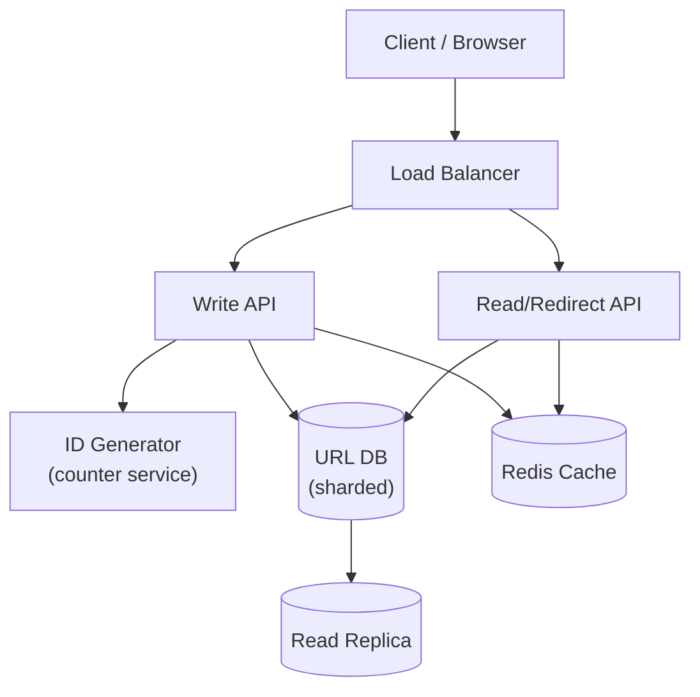
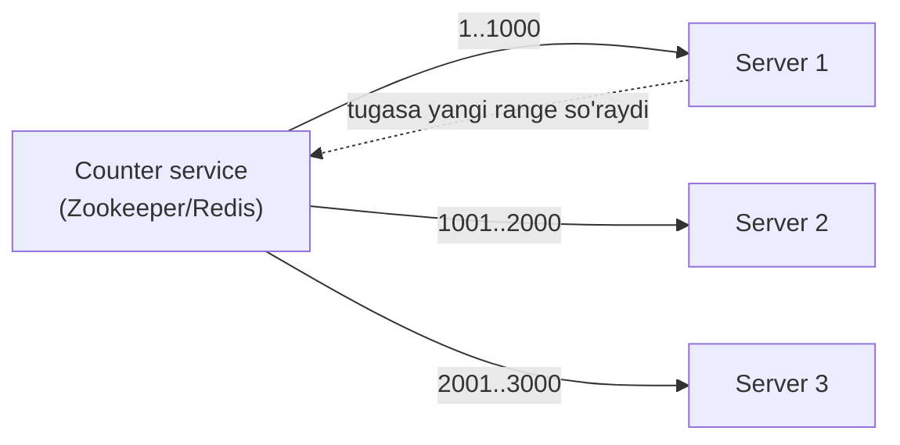
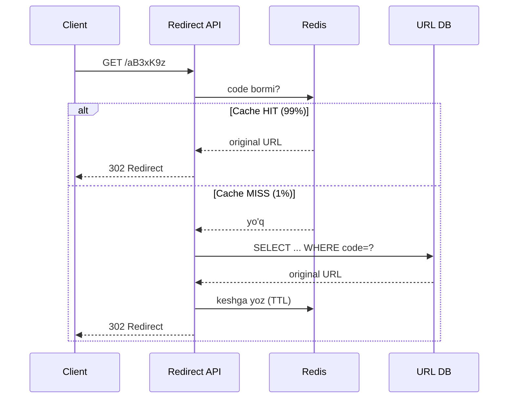

# URL Shortener arxitekturasi (bit.ly kabi)

> Bu — **warm-up** (qizdiruvchi) case study. Sodda, lekin haqiqiy intervyuda 30% hollarda beriladi. Bu yerda 5 bosqichli frameworkni (1-dars) birinchi marta amalda ishlatamiz. Chuqurlashish mavzusi: **qisqa kodni qanday generatsiya qilamiz va collision'ni qanday oldini olamiz?**

---

## Nega bu yaxshi mashq?

URL shortener — "kichik, lekin chuqur" tizim. Funksiyasi 2 ta (qisqartir + redirect), lekin ichida haqiqiy dizayn savollari yashiringan: **ID generatsiya, collision, kesh, redirect turi**. Aynan shuning uchun intervyuerlar buni yaxshi ko'radi — kam vaqtda ko'p narsani ko'rish mumkin.

---

## 1-bosqich: Talablar

Intervyuda talablarni **savol-javob** orqali aniqlaymiz. Hech qachon o'zing taxmin qilma — so'ra.

### Funksional talablar

```
Sen:        Asosiy funksiyalarni aniqlashtirsam: uzun URL beriladi,
            qisqa URL qaytadi. Qisqa URL bosilsa — asl manzilga redirect.
            Shu ikkitasimi?
Intervyuer: Ha. Yana statistika qo'shsak — necha marta bosilgani.
Sen:        Custom alias (masalan bit.ly/mening-linkim) kerakmi?
Intervyuer: Hozircha yo'q, keyin gaplashamiz.
```

Yakuniy scope:
- ✅ Uzun URL → qisqa URL yaratish
- ✅ Qisqa URL → asl manzilga redirect
- ✅ Bosilishlar statistikasi
- ❌ Custom alias, foydalanuvchi akkaunti (out-of-scope)

### Nofunksional talablar

| Talab | Qiymat | Nega muhim |
|-------|--------|------------|
| **Scale** | 100M yangi URL/kun | Yozish yukini belgilaydi |
| **Read : Write** | 100 : 1 | O'qish og'ir → kesh kerak |
| **Latency** | Redirect < 10ms | Odam kutmasin |
| **Availability** | 99.9% | Link ishlamasa — ishonch yo'qoladi |
| **Durability** | Link **abadiy** yashashi kerak | Eski link ham ishlashi shart |

> Eng muhim signal: **read 100 barobar ko'p** va **latency juda past**. Bu ikkisi bizni to'g'ri keshga olib boradi.

---

## 2-bosqich: Back-of-envelope hisob

Formulani (1-darsdan) qadam-baqadam ishlatamiz.

```
// --- 1-qadam: yozish yuki ---
Yozish/kun = 100M URL/kun
Write QPS  = 100M / 100 000 ≈ 1 000 QPS

// --- 2-qadam: o'qish yuki (100:1) ---
Read QPS   = 1 000 × 100 = 100 000 QPS

// --- 3-qadam: storage (10 yil saqlaymiz) ---
1 yozuv ≈ 500 bayt (uzun URL + kod + metadata)
Yillik  = 100M × 365 ≈ 36.5 mlrd yozuv/yil
10 yil  = 365 mlrd yozuv
Hajm    = 365 mlrd × 500 bayt ≈ 180 TB

// --- 4-qadam: qisqa kod uzunligi ---
62 belgi (a-z, A-Z, 0-9) ishlatamiz.
62^6 ≈ 56 mlrd  → 10 yilga yetmaydi
62^7 ≈ 3.5 trillion → yetarli!
Demak kod uzunligi = 7 belgi.
```

### Raqamlardan xulosa

- Read = 100 000 QPS → **kesh majburiy** (Modul 4)
- 180 TB → bitta DB'ga sig'maydi → **sharding** (Modul 3)
- 7 belgi kod → 3.5 trillion imkoniyat, collision ehtimoli boshqariladigan

---

## 3-bosqich: High-level dizayn



### API dizayn

```
POST /api/shorten
  Body:     { "url": "https://juda-uzun-manzil.com/yo'l?param=qiymat" }
  Javob:    { "short": "https://sh.rt/aB3xK9z", "code": "aB3xK9z" }

GET /{code}
  Javob:    301/302 Redirect → asl URL

GET /api/stats/{code}
  Javob:    { "clicks": 4213, "created_at": "2026-01-01" }
```

### Ma'lumot modeli

```sql
CREATE TABLE urls (
    id          BIGINT PRIMARY KEY,   -- counter'dan kelgan raqam
    short_code  VARCHAR(10) UNIQUE,   -- base62(id)
    original    TEXT NOT NULL,
    created_at  TIMESTAMP DEFAULT NOW(),
    click_count BIGINT DEFAULT 0
);
CREATE INDEX idx_short_code ON urls(short_code);
```

---

## 4-bosqich: Chuqurlashish — qisqa kodni qanday generatsiya qilamiz?

Bu — intervyuning **yuragi**. Ikki asosiy yondashuv bor: **hash** va **counter + base62**. Keling, muammodan boshlaymiz.

### Muammo: har bir URL uchun noyob, qisqa, takrorlanmaydigan kod kerak

### Yondashuv A — Hash (MD5/SHA256)

G'oya: URL'ni hash qilamiz, birinchi 7 belgini olamiz.

```go
// --- URL'ni hash qilib, qisqartiramiz ---
h := md5.Sum([]byte("https://google.com"))
code := hex.EncodeToString(h[:])[:7]   // "d41d8cd"
```

⚠️ **Muammo — collision (to'qnashuv):** ikki xil URL bir xil 7 belgili prefiksga tushib qolishi mumkin. 3.5 trillion imkoniyat bo'lsa ham, **tug'ilgan kun paradoksi** tufayli collision ehtimoli ko'rinadigan darajada ortadi. Har safar DB'ni "bu kod bandmi?" deb tekshirish kerak → sekin.

### Yondashuv B — Counter + Base62 ✅

G'oya: global o'suvchi hisoblagich (counter) ishlatamiz. Har yangi URL keyingi raqamni oladi, raqamni base62'ga o'giramiz.

**Notional machine — ichkarida nima sodir bo'ladi?**
Counter shunchaki `1, 2, 3, ...` deb o'sadi. `1000000` soni base62'da `"4c92"` bo'ladi. Har bir raqam **yagona** bo'lgani uchun, kod ham **yagona** — collision umuman bo'lmaydi.

```go
const base62 = "0123456789ABCDEFGHIJKLMNOPQRSTUVWXYZabcdefghijklmnopqrstuvwxyz"

// --- 1-qadam: raqamni base62 satrga o'girish ---
func Encode(id uint64) string {
    if id == 0 {
        return "0"
    }
    var b []byte
    for id > 0 {
        b = append(b, base62[id%62]) // qoldiqni belgiga aylantiramiz
        id /= 62
    }
    // --- 2-qadam: teskari aylantirish (eng katta razryad oldinda) ---
    for i, j := 0, len(b)-1; i < j; i, j = i+1, j-1 {
        b[i], b[j] = b[j], b[i]
    }
    return string(b)
}

// Misol: Encode(1000000) -> "4c92"
```

### Nega counter yutadi? Taqqoslash jadvali

| Mezon | Hash | Counter + Base62 |
|-------|------|------------------|
| Collision | Bo'lishi mumkin | **Yo'q** (har raqam yagona) |
| DB tekshiruvi | Har safar kerak | **Kerak emas** |
| Kod tartibsizmi? | Ha (tasodifiy) | Yo'q (ketma-ket, taxmin qilsa bo'ladi) |
| Distributed'da | Oson | Counter'ni tarqatish qiyin |

### Chuqur muammo: counter'ni distributed muhitda qanday tarqatamiz?

Agar 10 ta write-server bo'lsa, hammasi bitta counter'dan raqam olsa — bu **bottleneck** (torlik). Yechim: har serverga **diapazon (range)** ajratamiz.



Har server o'z diapazonini **lokal xotirada** ishlatadi — hech kim bilan gaplashmaydi. Diapazon tugasa, yangi 1000 tasini so'raydi. Bu — counter'ni **bottleneck bo'lishdan qutqaradi**.

---

## 5-bosqich: Bottleneck va trade-off'lar

### O'qish og'ir yuk → kesh (eng katta bottleneck)

100 000 read QPS'ni DB ko'tara olmaydi. Yechim: **read-through cache** (Modul 4).



Populyar linklar (masalan reklama kampaniyasi) baribir keshda bo'ladi → 99%+ cache hit → DB deyarli tinch.

### 301 vs 302 — analytics bilan trade-off

Bu — intervyuerlar sevadigan "aql o'lchagich" savol.

| Kod | Ma'nosi | Browser keshlaydimi? | Analytics |
|-----|---------|----------------------|-----------|
| **301** Moved Permanently | Abadiy ko'chdi | **Ha** — keyingi safar to'g'ri asl saytga boradi, serverga kelmaydi | Bosilishlarni **yo'qotamiz** (server ko'rmaydi) |
| **302** Found | Vaqtincha | **Yo'q** — har safar serverga keladi | Har bosishni **sanaymiz** ✅ |

> **Trade-off:** 301 tezroq va serverni yengillashtiradi, lekin statistikani buzadi. Statistika kerak bo'lsa — **302** tanlaymiz. Bu — "tezlik vs kuzatuv" muvozanati.

### Boshqa bottleneck'lar

| Muammo | Yechim |
|--------|--------|
| Bir URL takror qisqartiriladi | DB'da `original`'ga index + keshda tekshir |
| Statistika yozish redirect'ni sekinlashtiradi | Bosishni **async** (fon rejimida) yoz — redirect kutmasin |
| DB single point of failure | Read-replica + Redis cluster |
| Diapazon serveri o'chsa | Boshqa server yangi range oladi, yo'qolgan raqamlar shunchaki ishlatilmaydi (muammo emas) |

---

## 6-bosqich: Intervyuda shunday ayt

**Kod generatsiyasi haqida:**
> "Men hash o'rniga counter + base62 ni tanlayman, chunki hash collision'ga olib keladi va har yozishda DB tekshiruvi kerak bo'ladi. Counter esa har doim yagona raqam beradi — collision nolga teng. Distributed bottleneck'ni oldini olish uchun har serverga 1000 talik diapazon ajrataman, ular lokal ishlaydi."

**Kesh haqida:**
> "Read/Write nisbati 100:1 bo'lgani uchun tizim asosan o'qish uchun optimallashtiriladi. Redirect yo'liga read-through Redis cache qo'yaman — populyar linklar keshda qoladi, DB deyarli tegilmaydi va p99 latency 10ms dan past bo'ladi."

**Redirect turi haqida:**
> "Statistika talabi bor, shuning uchun 302 ishlataman — har bosish serverga keladi va sanaladi. Agar statistika kerak bo'lmasa, 301 bilan browser keshiga tayanib serverni yanada yengillashtirardim."

---

## Predict savollari — 🤔 Intervyuer so'rasa

> 🤔 **Intervyuer so'rasa:** "Nega hash emas, counter tanlading?"

<details>
<summary>💡 Javob</summary>
Hash collision beradi va har yozishda "bu kod bandmi?" degan DB so'rovi kerak bo'ladi — bu sekin va murakkab. Counter har doim yagona raqam beradi, base62'ga o'girilganda ham yagona qoladi. Collision umuman yo'q, DB tekshiruvi kerak emas. Yagona kamchilik — kodlar ketma-ket va taxmin qilsa bo'ladi; bu muhim bo'lsa, diapazonlarni aralashtirish yoki base62'ga tasodifiy "tuz" qo'shish mumkin.
</details>

> 🤔 **Intervyuer so'rasa:** "10 ta serverning hammasi bitta counter'dan raqam olsa nima bo'ladi?"

<details>
<summary>💡 Javob</summary>
Counter service bottleneck bo'ladi — har yozish uchun tarmoq so'rovi, u ham single point. Yechim: diapazon (range) ajratish. Har server bir marta "1000 ta raqam" oladi va ularni lokal xotirada tarqatadi. Faqat diapazon tugaganda yangisini so'raydi — tarmoq so'rovlari 1000 barobar kamayadi.
</details>

> 🤔 **Intervyuer so'rasa:** "301 ishlatsang statistikaga nima bo'ladi?"

<details>
<summary>💡 Javob</summary>
301'da browser asl URL'ni keshlaydi va keyingi safar to'g'ri asl saytga boradi — bizning serverimizga umuman kelmaydi. Demak birinchi bosishdan keyingi bosishlarni **ko'rmaymiz**, statistika noto'g'ri chiqadi. Statistika kerak bo'lsa 302 ishlatamiz.
</details>

> 🤔 **Intervyuer so'rasa:** "Custom alias (bit.ly/salom) qo'shsak, dizayn qanday o'zgaradi?"

<details>
<summary>💡 Javob</summary>
Custom alias'da collision **qaytadan paydo bo'ladi** — ikki kishi bir xil alias so'rashi mumkin. Shuning uchun alias uchun DB'da unique constraint qo'yamiz va yozishdan oldin "band emasmi?" tekshiramiz. Counter kodi va custom alias ikkalasi bir jadvalda, lekin alias'lar uchun alohida validatsiya yo'li bo'ladi.
</details>

---

## Go amaliyoti va kengaytmalar

Intervyuda ko'pincha "kod ko'rsat" ham so'raladi. Bu yerda write-path'ni Go'da yozamiz, base62'ning ichki mexanikasini ochamiz va ikki kengaytmani (expiry, custom alias) qo'shamiz.

### Base62 — raqam qanday kodga aylanadi (qadam-baqadam)

`Encode` ichida nima bo'lishini `12345` misolida ko'ramiz. Har qadamda 62'ga bo'lamiz, **qoldiq** — belgi indeksi:

```
12345 / 62 = 199,  qoldiq 7   -> base62[7]  = '7'
  199 / 62 =   3,  qoldiq 13  -> base62[13] = 'D'
    3 / 62 =   0,  qoldiq 3   -> base62[3]  = '3'

Qoldiqlar teskari tartibda o'qiladi -> "3D7"
Demak Encode(12345) = "3D7"
```

**Notional machine:** bu — aynan sanoq sistemasini o'zgartirish (10lik → 62lik). Qoldiqlar **eng kichik razryaddan** chiqadi, shuning uchun oxirida teskari aylantiramiz (kodda `for i,j := ...` sikli shuni qiladi). Har raqam yagona bo'lgani uchun kod ham yagona — collision yo'q. Teskari amal (Decode) — har belgi indeksini olib `result = result*62 + index` (bu — 1-Amaliyot).

### Write-path — Shorten handler (Go)

O'qish yo'lini (Redirect) Amaliyotda o'zing yozasan; bu yerda **yozish** yo'lini to'liq ko'rsatamiz:

```go
// --- 1-qadam: so'rovdan URL'ni olamiz ---
func (s *Server) Shorten(w http.ResponseWriter, r *http.Request) {
    var req ShortenRequest
    json.NewDecoder(r.Body).Decode(&req)

    // --- 2-qadam: counter'dan yagona ID olib, base62 kod yasaymiz ---
    id := s.gen.Next()      // distributed counter (diapazondan lokal)
    code := Encode(id)      // masalan 12345 -> "3D7"

    // --- 3-qadam: DB'ga saqlaymiz (asosiy manba) ---
    _, err := s.db.ExecContext(r.Context(),
        "INSERT INTO urls (id, short_code, original) VALUES ($1, $2, $3)",
        id, code, req.URL)
    if err != nil {
        http.Error(w, "xato", http.StatusInternalServerError)
        return
    }

    // --- 4-qadam: keshga ham yozamiz (kelasi redirect tez bo'lsin) ---
    s.redis.Set(r.Context(), "url:"+code, req.URL, 24*time.Hour)
    json.NewEncoder(w).Encode(ShortenResponse{ShortURL: "https://sh.rt/" + code, Code: code})
}
```

**Notional machine:** yozishda **DB asosiy manba** (durable), Redis esa nusxa. Yozgan zahoti keshga qo'yamiz — shu link'ni birinchi bosgan odam allaqachon cache HIT oladi (**write-through** unsuri). ID counter'dan kelgani uchun `INSERT` hech qachon "bu kod band" xatosini bermaydi (collision yo'q).

### Distributed ID — node-embedded variant

Diapazon (range) usuliga muqobil: ID ichiga **server raqamini** (nodeID) joylash. Har server o'z counter'ini yuritadi, lekin ID'ning yuqori bitlariga o'z nodeID'sini "muhrlash" tufayli ikki server hech qachon bir xil ID bermaydi.

```go
// --- ID = [ nodeID (yuqori bitlar) | lokal counter (past bitlar) ] ---
func (g *IDGenerator) Next() uint64 {
    id := atomic.AddUint64(&g.counter, 1)    // lokal, tarmoqsiz
    return id | (uint64(g.nodeID) << 48)     // yuqori bitlarga nodeID
}
```

**Notional machine:** `<< 48` nodeID'ni raqamning yuqori 16 bitiga suradi, `|` esa lokal counter bilan birlashtiradi. Natijada har serverning ID fazosi **ajratilgan** — markaziy counter'ga borish shart emas (Snowflake ID g'oyasining soddalashtirilgan ko'rinishi). Bu diapazon usulidan ham engilroq: hech qanday "range so'rash" ham kerak emas.

### Kengaytma 1 — Expiry (muddati o'tgan link)

Ba'zi linklar vaqtinchalik ("24 soatdan keyin o'chsin"). `urls` jadvaliga `expires_at` ustunini qo'shamiz va ikki joyda hisobga olamiz:

```sql
-- Muddati o'tganlarni cron bilan tozalash (kechasi ishlaydi):
DELETE FROM urls WHERE expires_at < NOW();
```

Redirect paytida ham tekshirish kerak: agar `expires_at < NOW()` bo'lsa, keshda bo'lsa ham **404** qaytar (kesh TTL'ni `expires_at`ga moslab qo'yish yanada yaxshi — Redis o'zi o'chiradi).

### Kengaytma 2 — Custom alias

Foydalanuvchi o'zi kod tanlasa (`sh.rt/mening-linkim`), collision qaytadi — ikki kishi bir xil alias so'rashi mumkin. Yechim: `short_code`'da **unique constraint** + yozishdan oldin band emasligini tekshirish.

```go
// --- alias band bo'lsa, INSERT unique constraint xatosi qaytaradi ---
_, err := s.db.Exec(
    "INSERT INTO urls (short_code, original) VALUES ($1, $2)", alias, url)
if isUniqueViolation(err) { // masalan pq error code 23505
    http.Error(w, "bu alias band", http.StatusConflict)
    return
}
```

**Notional machine:** counter kodlari va custom alias'lar **bir jadvalda** yashaydi, `short_code` ustunidagi unique constraint ikkalasiga ham qo'llanadi. Farqi: counter kodi hech qachon to'qnashmaydi (tekshiruv shart emas), alias esa foydalanuvchi bergani uchun **DB constraint** himoya qiladi.

---

## Xulosa

- URL shortener — kichik, lekin chuqur: ID generatsiya, collision, kesh, redirect.
- Funksiya 2 ta (qisqartir + redirect) + statistika; read/write = 100:1.
- Back-of-envelope: 1000 write QPS, 100 000 read QPS, ~180 TB/10 yil, 7 belgili kod.
- **Counter + base62** collision'ni butunlay yo'q qiladi; hash esa DB tekshiruvi talab qiladi.
- Distributed counter'ni **diapazon (range)** bilan bottleneck'dan qutqaramiz.
- O'qish og'irligini **read-through cache** yechadi (99%+ cache hit).
- **301 vs 302** — tezlik vs statistika trade-off'i.

## 🧠 Eslab qol

- Counter + base62 = collision yo'q; hash = collision bor.
- Diapazon ajratish counter'ni bottleneck bo'lishdan saqlaydi.
- Read 100x ko'p → read-through cache majburiy.
- 302 = statistika sanaladi; 301 = tez, lekin statistika yo'qoladi.
- Statistikani async yoz — redirect'ni sekinlashtirma.

## ✅ O'z-o'zini tekshir (retrieval practice)

**1. Nega counter yondashuvida collision umuman bo'lmaydi?**

<details>
<summary>Javob</summary>
Har yangi URL global o'suvchi counter'dan **yagona** raqam oladi (1, 2, 3, ...). Bir raqam ikki marta berilmaydi, base62'ga o'girilganda ham yagona satr chiqadi. Demak ikki xil URL hech qachon bir xil kodga tushmaydi.
</details>

**2. Diapazon (range) ajratish qanday muammoni hal qiladi?**

<details>
<summary>Javob</summary>
Distributed counter bottleneck'ini. Agar hamma server har yozishda markaziy counter'ga bormasa — u torlik va single point bo'lardi. Range bilan har server 1000 ta raqamni oldindan oladi va lokal ishlatadi, markaziy so'rovlar 1000 barobar kamayadi.
</details>

**3. Statistika kerak bo'lsa 301 emas, 302 tanlaymiz — nega?**

<details>
<summary>Javob</summary>
301'ni browser keshlaydi va keyingi bosishlarda serverimizga umuman kelmaydi — biz bosishni sanay olmaymiz. 302 har safar serverga keladi, shuning uchun har bosish sanaladi. Trade-off: 302 biroz sekinroq, lekin statistika to'g'ri.
</details>

**4. Read QPS 100 000 bo'lsa-yu, kesh qo'ymasak nima buziladi?**

<details>
<summary>Javob</summary>
DB (yoki replika) 100 000 QPS'ni ko'tara olmaydi — latency oshadi, redirect 10ms dan sekinlashadi, oxir-oqibat DB qulaydi. Read-through cache 99%+ so'rovni RAM'dan javob berib DB'ni tinch qoldiradi.
</details>

**5. Bosilish statistikasini nega async yozamiz?**

<details>
<summary>Javob</summary>
Agar `UPDATE click_count` ni redirect ichida sinxron bajarsak, foydalanuvchi DB yozilguncha kutadi — redirect sekinlashadi. Buni fon goroutine/queue orqali async qilsak, foydalanuvchi darhol redirect oladi, statistika esa keyin yoziladi.
</details>

## 🛠 Amaliyot

**1. Oson (Modify).** `Encode` funksiyasiga mos `Decode(code string) uint64` yoz — base62 satrni qaytadan raqamga o'gir.

<details>
<summary>Hint</summary>
`result = result*62 + indexOf(char)`. Har belgining base62'dagi o'rnini top, chapdan o'ngga yur.
</details>

**2. O'rta (faded example).** Quyidagi redirect handler skeletini to'ldir (read-through cache):

```go
func (s *Server) Redirect(w http.ResponseWriter, r *http.Request) {
    code := chi.URLParam(r, "code")

    // TODO: 1) avval Redis'dan code bo'yicha URL'ni ol
    // TODO: 2) topilsa — async click sana + 302 redirect
    // TODO: 3) topilmasa — DB'dan ol, keshga qayta yoz, 302 redirect
    // TODO: 4) DB'da ham yo'q bo'lsa — 404
}
```

<details>
<summary>Hint</summary>
`s.redis.Get(...)` → HIT bo'lsa `go s.incrClick(code)` va `http.Redirect(w,r,url,302)`. MISS bo'lsa `s.db.QueryRow(...)`, so'ng `s.redis.Set(...)`. Xatoda 404.
</details>

**3. Qiyin (Make).** URL shortener'ni **Instagram uchun rasm-havola qisqartiruvchi** deb qayta dizayn qil: rasmlarni S3'ga saqla, qisqa kod S3 obyektiga ishora qilsin. Talab + hisob + high-level diagramma yoz. Fikrla: bu yerda storage hisobi qanday o'zgaradi?

<details>
<summary>Hint</summary>
Endi storage asosiy bottleneck — 1 rasm ~2MB, DB emas object storage kerak. Kod S3 kalitiga (key) map bo'ladi, redirect esa CDN URL'ga ketadi. Read yuki CDN'ga tushadi, sizning serveringiz yengillashadi.
</details>

## 🔁 Takrorlash

**Bog'liq oldingi mavzular:**
- [Caching — o'qish strategiyalari](../4-caching/01-oqish-strategiyalari.md) — read-through cache
- [Ma'lumotlar ombori — Replication va Sharding](../3-malumotlar-ombori/04-replication-va-sharding.md) — 180 TB'ni bo'lish
- [Kengayish usullari — Load Balancing](../2-kengayish-usullari/02-load-balancing.md) — 100K QPS'ni tarqatish
- [Tizim talablarini yig'ish](01-tizim-talablarini-yigish.md) — framework

**Takrorlash jadvali:**
- **Ertaga:** "counter vs hash" farqini yoddan ayt.
- **3 kundan keyin:** redirect'ning cache HIT/MISS oqimini qog'ozga chiz.
- **1 haftadan keyin:** butun URL shortener'ni 5 bosqich bo'yicha og'zaki dizayn qil.

**Feynman testi:** URL shortener qanday ishlashini va nega counter hash'dan yaxshiroq ekanini kod so'zlarisiz 3 jumlada tushuntir.

---

⬅️ Oldingi: [01 — Tizim talablarini yig'ish](01-tizim-talablarini-yigish.md) | ➡️ Keyingi: [03 — Twitter arxitekturasi](03-twitter-arxitekturasi.md)
