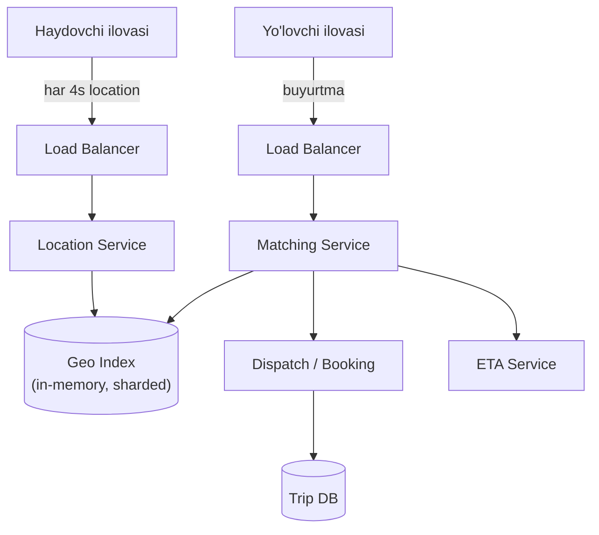
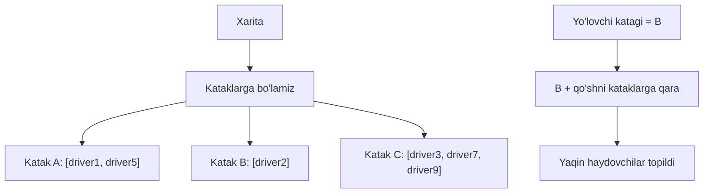
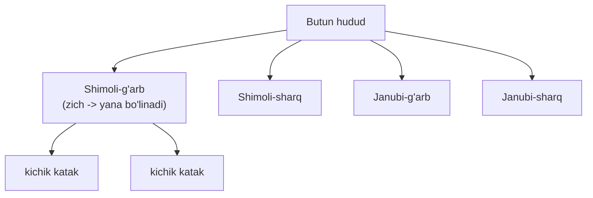
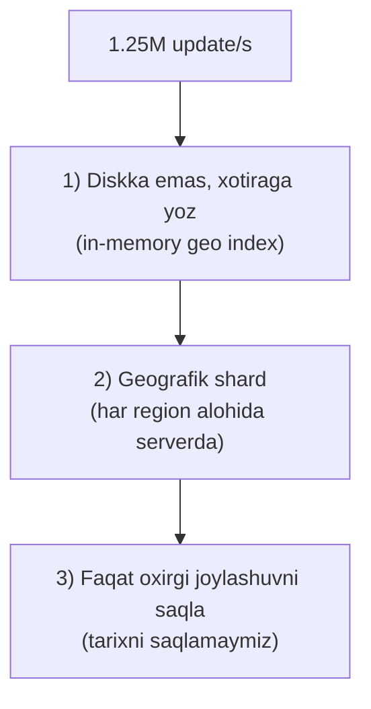
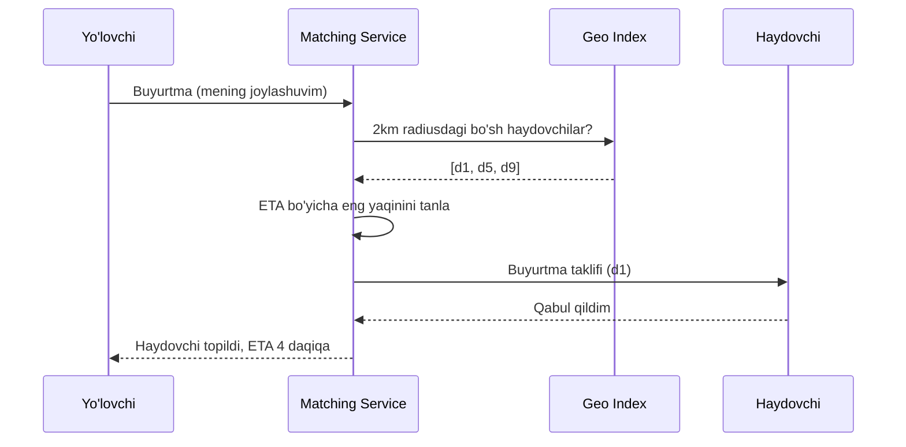

# Uber arxitekturasi — haydovchi topish va geospatial indexing

> Oxirgi case study. Bu yerda yangi turdagi muammo — **joylashuv (geospatial)**. Chuqurlashish mavzusi: **"yaqin atrofdagi haydovchilarni qanday tez topamiz?"** Bir qarashda oddiy `SELECT`, lekin oddiy DB query bu yerda **butunlay yaramaydi**. Va yana bir muammo: haydovchi joylashuvi har 4 soniyada yangilanadi — bu **ulkan yozish yuki**.

---

## Nega bu boshqacha muammo?

Oldingi darslarda ma'lumot "tekis" edi — ID bo'yicha qidirardik. Bu yerda ma'lumot **2 o'lchovli** (kenglik + uzunlik). Savol: "menga 2 km radiusda kim bor?" Bunday **yaqinlik (proximity)** so'rovi oddiy indeksga to'g'ri kelmaydi. Mana shu darsning yuragi.

---

## 1-bosqich: Talablar

### Funksional talablar

```
Sen:        Fokus haydovchi topishda deb tushundim. Asosiy funksiyalar:
            1. Haydovchi joylashuvini yangilab turadi
            2. Yo'lovchi buyurtma beradi -> yaqin haydovchilarni topamiz
            3. Haydovchi va yo'lovchini bog'laymiz (matching)
            To'lov, reyting, marshrut chizish — tashqaridami?
Intervyuer: Ha. ETA (yetib kelish vaqti) ni ham qo'shaylik, qisqacha.
```

Scope:
- ✅ Haydovchi joylashuvini yangilash (har ~4 soniyada)
- ✅ Yaqin haydovchilarni topish (proximity search)
- ✅ Matching (yo'lovchi ↔ haydovchi)
- ✅ ETA (qisqacha)
- ❌ To'lov, reyting, navigatsiya (out-of-scope)

### Nofunksional talablar

| Talab | Qiymat | Ta'siri |
|-------|--------|---------|
| **Faol haydovchilar** | 5M bir vaqtda | Yozish yuki manbai |
| **Location update** | har 4 soniyada | Juda katta write QPS |
| **Search latency** | < 1s | Yo'lovchi kutmasin |
| **Consistency** | Eventual (joylashuv 1-2s eskirsa mayli) | Bu bizga tezlik beradi |
| **Availability** | 99.9% | Buyurtma doim ishlasin |

> Ikki asosiy signal: (1) **yaqinlik qidiruvi** oddiy indeksga tushmaydi; (2) **har 4 soniyalik yangilanish** dahshatli yozish yuki. Ikkisi ham geospatial indexing bilan hal bo'ladi.

---

## 2-bosqich: Back-of-envelope hisob

```
// --- 1-qadam: location update yozish yuki (asl bottleneck!) ---
Faol haydovchi = 5M
Har 4 soniyada 1 update
Update QPS = 5M / 4 = 1 250 000 QPS (!!)

// --- 2-qadam: buyurtma (search) yuki ---
Faraz: kuniga 20M buyurtma
Search QPS = 20M / 100 000 ≈ 200 QPS o'rtacha
Peak (ish vaqti) ≈ 2 000 QPS

// --- 3-qadam: solishtiramiz ---
Yozish (1.25M QPS) >> O'qish (2K QPS)
Bu YOZISH-og'ir tizim — Twitter/URL'dan farqli!
```

### Raqamlardan xulosa

- **1.25M location update QPS** — asl muammo shu. Har birini diskka yozib bo'lmaydi.
- Yozish o'qishdan **600 barobar ko'p** — bu bizni **xotirada (in-memory) geospatial index** ga olib boradi.
- Joylashuv 4 soniyada eskiradi → uni doimiy diskda saqlash shart emas, RAM yetadi.

---

## 3-bosqich: High-level dizayn



### Asosiy g'oya — location ni diskka yozmaymiz

Haydovchi joylashuvi 4 soniyada eskiradigan "efemer" ma'lumot. Uni **in-memory geospatial index**da (Redis geo yoki o'z sharding'imiz) saqlaymiz. Diskka faqat safar (trip) tafsilotlarini yozamiz — ular kam va doimiy.

---

## 4-bosqich: Chuqurlashish — yaqin haydovchilarni qanday topamiz?

### Muammo: nega oddiy DB query yaramaydi?

Sodda g'oya: haydovchilar jadvalidan radius ichidagilarni tanlaymiz.

```sql
SELECT * FROM drivers
WHERE lat BETWEEN 41.30 AND 41.34
  AND lng BETWEEN 69.26 AND 69.30;
```

⚠️ **Nega yomon:**
- Bu **butun jadvalni skanerlaydi** yoki ikki alohida index ishlatadi — millionlab qatordan filtrlaydi. Sekin.
- `lat` va `lng` alohida indekslansa ham, DB ularni **birga** samarali qidira olmaydi (2 o'lchovli muammo).
- 5M haydovchi + 4 soniyalik update bilan bu query'lar DB'ni tiz cho'ktiradi.

**Ildiz muammo:** Yer yuzasi 2 o'lchovli, lekin oddiy B-tree index 1 o'lchovli. Bizga 2D fazoni **1D kalitga** aylantiradigan usul kerak.

### Yechim: fazoni kataklarga bo'lish (spatial indexing)

G'oya: butun xaritani **kataklar (cells)** ga bo'lamiz. Har haydovchini o'z katagida saqlaymiz. Qidiruv: "menga qaysi katakdaman va qo'shni kataklarda kim bor?" — bu **juda tez**, chunki faqat bir nechta katakka qaraymiz, butun jadvalni emas.



**Analogiya:** butun shahardagi do'stingni qidirish o'rniga, "u Chilonzor tumanida" desang — faqat o'sha tumanga qaraysan. Katak = tuman. Qidiruv maydoni keskin qisqaradi.

### Uch yondashuv — geohash, quadtree, S2

**1. Geohash** — kenglik/uzunlikni bit-bit aralashtirib bitta **satr** kalitga aylantiradi. Prefiks bir xil bo'lsa — yaqin joylashgan.

```
41.311, 69.279  →  geohash  →  "ts9rw"
Prefiks "ts9r" = ~150m katak
Prefiks "ts9" = ~1.2km katak (qisqaroq prefiks = kattaroq katak)
```

Yaqinlarni topish: bir xil prefiksli haydovchilarni ol. Redis buni tayyor beradi (`GEOADD`, `GEOSEARCH`).

**2. Quadtree** — xaritani rekursiv 4 ga bo'ladi. Zich joyda (shahar markazi) chuqurroq bo'linadi, siyrak joyda (cho'l) — yo'q. **Moslashuvchan zichlik.**



**3. S2 (Google)** — Yer sharini kubga proyeksiya qilib, Hilbert egri chizig'i bilan raqamlaydi. Eng aniq (shar geometriyasini hisobga oladi), lekin murakkab. Uber aslida o'z tizimida S2'dan foydalanadi (H3 esa Uber'ning oltiburchakli varianti).

### Taqqoslash jadvali

| Mezon | Geohash | Quadtree | S2 |
|-------|---------|----------|-----|
| G'oya | Bit aralashtirish → satr | Rekursiv 4 ga bo'lish | Sharni kubga + Hilbert |
| Zichlikka moslashish | Yo'q (bir xil katak) | **Ha** | Ha |
| Amalga oshirish | **Eng oson** (Redis tayyor) | O'rta | Qiyin |
| Aniqlik (qutb/chegara) | Kamroq | O'rta | **Eng yuqori** |
| Kim ishlatadi | Ko'p tizimlar | Ko'p GIS | **Uber, Google** |

> **Oltin qoida:** intervyuda **geohash + Redis** bilan boshlab, "zichlik notekis bo'lsa quadtree yoki S2 ga o'taman" desang — sen ham soddadan boshlashni, ham chuqurroq variantlarni bilishingni ko'rsatasan.

### Notional machine — geohash ichkarida qanday tez ishlaydi?

Geohash koordinatani **1 o'lchovli satr** ga aylantiradi. Endi oddiy B-tree yoki hash-map ishlaydi: "ts9r*" prefiksli barcha kalitlarni ol — bu prefiks-qidiruv, O(log n). 5M haydovchi bo'lsa ham, faqat bitta katakdagi (masalan 50 ta) haydovchiga qaraymiz, 5M ga emas. 2D muammo 1D muammoga aylandi.

---

## 5-bosqich: Bottleneck va trade-off'lar

### 1.25M location update yozishni qanday ko'taramiz?

Bu — asl bottleneck. Uch qadamda yechamiz:



1. **Xotiraga yozamiz** — RAM disk'dan ming barobar tez. Joylashuv 4s'da eskirgani uchun durability shart emas.
2. **Geografik sharding** — Toshkent serveri Toshkent haydovchilarini boshqaradi. Yozish yuki regionlar bo'ylab tarqaladi.
3. **Faqat oxirgi joylashuv** — har haydovchi uchun bitta yozuvni yangilaymiz (upsert), tarix yig'ilmaydi.

### Matching (qisqacha)

Yaqin haydovchilar topilgach, **bittasini** tanlash kerak:



Race condition muammosi: bir haydovchi ikki yo'lovchiga taklif qilinmasligi kerak. Yechim: haydovchini taklif paytida **lock** qilamiz (Modul 3/4: distributed lock).

### ETA (qisqacha)

To'g'ri chiziqli masofa emas, **yo'l grafi** bo'yicha hisoblanadi (traffic bilan). Alohida servis (masalan yo'l tarmog'i + ML modeli) real vaqt trafikni hisobga oladi. Intervyuda: "ETA ni alohida servis grafik yo'l va real-time traffic bilan hisoblaydi" deyish kifoya.

### Boshqa bottleneck'lar

| Muammo | Yechim |
|--------|--------|
| Chegaradagi haydovchi (ikki katak orasida) | Qo'shni kataklarni ham qidir (9 katak) |
| Zich shahar markazi | Quadtree/S2 — moslashuvchan katak |
| Geo shard qulasa | Replikatsiya; joylashuv baribir 4s'da yangilanadi |
| Bir haydovchi 2 buyurtmaga | Distributed lock matching paytida |

---

## 6-bosqich: Intervyuda shunday ayt

**Nega oddiy query emas:**
> "Oddiy `WHERE lat BETWEEN ... AND lng BETWEEN` ishlatmayman — bu 2 o'lchovli muammo, B-tree index buni samarali qidira olmaydi va butun jadvalni skanerlaydi. Buning o'rniga geospatial index ishlataman: xaritani kataklarga bo'lib, faqat yo'lovchi katagi va qo'shnilariga qarayman."

**Indexing tanlovi:**
> "Geohash + Redis bilan boshlaryman — koordinatani satr kalitga aylantiradi, prefiks qidiruv yaqinlarni beradi, Redis'da tayyor. Agar zichlik juda notekis bo'lsa (shahar markazi vs chekka), quadtree yoki S2 ga o'taman — ular zichlikka moslashadi. Uber aslida S2/H3 ishlatadi."

**Yozish yuki:**
> "1.25M location update/s ni diskka yozib bo'lmaydi. Uchta qaror: xotirada saqlayman (4s'da eskiradi, durability kerak emas), geografik sharding qilaman (har region alohida server), va faqat oxirgi joylashuvni upsert qilaman — tarix yig'maymiz."

---

## Predict savollari — 🤔 Intervyuer so'rasa

> 🤔 **Intervyuer so'rasa:** "Nega oddiy SQL `WHERE lat/lng BETWEEN` yaramaydi?"

<details>
<summary>💡 Javob</summary>
Bu 2 o'lchovli qidiruv, oddiy B-tree index 1 o'lchovli. `lat` va `lng` alohida indekslansa ham, DB ularni birga samarali kesib qidira olmaydi — ko'p qatorni skanerlaydi va filtrlaydi. 5M haydovchi va sekundiga million update bilan bu DB'ni qulatadi. Yechim — 2D fazoni 1D kalitga aylantiradigan geospatial index (geohash/quadtree/S2).
</details>

> 🤔 **Intervyuer so'rasa:** "Geohash bilan quadtree'ning farqi nima, qaysi birini tanlaysan?"

<details>
<summary>💡 Javob</summary>
Geohash koordinatani bit aralashtirib bitta satr kalitga aylantiradi, kataklar bir xil o'lchamda — oson va Redis'da tayyor. Quadtree xaritani rekursiv 4 ga bo'ladi va zich joyda chuqurroq bo'linadi — moslashuvchan. Men geohash+Redis bilan boshlayman (soddaligi uchun), zichlik juda notekis bo'lsa quadtree/S2 ga o'taman. Ishlab chiqarishda Uber S2/H3 ishlatadi.
</details>

> 🤔 **Intervyuer so'rasa:** "1.25M location update/s ni qanday ko'tarasan?"

<details>
<summary>💡 Javob</summary>
Uch qadam: (1) diskka emas, xotiradagi geo index'ga yozaman — joylashuv 4s'da eskiradi, durability kerak emas; (2) geografik sharding — har region o'z serverida, yozish yuki tarqaladi; (3) faqat oxirgi joylashuvni yangilayman (upsert), tarix saqlamayman. Shunda 1.25M yozish RAM'da va regionlar bo'ylab bo'lingan holda ko'tariladi.
</details>

> 🤔 **Intervyuer so'rasa:** "Yaqin haydovchi ikki chegaradagi katakda bo'lsa-chi?"

<details>
<summary>💡 Javob</summary>
Faqat yo'lovchi katagiga qarasak, chegara ortidagi yaqin haydovchini o'tkazib yuboramiz. Shuning uchun har doim **markaziy katak + 8 qo'shni katak** (jami 9) ga qaraymiz. Bu chegara muammosini hal qiladi. Radius katta bo'lsa qo'shni halqani kengaytiramiz.
</details>

> 🤔 **Intervyuer so'rasa:** "Bir haydovchi ikki yo'lovchiga bir vaqtda taklif qilinsa nima bo'ladi?"

<details>
<summary>💡 Javob</summary>
Race condition. Matching Service haydovchiga taklif yuborishdan oldin uni **lock** qiladi (distributed lock, masalan Redis). Lock band bo'lsa, o'sha haydovchi boshqa yo'lovchiga taklif qilinmaydi. Haydovchi rad etsa yoki taymout bo'lsa, lock bo'shatiladi va u yana bo'sh deb belgilanadi.
</details>

---

## Xulosa

- Uber muammosi yangi tur — **geospatial (joylashuv bo'yicha)** qidiruv.
- Oddiy `lat/lng BETWEEN` yaramaydi: 2D muammo, B-tree 1D.
- Yechim — fazoni **kataklarga** bo'lish (geohash / quadtree / S2).
- **Geohash** — oson, Redis'da tayyor; **quadtree/S2** — zichlikka moslashadi.
- Asl bottleneck — **1.25M location update/s** (yozish-og'ir tizim).
- Yechim: xotirada saqlash + geografik sharding + faqat oxirgi joylashuv.
- Matching'da distributed lock race condition'ni oldini oladi.

## 🧠 Eslab qol

- 2D qidiruvni oddiy index bajarmaydi — geospatial index kerak.
- Geohash = koordinata → satr kalit, prefiks = yaqinlik.
- Quadtree/S2 zichlikka moslashadi, geohash yo'q.
- Location = efemer → xotirada saqla, diskka emas.
- Chegara muammosi: markaz + 8 qo'shni katak.

## ✅ O'z-o'zini tekshir (retrieval practice)

**1. Nega oddiy `WHERE lat/lng BETWEEN` sekin?**

<details>
<summary>Javob</summary>
Bu 2 o'lchovli qidiruv, B-tree index 1 o'lchovli. DB `lat` va `lng` ni birga samarali kesa olmaydi — ko'p qatorni skanerlab filtrlaydi. Million haydovchi va sekundiga million update bilan DB qulaydi.
</details>

**2. Geohash yaqinlikni qanday ifodalaydi?**

<details>
<summary>Javob</summary>
Koordinatani bit-bit aralashtirib satr kalitga aylantiradi. Yaqin joylashgan nuqtalar bir xil prefiksga ega bo'ladi. Shuning uchun "bir xil prefiksli haydovchilar" = "yaqin haydovchilar". Qisqaroq prefiks = kattaroq katak.
</details>

**3. Quadtree geohashdan qanday ustun?**

<details>
<summary>Javob</summary>
Quadtree zichlikka moslashadi — zich joyda (shahar markazi) rekursiv chuqurroq bo'linadi, siyrak joyda bo'linmaydi. Geohash kataklari bir xil o'lchamda, shuning uchun zich joyda bitta katakda juda ko'p haydovchi to'planib qoladi.
</details>

**4. Nega location'ni diskka yozmaymiz?**

<details>
<summary>Javob</summary>
Joylashuv 4 soniyada eskiradi — efemer ma'lumot, durability kerak emas. 1.25M yozish/s ni diskka yozib bo'lmaydi (juda sekin). RAM ming barobar tez va yetarli, chunki tarix saqlanmaydi — faqat oxirgi joylashuv.
</details>

**5. Chegaradagi haydovchini o'tkazib yubormaslik uchun nima qilamiz?**

<details>
<summary>Javob</summary>
Faqat yo'lovchi katagiga emas, **markaziy katak + 8 qo'shni katak** (jami 9) ga qaraymiz. Shunda katak chegarasidan sal narida turgan yaqin haydovchi ham topiladi.
</details>

## 🛠 Amaliyot

**1. Oson (Modify).** Location update chastotasini 4 soniyadan 1 soniyaga tushirsang, yozish QPS qancha bo'ladi va qanday trade-off yuzaga keladi?

<details>
<summary>Hint</summary>
5M / 1 = 5M QPS (4 barobar). Aniqroq joylashuv, lekin yozish yuki 4x oshadi va batareya/traffik ko'proq yeyiladi. Muvozanat kerak.
</details>

**2. O'rta (faded example).** Quyidagi yaqin-haydovchi qidiruvi skeletini to'ldir (Redis GEO):

```go
func FindNearby(rdb *redis.Client, lat, lng float64, radiusKm float64) ([]string, error) {
    // TODO: 1) GEOSEARCH bilan "drivers" key'dan
    //          markaz (lat,lng), radius = radiusKm, birlik km
    // TODO: 2) natijani ASC (yaqindan uzoqqa) saralab qaytar
    return nil, nil
}
```

<details>
<summary>Hint</summary>
`rdb.GeoSearch(ctx, "drivers", &redis.GeoSearchQuery{Longitude: lng, Latitude: lat, Radius: radiusKm, RadiusUnit: "km", Sort: "ASC"})`. Natijadagi member'lar — driver ID'lar.
</details>

**3. Qiyin (Make).** Shu arxitekturani **oziq-ovqat yetkazish (food delivery)** uchun moslashtir. Talab + hisob + diagramma yoz. Fikrla: bu yerda **uchburchak** bor — mijoz, restoran, kuryer. Geospatial qidiruv qayerda ishlatiladi?

<details>
<summary>Hint</summary>
Geo qidiruv ikki marta: (1) mijozga yaqin restoranlar; (2) restoranga yaqin bo'sh kuryerlar. Kuryer joylashuvi ham 4s'da yangilanadi — xuddi Uber. Matching endi restoran tayyorlik vaqtini ham hisobga oladi.
</details>

## 🔁 Takrorlash

**Bog'liq oldingi mavzular:**
- [Ma'lumotlar ombori — Replication va Sharding](../3-malumotlar-ombori/04-replication-va-sharding.md) — geografik sharding
- [Caching — o'qish strategiyalari](../4-caching/01-oqish-strategiyalari.md) — in-memory geo index
- [Kengayish usullari — Load Balancing](../2-kengayish-usullari/02-load-balancing.md) — yozish yukini tarqatish
- [WhatsApp arxitekturasi](04-whatsapp-arxitekturasi.md) — real-time va yozish yuki

**Takrorlash jadvali:**
- **Ertaga:** nega oddiy `lat/lng` query yaramasligini yoddan ayt.
- **3 kundan keyin:** geohash/quadtree/S2 jadvalini chiz.
- **1 haftadan keyin:** butun "haydovchi topish" oqimini 5 bosqich bo'yicha gapir.

**Feynman testi:** Uber yaqin haydovchini qanday tez topishini va nega oddiy baza query yaramasligini kod so'zlarisiz 3 jumlada tushuntir.

---

⬅️ Oldingi: [04 — WhatsApp arxitekturasi](04-whatsapp-arxitekturasi.md) | ➡️ Keyingi: [06 — Qo'shimcha materiallar](06-qoshimcha-materiallar.md)
