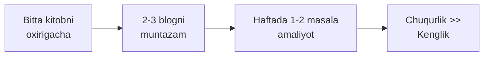
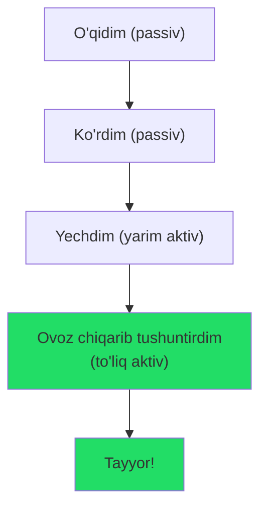
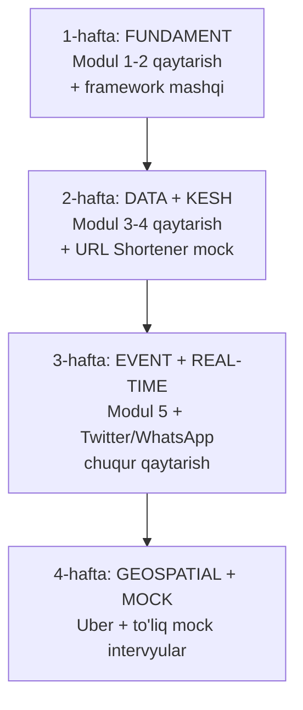
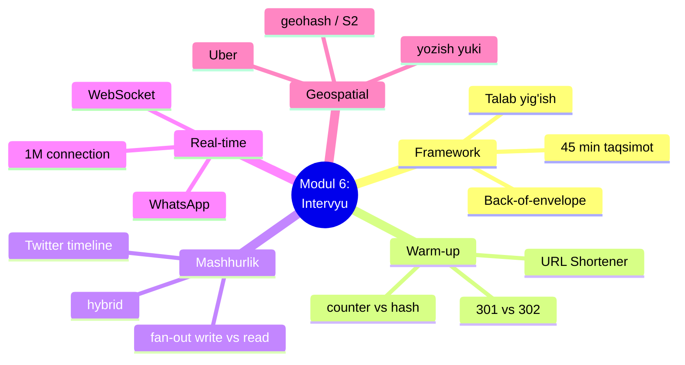

# Qo'shimcha materiallar va 4 haftalik takrorlash rejasi

> Bu — resurslar darsi. Bu yerda case-study yo'q. Maqsad: sen o'rganishni davom ettirishing uchun **sinovdan o'tgan, sifatli** manbalarni bir joyga to'plash va yakuniy takrorlash rejasini berish. Har resurs uchun: **kimga, qachon** ishlatish kerakligini aytamiz — chunki noto'g'ri paytda noto'g'ri kitob vaqt isrofi.

---

## Qanday foydalanish kerak?

Resurs ko'p — hammasini o'qishga urinma (bu 4-darsdagi "hamma narsani dizayn qilish" xatosining o'qish versiyasi). Aksincha:



> Oltin qoida: **chuqurlik kenglikdan muhim.** Bitta kitobni tugatgan, 20 masala ishlagan odam — 5 kitobni yarim o'qigandan kuchliroq.

---

## 1. Kitoblar

### Designing Data-Intensive Applications (Martin Kleppmann) — "DDIA"
- **Kimga:** distributed system'lar ichini chindan tushunmoqchi bo'lganga (replikatsiya, consistency, sharding, stream processing).
- **Qachon:** modul 2-5 ni tugatgach. Bu — intervyu emas, **fundament** kitobi. Har senior muhandis kamida bir marta o'qishi kerak deb sanaladi.
- **Maslahat:** sekin o'qi, har bobdan keyin to'xtab o'yla. Bu "bir kechada" kitob emas.

### System Design Interview, Vol. 1 (Alex Xu)
- **Kimga:** intervyuga aynan tayyorlanayotgan har kimga. Bizning modul 6 aynan shu uslubda tuzilgan.
- **Qachon:** **hoziroq**. Agar bitta kitob o'qisang — shu. Talab yig'ish, hisob-kitob, high-level dizayn — hammasi bosqichma-bosqich.
- **Maslahat:** har bobni o'qishdan **oldin** o'zing dizayn qilib ko'r, keyin solishtir (bu — retrieval practice).

### System Design Interview, Vol. 2 (Alex Xu & Sahn Lam)
- **Kimga:** 1-jildni tugatgan, ko'proq va murakkabroq case-study xohlaganga (proximity service, payment, hotel booking, chat...).
- **Qachon:** 1-jilddan keyin. Bizning Uber va WhatsApp darslarimizga to'g'ridan-to'g'ri mos keladi.
- **Maslahat:** har case'ni o'qigach, uni "boshqa mahsulotga moslashtir" (masalan proximity → food delivery).

### Grokking the System Design Interview (Design Gurus)
- **Kimga:** kitob emas, matnli onlayn kurs yoqadigan odamga. Mashhur masalalar to'plami + lug'at.
- **Qachon:** Alex Xu bilan parallel, qo'shimcha mashq sifatida.

---

## 2. Muhandislik bloglari (real arxitektura, real raqamlar)

Bu — eng qadrli manba. Bu yerda kompaniyalar **haqiqiy** muammolarni **haqiqiy** raqamlar bilan yozadi. Intervyuerlar aynan shunday tafsilotlarni qadrlaydi.

| Blog | Nima uchun qimmatli | Bizning qaysi darsga |
|------|---------------------|----------------------|
| **Uber Engineering** | Geospatial, dispatch, real-time, monolitdan 500+ microservice'ga | Uber (5-dars) |
| **Discord Blog** | Real-time chat, "trillion xabar"ni saqlash evolyutsiyasi | WhatsApp (4-dars) |
| **Netflix TechBlog** | CDN, streaming, chaos engineering, katta scale | Umumiy |
| **Cloudflare Blog** | Tarmoq, DDoS, performance, edge computing | LB, kesh |
| **Meta Engineering** | News feed, TAO grafik, katta ma'lumot | Twitter (3-dars) |
| **High Scalability** | Klassik "X qanday scale qildi" maqolalari arxivi | Umumiy |

- **Kimga:** modul 1-6 ni tugatib, "real dunyoda qanday?" degan savol paydo bo'lganga.
- **Qachon:** darsdan keyin. Masalan Uber darsini tugatgach, Uber'ning geospatial (H3) maqolasini o'qi.
- **Maslahat:** ByteByteGo va Design Gurus bu bloglarning eng yaxshi maqolalarini to'plab beradi — ulardan boshla.

---

## 3. YouTube kanallar (vizual o'rganish)

| Kanal | Kuchli tomoni | Kimga |
|-------|---------------|-------|
| **ByteByteGo** (Alex Xu) | Toza animatsiya, diagramma — Twitter feed, Netflix CDN, Uber dispatch | Boshlash uchun eng yaxshi |
| **Gaurav Sen** | Fundamentlar, chuqur tushuntirish | Asoslarni mustahkamlash |
| **CodeKarle** (ex-Facebook) | Real intervyu masalalari qadamlab | Intervyu mashqi |
| **Hussein Nasser** | Backend, tarmoq, protokollar chuqur | Chuqurlik xohlaganga |

- **Qachon:** kitob o'qishga charchaganda, yoki tushunmagan mavzuni vizual ko'rmoqchi bo'lganda.
- **Maslahat:** passiv ko'rma — videoni to'xtatib, o'zing dizayn qilib ko'r, keyin davom et.

---

## 4. Amaliyot platformalari (eng muhim qadam)

O'qish — passiv. Intervyu — aktiv. **Amaliyotsiz tayyorgarlik yo'q.**

| Platforma | Nima beradi |
|-----------|-------------|
| **Codemia.io** | 120+ system design masala, amaliyot uchun |
| **Exponent** | Mock intervyu, video yechimlar |
| **Pramp / interviewing.io** | Jonli mock intervyu (odam bilan) |
| **Do'st bilan mock** | Eng arzon va samarali — biringiz intervyuer, biringiz nomzod |

- **Oltin qoida:** haftada kamida **1 ta masalani boshdan-oxir og'zaki** ishlab chiq — ovoz chiqarib, 45 daqiqada, diagramma chizib. Bu real intervyuni imitatsiya qiladi.



---

## 5. 4 haftalik takrorlash rejasi

Modul 6 ni tugatding — endi bilimni **mustahkamlash** kerak. Spaced repetition (oraliqli takrorlash) prinsipi: material vaqt o'tgach qaytarilsa, xotira mustahkam bo'ladi. Mana jadval:



### 1-hafta — Fundament va framework
- **Qaytar:** Modul 1 (asoslar), Modul 2 (kengayish, load balancing).
- **Amaliyot:** [Tizim talablarini yig'ish](01-tizim-talablarini-yigish.md) frameworkini yod ol. 3 ta yangi tizim uchun (masalan Instagram, YouTube, Dropbox) faqat **talab + hisob-kitob** bosqichini mashq qil.
- **Feynman:** 45 daqiqalik intervyu taqsimotini do'stingga tushuntir.

### 2-hafta — Ma'lumot va kesh
- **Qaytar:** Modul 3 (SQL/NoSQL, sharding, replication), Modul 4 (caching strategiyalari).
- **Amaliyot:** [URL Shortener](02-url-shortener.md) ni to'liq, ovoz chiqarib, 45 daqiqada mock qil. "counter vs hash" va "301 vs 302" ni bemalol tushuntira olishing kerak.
- **Feynman:** read-through cache qanday ishlashini kod so'zlarisiz ayt.

### 3-hafta — Event-driven va real-time
- **Qaytar:** Modul 5 (message queue, pub/sub, fan-out).
- **Amaliyot:** [Twitter](03-twitter-arxitekturasi.md) va [WhatsApp](04-whatsapp-arxitekturasi.md) ni mock qil. Ikki eng qiyin savolga tayyor bo'l: "celebrity problem" va "1M connection".
- **Feynman:** fan-out on write vs read farqini va WebSocket nega polling'dan yaxshiligini tushuntir.

### 4-hafta — Geospatial va to'liq mock
- **Qaytar:** [Uber](05-uber-arxitekturasi.md) — geohash/quadtree/S2.
- **Amaliyot:** **Do'st bilan yoki platformada 2-3 to'liq mock intervyu** o'tkaz. Har birida boshqa tizim. Fikrlashni ovoz chiqarib qil.
- **Feynman:** nega oddiy DB query geospatial qidiruvga yaramasligini tushuntir.

### Har hafta oxirida
Har modulning **"✅ O'z-o'zini tekshir"** savollariga qaytib javob ber — kitobga qaramasdan. Qiynalgan savol — keyingi hafta yana qaytar (bu — spaced repetition'ning yuragi).

---

## 6. Modul 6 yakuniy cheat-sheet

Butun modulni bitta jadvalga sig'dirdik. Intervyudan oldin **oxirgi 10 daqiqada** shuni ko'zdan kechir — har case study'ning **eng qiziq muammosi** va **kalit trade-off'i** yodingga tushadi.

| Case study | Asosiy muammo (bottleneck) | Kalit yechim | Eng muhim trade-off |
|-----------|----------------------------|--------------|---------------------|
| **URL Shortener** | O'qish og'ir (100K read QPS) | Counter+base62 + read-through cache | 301 (tez) vs 302 (statistika) |
| **Twitter** | Fan-out yozish (~800K/s), celebrity | Hybrid: oddiy push, mashhur pull | Push (o'qish tez) vs pull (yozish arzon) |
| **WhatsApp** | 100M doimiy ulanish | WebSocket + goroutine-per-connection | Xotira/FD cheklovi vs connection soni |
| **Uber** | 1.25M location update/s + 2D qidiruv | In-memory geo index (geohash/S2) + geo-sharding | Geohash (oson) vs quadtree/S2 (aniq) |

Va butun modulning **umumiy dars xaritasi**:



> **Universal naqsh:** har case study'da bitta xil savol takrorlanadi — *"nima og'ir yuk, uni qayerga suramiz?"* Read og'ir bo'lsa → kesh; yozish og'ir bo'lsa → sharding/xotira/queue; ulanish og'ir bo'lsa → WebSocket + goroutine. Shuni ilg'asang — istagan yangi tizimni ham dizayn qila olasan.

---

## Xulosa

- Kenglik emas, **chuqurlik**: bitta kitob + 2-3 blog + muntazam amaliyot.
- **Alex Xu Vol. 1** — hoziroq boshla; **DDIA** — fundament uchun.
- Muhandislik bloglari real raqamlar beradi — intervyuerlar buni qadrlaydi.
- **Amaliyotsiz tayyorgarlik yo'q** — haftada kamida 1 to'liq mock.
- 4 haftalik reja: fundament → data/kesh → event/real-time → geospatial + mock.
- Har hafta oxirida oldingi modul savollariga qaytib javob ber (spaced repetition).

## 🧠 Eslab qol

- Bitta kitobni tugat, 5 tasini yarim o'qima.
- Passiv o'qish emas — ovoz chiqarib mock qil.
- Real bloglar = real raqamlar = intervyuer ishonchi.
- Haftada kamida 1 to'liq 45-daqiqalik mock.
- Qiynalgan savolni keyingi hafta yana qaytar.

## ✅ O'z-o'zini tekshir (retrieval practice)

**1. Nega "5 ta kitobni yarim o'qish" yomon strategiya?**

<details>
<summary>Javob</summary>
Chuqurlik kenglikdan muhim. Yarim o'qilgan bilim intervyuda ishlamaydi — sen mavzuni ovoz chiqarib, oxirigacha, o'zing dizayn qilib tushuntira olishing kerak. Bitta kitobni tugatib 20 masala ishlagan odam kuchliroq.
</details>

**2. Muhandislik bloglari kitoblardan qanday farq qiladi va nega qimmatli?**

<details>
<summary>Javob</summary>
Bloglar **real** tizimlarni **real raqamlar** bilan tasvirlaydi (masalan Discord'ning trillion xabarni saqlashi). Intervyuerlar aynan shunday konkret tafsilotlarni ishonchli deb qabul qiladi. Kitob asoslarni, blog esa dunyodagi amaliyotni beradi.
</details>

**3. Nega passiv o'qish/ko'rish yetarli emas?**

<details>
<summary>Javob</summary>
Intervyu aktiv jarayon — sen ovoz chiqarib fikrlaysan, diagramma chizasan, savolga javob berasan. Faqat o'qib/ko'rib, hech qachon o'zing dizayn qilmasang, real intervyuda muzlab qolasan. Retrieval practice (eslab chiqarish) shart.
</details>

**4. Spaced repetition rejasida nega qiynalgan savolni qayta-qayta qaytaramiz?**

<details>
<summary>Javob</summary>
Xotira material vaqt o'tib qaytarilganda mustahkamlanadi, ayniqsa qiyin joylarda. Oson bilgan narsani takrorlash vaqt isrofi; qiynalgan savolni oraliqlab qaytarish esa uni uzoq muddatli xotiraga o'tkazadi.
</details>

## 🛠 Amaliyot

**1. Oson (Modify).** O'zingning joriy bilim darajangga qarab 4 haftalik rejani moslashtir: qaysi modul senga qiyin bo'ldi? O'sha modulga qo'shimcha 2-3 kun ajrat.

<details>
<summary>Hint</summary>
Agar celebrity problem yoki geospatial qiyin bo'lgan bo'lsa — o'sha darsni va tegishli blogni (Meta/Uber) qo'shimcha o'qi. Reja qat'iy emas — o'zingga moslashtir.
</details>

**2. O'rta (faded example).** Quyidagi shaxsiy o'rganish jadvalini to'ldir:

```
Hafta 1: Modul ___ va ___ | Amaliyot: ___ | Feynman testi: ___
Hafta 2: Modul ___ va ___ | Amaliyot: ___ | Feynman testi: ___
Hafta 3: Modul ___ va ___ | Amaliyot: ___ | Feynman testi: ___
Hafta 4: Modul ___       | Amaliyot: ___ mock intervyu | Feynman testi: ___
```

<details>
<summary>Hint</summary>
Yuqoridagi 5-bo'limga qara, lekin o'z kunlaring va zaif joylaringga moslab yoz. Har haftaga aniq bitta mock tizim biriktir.
</details>

**3. Qiyin (Make).** O'zing uchun **yangi case study** tanla (masalan Netflix, Dropbox, yoki Google Docs) va uni modul 6 skeleti bo'yicha (talablar → hisob → high-level → chuqurlashish → bottleneck → intervyuda ayt) to'liq yoz. Keyin ByteByteGo/blogdan solishtir.

<details>
<summary>Hint</summary>
Netflix uchun chuqurlashish — CDN va video streaming; Dropbox — fayl sinxronizatsiya va chunking; Google Docs — real-time collaborative editing (CRDT/OT). Avval o'zing yoz, keyin blogdan solishtir — farqni ko'rish eng ko'p o'rgatadi.
</details>

## 🔁 Takrorlash

**Bog'liq oldingi mavzular (butun modul):**
- [Tizim talablarini yig'ish](01-tizim-talablarini-yigish.md) — framework
- [URL Shortener](02-url-shortener.md) — warm-up
- [Twitter arxitekturasi](03-twitter-arxitekturasi.md) — celebrity problem
- [WhatsApp arxitekturasi](04-whatsapp-arxitekturasi.md) — 1M connection
- [Uber arxitekturasi](05-uber-arxitekturasi.md) — geospatial

**Takrorlash jadvali:**
- **Ertaga:** o'zingga 4 haftalik shaxsiy rejani yozib chiq.
- **3 kundan keyin:** birinchi to'liq mock intervyuni (URL Shortener) o'tkaz.
- **1 haftadan keyin:** eng qiyin bo'lgan modulga qaytib, "O'z-o'zini tekshir" savollarini yech.

**Feynman testi:** System design intervyusiga qanday tayyorlanish kerakligini (nima o'qish, qanday amaliyot qilish) bir do'stingga 3 jumlada tushuntir.

---

## Manbalar (verified)

- [Tech Interview Handbook — System Design](https://www.techinterviewhandbook.org/system-design/)
- [ByteByteGo — Top 9 Engineering Blogs](https://bytebytego.com/guides/top-9-engineering-blog-favorites/)
- [ByteByteGo — Real World Case Studies](https://bytebytego.com/guides/real-world-case-studies/)
- [11 Best YouTube Channels for System Design (2026)](https://learnwithpath.com/blog/best-youtube-channels-for-system-design-2026)
- [Design Gurus — Blogs with system design case studies](https://www.designgurus.io/answers/detail/list-of-popular-blogs-with-system-design-interview-case-studies)
- [GitHub — shashank88/system_design](https://github.com/shashank88/system_design)

---

⬅️ Oldingi: [05 — Uber arxitekturasi](05-uber-arxitekturasi.md) | 🏠 [Modul boshi](01-tizim-talablarini-yigish.md)