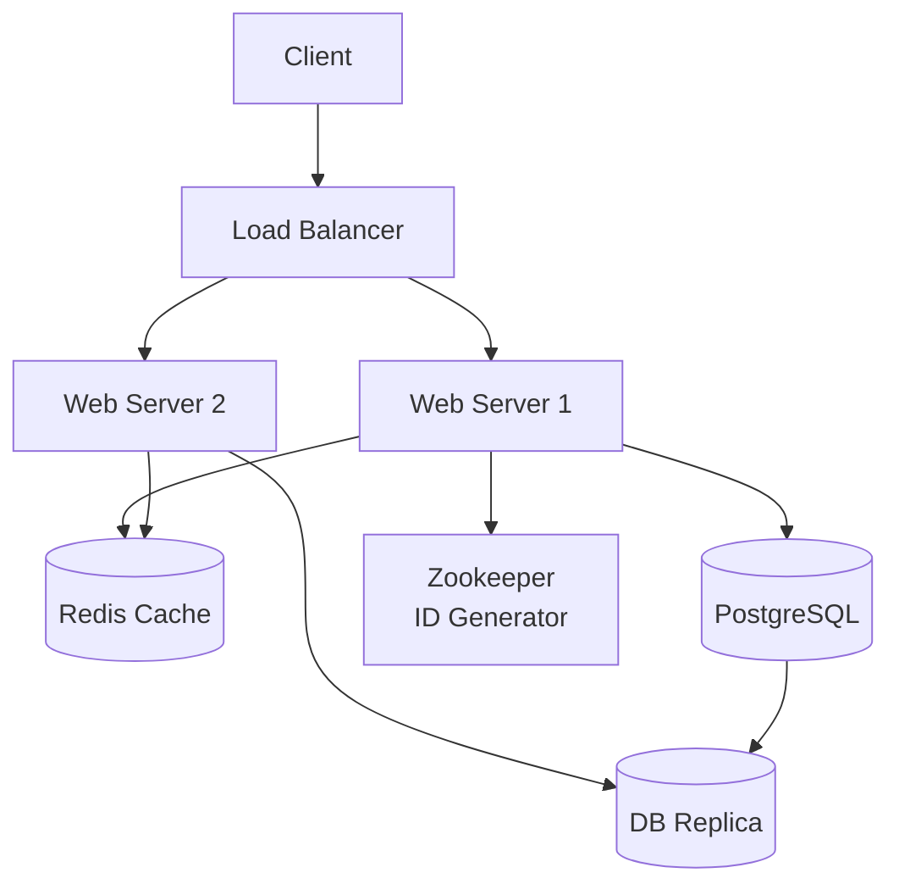

# URL Shortener Dizayn (bit.ly kabi)

## Talablar

### Funksional
- Uzun URL → qisqa URL yaratish (`https://bit.ly/abc123`)
- Qisqa URL → asl URL'ga redirect
- Statistika (optional): necha marta bosilgan

### Non-funksional
- 100M URL/kun yaratiladi
- 10:1 nisbat (read : write)
- 99.9% Availability
- Redirect < 10ms latency

---

## Hajm Hisoblash

```
Write:
100M URL/kun
= 100M / 86400 ≈ 1160 write/s

Read (10x):
= 11600 read/s

Ma'lumot hajmi:
Har URL ≈ 500 bytes
100M × 365 × 500 bytes ≈ 18 TB/yil

Qisqa URL uzunligi:
62^7 = 3.5 trillion (7 belgi yetarli)
```

---

## Yuqori Darajali Arxitektura



---

## URL Qisqartirish Algoritmlari

### 1. MD5/SHA256 Hash (muammo bor)
```
hash("https://google.com") = "d41d8cd98f00b204..."
→ Birinchi 7 belgini ol: "d41d8cd"

Muammo: Hash collision bo'lishi mumkin
```

### 2. Base62 Encoding ✅

```go
package shortener

import (
    "math/rand"
    "strings"
)

const base62Chars = "0123456789ABCDEFGHIJKLMNOPQRSTUVWXYZabcdefghijklmnopqrstuvwxyz"

func Encode(id uint64) string {
    var result strings.Builder
    for id > 0 {
        result.WriteByte(base62Chars[id%62])
        id /= 62
    }
    // Teskari qilib qaytarish
    runes := []byte(result.String())
    for i, j := 0, len(runes)-1; i < j; i, j = i+1, j-1 {
        runes[i], runes[j] = runes[j], runes[i]
    }
    return string(runes)
}

func Decode(short string) uint64 {
    var result uint64
    for _, ch := range short {
        pos := strings.IndexRune(base62Chars, ch)
        result = result*62 + uint64(pos)
    }
    return result
}

// Misol:
// ID = 1234567  → "5CH7" (base62)
// ID = 9999999  → "FXsj"
```

### 3. Unique ID Generator

```go
// Zookeeper yoki Redis bilan distributed counter
type IDGenerator struct {
    counter uint64
    nodeID  uint16
}

func (g *IDGenerator) Next() uint64 {
    id := atomic.AddUint64(&g.counter, 1)
    // NodeID bilan birlashtirish (distributed uchun)
    return id | (uint64(g.nodeID) << 48)
}
```

---

## Ma'lumotlar Bazasi Schema

```sql
CREATE TABLE urls (
    id          BIGSERIAL PRIMARY KEY,
    short_code  VARCHAR(10) UNIQUE NOT NULL,
    original    TEXT NOT NULL,
    user_id     BIGINT,
    created_at  TIMESTAMP DEFAULT NOW(),
    expires_at  TIMESTAMP,
    click_count BIGINT DEFAULT 0
);

CREATE INDEX idx_short_code ON urls(short_code);
```

---

## API Dizayn

```
POST /api/shorten
Body: { "url": "https://very-long-url.com/path?param=value" }
Response: { "short_url": "https://bit.ly/abc123", "code": "abc123" }

GET /{code}
Response: 301 Redirect → original URL

GET /api/stats/{code}
Response: { "clicks": 1234, "created_at": "..." }
```

---

## Go'da Implementation

```go
package main

import (
    "encoding/json"
    "net/http"

    "github.com/go-chi/chi/v5"
    "github.com/redis/go-redis/v9"
)

type URLShortener struct {
    db    *sql.DB
    redis *redis.Client
    gen   *IDGenerator
}

type ShortenRequest struct {
    URL string `json:"url"`
}

type ShortenResponse struct {
    ShortURL string `json:"short_url"`
    Code     string `json:"code"`
}

func (s *URLShortener) Shorten(w http.ResponseWriter, r *http.Request) {
    var req ShortenRequest
    json.NewDecoder(r.Body).Decode(&req)

    // 1. ID yaratish
    id := s.gen.Next()
    code := Encode(id)

    // 2. DB ga saqlash
    _, err := s.db.ExecContext(r.Context(),
        "INSERT INTO urls (id, short_code, original) VALUES ($1, $2, $3)",
        id, code, req.URL,
    )
    if err != nil {
        http.Error(w, "Xato", http.StatusInternalServerError)
        return
    }

    // 3. Cache ga saqlash
    s.redis.Set(r.Context(), "url:"+code, req.URL, 24*time.Hour)

    json.NewEncoder(w).Encode(ShortenResponse{
        ShortURL: "https://bit.ly/" + code,
        Code:     code,
    })
}

func (s *URLShortener) Redirect(w http.ResponseWriter, r *http.Request) {
    code := chi.URLParam(r, "code")

    // 1. Cache tekshir
    if url, err := s.redis.Get(r.Context(), "url:"+code).Result(); err == nil {
        // Statistika async yangilash
        go s.incrementClick(code)
        http.Redirect(w, r, url, http.StatusMovedPermanently)
        return
    }

    // 2. DB dan ol
    var originalURL string
    err := s.db.QueryRowContext(r.Context(),
        "SELECT original FROM urls WHERE short_code = $1", code,
    ).Scan(&originalURL)

    if err != nil {
        http.Error(w, "Topilmadi", http.StatusNotFound)
        return
    }

    // 3. Cache ga qayta yoz
    s.redis.Set(r.Context(), "url:"+code, originalURL, 24*time.Hour)

    go s.incrementClick(code)
    http.Redirect(w, r, originalURL, http.StatusMovedPermanently)
}

func (s *URLShortener) incrementClick(code string) {
    s.db.Exec("UPDATE urls SET click_count = click_count + 1 WHERE short_code = $1", code)
}
```

---

## Kengaytirishlar

### 301 vs 302 Redirect
```
301 Moved Permanently → Browser keshlaydii (serverga keyingi marta bormaydi)
302 Found             → Har safar serverga boradi (statistika uchun yaxshi)
```

### Expiry (Muddati)
```sql
-- Muddati o'tgan URLlar
SELECT short_code FROM urls WHERE expires_at < NOW();
-- Cron job bilan o'chirish
```

### Custom Alias
```
POST /api/shorten
{ "url": "...", "alias": "my-link" }
→ bit.ly/my-link
```

---

## Bottlenecklar va Yechimlar

| Muammo | Yechim |
|--------|--------|
| DB yozish sekin | Write batching, async |
| Redirect sekin | Redis cache, 301 |
| Duplicate URL | DB unique constraint + cache |
| Collision | Counter-based ID (collision yo'q) |
| Single point of failure | DB replica, Redis cluster |

---

## Keyingi Qadam

→ [2. Chat Tizimi.md](2.%20Chat%20Tizimi.md)
