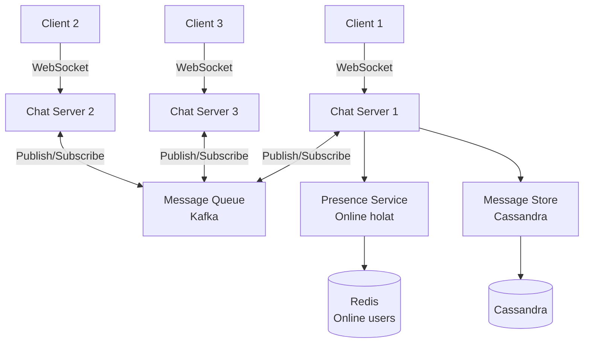
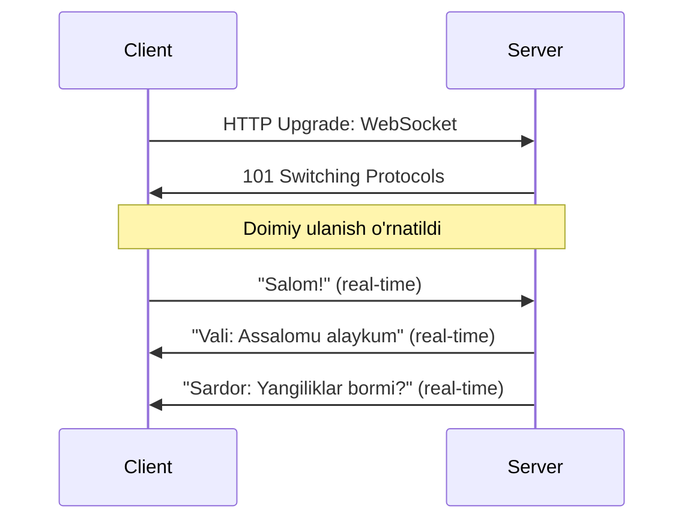
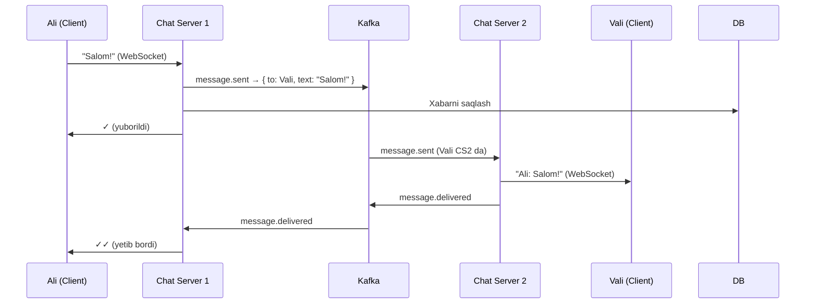
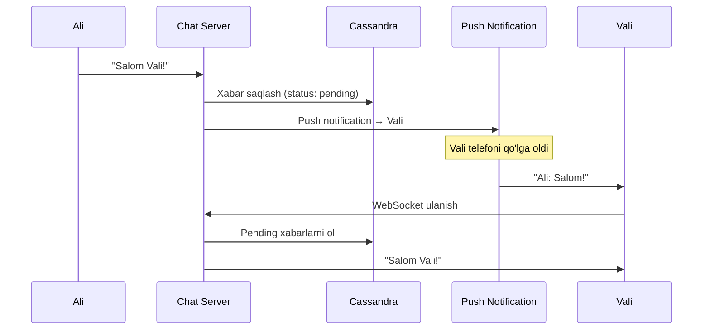

# Chat Tizimi Dizayn (WhatsApp/Telegram kabi)

## Talablar

### Funksional
- 1-to-1 va guruh chati
- Xabar yuborish va olish (real-time)
- Online/offline holat
- Xabar holati: yuborildi ✓ / yetib bordi ✓✓ / o'qildi ✓✓ (ko'k)

### Non-funksional
- 50M DAU
- 100M xabar/kun
- < 100ms latency
- 99.99% Availability

---

## Arxitektura



---

## WebSocket Nima?



HTTP bilan farqi: HTTP — bir so'rov/javob. WebSocket — doimiy ikki tomonlama kanal.

---

## Xabar Oqimi



---

## Offline Foydalanuvchi



---

## Go'da WebSocket Chat Server

```go
package main

import (
    "encoding/json"
    "log"
    "net/http"
    "sync"

    "github.com/gorilla/websocket"
)

type Message struct {
    From    string `json:"from"`
    To      string `json:"to"`
    Text    string `json:"text"`
    MsgID   string `json:"msg_id"`
}

type Client struct {
    ID   string
    Conn *websocket.Conn
    Send chan []byte
}

type Hub struct {
    clients    map[string]*Client
    register   chan *Client
    unregister chan *Client
    broadcast  chan Message
    mu         sync.RWMutex
}

func NewHub() *Hub {
    return &Hub{
        clients:    make(map[string]*Client),
        register:   make(chan *Client),
        unregister: make(chan *Client),
        broadcast:  make(chan Message, 100),
    }
}

func (h *Hub) Run() {
    for {
        select {
        case client := <-h.register:
            h.mu.Lock()
            h.clients[client.ID] = client
            h.mu.Unlock()
            log.Printf("✅ %s ulanish", client.ID)

        case client := <-h.unregister:
            h.mu.Lock()
            if _, ok := h.clients[client.ID]; ok {
                delete(h.clients, client.ID)
                close(client.Send)
            }
            h.mu.Unlock()
            log.Printf("❌ %s uzilish", client.ID)

        case msg := <-h.broadcast:
            h.mu.RLock()
            if recipient, ok := h.clients[msg.To]; ok {
                data, _ := json.Marshal(msg)
                select {
                case recipient.Send <- data:
                default:
                    // Buffer to'liq — offline deb hisoblaymiz
                    close(recipient.Send)
                    delete(h.clients, recipient.ID)
                }
            }
            h.mu.RUnlock()
        }
    }
}

var upgrader = websocket.Upgrader{
    CheckOrigin: func(r *http.Request) bool { return true },
}

func (h *Hub) HandleWS(w http.ResponseWriter, r *http.Request) {
    userID := r.URL.Query().Get("user_id")
    
    conn, err := upgrader.Upgrade(w, r, nil)
    if err != nil {
        return
    }

    client := &Client{
        ID:   userID,
        Conn: conn,
        Send: make(chan []byte, 256),
    }

    h.register <- client

    // Read goroutine
    go func() {
        defer func() {
            h.unregister <- client
            conn.Close()
        }()
        for {
            _, data, err := conn.ReadMessage()
            if err != nil {
                return
            }
            var msg Message
            if err := json.Unmarshal(data, &msg); err != nil {
                continue
            }
            msg.From = userID
            h.broadcast <- msg
        }
    }()

    // Write goroutine
    go func() {
        defer conn.Close()
        for data := range client.Send {
            conn.WriteMessage(websocket.TextMessage, data)
        }
    }()
}

func main() {
    hub := NewHub()
    go hub.Run()

    http.HandleFunc("/ws", hub.HandleWS)
    log.Println("Chat server :8080 da ishlamoqda")
    log.Fatal(http.ListenAndServe(":8080", nil))
}
```

---

## Ma'lumotlar Bazasi: Cassandra

Xabarlar uchun Cassandra mos, chunki:
- Yuqori write throughput
- Time-series ma'lumot
- Horizontal scaling

```sql
CREATE TABLE messages (
    conversation_id UUID,
    message_id      TIMEUUID,
    sender_id       TEXT,
    text            TEXT,
    status          TEXT,   -- sent, delivered, read
    created_at      TIMESTAMP,
    PRIMARY KEY (conversation_id, message_id)
) WITH CLUSTERING ORDER BY (message_id DESC);

-- So'nggi 50 xabarni olish:
SELECT * FROM messages
WHERE conversation_id = ?
LIMIT 50;
```

---

## Online/Offline Holat (Presence)

```go
type PresenceService struct {
    redis *redis.Client
}

func (ps *PresenceService) SetOnline(userID string) {
    ps.redis.Set(context.Background(),
        "presence:"+userID, "online", 30*time.Second)
}

func (ps *PresenceService) IsOnline(userID string) bool {
    err := ps.redis.Get(context.Background(), "presence:"+userID).Err()
    return err == nil
}

// Heartbeat — har 15 soniyada TTL yangilash
func (ps *PresenceService) Heartbeat(userID string) {
    ps.redis.Expire(context.Background(), "presence:"+userID, 30*time.Second)
}
```

---

## Keyingi Qadam

→ [3. News Feed.md](3.%20News%20Feed.md)
