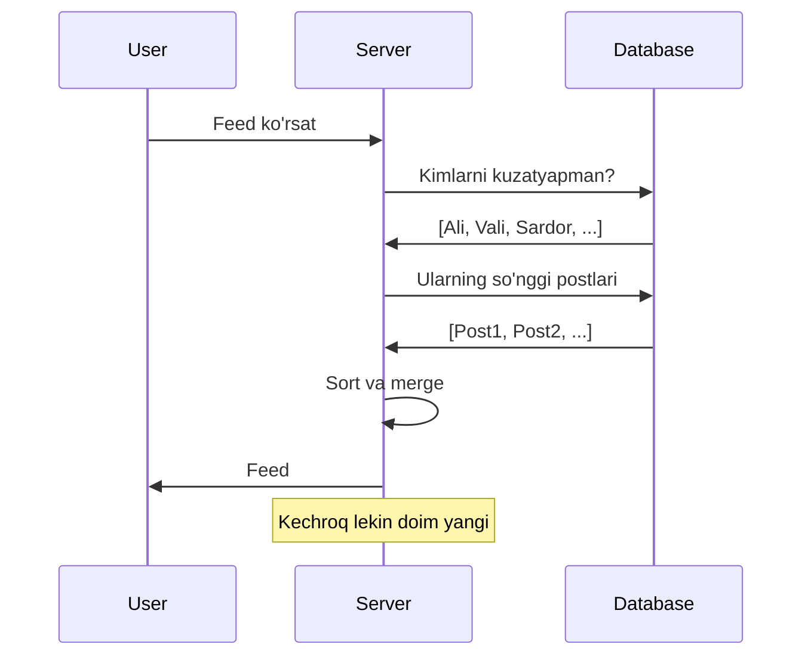
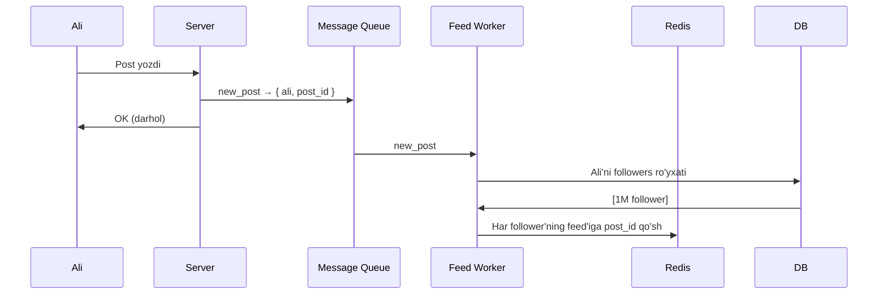
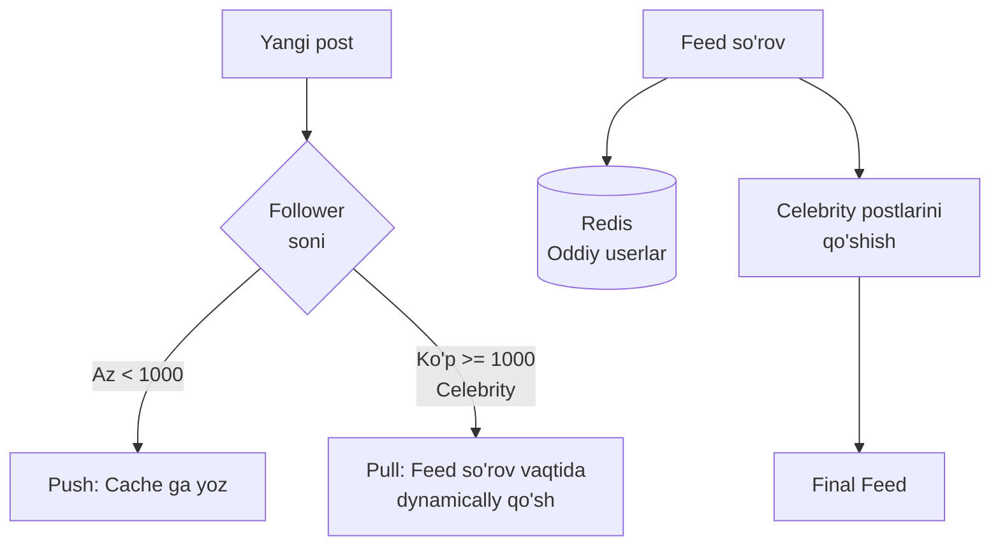
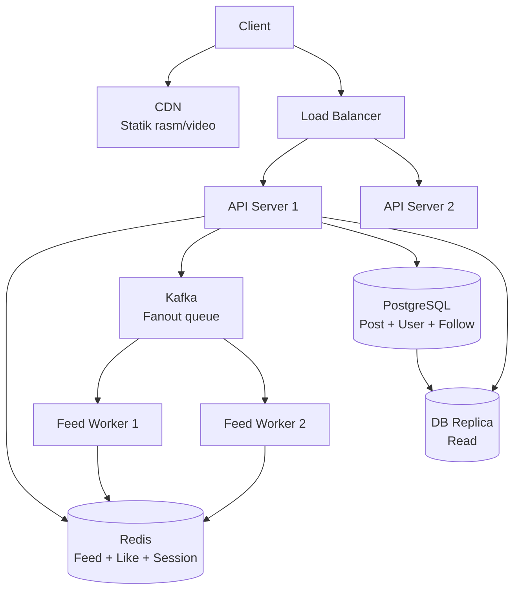
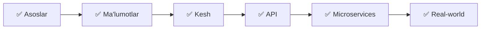

# News Feed Dizayn (Twitter/Instagram kabi)

## Talablar

### Funksional
- Post yaratish
- Foydalanuvchini kuzatish (follow)
- News feed ko'rish (kuzatilganlar postlari)
- Like va comment

### Non-funksional
- 100M DAU
- 500M post/kun
- Feed < 200ms
- 99.9% Availability

---

## Feed Generation Yondoshuvilari

### 1. Pull (Fan-out on Read)



**Muammo:** Ko'p followlari bor foydalanuvchi uchun sekin (1M follow → 1M query)

### 2. Push (Fan-out on Write)



**Muammo:** 1M follower → 1M cache write (celebrity muammo)

### 3. Hybrid ✅ (Eng yaxshi)



---

## Ma'lumotlar Bazasi Schemasi

```sql
-- Users
CREATE TABLE users (
    id       BIGSERIAL PRIMARY KEY,
    username TEXT UNIQUE NOT NULL,
    name     TEXT
);

-- Posts
CREATE TABLE posts (
    id         BIGSERIAL PRIMARY KEY,
    user_id    BIGINT REFERENCES users(id),
    content    TEXT,
    image_url  TEXT,
    created_at TIMESTAMP DEFAULT NOW()
);
CREATE INDEX idx_posts_user ON posts(user_id, created_at DESC);

-- Follows
CREATE TABLE follows (
    follower_id  BIGINT,
    following_id BIGINT,
    created_at   TIMESTAMP DEFAULT NOW(),
    PRIMARY KEY (follower_id, following_id)
);
CREATE INDEX idx_follows_following ON follows(following_id);
```

---

## Redis'da Feed Saqlash

```go
// Sorted Set: score = timestamp
// Har foydalanuvchi uchun "feed:{user_id}" key

func AddToFeed(rdb *redis.Client, userID, postID int64, createdAt time.Time) error {
    key := fmt.Sprintf("feed:%d", userID)
    return rdb.ZAdd(context.Background(), key, redis.Z{
        Score:  float64(createdAt.Unix()),
        Member: postID,
    }).Err()
}

// Feed olish (so'nggi 20 ta)
func GetFeed(rdb *redis.Client, userID int64, page, size int) ([]int64, error) {
    key := fmt.Sprintf("feed:%d", userID)
    offset := int64(page * size)
    
    result, err := rdb.ZRevRange(context.Background(), key, offset, offset+int64(size)-1).Result()
    if err != nil {
        return nil, err
    }

    postIDs := make([]int64, len(result))
    for i, r := range result {
        id, _ := strconv.ParseInt(r, 10, 64)
        postIDs[i] = id
    }
    return postIDs, nil
}

// Post yozilganda followerlarning feed'iga qo'shish
func FanoutPost(rdb *redis.Client, db *sql.DB, post Post) error {
    // Followerslarni ol
    rows, err := db.Query(
        "SELECT follower_id FROM follows WHERE following_id = $1", post.UserID,
    )
    if err != nil {
        return err
    }
    defer rows.Close()

    pipe := rdb.Pipeline()
    for rows.Next() {
        var followerID int64
        rows.Scan(&followerID)

        key := fmt.Sprintf("feed:%d", followerID)
        pipe.ZAdd(context.Background(), key, redis.Z{
            Score:  float64(post.CreatedAt.Unix()),
            Member: post.ID,
        })
        // Feed'ni 1000 ta bilan cheklash
        pipe.ZRemRangeByRank(context.Background(), key, 0, -1001)
    }

    _, err = pipe.Exec(context.Background())
    return err
}
```

---

## Full Feed API

```go
type FeedService struct {
    rdb *redis.Client
    db  *sql.DB
}

type FeedItem struct {
    Post     Post   `json:"post"`
    Author   User   `json:"author"`
    Liked    bool   `json:"liked"`
    LikeCount int   `json:"like_count"`
}

func (fs *FeedService) GetFeed(ctx context.Context, userID int64, page int) ([]FeedItem, error) {
    // 1. Cache'dan post ID larni ol
    postIDs, err := GetFeed(fs.rdb, userID, page, 20)
    if err != nil {
        return nil, err
    }

    // 2. Post ma'lumotlarini batch olish
    posts, err := fs.batchGetPosts(ctx, postIDs)
    if err != nil {
        return nil, err
    }

    // 3. Har post uchun like holatini tekshirish
    items := make([]FeedItem, len(posts))
    for i, post := range posts {
        liked := fs.rdb.SIsMember(ctx,
            fmt.Sprintf("likes:%d", post.ID), userID,
        ).Val()
        
        likeCount, _ := fs.rdb.SCard(ctx,
            fmt.Sprintf("likes:%d", post.ID),
        ).Result()

        items[i] = FeedItem{
            Post:      post,
            Liked:     liked,
            LikeCount: int(likeCount),
        }
    }

    return items, nil
}

// Like
func (fs *FeedService) LikePost(ctx context.Context, userID, postID int64) error {
    key := fmt.Sprintf("likes:%d", postID)
    fs.rdb.SAdd(ctx, key, userID)
    // DB ga ham yozish (async)
    go fs.db.Exec("INSERT INTO likes (user_id, post_id) VALUES ($1, $2) ON CONFLICT DO NOTHING",
        userID, postID)
    return nil
}
```

---

## Arxitektura Diagrammasi



---

## Muammolar va Yechimlar

| Muammo | Yechim |
|--------|--------|
| Celebrity post (1M follower) | Hybrid approach: pull for celebrities |
| Feed eskirib qolishi | Pull + Push kombinatsiya |
| Rasm saqlash | Object Storage (S3) + CDN |
| Spam post | ML spam filter + rate limiting |
| Trending | Time-decay formula bilan ranking |

---

## Tabriklash!

System Design kursini muvaffaqiyatli tugatdingiz.



**Keyingi qadam:** Design Patterns kursiga o'ting →
