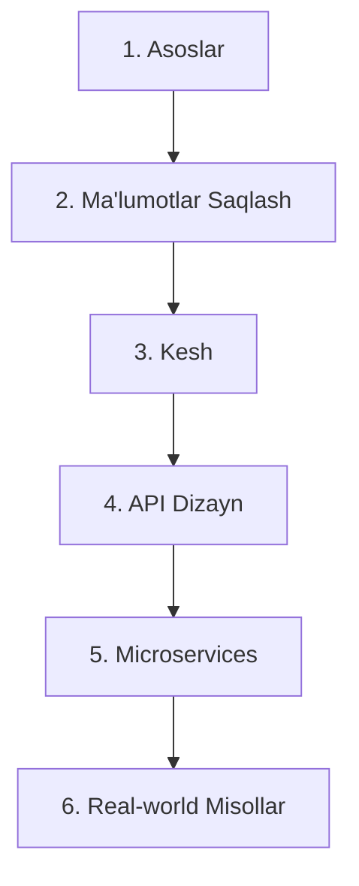
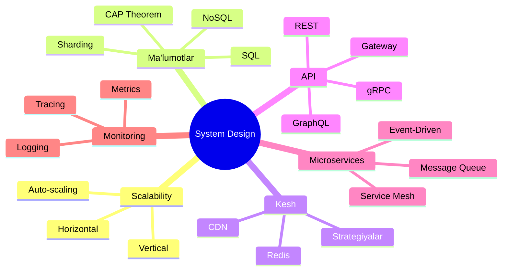

# System Design — O'quv Yo'l Xaritasi

> Katta tizimlarni loyihalashni bosqichma-bosqich o'rganish uchun to'liq qo'llanma.

---

## O'quv Yo'li

---

## Bosqichlar

### Bosqich 1 — Asoslar
| # | Mavzu | Fayl |
|---|-------|------|
| 1 | Tizim dizayn nima? | [1. Tizim Dizayn Nima.md](1.%20Asoslar/1.%20Tizim%20Dizayn%20Nima.md) |
| 2 | Scalability (kengayuvchanlik) | [2. Scalability.md](1.%20Asoslar/2.%20Scalability.md) |
| 3 | Load Balancing | [3. Load Balancing.md](1.%20Asoslar/3.%20Load%20Balancing.md) |

### Bosqich 2 — Ma'lumotlar Saqlash
| # | Mavzu | Fayl |
|---|-------|------|
| 1 | SQL vs NoSQL | [1. SQL vs NoSQL.md](2.%20Ma'lumotlar%20Saqlash/1.%20SQL%20vs%20NoSQL.md) |
| 2 | CAP Theorem | [2. CAP Theorem.md](2.%20Ma'lumotlar%20Saqlash/2.%20CAP%20Theorem.md) |
| 3 | Database Sharding & Replication | [3. Sharding va Replication.md](2.%20Ma'lumotlar%20Saqlash/3.%20Sharding%20va%20Replication.md) |

### Bosqich 3 — Kesh (Caching)
| # | Mavzu | Fayl |
|---|-------|------|
| 1 | Caching asoslari | [1. Caching.md](3.%20Kesh/1.%20Caching.md) |
| 2 | Cache strategiyalari | [2. Cache Strategiyalari.md](3.%20Kesh/2.%20Cache%20Strategiyalari.md) |

### Bosqich 4 — API Dizayn
| # | Mavzu | Fayl |
|---|-------|------|
| 1 | REST vs GraphQL vs gRPC | [1. REST vs GraphQL vs gRPC.md](4.%20API%20Dizayn/1.%20REST%20vs%20GraphQL%20vs%20gRPC.md) |
| 2 | Rate Limiting & API Gateway | [2. Rate Limiting va API Gateway.md](4.%20API%20Dizayn/2.%20Rate%20Limiting%20va%20API%20Gateway.md) |

### Bosqich 5 — Microservices
| # | Mavzu | Fayl |
|---|-------|------|
| 1 | Monolith vs Microservices | [1. Monolith vs Microservices.md](5.%20Microservices/1.%20Monolith%20vs%20Microservices.md) |
| 2 | Service Discovery & Communication | [2. Service Discovery.md](5.%20Microservices/2.%20Service%20Discovery.md) |
| 3 | Message Queue va Event-Driven | [3. Message Queue.md](5.%20Microservices/3.%20Message%20Queue.md) |

### Bosqich 6 — Real-world Misollar
| # | Loyiha | Fayl |
|---|--------|------|
| 1 | URL Shortener | [1. URL Shortener.md](6.%20Real-world%20Misollar/1.%20URL%20Shortener.md) |
| 2 | Chat Tizimi | [2. Chat Tizimi.md](6.%20Real-world%20Misollar/2.%20Chat%20Tizimi.md) |
| 3 | News Feed (Twitter/Instagram) | [3. News Feed.md](6.%20Real-world%20Misollar/3.%20News%20Feed.md) |

---

## Asosiy Tushunchalar Xaritasi

---

## O'rganish Tartibi

1. Har bir faylni ketma-ket o'qing
2. Mermaid diagrammalarni ko'rgazmali o'rganing
3. Go kodlarini o'zingiz yozing
4. Oxirida real-world misollarni mustaqil loyihalang

> **Vaqt:** ~4-6 hafta intensiv o'rganish
