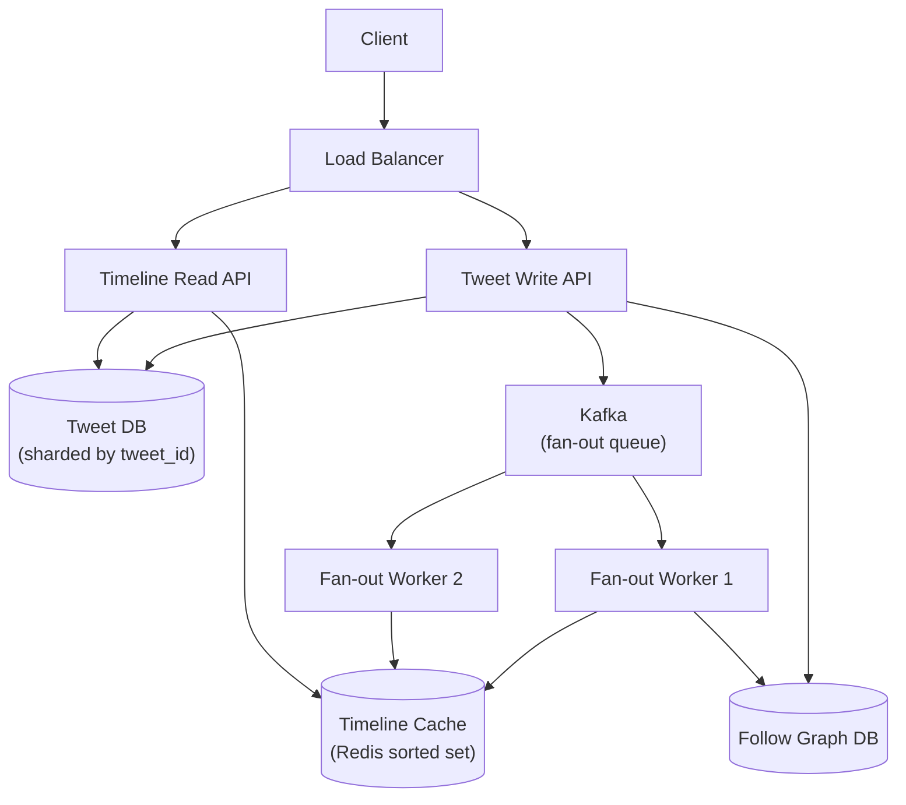
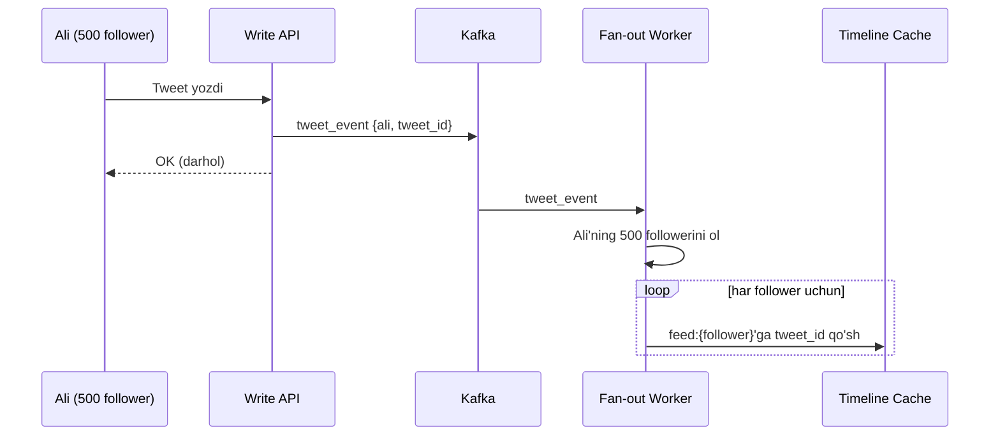
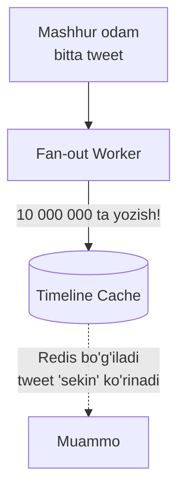
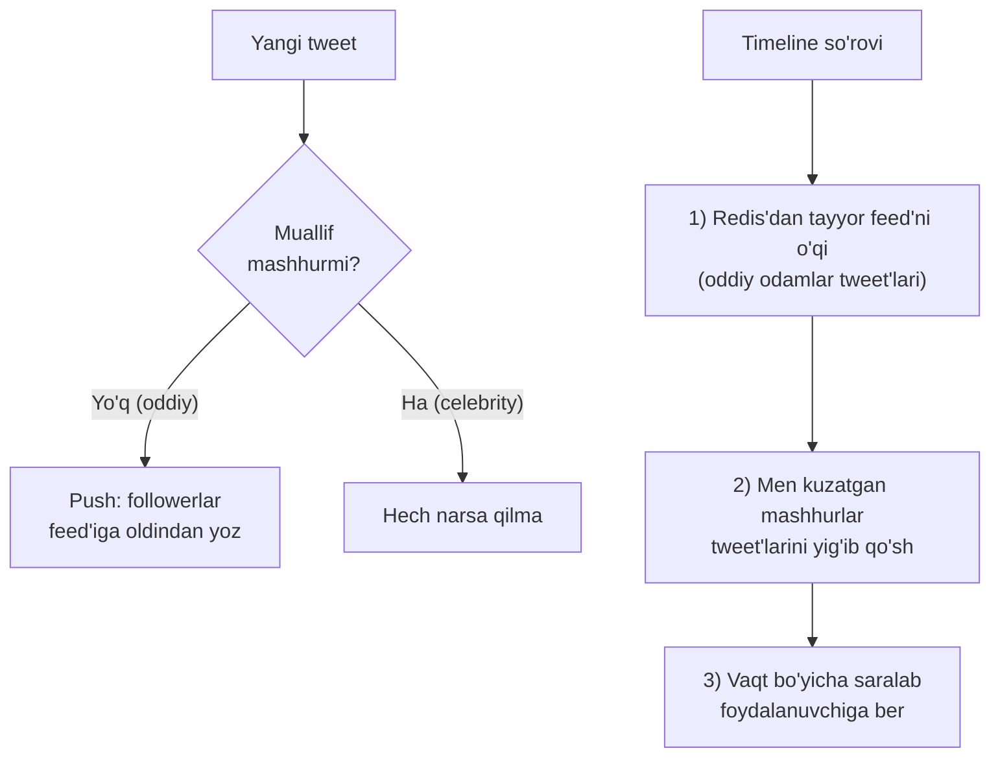

# Twitter arxitekturasi — timeline va mashhurlik muammosi

> Bu — system design intervyularining **klassikasi**. Chuqurlashish mavzusi: **home timeline'ni qanday quramiz?** Va uning eng nozik joyi — **mashhurlik muammosi (celebrity problem)**: 10 million kuzatuvchisi bor odam tweet yozsa, tizim qanday omon qoladi? Bu darsda 5-modul (pub/sub, fan-out) bilimini to'g'ridan-to'g'ri ishlatamiz.

---

## Nega bu qiyin?

Instagram/Twitter dizaynining butun murakkabligi bitta savolga jamlanadi: **"Home timeline'ni qanday tez ochamiz?"**

Bir qarashda oddiy: "kuzatgan odamlarim tweet'larini vaqt bo'yicha saralab ko'rsat". Lekin 200M foydalanuvchi, har biri yuzlab odamni kuzatadigan, ba'zilari 10M kuzatuvchiga ega bo'lgan tizimda bu **eng qiyin masala**ga aylanadi.

---

## 1-bosqich: Talablar

### Funksional talablar

```
Sen:        Fokus timeline'da deb tushundim. Asosiy funksiyalar:
            1. Tweet yozish
            2. Follow / unfollow
            3. Home timeline ko'rish (kuzatganlarim tweet'lari, yangidan eskiga)
            Like, retweet, media, qidiruv — tashqaridami?
Intervyuer: Ha, faqat shu 3 tasi. Media'ni ham qo'shsak — rasm URL yetadi.
```

Scope:
- ✅ Tweet yozish (matn + ixtiyoriy media URL)
- ✅ Follow / unfollow
- ✅ Home timeline (chronological)
- ❌ Qidiruv, trending, DM, reklama (out-of-scope)

### Nofunksional talablar

| Talab | Qiymat | Ta'siri |
|-------|--------|---------|
| **DAU** | 200M | Katta scale |
| **Read : Write** | ~25 : 1 (timeline o'qish, tweet yozish) | O'qish og'ir |
| **Timeline latency** | p99 < 200ms | Kesh kerak |
| **Availability** | 99.9% | Feed doim ochilsin |
| **Consistency** | Eventual (tweet 1-2s kechiksa mayli) | Bu bizga tezlik beradi |

> Eng muhim signal: **timeline o'qish juda tez-tez va juda tez bo'lishi kerak**. Demak har o'qishda 500 ta odamning tweet'ini yig'ib saralash — juda qimmat. Bu bizni "oldindan tayyorlangan feed" g'oyasiga olib boradi.

---

## 2-bosqich: Back-of-envelope hisob

```
// --- 1-qadam: yozish yuki ---
Tweet/user/kun = 2
Yozish/kun     = 200M × 2 = 400M tweet/kun
Write QPS      = 400M / 100 000 ≈ 4 000 QPS
Peak Write     ≈ 8 000 QPS

// --- 2-qadam: o'qish yuki ---
Timeline o'qish/user/kun = 50
O'qish/kun = 200M × 50 = 10 mlrd/kun
Read QPS   = 10 mlrd / 100 000 ≈ 100 000 QPS
Peak Read  ≈ 200 000 QPS

// --- 3-qadam: fan-out yuki (eng muhim!) ---
O'rtacha kuzatuvchilar soni ≈ 200
Har tweet 200 ta feed'ga yozilishi kerak
Fan-out yozish = 4 000 write QPS × 200 ≈ 800 000 yozish/s (!!)
```

### Raqamlardan xulosa

- Read/Write = 25:1, lekin **fan-out yozish 800K/s** — bu asl bottleneck!
- 100 000 read QPS → timeline **oldindan hisoblangan** va **keshda** bo'lishi kerak
- 800K fan-out yozish → buni "yozish paytida" qilish qimmat, lekin o'qishni tezlashtiradi

Bu yerda intervyuning butun qizig'i boshlanadi: **fan-out'ni qachon qilamiz — yozishda yoki o'qishda?**

---

## 3-bosqich: High-level dizayn



### Ma'lumot modeli

```sql
-- Tweet
CREATE TABLE tweets (
    id BIGINT PRIMARY KEY, user_id BIGINT,
    content TEXT, media_url TEXT, created_at TIMESTAMP
);

-- Follow grafi
CREATE TABLE follows (
    follower_id BIGINT, following_id BIGINT,
    PRIMARY KEY (follower_id, following_id)
);
CREATE INDEX idx_following ON follows(following_id); -- "kimlar meni kuzatadi?"
```

Timeline'ning o'zi DB'da emas — **Redis sorted set**'da saqlanadi:
```
feed:{user_id} → sorted set, score = tweet vaqti, member = tweet_id
```

---

## 4-bosqich: Chuqurlashish — timeline'ni qanday quramiz?

### Analogiya — gazeta yetkazish

Ikki xil gazeta biznesi bor:
- **Uyga yetkazish (fan-out on write):** har chiqqan gazetani darhol har bir obunachining pochta qutisiga tashaydilar. Obunachi ertalab shunchaki qutini ochadi — **tez**. Lekin nashriyot har son uchun ming marta yugurishi kerak.
- **Kioskda sotish (fan-out on read):** gazeta chiqadi, obunachi o'zi kelib har xil nashrni yig'ib oladi — **sekin**, lekin nashriyot hech kimga yugurmaydi.

Timeline ham xuddi shunday: tweet'ni **yozish paytida** followerlarga tarqatamizmi (push), yoki **o'qish paytida** yig'amizmi (pull)?

### Yondashuv A — Fan-out on Write (Push) ✅ oddiy foydalanuvchi uchun

Tweet yozilganda, uni **darhol** barcha followerlarning Redis feed'iga yozamiz. Timeline o'qish shunchaki tayyor feed'ni o'qish — juda tez.



**Yaxshi:** timeline o'qish O(1) — tayyor feed'ni RAM'dan olamiz. Read QPS 100K'ni bemalol ko'taradi.
**Yomon:** yozish qimmat. Va mana — **mashhurlik muammosi**...

### Muammo: Celebrity problem (mashhurlik muammosi)

Tasavvur qil: 10 **million** kuzatuvchisi bor mashhur odam bitta tweet yozadi.



Bitta tweet → **10 million Redis yozish**. Agar 100 ta mashhur bir vaqtda yozsa → milliardlab yozish. Tizim tiqiladi, tweet followerga **daqiqalab** yetib bormaydi. Bu — fan-out on write'ning halokati.

### Yondashuv B — Fan-out on Read (Pull) mashhurlar uchun

Mashhur odam tweet yozsa — **hech kimga tarqatmaymiz**. Uning tweet'lari o'z joyida qoladi. Follower timeline ochganda, biz **o'sha paytda** mashhurlar tweet'ini yig'ib qo'shamiz.

**Yaxshi:** mashhur yozganda 0 ta fan-out yozish.
**Yomon:** o'qish sekinlashadi (har o'qishda mashhurlar tweet'ini qidirish kerak).

### Yechim — Hybrid (aralash) ✅✅ — real Twitter shunday qiladi

Ikkalasining eng yaxshisini olamiz:

| Foydalanuvchi turi | Strategiya |
|--------------------|-----------|
| **Oddiy** (< ~10K follower) | **Fan-out on write** — feed'ga oldindan yoz |
| **Mashhur** (> ~10K follower) | **Fan-out on read** — o'qishda qo'sh |



Endi:
- Oddiy odam yozsa → arzon push (200 ta yozish).
- Mashhur yozsa → 0 ta push (o'qishda qo'shiladi).
- O'qishda faqat **men kuzatgan bir nechta mashhur**ni yig'amiz — bu arzon, chunki mashhurlar kam.

> **Oltin qoida:** hech qanday yagona strategiya to'g'ri emas. **Oddiy odamlar uchun push, mashhurlar uchun pull** — hybrid muammoning ikkala uchini ham yo'q qiladi.

### 5-modul bilan bog'lanish — pub/sub va fan-out

Bu yerdagi Kafka + Fan-out Worker aynan 5-moduldagi **pub/sub va fan-out** naqshi. Tweet Write API — **publisher**, Fan-out Worker'lar — **subscriber**. Kafka esa yozishni o'qishdan **ajratadi (decoupling)**: Write API followerlar feed'i yozilishini kutmaydi — u Kafka'ga tashlab, darhol javob qaytaradi. Bu — event-driven arxitekturaning klassik qo'llanishi.

---

## 5-bosqich: Bottleneck va trade-off'lar

### Timeline kesh — hajmni cheklash

Har feed:{user}'ni cheksiz o'stirib bo'lmaydi. Yechim: **faqat oxirgi ~800 ta tweet_id** saqlaymiz (odam baribir shundan ko'p aylantirmaydi). Eskisini kesamiz.

```
ZADD feed:{user} {score} {tweet_id}
ZREMRANGEBYRANK feed:{user} 0 -801   -- 800 tadan ortiqni o'chir
```

### Boshqa bottleneck'lar

| Muammo | Yechim |
|--------|--------|
| Mashhur odam 10M fan-out | Hybrid: mashhurlar uchun pull |
| Timeline cache o'chib qolsa | DB'dan qayta qurish (rebuild) mumkin, chunki tweet'lar DB'da |
| Fan-out worker ortda qolsa | Kafka'da xabarlar navbatda kutadi (buffer), worker'larni ko'paytiramiz |
| Yangi follow qilgan odam eski tweet'larni ko'rmaydi | Feed'ni pull bilan to'ldirish yoki oddiygina "kelajakdan boshlab" |
| Tweet DB read og'ir | tweet_id → tweet matni uchun alohida kesh |

### Trade-off jadvali — push vs pull vs hybrid

| Mezon | Push (write) | Pull (read) | Hybrid |
|-------|--------------|-------------|--------|
| Timeline o'qish tezligi | Juda tez | Sekin | Tez |
| Yozish narxi | Qimmat (celebrity halokat) | Arzon | Muvozanatli |
| Mashhurlik muammosi | Bor | Yo'q | **Yechilgan** |
| Murakkablik | Past | Past | Yuqori |

---

## 6-bosqich: Intervyuda shunday ayt

**Umumiy yondashuv:**
> "Timeline o'qish yozishdan 25 barobar tez-tez bo'lgani uchun, men o'qishni tezlashtirishga optimallashtiraman — timeline'ni oldindan hisoblab Redis sorted set'da saqlayman. Bu fan-out on write yondashuvi."

**Mashhurlik muammosi haqida:**
> "Fan-out on write'ning muammosi — 10 million follower'i bor odam yozsa, bitta tweet 10 million Redis yozishga aylanadi va tizim tiqiladi. Shuning uchun hybrid ishlataman: oddiy odamlarni push qilaman, mashhurlarni esa o'qish paytida timeline'ga qo'shaman. Chegara — taxminan 10 000 follower."

**Decoupling haqida:**
> "Write API fan-out'ni to'g'ridan-to'g'ri qilmaydi — Kafka'ga event tashlaydi va darhol javob qaytaradi. Fan-out Worker'lar fon rejimida ishlaydi. Bu tweet yozishni followerlar soniga bog'liqlikdan ozod qiladi."

---

## Predict savollari — 🤔 Intervyuer so'rasa

> 🤔 **Intervyuer so'rasa:** "10 million follower'i bor odam tweet yozsa nima bo'ladi?"

<details>
<summary>💡 Javob</summary>
Sof fan-out on write'da bu 10 million Redis yozishga aylanadi — Redis bo'g'iladi, tweet followerlarga daqiqalab yetib bormaydi. Yechim hybrid: mashhur odamlar uchun fan-out **qilmaymiz**. Uning tweet'i o'z joyida qoladi, followerlar timeline ochganda o'qish paytida qo'shiladi. Mashhurlar kam bo'lgani uchun o'qishdagi qo'shimcha yuk arzon.
</details>

> 🤔 **Intervyuer so'rasa:** "Nega timeline'ni har o'qishda jonli hisoblamaymiz (pull)?"

<details>
<summary>💡 Javob</summary>
Chunki o'qish 100 000 QPS. Har o'qishda 200 ta odamning tweet'larini DB'dan yig'ib, saralab qaytarish juda qimmat — DB qulaydi va p99 200ms'dan oshadi. Oddiy odamlar uchun timeline'ni oldindan hisoblab keshda saqlash o'qishni O(1) qiladi. Faqat mashhurlar uchun pull ishlatamiz.
</details>

> 🤔 **Intervyuer so'rasa:** "Timeline cache to'liq o'chib qolsa nima bo'ladi?"

<details>
<summary>💡 Javob</summary>
Ma'lumot yo'qolmaydi — tweet'lar va follow grafi DB'da. Cache shunchaki **hosila (derived)** ma'lumot. Uni qayta qurish (rebuild) mumkin: foydalanuvchi kuzatganlarining oxirgi tweet'larini DB'dan olib feed'ni to'ldiramiz. Vaqtincha o'qish sekinlashadi (pull rejimiga o'tadi), lekin tizim ishlaydi.
</details>

> 🤔 **Intervyuer so'rasa:** "Foydalanuvchi yangi odamni follow qilsa, uning eski tweet'lari feed'ga qanday tushadi?"

<details>
<summary>💡 Javob</summary>
Push modelida faqat kelajakdagi tweet'lar avtomatik tushadi. Eski tweet'larni ko'rsatish uchun follow paytida bir martalik "backfill" qilamiz — yangi kuzatilgan odamning oxirgi N ta tweet'ini feed'ga qo'shamiz. Yoki soddaroq: eski tweet'lar keyingi timeline yangilanishida pull orqali qo'shiladi.
</details>

---

## Xulosa

- Twitter dizaynining yuragi — **home timeline'ni qanday quramiz?**
- Read/Write = 25:1, lekin asl bottleneck — **fan-out yozish (~800K/s)**.
- **Fan-out on write (push):** o'qish tez, lekin mashhur odamda halokat.
- **Fan-out on read (pull):** yozish arzon, lekin o'qish sekin.
- **Hybrid:** oddiy odam push, mashhur pull — muammoning ikkala uchini yechadi.
- Timeline Redis sorted set'da, faqat oxirgi ~800 tweet.
- Kafka Write API'ni fan-out'dan ajratadi (5-modul: pub/sub decoupling).

## 🧠 Eslab qol

- Push = o'qishni tezlashtiradi, yozishni qimmatlashtiradi.
- Celebrity problem push modelini buzadi (10M yozish).
- Hybrid: oddiy → push, mashhur → pull.
- Timeline = hosila ma'lumot, DB'dan qayta qursa bo'ladi.
- Kafka yozish va fan-out'ni ajratadi (decoupling).

## ✅ O'z-o'zini tekshir (retrieval practice)

**1. Fan-out on write va fan-out on read'ning farqi nima?**

<details>
<summary>Javob</summary>
Write (push): tweet yozilganda darhol barcha followerlar feed'iga yoziladi — o'qish tez, yozish qimmat. Read (pull): tweet o'z joyida qoladi, follower o'qiganda tweet'lar yig'iladi — yozish arzon, o'qish sekin.
</details>

**2. Nega mashhur odam fan-out on write'ni buzadi?**

<details>
<summary>Javob</summary>
Bitta tweet uning barcha followerlari (masalan 10M) feed'iga yozilishi kerak = 10M Redis yozish. Bu Redis'ni bo'g'adi, tweet followerlarga sekin yetadi. Yozish narxi follower soniga chiziqli bog'liq — mashhurda u portlaydi.
</details>

**3. Hybrid yechim aynan qanday ishlaydi?**

<details>
<summary>Javob</summary>
Chegara qo'yamiz (~10K follower). Undan kam bo'lsa oddiy — tweet push qilinadi. Undan ko'p bo'lsa mashhur — push qilinmaydi. O'qishda: tayyor feed (oddiylar) + men kuzatgan mashhurlar tweet'lari yig'ilib saralanadi.
</details>

**4. Timeline cache o'chsa ma'lumot yo'qoladimi?**

<details>
<summary>Javob</summary>
Yo'q. Timeline — hosila ma'lumot; asl tweet'lar va follow grafi DB'da. Cache'ni DB'dan qayta qurish mumkin. Vaqtincha sekinlashuv bo'ladi, xolos.
</details>

**5. Kafka bu yerda qanday muammoni hal qiladi?**

<details>
<summary>Javob</summary>
Kafka Write API'ni fan-out ishidan ajratadi (decoupling). Tweet yozilganda Write API followerlar feed'i yozib bo'linishini kutmaydi — u Kafka'ga event tashlaydi va darhol javob qaytaradi. Fan-out Worker'lar fon rejimida ishlaydi. Bu tweet yozish tezligini follower soniga bog'liqlikdan ozod qiladi va yukni buffer qiladi (worker ortda qolsa Kafka'da kutadi).
</details>

## 🛠 Amaliyot

**1. Oson (Modify).** Hybrid chegarasini 10 000 dan 1 000 000 ga oshirsang, tizimga qanday ta'sir qiladi? Yozib chiq: qaysi foydalanuvchilar endi "oddiy" bo'lib qoladi va bu fan-out yukiga qanday ta'sir qiladi.

<details>
<summary>Hint</summary>
Ko'proq odam "oddiy" sanaladi → ko'proq push → fan-out yozish yuki oshadi. Lekin o'qishda pull qilinadigan mashhurlar kamayadi → o'qish soddalashadi. Bu — yozish vs o'qish muvozanatini surish.
</details>

**2. O'rta (faded example).** Quyidagi fan-out worker skeletini to'ldir:

```go
func FanoutTweet(rdb *redis.Client, db *sql.DB, t Tweet) error {
    // TODO: 1) muallif mashhurmi? follower sonini tekshir
    //          agar mashhur bo'lsa — return (push qilma)
    // TODO: 2) muallifning barcha followerlarini DB'dan ol
    // TODO: 3) Redis pipeline bilan har follower feed:{id}'ga ZAdd qil
    // TODO: 4) har feed'ni oxirgi 800 tweet bilan cheklab (ZRemRangeByRank)
    return nil
}
```

<details>
<summary>Hint</summary>
`SELECT COUNT(*) FROM follows WHERE following_id=?` > 10000 bo'lsa return. So'ng `SELECT follower_id ...`, `pipe.ZAdd(...)`, `pipe.ZRemRangeByRank(key, 0, -801)`, `pipe.Exec()`.
</details>

**3. Qiyin (Make).** Shu arxitekturani **Instagram Stories** uchun moslashtir: story 24 soatdan keyin yo'qoladi. Talab + hisob + high-level diagramma yoz. Fikrla: TTL (yashash muddati) bu yerda qanday ishlaydi va celebrity problem baribir bormi?

<details>
<summary>Hint</summary>
Story'ga Redis TTL 24 soat qo'yiladi — o'zi o'chadi, eski story tozalash cron kerak emas. Celebrity problem bor, lekin story doim "yangi" bo'lgani uchun feed hajmi kichik. Fan-out o'rniga ko'pincha pull ishlatiladi (story kam va tez eskiradi).
</details>

## 🔁 Takrorlash

**Bog'liq oldingi mavzular:**
- [Hodisa ustida qurish — Pub/Sub va Fan-out](../05-hodisa-ustida-qurish/03-pub-sub-va-fan-out.md) — Kafka, decoupling
- [Caching — o'qish strategiyalari](../04-caching/01-oqish-strategiyalari.md) — timeline cache
- [Ma'lumotlar ombori — Replication va Sharding](../03-malumotlar-ombori/04-replication-va-sharding.md) — tweet DB sharding
- [URL Shortener](02-url-shortener.md) — oldingi case study

**Takrorlash jadvali:**
- **Ertaga:** push vs pull vs hybrid jadvalini yoddan chiz.
- **3 kundan keyin:** celebrity problem va uning yechimini og'zaki tushuntir.
- **1 haftadan keyin:** butun timeline dizaynini 5 bosqich bo'yicha gapirib ber.

**Feynman testi:** Twitter timeline'i qanday quriladi va mashhur odam yozganda muammo nega paydo bo'lishini kod so'zlarisiz 3 jumlada tushuntir.

---

⬅️ Oldingi: [02 — URL Shortener](02-url-shortener.md) | ➡️ Keyingi: [04 — WhatsApp arxitekturasi](04-whatsapp-arxitekturasi.md)