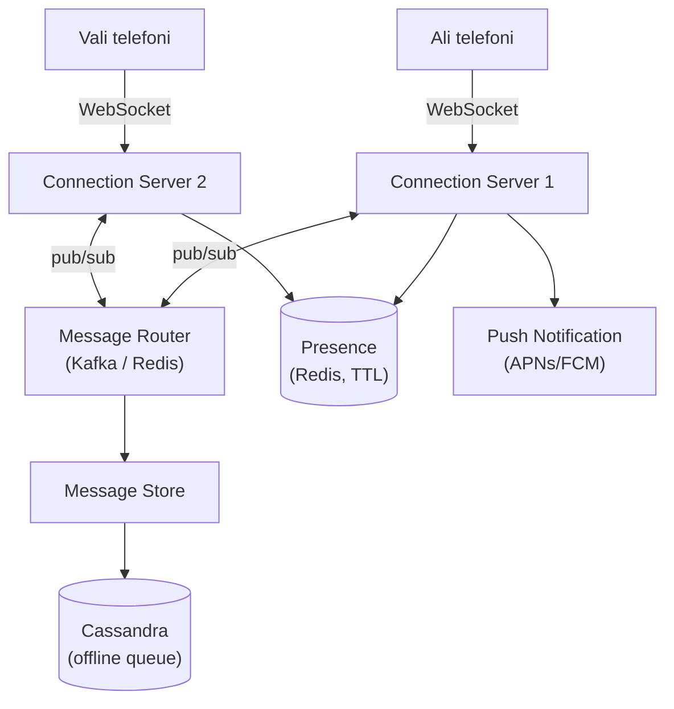
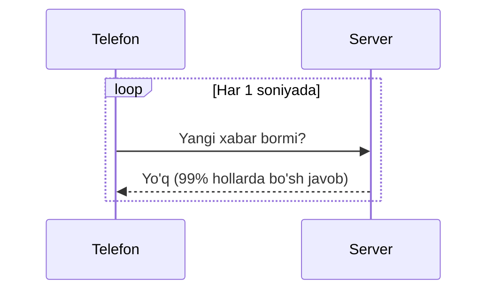
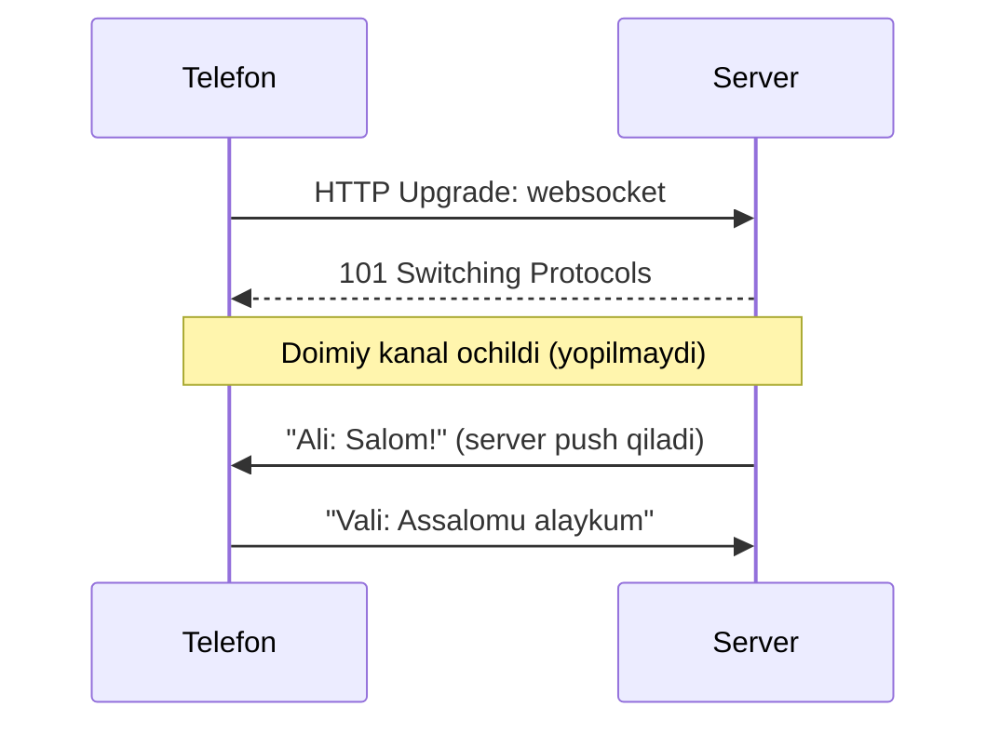
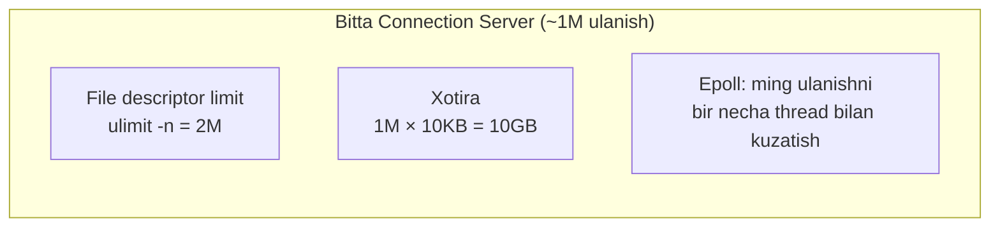
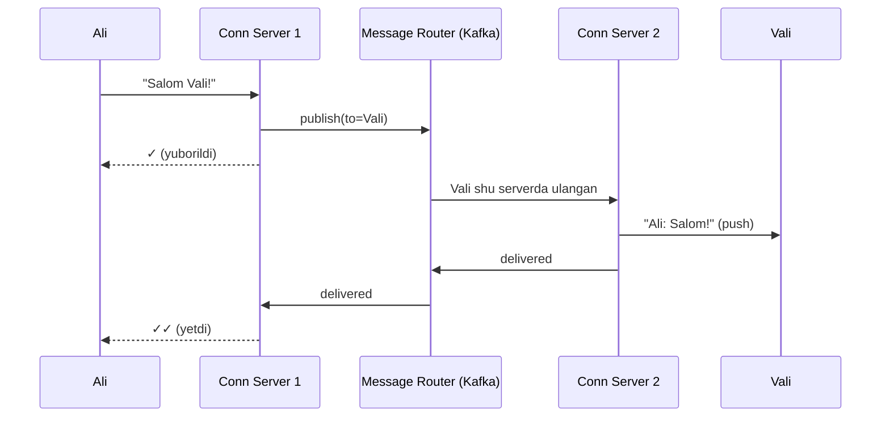
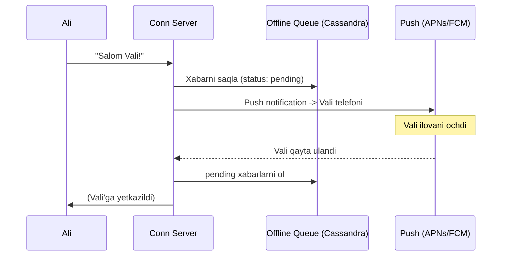

# WhatsApp arxitekturasi — 1 million connection muammosi

> Chat tizimlarining eng qiziq savoli — **"qanday qilib millionlab odam bir vaqtda ulanib turadi?"** Twitter'da (oldingi dars) muammo *yozish yuki* edi. Bu yerda muammo boshqa — **doimiy ulanishlar (persistent connections)**. Chuqurlashish mavzusi: **1 million connection'ni bitta serverda qanday ushlab turamiz?**

---

## Nega chat boshqacha?

Oddiy veb-sayt: so'rov keladi → javob ketadi → ulanish yopiladi. Server kimning "onlayn" ekanini bilishi shart emas.

Chat esa **real-time** va **push**: Ali xabar yozganda, Vali sahifani yangilamasdan **darhol** ko'rishi kerak. Buning uchun server Vali bilan **doimiy ochiq ulanish** ushlab turishi kerak. Mana shu yerdan butun murakkablik boshlanadi.

---

## 1-bosqich: Talablar

### Funksional talablar

```
Sen:        Fokus 1-to-1 chatda deb tushundim. Asosiy funksiyalar:
            1. 1-to-1 xabar yuborish/olish (real-time)
            2. Online/offline holat (presence)
            3. Yetkazish holati: yuborildi / yetdi / o'qildi
            Guruh chati, ovozli qo'ng'iroq — tashqaridami?
Intervyuer: Ha, faqat 1-to-1 va offline foydalanuvchiga xabar yetkazish.
```

Scope:
- ✅ 1-to-1 real-time xabar
- ✅ Online/offline presence
- ✅ Delivery status (bir galochka / ikki galochka / o'qildi)
- ✅ Offline foydalanuvchiga xabar yetkazish
- ❌ Guruh, qo'ng'iroq, media (out-of-scope)

### Nofunksional talablar

| Talab | Qiymat | Ta'siri |
|-------|--------|---------|
| **DAU** | 500M | Juda ko'p ulanish |
| **Xabar/kun** | 50 mlrd | Yuqori throughput |
| **Latency** | < 100ms | Real-time his qilinsin |
| **Delivery** | Kafolatli (yo'qolmasin) | Offline queue kerak |
| **Availability** | 99.99% | Chat doim ishlasin |

> Eng muhim signal: **500M foydalanuvchi bir vaqtda ulanib turishi mumkin.** Bu — asl muammo. Chunki har ulanish serverda resurs egallaydi.

---

## 2-bosqich: Back-of-envelope hisob

```
// --- 1-qadam: bir vaqtdagi ulanishlar (concurrent connections) ---
DAU = 500M, ularning ~20% bir vaqtda onlayn
Concurrent connections ≈ 100M

// --- 2-qadam: xabar throughput ---
Xabar/kun = 50 mlrd
Write QPS = 50 mlrd / 100 000 ≈ 500 000 QPS
Peak      ≈ 1 000 000 QPS

// --- 3-qadam: nechta connection server kerak? ---
Faraz: bitta server ~1M connection ushlaydi (buni pastda asoslaymiz)
Server soni = 100M / 1M = 100 ta connection server

// --- 4-qadam: storage ---
1 xabar ≈ 300 bayt
Kunlik  = 50 mlrd × 300 ≈ 15 TB/kun
```

### Raqamlardan xulosa

- **100M concurrent connection** → bu asl bottleneck, oddiy HTTP model yaramaydi
- Bitta serverda 1M connection → **file descriptor va xotira** cheklovlarini hisoblash kerak
- 15 TB/kun → xabarlar uchun **Cassandra** kabi write-optimallashgan DB

---

## 3-bosqich: High-level dizayn



### Asosiy g'oya — Connection Server alohida

Ulanishlarni ushlab turadigan serverlar (**Connection Server**) biznes-logikadan **ajratilgan**. Ular faqat bitta ish qiladi: WebSocket ulanishlarni ushlab, xabarni Message Router'ga uzatish va qaytarish. Bu ularni juda "yengil" qiladi va ko'p connection sig'diradi.

---

## 4-bosqich: Chuqurlashish — 1 million connection

### Muammo 1: nega HTTP polling yaramaydi?

Real-time xabar uchun eng sodda g'oya: telefon har soniyada serverdan "yangi xabar bormi?" deb so'raydi (**polling**).



⚠️ **Nega yomon:**
- 100M foydalanuvchi × har soniyada so'rov = **100M QPS** — faqat "yo'q" deyish uchun!
- Xabarlarning 99% bo'sh javob — resurs behuda ketadi.
- Xabar kelsa ham, keyingi so'rovgacha (1 soniya) kechikadi — real-time emas.

### Yechim: WebSocket — doimiy ikki tomonlama kanal

**WebSocket** — bir marta ochiladigan va yopilmaydigan ulanish. Server xabar kelganda telefonga **o'zi push qiladi**, telefon so'ramaydi.



**Analogiya:** polling — har daqiqada pochtaga borib "xat bormi?" deb so'rash. WebSocket — pochtachining eshigingizni taqillatib xatni **o'zi keltirishi**. Ikkinchisi ancha samarali.

| Mezon | HTTP Polling | WebSocket |
|-------|--------------|-----------|
| Ulanish | Har so'rovda yangi | Bir marta, doimiy |
| Kim boshlaydi | Faqat client | **Server ham** push qila oladi |
| Bo'sh so'rov | Ko'p (99%) | Yo'q |
| Real-time | Yo'q (kechikadi) | Ha |

### Muammo 2: bitta serverda qancha connection sig'adi?

Endi eng nozik savol. Har WebSocket ulanish serverda ikki resurs yeydi:

**1. File descriptor (FD):** Linux'da har ochiq ulanish — bitta "fayl" (socket). Standart limit odatda 1024, lekin uni oshirish mumkin:
```
ulimit -n 2000000        # bitta jarayon 2M ta FD ocha oladi
```

**2. Xotira (memory):** har ulanish bufer va holat uchun xotira yeydi. Agar har connection ~10 KB yesa:
```
1M connection × 10 KB = 10 GB RAM  →  bitta serverda sig'adi
```

Demak nazariy jihatdan **bitta server ~1M connection** ushlay oladi. Cheklov — FD limitini oshirish va connection'ni **arzon** (kam xotira) qilish.



### Muammo 3: Go'da qanday yozamiz? Goroutine-per-connection

Go bu masala uchun **ideal**, chunki goroutine juda arzon (~2-8 KB stek). Har ulanishga 2 ta goroutine ochamiz: biri o'qiydi, biri yozadi.

**Notional machine — ichkarida nima bo'ladi?**
Har goroutine OS thread emas — Go runtime ularni bir nechta OS thread ustida "multiplekslaydi" (GMP scheduler). 1M goroutine ≈ 1M × 4KB ≈ 4GB stek. OS thread bilan buni qilib bo'lmasdi (thread ~1MB stek → 1M × 1MB = 1TB, imkonsiz). Aynan shuning uchun Go chat serverlari uchun mashhur.

```go
// --- 1-qadam: har WebSocket ulanish uchun handler ---
func (s *Server) HandleWS(w http.ResponseWriter, r *http.Request) {
    conn, _ := upgrader.Upgrade(w, r, nil) // HTTP -> WebSocket
    userID := r.URL.Query().Get("user_id")

    client := &Client{ID: userID, Conn: conn, Send: make(chan []byte, 256)}
    s.hub.register <- client

    // --- 2-qadam: O'qish goroutine (client -> server) ---
    go client.readLoop(s.hub)
    // --- 3-qadam: Yozish goroutine (server -> client) ---
    go client.writeLoop()
}

// Yozish: Send kanalidagi har xabarni ulanishga jo'natamiz
func (c *Client) writeLoop() {
    for data := range c.Send {           // kanal yopilmaguncha kutadi
        c.Conn.WriteMessage(websocket.TextMessage, data)
    }
}
```

Har `Client` uchun `Send` kanali — bu uning "pochta qutisi". Boshqa server unga xabar yubormoqchi bo'lsa, shu kanalga tashlaydi, `writeLoop` esa uni ulanishga uzatadi.

### Muammo 4: Ali va Vali turli serverlarda bo'lsa-chi?

Ali → Connection Server 1, Vali → Connection Server 2. CS1 Vali'ni ko'rmaydi. Yechim: **Message Router** (pub/sub) — 5-moduldagi naqsh.



Router "qaysi foydalanuvchi qaysi serverda?" degan xaritani (routing table) Redis'da saqlaydi.

---

## 5-bosqich: Bottleneck va trade-off'lar

### Online/offline presence

Onlayn holatni Redis'da **TTL (yashash muddati)** bilan saqlaymiz. Telefon har 15 soniyada "heartbeat" yuboradi, TTL 30 soniya:

```
SET presence:{user} online EX 30    -- 30 soniya keyin o'zi o'chadi
```

Agar telefon heartbeat yubormay qo'ysa (internet uzildi), 30 soniyadan keyin TTL o'chadi → foydalanuvchi avtomatik "offline" bo'ladi. Alohida "offline qil" xabari kerak emas.

### Offline foydalanuvchiga xabar yetkazish kafolati

Vali offline bo'lsa, xabar yo'qolmasligi kerak. Yechim: **offline queue** (Cassandra).



Xabar **avval saqlanadi, keyin yetkaziladi** — shu tartib yo'qolishni oldini oladi.

### Delivery status — bir/ikki galochka

| Belgi | Ma'nosi | Qachon |
|-------|---------|--------|
| ✓ (bitta) | **Yuborildi** — server qabul qildi | CS xabarni saqladi |
| ✓✓ (ikkita) | **Yetdi** — qabul qiluvchi qurilmaga tushdi | CS2 Vali'ga push qildi |
| ✓✓ (ko'k) | **O'qildi** | Vali chatni ochdi, "read" event yubordi |

Har bosqichda qabul qiluvchi tomon **acknowledgement (ack)** yuboradi, u orqaga (Ali'ga) qaytadi.

### Boshqa bottleneck'lar

| Muammo | Yechim |
|--------|--------|
| Connection server o'chsa, 1M ulanish uziladi | Telefon avtomatik boshqa serverga qayta ulanadi (LB) |
| Router single point | Kafka/Redis cluster, replikatsiya |
| Xotira to'lib ketishi | Connection'ni yengil tut, keraksiz bufer'ni tozalab tur |
| Push notification kechikishi | Offline queue + retry |
| Thundering herd (hamma bir vaqtda qayta ulanadi) | Qayta ulanishni tasodifiy kechiktirish (jitter) |

---

## 6-bosqich: Intervyuda shunday ayt

**Ulanish modeli haqida:**
> "Polling ishlatmayman — 100M foydalanuvchi har soniyada so'rov yuborsa, faqat 'yo'q' deyish uchun 100M QPS bo'ladi. Buning o'rniga WebSocket ishlataman: bir marta ochiladigan doimiy kanal, server xabarni o'zi push qiladi. Bu real-time va resurs tejaydi."

**1M connection haqida:**
> "Har ulanish bitta file descriptor va ~10KB xotira yeydi. `ulimit -n` ni oshirib va connection'ni yengil tutib, bitta serverda ~1M ulanish ushlayman. Go'da goroutine-per-connection ishlataman — goroutine ~4KB stek, OS thread'dan 200 barobar arzon, shuning uchun million goroutine muammosiz."

**Delivery kafolati haqida:**
> "Xabarni avval Cassandra'ga saqlab, keyin yetkazaman. Qabul qiluvchi offline bo'lsa, xabar offline queue'da kutadi va push notification yuboriladi. Foydalanuvchi qayta ulanganda pending xabarlarni oladi — hech narsa yo'qolmaydi."

---

## Predict savollari — 🤔 Intervyuer so'rasa

> 🤔 **Intervyuer so'rasa:** "Nega WebSocket, oddiy HTTP emas?"

<details>
<summary>💡 Javob</summary>
HTTP so'rov-javob modeli — server o'zi client'ga xabar yubora olmaydi, faqat javob beradi. Chatda server "Ali sizga yozdi" deb o'zi push qilishi kerak. HTTP bilan buni faqat polling orqali (har soniyada so'rash) qilish mumkin, bu esa 99% bo'sh so'rov va resurs isrofi. WebSocket doimiy ikki tomonlama kanal ochadi — server istagan payt push qiladi.
</details>

> 🤔 **Intervyuer so'rasa:** "Bitta serverda qancha connection sig'adi va nima cheklaydi?"

<details>
<summary>💡 Javob</summary>
Taxminan 1M. Ikki cheklov: (1) file descriptor — har ulanish bitta socket FD, `ulimit -n` ni oshirish kerak; (2) xotira — har ulanish ~10KB, 1M × 10KB = 10GB RAM. Go'da goroutine stek ham hisobga olinadi (~4KB × 1M = 4GB). Connection'ni yengil tutsak, bitta serverga million ulanish sig'adi.
</details>

> 🤔 **Intervyuer so'rasa:** "Nega Go bu masala uchun yaxshi?"

<details>
<summary>💡 Javob</summary>
Goroutine juda arzon — ~4KB stek, OS thread esa ~1MB. 1M ulanishga OS thread ochsak 1TB RAM kerak (imkonsiz), goroutine bilan ~4GB. Go runtime goroutine'larni bir nechta OS thread ustida multiplekslaydi (GMP scheduler), shuning uchun million bloklovchi o'qish/yozishni bemalol boshqaradi. Kod ham sodda: har connection uchun 2 ta goroutine.
</details>

> 🤔 **Intervyuer so'rasa:** "Ali va Vali turli connection serverlarda bo'lsa xabar qanday yetadi?"

<details>
<summary>💡 Javob</summary>
Connection Server'lar orasida Message Router (Kafka yoki Redis pub/sub) turadi. CS1 xabarni router'ga publish qiladi, router "Vali qaysi serverda?" degan xaritaga (Redis routing table) qarab CS2'ga yuboradi, CS2 Vali'ga push qiladi. Connection server'lar bir-birini bevosita bilmaydi — router ular orasini ulaydi (decoupling).
</details>

> 🤔 **Intervyuer so'rasa:** "Foydalanuvchi offline bo'lsa xabar yo'qolmasligi qanday kafolatlanadi?"

<details>
<summary>💡 Javob</summary>
Xabar avval Cassandra'ga saqlanadi (write-first), keyin yetkazishga urinamiz. Qabul qiluvchi offline bo'lsa xabar "pending" holatda offline queue'da qoladi va push notification yuboriladi. Foydalanuvchi qayta ulanganda pending xabarlarni oladi va ack yuboradi — shundan keyingina xabar "yetkazildi" deb belgilanadi.
</details>

---

## Xulosa

- Chat muammosi Twitter'dan farqli — asosiy qiyinchilik **doimiy ulanishlar (connections)**.
- **Polling yaramaydi:** 100M × har soniya = 100M bo'sh QPS.
- **WebSocket:** bir marta ochiladigan kanal, server o'zi push qiladi.
- Bitta serverda ~1M connection: cheklov — **file descriptor** va **xotira**.
- Go'da **goroutine-per-connection** — goroutine OS thread'dan 200x arzon.
- Turli serverdagi foydalanuvchilarni **Message Router (pub/sub)** ulaydi.
- Presence — Redis TTL + heartbeat; delivery — offline queue + ack.

## 🧠 Eslab qol

- WebSocket = doimiy kanal, server push qiladi; polling = isrof.
- 1 connection = 1 file descriptor + ~10KB xotira.
- Goroutine ~4KB, OS thread ~1MB → Go million ulanishni ko'taradi.
- Xabarni avval saqla, keyin yetkaz (delivery kafolati).
- Presence = heartbeat + Redis TTL.

## ✅ O'z-o'zini tekshir (retrieval practice)

**1. Nega 100M foydalanuvchi uchun polling falokat?**

<details>
<summary>Javob</summary>
Har foydalanuvchi har soniyada "xabar bormi?" so'rasa, 100M QPS bo'ladi — asosan bo'sh javoblar uchun. Bu server resursini behuda yeydi va xabar baribir keyingi so'rovgacha kechikadi. WebSocket bu so'rovlarni butunlay yo'q qiladi.
</details>

**2. Bitta serverda 1M connection'ni nima cheklaydi?**

<details>
<summary>Javob</summary>
Ikki narsa: (1) file descriptor limiti — har ulanish bitta socket FD, `ulimit -n` ni oshirish kerak; (2) xotira — har ulanish bufer/holat uchun ~10KB, million ulanish ~10GB RAM. Connection yengil bo'lsa, million sig'adi.
</details>

**3. Nega goroutine-per-connection OS thread-per-connection'dan yaxshi?**

<details>
<summary>Javob</summary>
Goroutine ~4KB stek, OS thread ~1MB. 1M ulanish: goroutine ~4GB, thread ~1TB (imkonsiz). Go runtime goroutine'larni bir nechta thread ustida multiplekslaydi, shuning uchun million bloklovchi ulanishni oz resurs bilan boshqaradi.
</details>

**4. Presence (online holat) TTL bilan nega qulay?**

<details>
<summary>Javob</summary>
Heartbeat kelganda TTL yangilanadi. Telefon uzilsa heartbeat kelmaydi, TTL o'zi tugaydi → foydalanuvchi avtomatik offline. "Offline qil" degan alohida signal kerak emas — tabiiy va ishonchli.
</details>

**5. Ikki galochka (✓✓) qachon paydo bo'ladi va u qanday ishlaydi?**

<details>
<summary>Javob</summary>
Xabar qabul qiluvchi qurilmaga yetkazilganda. CS2 Vali'ga push qilgach, "delivered" ack yuboradi, u router orqali Ali serveriga (CS1), undan Ali'ga qaytadi. Bir galochka = server qabul qildi; ikki galochka = qurilmaga yetdi; ko'k = o'qildi.
</details>

## 🛠 Amaliyot

**1. Oson (Modify).** Presence TTL'ni 30 soniyadan 10 soniyaga tushirsang, qanday trade-off yuzaga keladi?

<details>
<summary>Hint</summary>
Offline holat tezroq aniqlanadi (aniqroq), lekin heartbeat tez-tez yuborilishi kerak → ko'proq tarmoq va yuk. TTL uzun = kam yuk, lekin "offline" kech ko'rinadi.
</details>

**2. O'rta (faded example).** Quyidagi `readLoop` skeletini to'ldir (client'dan kelgan xabarni router'ga uzatish):

```go
func (c *Client) readLoop(hub *Hub) {
    defer func() {
        // TODO: 1) hub'dan unregister qil va conn'ni yop
    }()
    for {
        // TODO: 2) conn.ReadMessage() bilan xabar o'qi, xato bo'lsa return
        // TODO: 3) xabarni Message parse qil, from = c.ID
        // TODO: 4) hub.route <- msg (router'ga uzat)
    }
}
```

<details>
<summary>Hint</summary>
`defer` ichida `hub.unregister <- c; c.Conn.Close()`. Loop ichida `_, data, err := c.Conn.ReadMessage()`; `err != nil` bo'lsa `return`; `json.Unmarshal`, `msg.From = c.ID`, `hub.route <- msg`.
</details>

**3. Qiyin (Make).** Shu arxitekturani **guruh chati** uchun moslashtir (masalan 500 kishilik guruh). Talab + hisob + diagramma yoz. Fikrla: bitta xabar 500 kishiga borishi kerak — bu Twitter'ning fan-out muammosiga o'xshaydimi?

<details>
<summary>Hint</summary>
Ha, o'xshaydi — guruh xabari kichik fan-out. Har xabar guruh a'zolari sonicha nusxalanadi. Katta guruhlar uchun (WhatsApp'da 1024 gacha) fan-out on write ishlatiladi, lekin celebrity-darajada emas. Presence va delivery status har a'zo uchun murakkablashadi.
</details>

## 🔁 Takrorlash

**Bog'liq oldingi mavzular:**
- [Hodisa ustida qurish — Pub/Sub va Fan-out](../05-hodisa-ustida-qurish/03-pub-sub-va-fan-out.md) — Message Router
- [Kengayish usullari — Load Balancing](../02-kengayish-usullari/02-load-balancing.md) — connection serverlarni tarqatish
- [Caching — o'qish strategiyalari](../04-caching/01-oqish-strategiyalari.md) — presence Redis
- [Twitter arxitekturasi](03-twitter-arxitekturasi.md) — fan-out taqqoslash

**Takrorlash jadvali:**
- **Ertaga:** polling vs WebSocket jadvalini yoddan ayt.
- **3 kundan keyin:** "1M connection" cheklovlarini (FD, xotira) hisoblab ber.
- **1 haftadan keyin:** butun chat oqimini (Ali → Vali, turli serverda) chizib ber.

**Feynman testi:** Millionlab odam qanday bir vaqtda ulanib turishini va Go bu uchun nega yaxshi ekanini kod so'zlarisiz 3 jumlada tushuntir.

---

⬅️ Oldingi: [03 — Twitter arxitekturasi](03-twitter-arxitekturasi.md) | ➡️ Keyingi: [05 — Uber arxitekturasi](05-uber-arxitekturasi.md)
