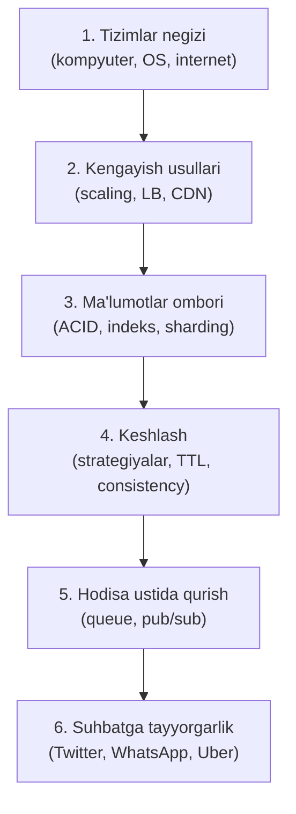
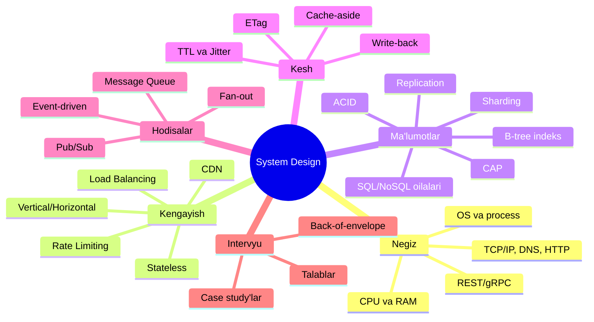

# System Design — To'liq O'quv Kursi

> Kompyuter negizidan boshlab, millionlab foydalanuvchiga xizmat qiladigan tizimlar loyihalashgacha — bosqichma-bosqich, o'zbek tilida.

---

## Kurs xaritasi

---

## Modul 1 — Tizimlar negizi

> Ko'r-ko'rona kod yozishni to'xtatib, kompyuter va internet aslida qanday ishlashini tushunish orqali ongli arxitektura qurishga o'tasiz.

| # | Mavzu | Fayl |
|---|-------|------|
| 1 | Kompyuter anatomiyasi | [01-kompyuter-anatomiyasi.md](01-tizimlar-negizi/01-kompyuter-anatomiyasi.md) |
| 2 | Operatsion tizim va abstraksiya | [02-operatsion-tizim-va-abstraksiya.md](01-tizimlar-negizi/02-operatsion-tizim-va-abstraksiya.md) |
| 3 | Dastur, dasturlash tili va dasturchi | [03-dastur-dasturlash-tili-va-dasturchi.md](01-tizimlar-negizi/03-dastur-dasturlash-tili-va-dasturchi.md) |
| 4 | Internet tarmog'i va protokollari | [04-internet-tarmogi-va-protokollari.md](01-tizimlar-negizi/04-internet-tarmogi-va-protokollari.md) |
| 5 | API uslublari: REST, GraphQL, gRPC ➕ | [05-api-uslublari-rest-graphql-grpc.md](01-tizimlar-negizi/05-api-uslublari-rest-graphql-grpc.md) |

## Modul 2 — Kengayish usullari

> Saytingizga millionlab odam kirganda serverlar "qotib" qolmasligi uchun sistemani yuqori yuklamaga chidamli qilishni o'rganasiz.

| # | Mavzu | Fayl |
|---|-------|------|
| 1 | Vertikal va gorizontal kengayish | [01-vertikal-va-gorizontal-kengayish.md](02-kengayish-usullari/01-vertikal-va-gorizontal-kengayish.md) |
| 2 | Yuklanishni taqsimlash (load balancing) | [02-load-balancing.md](02-kengayish-usullari/02-load-balancing.md) |
| 3 | Kengayish qiyinchiligi: stateful/stateless | [03-stateful-va-stateless.md](02-kengayish-usullari/03-stateful-va-stateless.md) |
| 4 | CDN bilan kontentni yetkazish | [04-cdn.md](02-kengayish-usullari/04-cdn.md) |
| 5 | Rate limiting va backpressure ➕ | [05-rate-limiting-va-backpressure.md](02-kengayish-usullari/05-rate-limiting-va-backpressure.md) |

## Modul 3 — Ma'lumotlar ombori

> Terabaytlab ma'lumot bilan ishlaganda tizim sekinlashmasligi uchun to'g'ri saqlash, tezkor qidirish va xavfsiz masshtablashni o'rganasiz.

| # | Mavzu | Fayl |
|---|-------|------|
| 1 | Ma'lumot saqlashdagi talablar (ACID) | [01-acid-va-tranzaksiyalar.md](03-malumotlar-ombori/01-acid-va-tranzaksiyalar.md) |
| 2 | Ma'lumotlar ombori oilalari va farqlari | [02-malumotlar-ombori-oilalari.md](03-malumotlar-ombori/02-malumotlar-ombori-oilalari.md) |
| 3 | Qidiruvni tezlashtirish — B-tree indeksi | [03-b-tree-indeks.md](03-malumotlar-ombori/03-b-tree-indeks.md) |
| 4 | Nusxalash va bo'laklash (replication & sharding) | [04-replication-va-sharding.md](03-malumotlar-ombori/04-replication-va-sharding.md) |
| 5 | CAP teoremasi ➕ | [05-cap-teoremasi.md](03-malumotlar-ombori/05-cap-teoremasi.md) |

## Modul 4 — Keshlash (Caching)

> Tizim unumdorligini oshirish, o'qish tezligini karrasiga ko'paytirish va kesh strategiyalarini mukammal o'rganasiz.

| # | Mavzu | Fayl |
|---|-------|------|
| 1 | O'qishni arzonlashtirish strategiyalari | [01-oqish-strategiyalari.md](04-caching/01-oqish-strategiyalari.md) |
| 2 | Ma'lumot eskirdimi? ETag, TTL & Jitter | [02-malumot-eskirishi-etag-ttl-jitter.md](04-caching/02-malumot-eskirishi-etag-ttl-jitter.md) |
| 3 | Yozishni kechiktirish (eventual consistency) | [03-yozishni-kechiktirish-eventual-consistency.md](04-caching/03-yozishni-kechiktirish-eventual-consistency.md) |

## Modul 5 — Hodisa ustida qurish

> Xabarlar navbati va asinxron aloqa orqali mustahkam va masshtablanuvchi tizimlar yaratish sirlari.

| # | Mavzu | Fayl |
|---|-------|------|
| 1 | Hodisalarni aniqlash (event-driven development) | [01-event-driven-development.md](05-hodisa-ustida-qurish/01-event-driven-development.md) |
| 2 | Xabarlar yuborish tizimi (messaging queue) | [02-messaging-queue.md](05-hodisa-ustida-qurish/02-messaging-queue.md) |
| 3 | Obuna bo'lish usullari (pub/sub & fan-out) | [03-pub-sub-va-fan-out.md](05-hodisa-ustida-qurish/03-pub-sub-va-fan-out.md) |
| 4 | Monolith, microservices va service discovery ➕ | [04-monolith-microservices-service-discovery.md](05-hodisa-ustida-qurish/04-monolith-microservices-service-discovery.md) |

## Modul 6 — Suhbatga tayyorgarlik

> Real dunyo loyihalari (Twitter, WhatsApp, Uber) arxitekturasini tahlil qilish orqali intervyularga tayyorgarlik ko'rasiz.

| # | Mavzu | Fayl |
|---|-------|------|
| 1 | Tizim talablarini yig'ish — funksional talablar | [01-tizim-talablarini-yigish.md](06-suhbatga-tayyorgarlik/01-tizim-talablarini-yigish.md) |
| 2 | URL Shortener — warm-up case study ➕ | [02-url-shortener.md](06-suhbatga-tayyorgarlik/02-url-shortener.md) |
| 3 | Twitter arxitekturasi — mashhurlik muammosi | [03-twitter-arxitekturasi.md](06-suhbatga-tayyorgarlik/03-twitter-arxitekturasi.md) |
| 4 | WhatsApp arxitekturasi — 1 million connection | [04-whatsapp-arxitekturasi.md](06-suhbatga-tayyorgarlik/04-whatsapp-arxitekturasi.md) |
| 5 | Uber arxitekturasi — haydovchi topish texnikasi | [05-uber-arxitekturasi.md](06-suhbatga-tayyorgarlik/05-uber-arxitekturasi.md) |
| 6 | Qo'shimcha materiallar: maqolalar & tavsiyalar | [06-qoshimcha-materiallar.md](06-suhbatga-tayyorgarlik/06-qoshimcha-materiallar.md) |

➕ — asosiy dasturga qo'shimcha kiritilgan mavzular

---

## Tushunchalar xaritasi

---

## Qanday o'rganish kerak (ilmiy asoslangan usul)

1. **Ketma-ket o'qi** — har modul oldingisiga tayanadi
2. **Predict savollarida to'xta** — 🤔 belgisini ko'rganda javobni ochishdan OLDIN o'zing o'ylab ko'r
3. **"O'z-o'zini tekshir"ni yozma bajar** — javobga qaramasdan eslab chiqarishga urin (retrieval practice)
4. **Takrorlash jadvaliga amal qil** — har darsni ertasi kuni, 3 kundan keyin va 1 haftadan keyin savollar orqali qaytar (spaced repetition)
5. **Feynman testi** — har mavzuni do'stingga 3 jumlada tushuntirib bera olmaguningcha keyingisiga o'tma
6. **Amaliyotni tashlab ketma** — o'qish tushunish beradi, amaliyot esa ko'nikma

> **Vaqt:** haftasiga 5-6 soat bilan ~6-8 hafta. Shoshilma — chuqur o'rganilgan 1 modul, yuzaki o'qilgan 3 moduldan qimmat.
