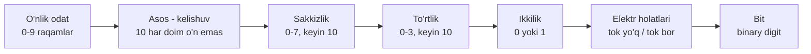

# 8-bob: O'nlikka muqobillar

## Bobning asosiy g'oyasi

Bu bob muallifning juda muhim burilish nuqtalaridan biridir: sonlarni yozishning o'nlik usuli tabiatning yagona va majburiy qonuni emas, balki odam tanasi va odatiga bog'langan qulay kelishuv ekanini ko'rsatadi. Bizda qo'llarda o'nta barmoq bo'lgani uchun `10` deganda darhol "o'n dona" deb o'ylaymiz. Ammo boshqa sanoq asosida `10` butunlay boshqa miqdorni bildirishi mumkin.

Muallif o'quvchini o'nlikdan asta-sekin uzoqlashtiradi: avval sakkizlik sanoq tizimi, keyin to'rtlik tizim, so'ng eng sodda ikki belgili tizim - ikkilik sanoq tizimi. Maqsad shunchaki g'alati raqamlar bilan o'ynash emas. Asosiy maqsad kompyuterlar nega aynan `0` va `1` bilan ishlashini tushuntirishdir. Ikkilik sanoq tizimi elektr qurilmalarining ikki holati bilan juda tabiiy mos keladi: tok bor yoki yo'q, kalit yopiq yoki ochiq, lampochka yonadi yoki yonmaydi, rele ulanadi yoki uziladi.

## Bosqichma-bosqich tushuntirish

### 1. O'nlik tizim tabiiydek tuyuladi, lekin u yagona emas

O'nlik tizim bizga juda oddiy ko'rinadi, chunki uni bolalikdan barmoqlarimiz bilan bog'lab o'rganganmiz. Unda o'nta raqam bor:

```text
0 1 2 3 4 5 6 7 8 9
```

Raqamlar tugagach, biz yangi xona ochamiz va `10` yozamiz. Odatda buni "o'n" deb o'qiymiz. Lekin boshqa sanoq tizimlarini tushunishda `10` ni avval "bir-nol" deb ko'rish foydaliroq: chapdagi `1` bitta to'liq guruh borligini, o'ngdagi `0` esa alohida birlik qolmaganini bildiradi.

Shuning uchun `10` belgisi har doim ham o'n dona degani emas. U ishlatilayotgan sanoq asosiga qarab "bitta to'liq guruh" degani:

- `10_10` - bitta o'nlik guruh, ya'ni o'n dona;
- `10_8` - bitta sakkizlik guruh, ya'ni sakkiz dona;
- `10_4` - bitta to'rtlik guruh, ya'ni to'rt dona;
- `10_2` - bitta ikkilik guruh, ya'ni ikki dona.

Demak, son yozuvidagi belgi va haqiqiy miqdor bir xil narsa emas. Belgining ma'nosi sanoq asosiga bog'liq.

### 2. Sanoq asosi nimani bildiradi?

Sanoq tizimining asosi - bitta xonada nechta turli raqam ishlatilishini bildiradi. Asos `b` bo'lsa, raqamlar `0` dan `b - 1` gacha bo'ladi. Keyingi miqdor uchun yangi xona kerak bo'ladi.

```text
Asos 10: 0 1 2 3 4 5 6 7 8 9 10 ...
Asos  8: 0 1 2 3 4 5 6 7 10 ...
Asos  4: 0 1 2 3 10 ...
Asos  2: 0 1 10 ...
```

Bu yerda eng muhim qoida: qaysi asosda bo'lishidan qat'i nazar, raqamlar tugagan joyda "ko'tarish" sodir bo'ladi. O'nlikda `9 + 1 = 10`; sakkizlikda `7 + 1 = 10`; to'rtlikda `3 + 1 = 10`; ikkilikda esa `1 + 1 = 10`.

### 3. Sakkizlik tizim: o'nlikka o'xshaydi, faqat asosi 8

Sakkizlik sanoq tizimida `8` va `9` raqamlari ishlatilmaydi. Hisoblash quyidagicha ketadi:

```text
0, 1, 2, 3, 4, 5, 6, 7, 10, 11, 12, ..., 17, 20, ...
```

Bu avvaliga g'alati ko'rinadi, chunki `10_8` ni ko'rib ongimiz "o'n" deb yuboradi. Aslida `10_8` o'nlikdagi `8_10` ga teng. `20_8` esa ikki sakkizlik guruh, ya'ni `16_10`.

Sakkizlik son ham o'nlik son kabi xonali tuzilishga ega. Farq shundaki, xonalarning og'irligi o'nning darajalari emas, sakkizning darajalari bilan o'sadi:

```text
... 8^3   8^2   8^1   8^0
... 512    64     8     1
```

Masalan:

```text
245_8 = 2 * 64 + 4 * 8 + 5 * 1
      = 128 + 32 + 5
      = 165_10
```

Bu usul sanoq tizimlarini almashtirishning umumiy kalitidir: har bir raqam o'z xonasining og'irligiga ko'paytiriladi, keyin hammasi qo'shiladi.

### 4. "Dumaloq" sonlar asosga bog'liq

O'nlik tizimda `100`, `1000`, `10000` kabi sonlar bizga dumaloq ko'rinadi, chunki ular o'nning darajalari. Ammo boshqa asoslarda ham xuddi shunday hodisa bor. Sakkizlikda:

```text
10_8   = 8_10
100_8  = 64_10
1000_8 = 512_10
```

Bu sonlarning o'nlikdagi qiymatlari ko'pincha kompyuter olamida tanish bo'lib chiqadi, chunki `8 = 2^3`. Shuning uchun sakkizlikdagi dumaloq sonlar ikkilik va ikkilik darajalari bilan yaxshi moslashadi. Muallif shu orqali keyingi fikrga yo'l ochadi: o'nlikdan boshqa tizimlar ayniqsa ikkilik kodlar bilan ishlaganda juda qulay bo'lishi mumkin.

### 5. Arifmetika ham o'zgaradi, lekin mantiq o'zgarmaydi

Sakkizlik tizim o'nlikdan kam emas. Unda ham qo'shish, ayirish, ko'paytirish mumkin. Faqat "ko'tarish" qoidasi boshqacha joyda ishga tushadi.

O'nlikda:

```text
5 + 7 = 12_10
```

Sakkizlikda esa:

```text
5_8 + 7_8 = 14_8
```

Nega? Chunki o'nlik miqdorda `5 + 7 = 12`. Sakkizlikda `12_10` ni yozish uchun bitta sakkizlik guruh va to'rtta birlik kerak bo'ladi: `14_8`.

Demak, arifmetika qoidalari buzilmaydi. Faqat yozuv tizimi boshqa bo'lgani uchun natija boshqacha ko'rinadi.

### 6. To'rtlik tizim: ikkilikka yaqinlashish

Muallif keyin to'rtlik sanoq tizimini kiritadi. Unda faqat to'rtta raqam bor:

```text
0 1 2 3
```

Hisoblash bunday ko'rinish oladi:

```text
0, 1, 2, 3, 10, 11, 12, 13, 20, ..., 100, ...
```

To'rtlikda xonalar to'rtning darajalari bo'yicha o'sadi:

```text
... 4^3   4^2   4^1   4^0
...  64    16     4     1
```

Bu tizim bobda ko'proq ko'prik vazifasini bajaradi. O'nlikdan sakkizlikka o'tganda "raqamlar soni kamayadi" degan fikr paydo bo'ladi. To'rtlikka o'tganda bu yanada seziladi. Endi navbat eng kichik amaliy asosga - ikkilikka keladi.

### 7. Ikkilik tizim: faqat 0 va 1

Ikkilik sanoq tizimida bor-yo'g'i ikki raqam ishlatiladi:

```text
0 1
```

Shuning uchun raqamlar juda tez "tugaydi". `0` dan keyin `1`, undan keyin esa darhol `10_2` keladi. Bu `10_10` emas, balki `2_10` degani.

Ikkilikda sanash:

```text
0, 1, 10, 11, 100, 101, 110, 111, 1000, ...
```

Ikkilik sonlar ko'zga uzun ko'rinadi, lekin bu ularning katta ekanini anglatmaydi. Masalan, `1000_2` bor-yo'g'i `8_10`. Uzunlik shunchaki ikki belgidan foydalanishning oqibatidir.

### 8. Ikkilik xonalarning og'irligi

Ikkilikda har bir xona ikki darajasiga teng:

```text
... 2^5   2^4   2^3   2^2   2^1   2^0
...  32    16     8     4     2     1
```

Shuning uchun `1` va undan keyingi nollar juda aniq ma'noga ega:

```text
10_2     = 2
100_2    = 4
1000_2   = 8
10000_2  = 16
```

Qancha nol bo'lsa, o'sha darajadagi ikki olinadi. Masalan, `100000_2` da beshta nol bor, demak bu `2^5 = 32_10`.

## Original diagramma

Quyidagi diagramma kitobdagi rasmlarni ko'chirmaydi. U bobdagi asosiy g'oyani bitta yo'lda ko'rsatadi: sanoq asosi kamaygan sari alohida raqamlar kamayadi, son yozuvi uzunlashadi, lekin ikkilik yozuv elektr qurilmalarning ikki holatiga juda mos tushadi.



Ikkilik sonni o'qish uchun esa har bir bitni o'z og'irligi bilan ko'rish kifoya:

```text
Bitlar:        1   0   1   1   0   1
Og'irliklar:  32  16   8   4   2   1
Qiymat:       32 + 0 + 8 + 4 + 0 + 1 = 45_10
```

### 9. Ikkilikdan o'nlikka o'tkazish

Ikkilik sonni o'nlikka o'tkazish uchun `1` turgan xonalarning og'irliklarini qo'shamiz, `0` turgan xonalarni tashlab ketamiz.

Masalan:

```text
110101_2 = 1*32 + 1*16 + 0*8 + 1*4 + 0*2 + 1*1
         = 32 + 16 + 4 + 1
         = 53_10
```

Bu usul o'nlik, sakkizlik, to'rtlik va ikkilik tizimlarning hammasiga tegishli yagona pozitsion qoidadan keladi.

### 10. O'nlikdan ikkilikka o'tkazish

O'nlik sonni ikkilikka o'tkazishda eng katta mos ikki darajasidan boshlash mumkin. Har bir og'irlik uchun savol bitta: bu qiymat kerakmi yoki yo'qmi?

Masalan, `45_10` ni olaylik:

```text
45 ichida 32 bor  -> 1, qoldiq 13
13 ichida 16 yo'q -> 0, qoldiq 13
13 ichida 8 bor   -> 1, qoldiq 5
5 ichida 4 bor    -> 1, qoldiq 1
1 ichida 2 yo'q   -> 0, qoldiq 1
1 ichida 1 bor    -> 1, qoldiq 0

Natija: 101101_2
```

Bu jarayonda har bir pozitsiyada faqat `0` yoki `1` yoziladi. Chunki har bir ikki darajasidan yoki foydalanamiz, yoki foydalanmaymiz.

### 11. Ikkilik qo'shish va ko'paytirish

Ikkilik arifmetika juda oz jadval talab qiladi. Qo'shishda eng muhim holat:

```text
1 + 1 = 10_2
```

Ya'ni natija xonada `0`, keyingi xonaga esa `1` ko'tariladi.

Masalan:

```text
   101101
+  001011
---------
  111000
```

Tekshirib ko'ramiz:

```text
101101_2 = 45_10
001011_2 = 11_10
111000_2 = 56_10
```

Ko'paytirishda ham qoida juda sodda: `0` ga ko'paytirilsa, natija `0`; `1` ga ko'paytirilsa, sonning o'zi qoladi. Shuning uchun ikkilik ko'paytirish ko'p jihatdan sonni siljitish va qo'shishdan iborat.

### 12. Yetakchi nollar va bitlar tartibi

Ikkilik sonning oldiga nollar qo'shish qiymatni o'zgartirmaydi:

```text
11_2 = 0011_2 = 00000011_2
```

Bu nollar bekorchi emas. Ular sonlarni bir xil kenglikda yozishga yordam beradi. Masalan, 4 bit bilan `0` dan `15` gacha bo'lgan sonlarni yozish mumkin:

```text
0000, 0001, 0010, ..., 1111
```

Bu ro'yxatda o'ngdagi bit har safar almashadi: `0, 1, 0, 1...`. Undan chapdagi bit ikki qadamda almashadi: `00, 11, 00, 11...`. Keyingi bit to'rt qadamda, undan keyingisi sakkiz qadamda almashadi. Ikkilik sanash shu tartibli o'zgarishlar orqali ishlaydi.

### 13. Nega ikkilik kompyuterlar uchun qulay?

Bobning eng muhim nuqtasi shu yerda ochiladi. Ikkilik tizimdagi `0` va `1` elektr qurilmalaridagi ikki holat bilan bevosita mos keladi.

```text
Ikkilik raqam    Elektrdagi mos holat
-------------    --------------------
0                tok yo'q
1                tok bor

0                kalit ochiq
1                kalit yopiq

0                lampochka o'chgan
1                lampochka yongan

0                rele uzilgan
1                rele ulangan
```

O'nlik tizimni elektr qurilmada ifodalash uchun bitta joyda o'nta farqli holatni ishonchli ajratish kerak bo'lardi. Ikkilikda esa ikki holat yetadi. Bu ancha oddiy, barqaror va qurilma bilan mos. Shuning uchun ikkilik sonlar faqat matematik qulaylik emas, balki fizik qurilmalarga mos ifoda usulidir.

### 14. Bit tushunchasi

Ikkilik raqam inglizcha "binary digit" deb ataladi. Muallif bob oxirida bu ibora keyinchalik qisqarib "bit" so'ziga aylanganini aytadi. Bit - axborotning eng kichik ikkilik bo'lagi: u faqat ikki qiymatdan birini oladi, `0` yoki `1`.

Bu bobda bit hali katta kompyuter nazariyasi sifatida emas, balki juda oddiy fizik ma'noda paydo bo'ladi. Bitta sim, bitta kalit, bitta lampochka yoki bitta rele bitta bitni ko'rsatishi mumkin.

## Muhim tushunchalar

- Sanoq tizimi asosi: son yozuvida nechta turli raqam ishlatilishini belgilaydi.
- Pozitsion yozuv: raqamning qiymati uning qaysi xonada turganiga bog'liq bo'lgan yozuv usuli.
- Xona og'irligi: har bir pozitsiyaning asos darajasi bilan belgilanadigan qiymati; masalan, ikkilikda `1`, `2`, `4`, `8`, `16`.
- Ko'tarish: bitta xonada raqamlar tugaganda keyingi xonaga o'tish; masalan, ikkilikda `1 + 1 = 10`.
- Sakkizlik tizim: asosi 8 bo'lgan tizim; raqamlari `0` dan `7` gacha.
- To'rtlik tizim: asosi 4 bo'lgan tizim; raqamlari `0` dan `3` gacha.
- Ikkilik tizim: asosi 2 bo'lgan tizim; faqat `0` va `1` ishlatiladi.
- Yetakchi nol: sonning chap tomoniga qo'shilgan, qiymatni o'zgartirmaydigan nol.
- Bit: bitta ikkilik raqam; `0` yoki `1` qiymatini oladigan eng kichik axborot bo'lagi.
- Elektr holati: fizik qurilmaning ikki xil holati; masalan, tok bor/tok yo'q yoki kalit yopiq/ochiq.

## Kichik misol

Tasavvur qilaylik, bizda uchta kichik lampochka bor. Har bir lampochka bitta bitni bildiradi. Chapdan o'ngga ularning og'irligi `4`, `2`, `1` bo'lsin.

```text
Lampochkalar:   yonadi   o'chgan   yonadi
Bitlar:            1        0        1
Og'irliklar:       4        2        1
Qiymat:            4   +    0   +    1 = 5
```

Demak, uchta lampochkaning `yonadi-o'chgan-yonadi` holati `101_2` sonini bildiradi. Uning o'nlik qiymati `5_10`. Agar o'rtadagi lampochka ham yonsa, holat `111_2` bo'ladi va qiymat `7_10` ga aylanadi.

Bu kichik misol bobning asosiy fikrini jamlaydi: ikkilik son faqat qog'ozdagi yozuv emas, uni haqiqiy elektr holatlari bilan ko'rsatish mumkin.

## O'zini tekshirish savollari

1. Nega `10` yozuvi har doim o'n dona degani emas?
2. Sanoq tizimining asosi nimani bildiradi?
3. Sakkizlik tizimda qaysi raqamlar ishlatilmaydi?
4. Nega `10_8` o'nlikdagi `8_10` ga teng?
5. Pozitsion yozuvda raqamning qiymati nimaga bog'liq?
6. `1000_2` soni o'nlikda nechaga teng va nima uchun?
7. Ikkilik sonni o'nlikka o'tkazishda qaysi xonalarning og'irliklari qo'shiladi?
8. O'nlik sonni ikkilikka o'tkazishda nega har bir xonaga faqat `0` yoki `1` yoziladi?
9. Yetakchi nollar son qiymatini o'zgartirmasa, ular nima uchun foydali?
10. Nega elektr qurilmalarida ikkilik tizim o'nlik tizimdan qulayroq?
11. Kalit, lampochka, sim yoki rele qanday qilib bitta bitni ifodalashi mumkin?
12. "Bit" tushunchasi bobda qanday ma'noda paydo bo'ladi?

## Qisqa xulosa

8-bob o'quvchini "sonlar tabiatan o'nlik bo'ladi" degan odatdan chiqaradi. O'nlik, sakkizlik, to'rtlik va ikkilik tizimlar bir xil pozitsion g'oyaga tayanadi: har bir xona asosning navbatdagi darajasini bildiradi. Farq faqat asosda va ishlatiladigan raqamlar sonida.

Muallif shu yo'l bilan kompyuterlar uchun hal qiluvchi fikrni tayyorlaydi: ikkilik tizim eng sodda sanoq tizimi bo'lib, u elektr qurilmalarning ikki holati bilan bevosita mos keladi. `0` va `1` qog'ozdagi raqamlar bo'lib qolmaydi; ular tokning bor-yo'qligi, kalitning ochiq-yopiqligi, lampochkaning o'chgan-yonganligi va relening uzilgan-ulanganligi orqali jismoniy shaklga kiradi. Shu sababli bit kompyuterlarning asosiy g'ishtiga aylanadi.
