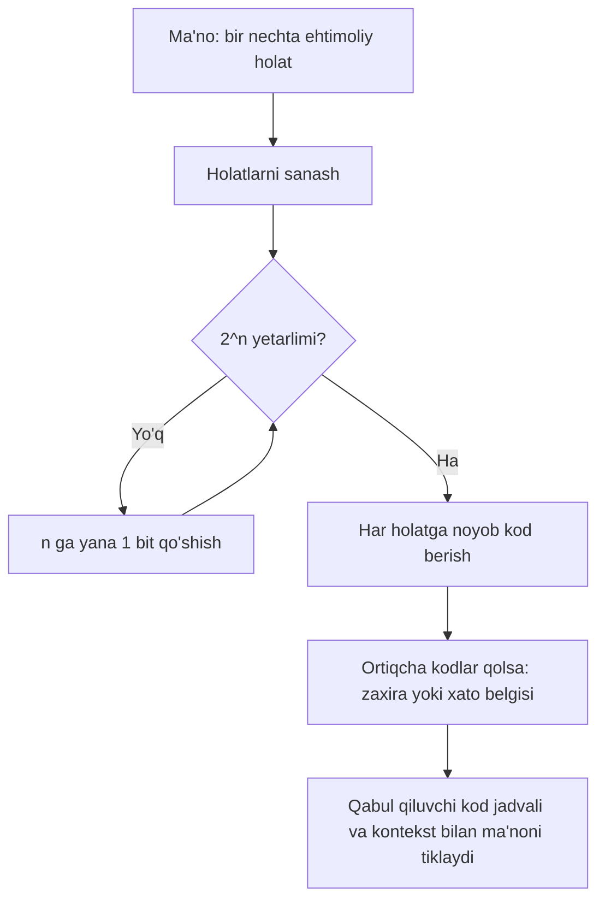

# 9-bob konspekti: Bit ortidan bit

## Bobning asosiy g'oyasi

Charlz Petzold bu bobda "bit"ni shunchaki kompyuter ichidagi sirli texnik birlik sifatida emas, axborot haqidagi eng oddiy savol sifatida tushuntiradi: ikkita imkoniyatdan qaysi biri tanlandi? Ha yoki yo'q, bor yoki yo'q, yondi yoki o'chdi, rost yoki yolg'on - bularning har biri bitta bit bilan ifodalanishi mumkin.

Bobning markaziy fikri shuki: axborot ko'pincha tanlovdir. Agar tanlovlar soni ko'paysa, ularni ajratish uchun ko'proq bit kerak bo'ladi. 1 bit 2 ta holatni, 2 bit 4 ta holatni, 3 bit 8 ta holatni bildiradi. Har bir qo'shimcha bit imkoniyatlar sonini ikki baravar oshiradi.

Muallif bu fikrni qo'shiqdagi sariq lenta, Paul Revere fonarlari, kino baholari, fotoplyonka kassasidagi DX kvadratchalari, UPC shtrixkodi, Morse va Brayl kodlari orqali ko'rsatadi. Ya'ni bitlar faqat kompyuterda emas: ular har qanday kelishilgan "0 yoki 1" holatidan qurilishi mumkin. Muhimi, bitning ma'nosi doim kontekst va kod kelishuviga bog'liq.

## Bosqichma-bosqich tushuntirish

### 1. Bitta bit - ikki imkoniyatdan birini tanlash

Bob oddiy hayotiy misol bilan boshlanadi: biror belgi bor bo'lsa "ha", yo'q bo'lsa "yo'q" degan ma'no chiqishi mumkin. Buning uchun gap, harf yoki uzun izoh kerak emas. Belgining mavjudligi bir holat, mavjud emasligi ikkinchi holat bo'ladi.

Kompyuter tilida bunday ikki holat `1` va `0` bilan belgilanadi. `1` ko'pincha "bor", "yoniq", "ha" deb tasavvur qilinadi; `0` esa "yo'q", "o'chiq", "yo'q" deb talqin qilinadi. Lekin bu tabiiy qonun emas. Istasa odamlar aksincha kelishib olishlari ham mumkin. Asosiy shart - yuboruvchi va qabul qiluvchi kelishuvni bir xil tushunishi.

### 2. Nega aynan ikkilik tizim alohida?

Oldingi boblarda sanoq sistemalari o'rganilgan edi: o'nlik tizim bizga odatiy, chunki qo'llarimizda 10 barmoq bor. Ammo bu yagona mumkin bo'lgan yo'l emas. Sanoqni 8 lik, 4 lik yoki 2 lik asosda ham qurish mumkin.

Ikkilik tizimning alohidaligi shundaki, u eng sodda ishlaydigan sanoq tizimidir. Unda faqat ikki raqam bor: `0` va `1`. Bundan ham soddalashtirsak, faqat `0` qoladi, lekin bitta belgi bilan farq yaratib bo'lmaydi. Demak, axborot uchun eng kichik foydali farq - ikki holatli farq.

`Bit` so'zi "binary digit", ya'ni ikkilik raqam iborasidan kelib chiqqan. Lekin bobda bit bundan kengroq ma'noda ishlatiladi: u axborotning eng kichik bo'lagi, tanlovning eng mayda birligi.

### 3. Axborot - imkoniyatlar orasidan tanlov

Muallifning muhim xulosasi: axborot degani ko'pincha mavjud variantlardan bittasini ajratishdir. Masalan, "hujum bo'ladimi yoki yo'qmi?" degan savol ikki variantli. Bunga 1 bit yetadi. Lekin "hujum yo'qmi, quruqlikdanmi, dengizdanmi?" degan savolda uchta variant bor. Endi 1 bit yetmaydi, chunki 1 bit faqat ikki holatni ajrata oladi.

2 bit esa to'rtta kod beradi:

```text
00
01
10
11
```

Uchta ma'no uchun to'rttadan bittasi ortib qoladi yoki ayrim kodlar bir xil ma'noga xizmat qiladi. Bu bobdagi Paul Revere fonarlari misolida ko'rinadi: ikki fonar nazariy jihatdan to'rt xil holat beradi, lekin amalda uch xil xabar yetarli. Bunda ortiqchalik paydo bo'ladi.

### 4. Ortiqchalik xatolarga qarshi ishlaydi

Telekommunikatsiyada "shovqin" deganda xabarni noto'g'ri tushunishga olib keladigan har qanday xalaqit tushuniladi: masofa, qorong'ulik, yomon aloqa, chiziqning buzilishi, noto'g'ri o'qish va hokazo.

Ikki fonar misolida bitta fonar yonib tursa, uzoqdan qaysi fonar yonganini aniq bilish qiyin bo'lishi mumkin. Agar `01` ham, `10` ham "quruqlikdan kelish" ma'nosiga ega bo'lsa, qabul qiluvchi uchun xatoga joy kamroq qoladi: muhim narsa bitta fonar yonayotganini ko'rish.

Shu yerda Petzold keyingi kompyuter dunyosi uchun juda katta fikrni beradi: ba'zan kodni "ixcham" qilishdan ko'ra "ishonchli" qilish muhimroq. Ortiqcha bitlar yoki ortiqcha naqshlar xato aniqlashga yordam beradi.

### 5. Bitning ma'nosi kelishuvga bog'liq

Kino tanqidchilari misoli buni juda sodda ko'rsatadi. Ikki tanqidchining har biri filmni yoqtirdi yoki yoqtirmadi deb tasavvur qilaylik. Har bir tanqidchi uchun bitta bit kerak:

```text
birinchi bit  = birinchi tanqidchi fikri
ikkinchi bit  = ikkinchi tanqidchi fikri

00 = ikkalasi ham yoqtirmadi
01 = birinchisi yoqtirmadi, ikkinchisi yoqtirdi
10 = birinchisi yoqtirdi, ikkinchisi yoqtirmadi
11 = ikkalasi ham yoqtirdi
```

Bu yerda bitlar o'z-o'zidan hech narsa demaydi. `10` degani faqat oldindan kelishilgan jadval bo'lsa tushunarli bo'ladi. Qaysi bit kimga tegishli? `1` "yoqdi"mi yoki "yoqmadi"mi? Qaysi film haqida gapiryapmiz? Bularning hammasi kontekst.

Demak, bitning kuchi uning kichikligida, lekin ma'nosi kod jadvali va vaziyat bilan ochiladi.

### 6. Bitlar ko'payganda imkoniyatlar ikki baravar ortadi

Uchinchi odamning fikrini ham qo'shsak, endi 3 bit kerak bo'ladi. 3 bit bilan 8 ta kombinatsiya hosil bo'ladi. Bu yaxshi tomoni shundaki, barcha ehtimoliy holatlarni tartibli sanab chiqish mumkin.

Umumiy qoida:

```text
n ta bit -> 2^n ta kod
```

Masalan:

```text
1 bit  -> 2 kod
2 bit  -> 4 kod
3 bit  -> 8 kod
4 bit  -> 16 kod
5 bit  -> 32 kod
8 bit  -> 256 kod
10 bit -> 1024 kod
```

Har bir yangi bit avvalgi barcha kodlarning ikki nusxasini yaratgandek bo'ladi: bittasi boshiga `0` qo'shilgan holat, ikkinchisi boshiga `1` qo'shilgan holat.

### 7. Nechta bit kerakligini qanday bilamiz?

Agar nechta imkoniyat borligini bilsak, bitlar sonini tanlay olamiz. Eng kichik shunday `n` topiladi:

```text
2^n >= imkoniyatlar soni
```

Masalan, 7 xil kino reytingi bo'lsa, 2 bit yetmaydi, chunki `2^2 = 4`. 3 bit yetadi, chunki `2^3 = 8`. Bitta kod ortib qoladi. Bu ortiqcha kod kelajakdagi yangi bahoga ajratilishi yoki xato belgisi sifatida qaralishi mumkin.

13 xil harfli baho tizimi bo'lsa, 3 bit yetmaydi, chunki 8 ta kod bor. 4 bit kerak, chunki 16 ta kod beradi. 3 ta kod ishlatilmay qoladi.

Matematik tilda bu logarifm bilan bog'liq: `2^7 = 128` bo'lsa, `log2(128) = 7`. Amaliy tomondan esa bobdagi asosiy usul juda sodda: kodlar soni yetmaguncha bit qo'shib boriladi.

### 8. Kodlar tartibli ham, ixtiyoriy ham bo'lishi mumkin

Biror reyting tizimini bitlarga bog'lashda ikki xil yo'l bor. Kodlarni tartibli berish mumkin: masalan, past bahodan yuqori bahogacha ikkilik sonlar ketma-ket o'sadi. Bunda kodning raqam sifatidagi qiymatidan qo'shimcha ma'no chiqarish oson bo'ladi.

Yoki kodlarni butunlay ixtiyoriy taqsimlash mumkin. Agar barcha ishtirokchilar jadvalni bilsa, bunday kod ham ishlaydi. Lekin tartibli kod keyinchalik hisoblash, solishtirish yoki kengaytirishda qulayroq.

Bu g'oya kompyuter tizimlarida juda muhim: bitlar o'z-o'zidan "reyting", "harf", "narx" yoki "rang" emas. Biz ularga kelishilgan ma'no beramiz.

### 9. DX kod: fotoplyonka kassasidagi ko'rinadigan bitlar

Bitlar odatda elektron qurilmalar ichida ko'zga ko'rinmaydi. Bob shuning uchun 35 mm fotoplyonka kassasidagi DX kodni qiziqarli misol sifatida oladi. Kassada qora va kumushrang kvadratchalar bor. Kumushrang joy elektr o'tkazadi, qora bo'yalgan joy esa o'tkazmaydi. Shunday qilib:

```text
kumushrang kvadrat -> 1
qora kvadrat       -> 0
```

Fotoapparat ichidagi metall kontaktlar shu kvadratchalarga tegadi va qaysi nuqtalarda tok o'tishini aniqlaydi. Shu bitlar orqali apparat plyonkaning yorug'lik sezgirligini bilib oladi va ekspozitsiyani moslaydi.

Plyonka sezgirligi uchun 24 ta standart qiymat bor. 24 holatni kodlash uchun 4 bit yetmaydi, chunki `2^4 = 16`. 5 bit esa yetadi, chunki `2^5 = 32`. Demak, 5 bit 24 qiymatni qoplab, yana 8 ta zaxira kod qoldiradi.

DX kodning boshqa qismlari plyonkadagi kadrlar soni, rangli yoki oq-qora ekanligi, negativ yoki pozitivligi kabi ma'lumotlarni ham bildirishi mumkin. Bu misol bitning fizik ko'rinishi har xil bo'lishini ko'rsatadi: kompyuter chipida kuchlanish, plyonkada esa o'tkazuvchi yoki o'tkazmaydigan sirt.

### 10. UPC shtrixkodi: oddiy chiziqlar ortidagi 95 bit

Shtrixkod bir qarashda qora chiziqlar va bo'sh joylardan iborat. Lekin skaner uchun u bitlar oqimidir. Skaner butun rasmni "ko'rib" OCR qilmaydi; u shtrixkod bo'ylab tor kesimni o'qiydi. Qora bo'laklar `1`, oq bo'shliqlar `0` sifatida talqin qilinadi. Bo'lak kengroq bo'lsa, bu bir nechta ketma-ket `1` yoki `0` degani.

Oddiy UPC kodi 95 bitdan tashkil topadi. Uning ichida uch xil vazifa bor:

- chekka va markaziy cheklovchi naqshlar skanerga kod qayerdan boshlanishi, qayerda bo'linishi va bit kengligi qancha ekanini bildiradi;
- 7 bitli guruhlar o'nlik raqamlarni kodlaydi;
- tekshiruv va paritet qoidalari noto'g'ri o'qishni aniqlashga yordam beradi.

UPC juda ixcham bo'lishga urinmaydi. Oddiy o'nlik raqamni 4 bitda berish mumkin, chunki 4 bit 16 ta kod beradi. Lekin UPC har bir raqamga 7 bit ajratadi. Buning sababi - ishonchlilik: kod yomon bosilgan bo'lsa, noto'g'ri skanerlangan bo'lsa yoki kimdir uni o'zgartirishga urinsa, tizim buni sezishi kerak.

UPC haqida muhim aniqlik: shtrixkod narxni o'zida saqlamaydi. U mahsulot turini va ishlab chiqaruvchi bilan bog'liq raqamlarni beradi. Narx esa kassaning ma'lumotlar bazasidan olinadi.

### 11. Paritet va tekshiruv raqami

Bobda UPC orqali ikki xil xato tekshiruvi ko'rsatiladi.

Birinchisi - paritet. Bitlar guruhidagi `1` lar soni juft yoki toq bo'lishi mumkin. UPC ning chap va o'ng tomonidagi kodlar paritet bo'yicha farqlanadi. Shu farq skanerga kod qaysi tomondan o'qilayotganini va guruhlar to'g'ri ko'rinyaptimi-yo'qligini aniqlashga yordam beradi.

Ikkinchisi - oxirgi tekshiruv raqami. Dastlabki 11 raqam ustida maxsus arifmetik hisob bajariladi, natija oxirgi raqam bilan mos bo'lishi kerak. Agar mos kelmasa, kod yaroqsiz deb qaraladi.

Bu bobdagi katta mavzuga qaytamiz: ortiqcha ma'lumot ba'zan behuda emas, balki himoya vazifasini bajaradi.

### 12. Morse ham bitlarga aylanishi mumkin

Morse alifbosi nuqta, tire va pauzalardan iboratdek ko'rinadi. Lekin vaqtni kichik bo'laklarga ajratsak, uni ham `1` va `0` oqimi sifatida yozish mumkin:

- signal bor vaqtlar - `1`;
- signal yo'q, ya'ni pauza - `0`;
- nuqta qisqa `1`;
- tire uzunroq `1` ketma-ketligi;
- harf va so'z orasidagi tanaffuslar uzunroq `0` ketma-ketligi.

Bu yerda ham kod faqat belgilar bilan emas, vaqt tartibi bilan ishlaydi. Qabul qiluvchi signal va sukunat uzunliklarini ajratishi kerak. Shu ma'noda Morse shtrixkodga o'xshaydi: biri vaqt bo'ylab, ikkinchisi qog'ozdagi masofa bo'ylab `1` va `0` lar ketma-ketligini beradi.

### 13. Brayl: 6 bitli belgilar

Brayl yozuvi bitli kodga yanada yaqinroq. Har bir belgi oltita nuqtadan iborat bo'lishi mumkin. Har bir nuqta ikki holatdan birida:

```text
bo'rtib chiqqan -> 1
tekis           -> 0
```

6 ta nuqta `2^6 = 64` ta kombinatsiya beradi. Demak, har bir Brayl belgisi 6 bitli naqsh sifatida tasavvur qilinishi mumkin. Bu misol bitlar faqat elektr yoki yorug'lik bilan cheklanmasligini yana bir marta ko'rsatadi: teginish orqali ham ikkilik kod ishlaydi.

### 14. Keyingi eshik: bitlar son va mantiqdir

Bob oxirida muallif keyingi bobga o'tish uchun ikki yo'nalishni bog'laydi. Birinchisi: bitlar aslida sonlardir. Har qanday ma'lumotni bitlarda ifodalash uchun avval nechta imkoniyat borligini sanaymiz, keyin har bir imkoniyatga noyob raqam beramiz.

Ikkinchisi: bitlar mantiq bilan ham tabiiy bog'lanadi. Rost va yolg'on ham ikki holatli tanlovdir. Ularni `1` va `0` bilan ifodalash mumkin. Shu fikr keyingi bobdagi mantiq va kalitlar mavzusiga olib boradi.

## Original diagramma: imkoniyatdan bitgacha

Quyidagi diagramma bobdagi umumiy fikrni yangi misolda jamlaydi. U kitobdagi rasmlarni takrorlamaydi; maqsad - "nechta imkoniyat bor?" savoli qanday qilib bitlar soniga aylanishini ko'rsatish.



Yana bitta ixcham ko'rinish:

```text
1 bit:   0  1                         -> 2 holat
2 bit:   00 01 10 11                  -> 4 holat
3 bit:   000 001 010 011 100 101 110 111 -> 8 holat

Qoida: har bir yangi bit mavjud kodlar sonini ikki baravar qiladi.
```

## Muhim tushunchalar

- Bit: ikkilik raqam; axborotning eng kichik tanlov birligi.
- `0` va `1`: ikki farqli holatni belgilash uchun ishlatiladigan qiymatlar.
- Ikkilik tizim: faqat `0` va `1` raqamlariga tayangan sanoq tizimi.
- Axborot: bob nuqtayi nazarida imkoniyatlar orasidan tanlangan holat.
- Kod jadvali: bitlar ketma-ketligi qaysi ma'noni anglatishini belgilaydigan kelishuv.
- Kontekst: bitning ma'nosini ochib beradigan vaziyat; qaysi film, qaysi mahsulot, qaysi signal haqida gap ketayotgani.
- Ortiqchalik: xato aniqlash yoki shovqinga chidamlilik uchun kerak bo'lishi mumkin bo'lgan qo'shimcha kodlar yoki naqshlar.
- Shovqin: xabarni noto'g'ri qabul qilishga sabab bo'ladigan tashqi yoki ichki xalaqit.
- Paritet: bitlar guruhidagi `1` lar sonining juft yoki toqligiga asoslangan tekshiruv.
- Tekshiruv raqami: raqamli kodning to'g'ri o'qilganini tekshirish uchun hisoblab qo'yilgan qo'shimcha raqam.
- DX kod: fotoplyonka kassasidagi o'tkazuvchi va o'tkazmaydigan kvadratchalar orqali bitlarni ifodalash usuli.
- UPC: mahsulot shtrixkodi; chiziq va bo'shliqlardan tuzilgan bitlar oqimi.
- Logarifm asos 2: kerakli kodlar sonidan bitlar sonini topishning matematik yo'li.

## Kichik misol

Tasavvur qilaylik, aqlli choynak 5 xil holatni ko'rsatishi kerak:

- suv yo'q;
- suv bor;
- qiziyapti;
- qaynadi;
- issiq saqlanmoqda.

5 holat uchun 2 bit yetmaydi, chunki `2^2 = 4`. 3 bit kerak, chunki `2^3 = 8`.

```text
000 = suv yo'q
001 = suv bor
010 = qiziyapti
011 = qaynadi
100 = issiq saqlanmoqda
101 = ishlatilmaydi
110 = ishlatilmaydi
111 = xato holati
```

Bu misolda ikkita kod zaxirada qoldi, bittasi esa xato belgisi sifatida ajratildi. Agar qurilma ichida sim uzilishi yoki sensor noto'g'ri ishlashi sababli `111` kelsa, dastur buni oddiy holat deb emas, tekshirish kerak bo'lgan muammo deb qabul qiladi. Bu bobdagi UPC va fonarlar misolidagi ortiqchalik g'oyasiga o'xshaydi.

## O'zini tekshirish savollari

1. Nega bitta bit faqat ikki imkoniyatni ifodalay oladi?
2. `1` doim "ha", `0` doim "yo'q" degani bo'lishi shartmi? Nega?
3. Uchta ehtimoliy xabarni uzatish uchun nega kamida 2 bit kerak?
4. Paul Revere fonarlari misolida ortiqchalik qanday foyda beradi?
5. 3 bit nechta kod beradi? 4 bit-chi?
6. 13 xil bahoni kodlash uchun nega 4 bit kerak?
7. Ishlatilmay qolgan kodlar qanday vazifani bajarishi mumkin?
8. DX kodda qora va kumushrang kvadratchalar qanday qilib bitga aylanadi?
9. UPC shtrixkodi nima uchun har bir raqamga 7 bit ajratadi, vaholanki 4 bit ham yetishi mumkin?
10. Paritet xatoni aniqlashga qanday yordam beradi?
11. Morse alifbosini qanday qilib `1` va `0` lar oqimi sifatida ko'rish mumkin?
12. Brayl yozuvi nima uchun 6 bitli kodga o'xshaydi?
13. "Bitning ma'nosi kontekstga bog'liq" deganda nimani tushunasiz?

## Qisqa xulosa

9-bob bit tushunchasini kompyuter ichidagi mavhum narsa sifatida emas, kundalik aloqa va kodlashning eng kichik g'ishtchasi sifatida ochadi. Bir bit ikki holatni ajratadi; bitlar ko'paygani sari ifodalanadigan imkoniyatlar soni ikki baravar o'sadi.

Muallifning asosiy darsi shuki: har qanday ma'lumotni bitlarda ifodalash uchun avval imkoniyatlarni sanash, so'ng har biriga kod berish kerak. Kodning o'zi yetarli emas - uni to'g'ri tushunish uchun kelishuv, kontekst va ba'zan xatoni aniqlaydigan ortiqcha bitlar ham zarur.
