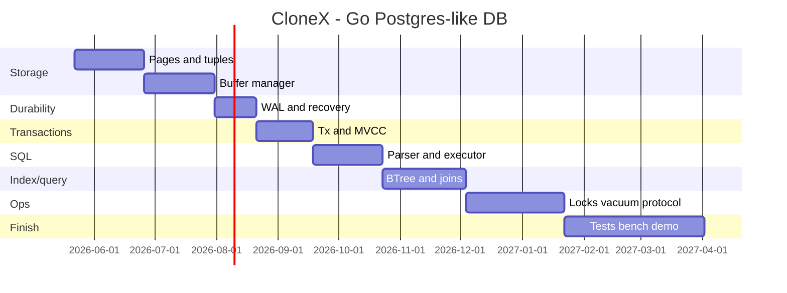

# 19. Timeline

Asos: kuniga 2-3 soat, haftada 5-6 kun.

| Hafta | Mavzu | Natija |
|-------|-------|--------|
| 1 | Scope, architecture | package boundaries |
| 2 | Page format | 8KB slotted page |
| 3 | Relation file | ReadAt/WriteAt persistence |
| 4 | Tuple encoding | INT, BOOL, TEXT |
| 5 | Heap table | insert/get/seqscan |
| 6 | Buffer manager v1 | fetch/unpin/flush |
| 7 | CLOCK replacer | eviction |
| 8 | WAL v1 | append/flush records |
| 9 | Recovery v1 | committed changes replay |
| 10 | Tx manager | begin/commit/abort |
| 11 | MVCC v1 | Read Committed |
| 12 | MVCC v2 | update/delete versions |
| 13 | Catalog | create table metadata |
| 14 | SQL lexer/parser | CREATE/INSERT/SELECT |
| 15 | Executor v1 | insert/select/where |
| 16 | Update/Delete | executor mutations |
| 17 | B+Tree in-memory | insert/search |
| 18 | B+Tree page-backed | leaf/internal pages |
| 19 | IndexScan | planner rule |
| 20 | Joins | nested loop join |
| 21 | Aggregates | count/sum/group by |
| 22 | Sort/Limit | order by, limit |
| 23 | Lock manager | table/row locks |
| 24 | Deadlock detector | wait-for graph |
| 25 | Vacuum v1 | dead tuple cleanup |
| 26 | Free Space Map | insert page selection |
| 27 | Wire protocol v1 | startup/simple query |
| 28 | psql smoke | connect and select |
| 29 | Crash tests | WAL recovery harness |
| 30 | Fuzz tests | parser/page/wal |
| 31 | Benchmarks | storage/query/index |
| 32 | Observability | stats and pprof |
| 33-36 | Stabilization | bugs, docs, refactor |
| 37-40 | Final demo | mini Postgres-like DB |

## Diagram

