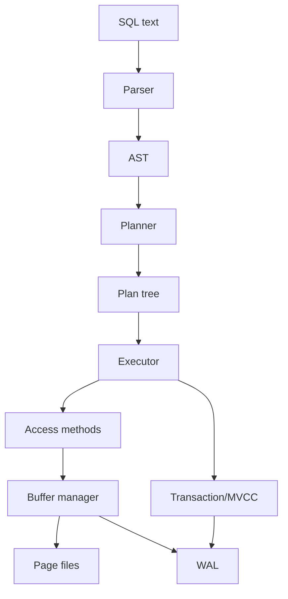

# Go Postgres-Like Database Roadmap

Maqsad: Go'da kichik, lekin ichki arxitekturasi Postgresga o'xshash relational database yozish.

Boshlang'ich qoida: avval storage engine, keyin SQL. Parser va protocol qiziq, lekin database yuragi page, buffer, WAL, MVCC va executor ichida.

## O'qish Tartibi

| # | Fayl | Mavzu |
|---|------|-------|
| 0 | [00_scope.md](00_scope.md) | Chegara va maqsad |
| 1 | [01_prerequisites.md](01_prerequisites.md) | Go, OS, DB internals old shartlari |
| 2 | [02_architecture.md](02_architecture.md) | Umumiy arxitektura |
| 3 | [03_project_structure.md](03_project_structure.md) | Package tuzilmasi |
| 4 | [04_storage_pages.md](04_storage_pages.md) | Page, slotted page, disk file |
| 5 | [05_tuple_heap_table.md](05_tuple_heap_table.md) | Tuple, heap table, table scan |
| 6 | [06_buffer_manager.md](06_buffer_manager.md) | Buffer pool, dirty page, CLOCK |
| 7 | [07_wal_recovery.md](07_wal_recovery.md) | WAL, LSN, crash recovery |
| 8 | [08_transactions_mvcc.md](08_transactions_mvcc.md) | Transaction, snapshot, MVCC |
| 9 | [09_catalog_schema.md](09_catalog_schema.md) | Catalog, table metadata, types |
| 10 | [10_sql_parser.md](10_sql_parser.md) | SQL lexer/parser subset |
| 11 | [11_planner_executor.md](11_planner_executor.md) | Plan nodes va executor |
| 12 | [12_indexes_btree.md](12_indexes_btree.md) | B+Tree index |
| 13 | [13_joins_aggregates.md](13_joins_aggregates.md) | Join, aggregate, sort |
| 14 | [14_locks_isolation.md](14_locks_isolation.md) | Locks, deadlock, isolation |
| 15 | [15_vacuum_storage_maintenance.md](15_vacuum_storage_maintenance.md) | Vacuum, free space, bloat |
| 16 | [16_wire_protocol.md](16_wire_protocol.md) | PostgreSQL protocol subset |
| 17 | [17_observability_testing.md](17_observability_testing.md) | Test, fuzz, crash test, benchmark |
| 18 | [18_milestones.md](18_milestones.md) | Amaliy milestone'lar |
| 19 | [19_timeline.md](19_timeline.md) | 40 haftalik reja |
| 20 | [20_checklist.md](20_checklist.md) | Tekshirish ro'yxati |
| 21 | [21_resources.md](21_resources.md) | Manbalar |

## Katta Rasm



## Birinchi Real Demo

SQLsiz API:

```go
db, _ := clonex.Open("data")
defer db.Close()

users := db.CreateTable("users", schema)
users.Insert(Row{Int(1), Text("Ali")})

rows := users.SeqScan()
```

Diskda:

```text
data/
  base/
    1.tbl
  wal/
    00000001.wal
  catalog/
    tables.meta
```

Keyingi demo: shu DB yopilib qayta ochilganda `users` rowlari o'qilishi.
